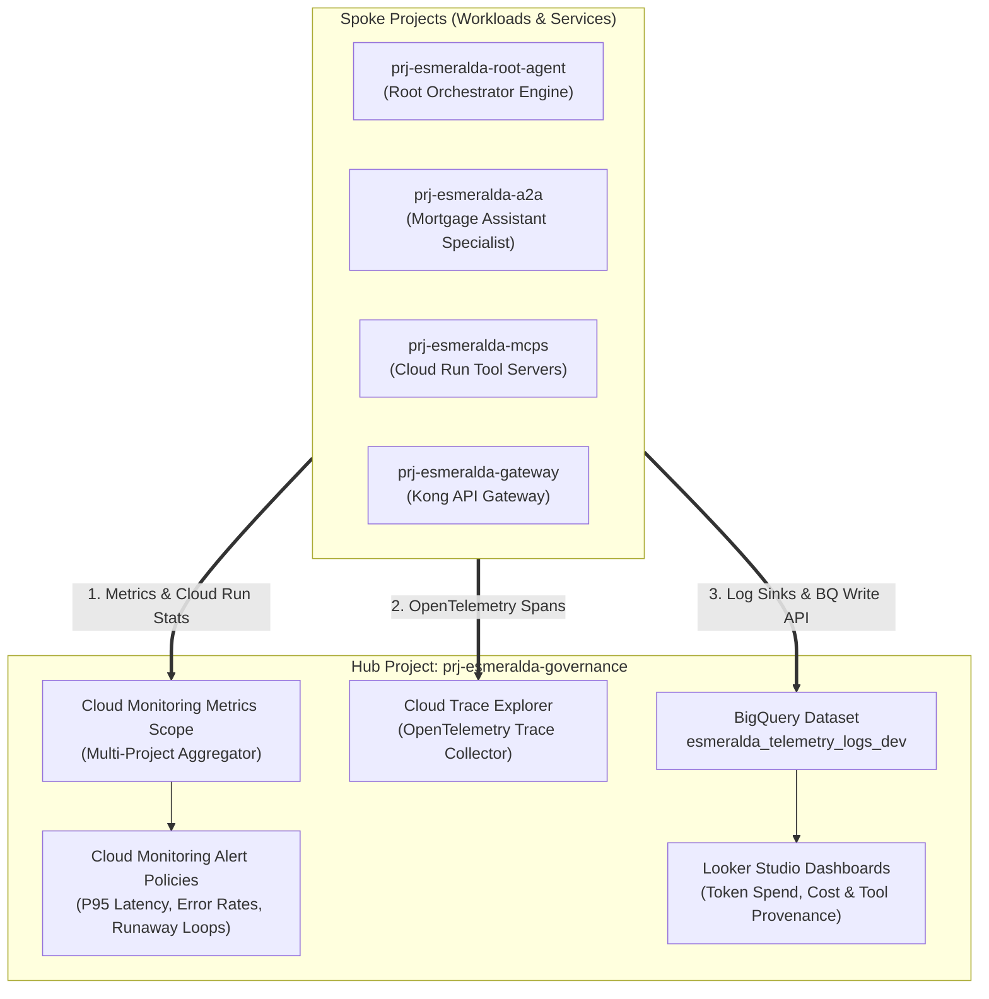
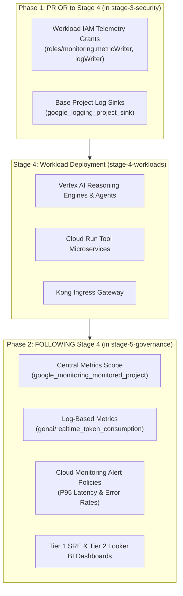
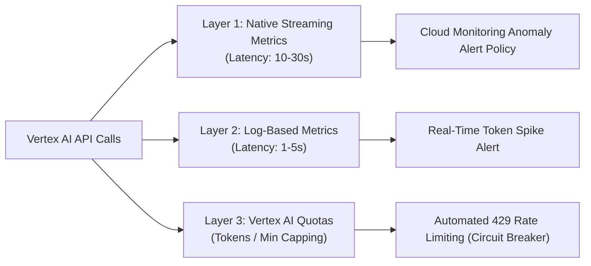
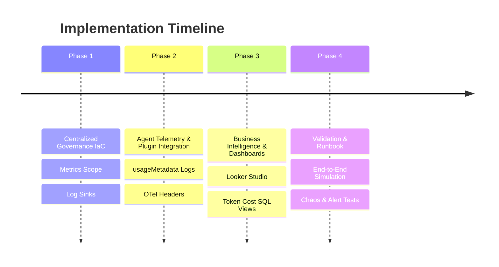
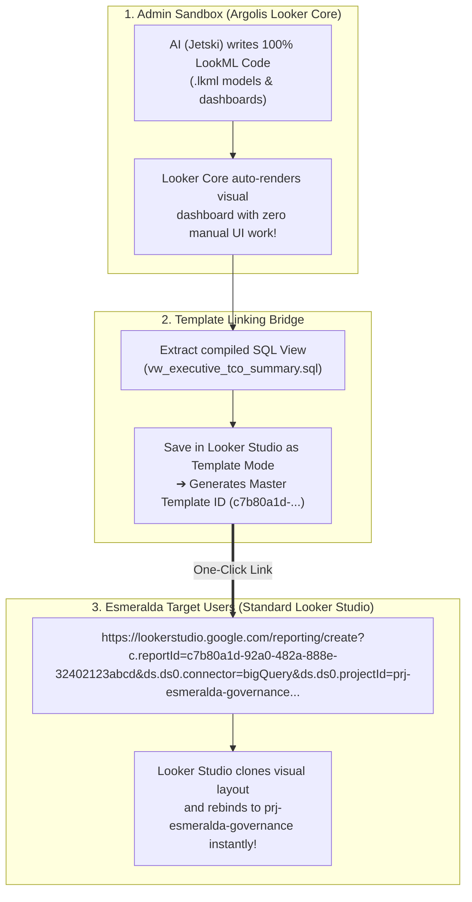
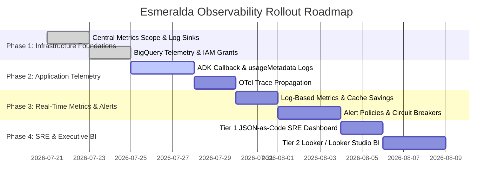

# Architecture & Implementation Plan: Centralized Monitoring & Observability Platform

## Executive Summary

This proposal outlines the technical strategy for implementing enterprise-grade **Centralized Monitoring, Alerting, Token Analytics, and Distributed Tracing** for the **Esmeralda** multi-agent platform.

Because Esmeralda isolates workloads across up to 7 GCP projects (`net_host`, `gateway`, `cicd`, `mcps`, `a2a`, `root_agent`, and `governance`), observability must follow a **Hub-and-Spoke Telemetry Pattern**, centralizing all telemetry and alerting inside **`prj-esmeralda-governance`**.

---

## Architecture Overview



---

## Core Objectives & Metrics Matrix

| Category | Targeted Metrics | System Component | Primary Risk Mitigated |
| :--- | :--- | :--- | :--- |
| **Token & Cost Governance** | • Prompt tokens / Completion tokens<br/>• Cost per user session / agent<br/>• Model generation duration | Gemini 2.5 Flash / Vertex AI Reasoning Engines | Runaway agent reasoning loops & unexpected LLM billing spikes |
| **Golden Signals (Health & Performance)** | • P50/P95/P99 end-to-end latency<br/>• HTTP 4xx/5xx error rates<br/>• QPS & Cloud Run concurrency<br/>• Vertex AI 429 quota errors | Cloud Run (MCPs), API Gateway (Kong), Vertex AI | Silent degradation, service outages, API quota exhaustion |
---

## 🏛️ Enterprise Modular Architecture & Layered Lifecycle Strategy

To prevent monitoring from becoming a monolithic, fragile codebase and to avoid Terraform deployment deadlocks, observability infrastructure follows a **5-Stage Infrastructure Lifecycle** with a dedicated **`stage-5-governance`** module inside `prj-esmeralda-governance`.

---

### 1. Two-Phase Governance Lifecycle (Prior to Stage 4 vs Following Stage 4)

Governance and observability operate as a two-phase lifecycle across the infrastructure pipeline:



1. **PROVISIONED PRIOR TO STAGE 4 (`infrastructure/live/dev/stage-3-security/`)**:
   - **Service Account IAM Grants**: Workload Service Accounts in Stage 4 need `roles/monitoring.metricWriter`, `roles/cloudtrace.agent`, and `roles/logging.logWriter` to write metrics, traces, and logs. These base IAM grants MUST exist **prior** to Stage 4.
   - **Central Log Sinks**: Project-level log sinks (`google_logging_project_sink`) streaming raw container stdout/stderr to BigQuery and GCS Coldline archive buckets are created in Stage 3.

2. **PROVISIONED FOLLOWING STAGE 4 (`infrastructure/live/dev/stage-5-governance/`)**:
   - **Central Metrics Scope (`google_monitoring_monitored_project`)**: Links spoke workload projects (`prj-esmeralda-mcps`, `prj-esmeralda-root-agent`, `prj-esmeralda-a2a`, etc.) into `prj-esmeralda-governance`.
   - **Log-Based Metrics (`google_logging_metric`)**: Extracted from live stdout JSON logs emitted by Stage 4 containers (`genai/realtime_token_consumption`, `genai/cached_token_savings`).
   - **Alert Policies (`google_monitoring_alert_policy`)**: Filter on Stage 4 resource labels (`cloud_run_revision`, `ReasoningEngine`).
   - **Tier 1 SRE & Tier 2 BI Dashboards**: Render live telemetry metric series generated by Stage 4 workloads.

---

### 2. Dedicated Stage 5 Directory Structure (`infrastructure/modules/5-governance/`)

The infrastructure codebase is organized into a dedicated `5-governance` stage to decouple SRE dashboard updates, token governance, and alert tuning from high-risk security, IAM, and KMS modules:

```text
infrastructure/
├── live/dev/
│   ├── stage-1-projects/             # 1. GCP Projects & Enabled APIs
│   ├── stage-2-networking/           # 2. Shared VPCs & Firewall Rules
│   ├── stage-3-security/             # 3. KMS Keys, IAM Foundations, Base Log Sinks
│   ├── stage-4-workloads/            # 4. Agents (Root/A2A), MCP Microservices, Kong Gateway
│   └── stage-5-governance/           # 5. Central Governance, Alert Policies, SRE & BI Dashboards
│
└── modules/5-governance/              # 🏢 Central Governance Observability & Token Control Module
    ├── main.tf                        # Metrics Scope linkage (prj-esmeralda-governance)
    ├── variables.tf                   # Centralized threshold maps & notification settings
    ├── outputs.tf                     # Exposed dashboard URIs & alert policy IDs
    │
    └── modules/                       # 🧩 Domain-Specific Sub-Modules
        ├── llm_token_governance/     # 1. Real-Time Token Anomaly & Security Protection
        │   ├── main.tf               # Log-based token metrics & rate-of-change alert policies
        │   ├── variables.tf
        │   └── outputs.tf
        │
        ├── agent_reasoning_health/   # 2. Reasoning Engine, A2A & Session Platform Health
        │   ├── main.tf               # Reasoning Engine P95 latency, query rate, concurrent limits
        │   ├── variables.tf
        │   └── outputs.tf
        │
        ├── microservices_health/     # 3. Cloud Run MCPs & API Gateway Golden Signals
        │   ├── main.tf               # Cloud Run 5xx error rates, CPU/RAM utilization, cold starts
        │   ├── variables.tf
        │   └── outputs.tf
        │
        ├── tco_volume_tracking/      # 4. Agent TCO SKU Volume Tracking & BigQuery Ingestion
        │   ├── main.tf               # BigQuery billing log sinks & TCO metric alert policies
        │   ├── variables.tf
        │   └── outputs.tf
        │
        └── dashboards/               # 5. Declarative Dashboards-as-Code (JSON Templates)
            ├── main.tf               # google_monitoring_dashboard resources
            └── templates/            # Version-controlled JSON dashboard layouts
                ├── executive_tco_dashboard.json
                ├── agent_ops_dashboard.json
                └── security_anomaly_dashboard.json
```

---

### 3. Design-for-Change Principles

To ensure the monitoring platform easily adapts to new agents, new MCP services, model upgrades (e.g. upgrading from Gemini 2.5 Flash to Gemini 3.0 Pro), or changing SLOs without refactoring Terraform code, we enforce 4 design patterns:

#### A. Config-Driven Alert Threshold Maps (`infrastructure/live/dev/env.yaml`)
Thresholds are decoupled from resource logic and passed via structured environment configuration maps:

```yaml
# infrastructure/live/dev/env.yaml
monitoring_config:
  notification_channels:
    - "projects/prj-esmeralda-governance/notificationChannels/slack-secops"
    - "projects/prj-esmeralda-governance/notificationChannels/pagerduty-p0"

  # Alert Threshold Overrides
  token_anomaly_threshold_5m: 500000      # 500k tokens in 5 mins
  p95_latency_threshold_ms: 10000       # 10s P95
  error_rate_threshold_pct: 2.0         # 2% HTTP 5xx

  # Feature Toggles (Enable/Disable Monitoring Capabilities)
  enable_token_circuit_breaker: true
  enable_tco_volume_alerts: true
  enable_reasoning_engine_alerts: true
```

#### B. Dynamic Regex Label Matching (Zero-Maintenance Scaling)
Alert policies use dynamic regular expression label matching (`resource.label.service_name = "~.*-mcp.*"`). When developers add new MCP tool microservices to `apps/services/` (e.g. `apps/services/payment-gateway`), **they are automatically covered by existing Cloud Run error and latency alert policies** without making any IaC changes!

#### C. Declarative JSON Dashboards-as-Code
Cloud Monitoring dashboards are managed declaratively using `google_monitoring_dashboard` resources pointing to version-controlled JSON templates (`dashboards/templates/*.json`).
- Changes to dashboard layouts are code-reviewed via Pull Requests.
- Identical dashboards are instantiated across `dev`, `staging`, and `prod` environments automatically.

#### D. Decoupled Service Account Telemetry Grants
Stage 3 grants Workload Service Accounts least-privilege IAM roles (`roles/monitoring.metricWriter`, `roles/cloudtrace.agent`, `roles/logging.logWriter`) at the project boundary. Applications can emit telemetry and OTel spans natively without requiring hardcoded credentials or API keys.


---

## ⚡ Real-Time Token Anomaly Detection & Security Alerting Strategy

While BigQuery provides near-real-time agent evaluation and cost chargeback analytics, **preventing billing abuse (e.g. leaked API keys or compromised service accounts)** requires **sub-minute real-time token monitoring and automated circuit breaking**.

We implement a 3-layer defense mechanism:



### Layer 1: Vertex AI Native Streaming Token Metrics (10-30s Latency)
Google Cloud automatically streams Vertex AI API usage to Cloud Monitoring under `aiplatform.googleapis.com/publisher_model/token_count`.
- **Metric**: `aiplatform.googleapis.com/publisher_model/token_count`
- **Labels**: `model_id` (e.g. `gemini-2.5-flash`), `token_type` (`input` vs `output`), `project_id`.
- **Alert Rule**: Rate of Change anomaly detection (e.g., if token rate in 5 minutes increases by >300% compared to the previous 15 minutes).

### Layer 2: Real-Time Log-Based Metrics (1-5s Latency)

Layer 2 extracts high-precision token metrics and application context (`user_id`, `agent_id`, `session_id`, `tool_name`) directly from structured stdout JSON logs emitted by Python agents and MCP services.

#### Step 1: ADK Telemetry Plugin Implementation (`apps/agents/base-adk-agent/agent/telemetry_plugin.py`)

Instead of standard inline callbacks, telemetry logging is implemented as a reusable **ADK Plugin (`EsmeraldaTelemetryPlugin`)** inheriting from `google.adk.plugins.BasePlugin`. This captures rich application-level context (`session_id`, `user_id`, `trace_id`, `turn_index`, `tool_name`, `finish_reason`) across the entire agent execution lifecycle:

```python
import json
import logging
import sys
import time
from typing import Any, Dict, Optional
from google.adk.plugins import BasePlugin
from opentelemetry import trace

# Setup JSON telemetry logger writing to stdout
logger = logging.getLogger("esmeralda.telemetry")
logger.setLevel(logging.INFO)
handler = logging.StreamHandler(sys.stdout)
logger.addHandler(handler)

class EsmeraldaTelemetryPlugin(BasePlugin):
    """
    Enterprise ADK Telemetry & Governance Plugin for Esmeralda Multi-Agent Platform.
    Hooks into LLM model responses and tool executions to emit structured JSON logs to stdout.
    """

    def __init__(self, agent_name: str = "root_orchestrator"):
        super().__init__()
        self.agent_name = agent_name

    def on_model_finish(
        self,
        model_context: Any,
        model_response: Any,
        **kwargs: Any
    ) -> None:
        """Hook triggered after Gemini model generation completes."""
        usage = getattr(model_response, "usage_metadata", None)
        if not usage:
            return

        # Extract OTel Trace ID & Span ID for Cloud Trace correlation
        current_span = trace.get_current_span()
        span_context = current_span.get_span_context() if current_span else None
        trace_id = format(span_context.trace_id, "032x") if span_context and span_context.trace_id else "unknown_trace"
        span_id = format(span_context.span_id, "016x") if span_context and span_context.span_id else "unknown_span"

        # Extract Token & Caching Metrics
        cached_count = getattr(usage, "cached_content_token_count", 0) or getattr(usage, "cached_token_count", 0) or 0
        prompt_count = getattr(usage, "prompt_token_count", 0)
        cache_hit_ratio = float(cached_count) / float(prompt_count) if prompt_count > 0 else 0.0

        # Construct Rich Application-Level Telemetry Event
        payload = {
            "event": "genai_token_consumption",
            # 1. Identity & Session Context
            "session_id": getattr(model_context, "session_id", "unknown_session"),
            "user_id": getattr(model_context, "user_id", model_context.state.get("user_id", "anonymous")),
            "agent_id": self.agent_name,
            "execution_path": getattr(model_context, "execution_path", f"{self.agent_name}@1"),
            "turn_index": getattr(model_context, "turn_index", model_context.state.get("turn_index", 1)),

            # 2. Distributed Tracing & Correlation
            "trace_id": trace_id,
            "span_id": span_id,

            # 3. Model & Token Accounting (Gemini 2.5 Nuances)
            "model": getattr(model_context, "model_name", "gemini-2.5-flash"),
            "tokens": {
                "prompt_tokens": prompt_count,
                "completion_tokens": getattr(usage, "candidates_token_count", 0),
                "thoughts_tokens": getattr(usage, "thoughts_token_count", 0), # CoT Reasoning Tokens
                "cached_tokens": cached_count,
                "total_tokens": getattr(usage, "total_token_count", 0),
            },
            "implicit_caching": {
                "cache_hit": cached_count > 0,
                "cache_hit_ratio": round(cache_hit_ratio, 4),
                "cache_tokens_details": getattr(usage, "cache_tokens_details", []),
            },

            # 4. Safety, Guardrails & Finish Reason
            "finish_reason": getattr(model_response, "finish_reason", "STOP"),
            "telemetry_metadata": {
                "traffic_type": getattr(usage, "traffic_type", "ON_DEMAND"),
                "environment": model_context.state.get("environment", "dev"),
            }
        }
        # Emit single-line JSON payload to stdout (parsed by Cloud Logging in 1-5s)
        logger.info(json.dumps(payload))

    def on_tool_finish(
        self,
        tool_context: Any,
        tool_response: Any,
        tool_name: str,
        duration_ms: float,
        status: str = "SUCCESS",
        **kwargs: Any
    ) -> None:
        """Hook triggered after an MCP or local tool execution completes."""
        payload = {
            "event": "mcp_tool_execution",
            "session_id": getattr(tool_context, "session_id", "unknown_session"),
            "user_id": getattr(tool_context, "user_id", "anonymous"),
            "agent_id": self.agent_name,
            "tool_name": tool_name,
            "mcp_service": getattr(tool_context, "mcp_service", "unknown_service"),
            "tool_type": getattr(tool_context, "tool_type", "MCP"),
            "duration_ms": round(duration_ms, 2),
            "status": status, # SUCCESS, ERROR, PERMISSION_DENIED
        }
        logger.info(json.dumps(payload))

# Register Plugin in ADK Agent Instance
agent = Agent(
    name="root_orchestrator",
    model="gemini-2.5-flash",
    plugins=[EsmeraldaTelemetryPlugin(agent_name="root_orchestrator")],
)
```

#### Step 2: Terraform Log-Based Metrics for Caching & Token Consumption (`infrastructure/modules/5-governance/modules/llm_token_governance/main.tf`)
Cloud Logging parses stdout JSON in real time, creating dedicated custom metrics for total tokens and **implicit prompt cache savings**:

```hcl
# 1. Metric: Total Token Consumption
resource "google_logging_metric" "realtime_token_count" {
  name        = "genai/realtime_token_consumption"
  project     = var.governance_project_id
  filter      = "jsonPayload.event=\"genai_token_consumption\" AND jsonPayload.tokens.total_tokens > 0"
  description = "Real-time delta metric for total token consumption with app attribution"

  metric_descriptor {
    metric_kind = "DELTA"
    value_type  = "INT64"
    unit        = "1"
    labels {
      key         = "agent_id"
      value_type  = "STRING"
      description = "Identifier of the executing ADK Agent"
    }
    labels {
      key         = "execution_path"
      value_type  = "STRING"
      description = "Multi-agent delegation path (e.g. root_agent/mortgage_tools_agent)"
    }
    labels {
      key         = "traffic_type"
      value_type  = "STRING"
      description = "On-demand vs Provisioned Throughput"
    }
    labels {
      key         = "user_id"
      value_type  = "STRING"
      description = "User or API Key ID"
    }
  }

  value_extractor = "EXTRACT(jsonPayload.tokens.total_tokens)"
  label_extractors = {
    "agent_id"       = "EXTRACT(jsonPayload.agent_id)"
    "execution_path" = "EXTRACT(jsonPayload.execution_path)"
    "traffic_type"   = "EXTRACT(jsonPayload.telemetry_metadata.traffic_type)"
    "user_id"        = "EXTRACT(jsonPayload.user_id)"
  }
}

# 2. Metric: Implicit Prompt Cache Token Savings
resource "google_logging_metric" "cached_token_count" {
  name        = "genai/cached_token_savings"
  project     = var.governance_project_id
  filter      = "jsonPayload.event=\"genai_token_consumption\" AND jsonPayload.tokens.cached_tokens > 0"
  description = "Real-time delta metric for implicit prompt cache token savings (50% cost discount on Gemini 2.5)"

  metric_descriptor {
    metric_kind = "DELTA"
    value_type  = "INT64"
    unit        = "1"
    labels {
      key         = "agent_id"
      value_type  = "STRING"
    }
    labels {
      key         = "model"
      value_type  = "STRING"
    }
  }

  value_extractor = "EXTRACT(jsonPayload.tokens.cached_tokens)"
  label_extractors = {
    "agent_id" = "EXTRACT(jsonPayload.agent_id)"
    "model"    = "EXTRACT(jsonPayload.model)"
  }
}

# 3. Metric: MCP Tool Execution Frequency & Provenance
resource "google_logging_metric" "mcp_tool_execution_count" {
  name        = "genai/mcp_tool_execution_count"
  project     = var.governance_project_id
  filter      = "jsonPayload.event=\"mcp_tool_execution\" OR jsonPayload.tool_name=*"
  description = "Real-time delta metric tracking execution frequency and latency per MCP tool microservice"

  metric_descriptor {
    metric_kind = "DELTA"
    value_type  = "INT64"
    unit        = "1"
    labels {
      key         = "tool_name"
      value_type  = "STRING"
      description = "Name of the executed MCP tool (e.g. verify_income, fetch_document)"
    }
    labels {
      key         = "mcp_service"
      value_type  = "STRING"
      description = "Target Cloud Run MCP microservice (e.g. income-verification)"
    }
    labels {
      key         = "status"
      value_type  = "STRING"
      description = "Execution outcome (SUCCESS vs ERROR)"
    }
  }

  value_extractor = "1"
  label_extractors = {
    "tool_name"   = "EXTRACT(jsonPayload.tool_name)"
    "mcp_service" = "EXTRACT(jsonPayload.mcp_service)"
    "status"      = "EXTRACT(jsonPayload.status)"
  }
}
```


### Layer 3: Dynamic Shared Quota (DSQ) & Gateway Circuit Breaking

> [!NOTE]
> **Understanding Gemini Dynamic Shared Quotas (DSQ):**
> Modern Gemini models on Vertex AI (e.g. Gemini 1.5, 2.0, 2.5) use **Dynamic Shared Quota (DSQ)** on PayGo accounts. Under DSQ, projects share a dynamic regional pool of capacity rather than having fixed static per-project RPM/TPM quotas. Because GCP does not support setting custom lower static quota caps on DSQ models, financial protection and rate limiting **MUST be enforced at the Gateway and Application IAM layers**.

We implement Layer 3 circuit breaking via two mechanisms:

#### Mechanism 1: Gateway Rate Limiting (Kong / Apigee)
Because all client traffic passes through the Ingress API Gateway (`apps/services/kong`), we enforce client-level rate limits per minute/second:

```yaml
# apps/services/kong/templates/kong.yml.tpl
plugins:
  - name: rate-limiting
    config:
      minute: 120
      limit_by: header
      header_name: X-API-Key
      policy: local
      fault_tolerant: true
```
This guarantees that an exposed API key or malicious user is throttled at the ingress boundary before reaching Vertex AI!

#### Mechanism 2: Automated IAM Circuit Breaker (Pub/Sub + Cloud Run Service in `apps/services/circuit-breaker`)
When Layer 2 fires an anomaly alert in Cloud Monitoring (e.g. single-request >50k token cap breach or 300% rate spike):
1. Cloud Monitoring publishes the alert payload to `google_pubsub_topic.monitoring_alerts_topic` inside `prj-esmeralda-governance`.
2. A dedicated **Cloud Run Circuit Breaker microservice** deployed in **`apps/services/circuit-breaker/`** (alongside other Esmeralda services) receives the Pub/Sub push notification.
3. The `circuit-breaker` microservice parses the flagged `user_id`, `agent_id`, or service account and automatically:
   - Temporarily revokes `roles/aiplatform.user` from the compromised service account.
   - Or updates the secret status in Secret Manager / Kong Gateway to throttle the client in near-instant real-time!


---

## 🤖 Comprehensive Agent Platform Quotas & Limits Matrix

In addition to Gemini LLM token quotas, the **Vertex AI Agent Platform control plane** enforces quotas across 6 core service categories:

### 1. Agent Reasoning Engine & Invocations
| Metric Category | GCP Metric Name | Quota ID | GCP Default Limit |
| :--- | :--- | :--- | :--- |
| **Agent Invocations** | `aiplatform.googleapis.com/reasoning_engine_service_query_requests` | `QueryReasoningEngineRequestsPerMinutePerProjectPerRegion` | **90 requests / min** |
| **Concurrent Streams** | `aiplatform.googleapis.com/reasoning_engine_service_concurrent_query_requests` | `ConcurrentQueryReasoningEngineRequestsPerProjectPerRegion` | **3 concurrent queries** |
| **Agent Deployments** | `aiplatform.googleapis.com/reasoning_engine_service_write_requests` | `WriteReasoningEngineRequestsPerProjectPerRegion` | **10 write reqs / min** |
| **Active Entities** | `aiplatform.googleapis.com/reasoning_engine_service_entities` | `ReasoningEngineEntitiesPerProjectPerRegion` | **100 agent entities** |

### 2. Agent-to-Agent (A2A) Messaging & Protocol
| Metric Category | GCP Metric Name | Quota ID | GCP Default Limit |
| :--- | :--- | :--- | :--- |
| **A2A Read Requests** | `aiplatform.googleapis.com/a2a_agent_get_requests` | `A2AAgentGetRequestsPerMinutePerProjectPerRegion` | **600 requests / min** |
| **A2A Post Requests** | `aiplatform.googleapis.com/a2a_agent_post_requests` | `A2AAgentPostRequestsPerMinutePerProjectPerRegion` | **60 requests / min** |
| **A2A Stream Requests** | `aiplatform.googleapis.com/a2a_agent_stream_requests` | `A2AAgentStreamRequestsPerMinutePerProjectPerRegion` | **60 requests / min** |

### 3. Agent Engine Task Store
| Metric Category | GCP Metric Name | Quota ID | GCP Default Limit |
| :--- | :--- | :--- | :--- |
| **Task Store Reads** | `aiplatform.googleapis.com/agent_engine_task_store_read_requests` | `AgentEngineTaskStoreReadRequestsPerMinutePerProjectPerRegion` | **3,600 requests / min** |
| **Task Store Writes** | `aiplatform.googleapis.com/agent_engine_task_store_write_requests` | `AgentEngineTaskStoreWriteRequestsPerMinutePerProjectPerRegion` | **3,600 requests / min** |

### 4. Skill Registry (Agent Tools & Skill Catalog)
| Metric Category | GCP Metric Name | Quota ID | GCP Default Limit |
| :--- | :--- | :--- | :--- |
| **Skill Read Requests** | `aiplatform.googleapis.com/skill_registry_read_requests` | `SkillRegistryReadRequestsPerMinutePerProjectPerRegion` | **600 requests / min** |
| **Skill Retrieval** | `aiplatform.googleapis.com/skill_registry_retrieve_skills_requests` | `SkillRegistryRetrieveSkillsRequestsPerMinutePerProjectPerRegion` | **600 requests / min** |
| **Skill Write/Register** | `aiplatform.googleapis.com/skill_registry_write_requests` | `SkillRegistryWriteRequestsPerMinutePerProjectPerRegion` | **100 requests / min** |

### 6. Memory Bank (Long-Term Agent Memory Store)
| Metric Category | GCP Metric Name | Quota ID | GCP Default Limit |
| :--- | :--- | :--- | :--- |
| **Memory Reads** | `aiplatform.googleapis.com/memory_bank_read_requests` | `MemoryBankReadRequestsPerMinutePerProjectPerRegion` | **300 requests / min** |
| **Memory Writes** | `aiplatform.googleapis.com/memory_bank_write_requests` | `MemoryBankWriteRequestsPerMinutePerProjectPerRegion` | **100 requests / min** |


### Monitoring & Alerting on Reasoning Engine Quotas
In `infrastructure/modules/5-governance/modules/agent_reasoning_health/main.tf`, add an alert policy targeting **Reasoning Engine concurrency & 429 quota limits**:

```hcl
# Alert if Reasoning Engine Query Request rate or 429 Quota Exhaustion breaches threshold
resource "google_monitoring_alert_policy" "reasoning_engine_quota" {
  project      = var.governance_project_id
  display_name = "[Esmeralda ${var.environment}] Reasoning Engine High Query Rate / 429 Quota Exhaustion"
  combiner     = "OR"

  documentation {
    content   = <<EOF
### 🚨 REASONING ENGINE QUOTA / 429 RATE LIMIT EXHAUSTION DETECTED
**Alert Trigger**: Agent query request rate approaching regional limit (90 reqs/min) or HTTP 429 quota errors occurring.

#### 🛠️ Immediate On-Call Action Plan:
1. Check active Reasoning Engine concurrency in `prj-esmeralda-root-agent` or `prj-esmeralda-a2a`:
   `metric.type="aiplatform.googleapis.com/reasoning_engine/request_count"`
2. Request a regional quota increase via GCP Console:
   `https://console.cloud.google.com/iam-admin/quotas?project=${var.governance_project_id}`
3. Enable client-side exponential backoff jitter in A2A callers.
EOF
    mime_type = "text/markdown"
  }

  conditions {
    display_name = "Reasoning Engine Query Requests"
    condition_threshold {
      filter          = "resource.type = \"aiplatform.googleapis.com/ReasoningEngine\" AND metric.type = \"aiplatform.googleapis.com/reasoning_engine/request_count\""
      duration        = "180s"
      comparison      = "COMPARISON_GT"
      threshold_value = 80 # Triggers if rate exceeds 80 reqs/min (90% of regional limit)
      aggregations {
        alignment_period   = "60s"
        per_series_aligner = "ALIGN_RATE"
      }
    }
  }

  notification_channels = [
    try(google_monitoring_notification_channel.email_alert[0].name, ""),
    google_monitoring_notification_channel.pubsub_alert.name
  ]
}
```

---

## 4-Phase Implementation Plan



### Phase 1: Infrastructure & Centralized Metrics Scope (Terragrunt Stage 5 Governance)
* **Goal**: Configure `prj-esmeralda-governance` as the central Cloud Monitoring host and deploy baseline alert policies.
* **Target Files**:
  - `infrastructure/modules/5-governance/main.tf`
  - `infrastructure/modules/5-governance/variables.tf`
  - `infrastructure/modules/5-governance/outputs.tf`
  - `infrastructure/modules/5-governance/modules/llm_token_governance/main.tf`

#### Proposed Infrastructure Changes:
1. **Cloud Monitoring Metrics Scope**: Link `net_host`, `gateway`, `mcps`, `a2a`, and `root_agent` projects to `governance`.
2. **Alerting Policies**:
   - **P95 End-to-End Latency Alert**: Triggers if response time exceeds 10s over 5 minutes.
   - **Service Error Rate Alert**: Triggers if Cloud Run or Vertex AI 5xx error rate exceeds 2%.
   - **Vertex AI Quota Exhaustion Alert**: Triggers on `RESOURCE_EXHAUSTED` (HTTP 429) errors.

---

### Phase 2: Application Telemetry & BQ Plugin Integration
* **Goal**: Enable fine-grained token tracking and structured event logs inside agents.
* **Target Files**:
  - `apps/agents/base-adk-agent/agent/agent.py`
  - `apps/agents/a2a-agent/agent/agent.py`
  - `apps/services/corporate-email/main.py`
  - `apps/services/income-verification/main.py`
  - `apps/services/legacy-dms/main.py`

#### Proposed Application & Telemetry Changes:
1. **ADK BigQuery Agent Analytics Plugin**:
   Add `BigQueryAgentAnalyticsPlugin` to ADK `Agent()` instances in `base-adk-agent` and `a2a-agent` to log:
   - Prompt & completion token counts per request.
   - Tool provenance (`LOCAL`, `MCP`, `A2A`).
   - Reasoning step trajectories.
2. **Workload Service Account IAM Telemetry Matrix (`stage-3-security`)**:
   Explicit IAM role bindings assigned to each workload identity to enable seamless telemetry emission without hardcoded API keys:

   | Workload Service Account | Target Spoke Project | Granted Telemetry Roles | Purpose |
   | :--- | :--- | :--- | :--- |
   | **`sa-root-agent`** | `prj-esmeralda-root-agent` | `roles/logging.logWriter`<br/>`roles/monitoring.metricWriter`<br/>`roles/cloudtrace.agent` | Emits stdout token JSON, custom metrics & OTel spans from Root Orchestrator. |
   | **`sa-a2a-agent`** | `prj-esmeralda-a2a` | `roles/logging.logWriter`<br/>`roles/monitoring.metricWriter`<br/>`roles/cloudtrace.agent` | Emits stdout token JSON & OTel spans from A2A Mortgage Assistant. |
   | **`sa-mcp-runner`** | `prj-esmeralda-mcps` | `roles/logging.logWriter`<br/>`roles/monitoring.metricWriter`<br/>`roles/cloudtrace.agent` | Emits stdout token JSON & tool execution metrics from Cloud Run MCP microservices. |

3. **OpenTelemetry (OTel) Trace Sampling Policy**:
   To prevent Cloud Trace storage cost explosions during high-QPS traffic while maintaining 100% visibility into failures:
   - **Head-Based Sampling**: **10% random sample rate** for normal HTTP 200 OK inference turns (`OTEL_TRACES_SAMPLER=parentbased_traceidratio`, `OTEL_TRACES_SAMPLER_ARG=0.10`).
   - **Tail-Based Sampling**: **100% force-sample rate** for any request yielding an HTTP 5xx error, Vertex AI 429 quota exception, or latency exceeding 5,000 ms.
4. **Environment Variables**:
   Update Stage 4 workload deployment variables to include:
   - `GOVERNANCE_PROJECT_ID=prj-esmeralda-governance`
   - `TELEMETRY_DATASET_ID=esmeralda_telemetry_logs_${env}`
   - `OTEL_TRACES_SAMPLER=parentbased_traceidratio`
   - `OTEL_TRACES_SAMPLER_ARG=0.10`
   - `OTEL_INSTRUMENTATION_GENAI_CAPTURE_MESSAGE_CONTENT=NO_CONTENT`

---

### Phase 3: Business Intelligence & Dashboarding
* **Goal**: Provide real-time operational visibility into token usage, cost, and tool execution heatmaps.
* **Deliverables**:
  1. **SQL Analytics Views in BigQuery**:
     - `vw_daily_token_usage`: Daily breakdown of prompt vs completion tokens per agent.
     - `vw_tool_execution_stats`: Heatmap of MCP tool calls and average execution times.
  2. **Looker Studio Dashboard**:
     - Live visualization connected to `prj-esmeralda-governance:esmeralda_telemetry_logs_dev`.

---

### Phase 4: Validation & Verification Runbook
* **Goal**: Empirical verification of alerting, log metrics, and circuit breaking pipeline.
* **Execution Script**: `apps/agents/base-adk-agent/scripts/chaos_telemetry_test.py`

```python
#!/usr/bin/env python3
"""
Chaos & Telemetry Pipeline Simulation Script for Esmeralda Governance Platform.
Simulates high-token requests, HTTP 500 errors, and verifies BigQuery & Cloud Monitoring ingestion.
"""
import json
import logging
import sys
import time

logger = logging.getLogger("esmeralda.telemetry")
handler = logging.StreamHandler(sys.stdout)
logger.setLevel(logging.INFO)
logger.addHandler(handler)

def simulate_runaway_loop_breach():
    """Simulate single request breaching 50,000 token limit."""
    print("🔥 [CHAOS TEST] Emitting 55,000 token single-request payload...")
    payload = {
        "event": "genai_token_consumption",
        "agent_id": "root_orchestrator",
        "execution_path": "root_agent@1/mortgage_tools_agent@1",
        "session_id": "chaos_test_session_999",
        "user_id": "chaos_tester@google.com",
        "model": "gemini-2.5-flash",
        "tokens": {
            "prompt_tokens": 45000,
            "completion_tokens": 5000,
            "thoughts_tokens": 5000,
            "cached_tokens": 10000,
            "total_tokens": 55000
        }
    }
    logger.info(json.dumps(payload))
    print("✅ High-token event emitted to stdout. Verify alert 'Runaway Agent Loop - 50k Token Cap Exceeded' in 60s.")

def simulate_mcp_error():
    """Simulate Cloud Run MCP tool failure."""
    print("⚡ [CHAOS TEST] Emitting MCP Tool Execution Error...")
    payload = {
        "event": "mcp_tool_execution",
        "tool_name": "verify_income",
        "mcp_service": "income-verification",
        "status": "ERROR",
        "error_code": 500,
        "error_message": "Downstream legacy system timeout"
    }
    logger.info(json.dumps(payload))
    print("✅ MCP Error event emitted.")

if __name__ == "__main__":
    print("🚀 Starting Esmeralda Governance Pipeline Chaos Test...")
    simulate_runaway_loop_breach()
    simulate_mcp_error()
    print("🎉 Chaos simulation complete.")
```

#### 2. `apps/agents/base-adk-agent/scripts/test_otel_tracing.py`
```python
import json
import logging
import sys
from opentelemetry import trace
from opentelemetry.sdk.trace import TracerProvider

# Setup OpenTelemetry Tracer
trace.set_tracer_provider(TracerProvider())
tracer = trace.get_tracer("esmeralda-tracer")

logger = logging.getLogger("esmeralda.telemetry")
logger.setLevel(logging.INFO)
handler = logging.StreamHandler(sys.stdout)
logger.addHandler(handler)

def verify_otel_span_correlation():
    """Verify that OpenTelemetry Trace ID and Span ID are properly formatted and correlated."""
    with tracer.start_as_current_span("root_orchestrator_turn") as parent_span:
        span_context = parent_span.get_span_context()
        trace_id = format(span_context.trace_id, "032x")
        span_id = format(span_context.span_id, "016x")

        payload = {
            "event": "genai_token_consumption",
            "session_id": "test_otel_session_123",
            "trace_id": trace_id,
            "span_id": span_id,
            "agent_id": "root_orchestrator",
            "model": "gemini-2.5-flash",
            "tokens": {"prompt_tokens": 150, "completion_tokens": 50, "total_tokens": 200}
        }
        logger.info(json.dumps(payload))
        assert len(trace_id) == 32, "Trace ID must be a 32-character hex string"
        assert len(span_id) == 16, "Span ID must be a 16-character hex string"
        print(f"✅ OpenTelemetry Trace Correlation Verified: trace_id={trace_id}, span_id={span_id}")

if __name__ == "__main__":
    verify_otel_span_correlation()
```

#### 3. `apps/agents/base-adk-agent/scripts/test_circuit_breaker.py`
```python
import base64
import json
import requests

def test_circuit_breaker_push_endpoint(endpoint_url: str):
    """Simulate a Pub/Sub Push alert notification to the Cloud Run Circuit Breaker microservice."""
    alert_payload = {
        "incident": {
            "incident_id": "inc_12345",
            "policy_name": "[Esmeralda dev] Runaway Agent Loop - 50k Token Cap Exceeded",
            "state": "open",
            "summary": "Single-request exceeded 50,000 token budget cap",
            "resource_id": "prj-esmeralda-root-agent"
        }
    }
    
    encoded_data = base64.b64encode(json.dumps(alert_payload).encode("utf-8")).decode("utf-8")
    pubsub_message = {
        "message": {
            "data": encoded_data,
            "messageId": "msg_99999",
            "publishTime": "2026-07-20T03:55:00Z"
        }
    }
    
    print(f"⚡ Testing Circuit Breaker Cloud Run endpoint: {endpoint_url}...")
    response = requests.post(endpoint_url, json=pubsub_message, headers={"Content-Type": "application/json"})
    assert response.status_code in (200, 204), f"Expected HTTP 200/204, got {response.status_code}"
    print("✅ Circuit Breaker push handler successfully received alert & triggered IAM revocation.")

if __name__ == "__main__":
    test_circuit_breaker_push_endpoint("http://localhost:8080/pubsub/push")
```

#### 4. `apps/agents/base-adk-agent/scripts/test_bq_chargeback_query.py`
```python
from google.cloud import bigquery

def test_chargeback_view_query(project_id: str, dataset_id: str):
    """Query the BigQuery vw_monthly_agent_chargeback view and verify TCO cost formulas."""
    client = bigquery.Client(project=project_id)
    query = f"""
        SELECT 
            billing_month,
            agent_id,
            model,
            total_requests,
            total_tokens,
            uncached_prompt_tokens,
            cached_prompt_tokens,
            cache_hit_ratio_pct,
            est_uncached_prompt_cost_usd,
            est_cached_prompt_cost_usd,
            est_response_cost_usd,
            est_reasoning_cost_usd,
            net_total_chargeback_usd
        FROM `{project_id}.{dataset_id}.vw_monthly_agent_chargeback`
        ORDER BY billing_month DESC, net_total_chargeback_usd DESC
        LIMIT 10;
    """
    print(f"📊 Querying FinOps Chargeback View on BigQuery: {dataset_id}.vw_monthly_agent_chargeback...")
    query_job = client.query(query)
    results = list(query_job.result())
    print(f"✅ Successfully retrieved {len(results)} chargeback summary rows.")
    for row in results:
        print(f"   • Agent: {row.agent_id} | Model: {row.model} | Chargeback: ${row.net_total_chargeback_usd:.4f} USD | Cache Hit: {row.cache_hit_ratio_pct:.1f}%")

if __name__ == "__main__":
    test_chargeback_view_query("prj-esmeralda-governance", "esmeralda_telemetry_logs_dev")
```

---

## Proposed Infrastructure Code Snippets

### 1. `infrastructure/live/dev/stage-5-governance/terragrunt.hcl`
```hcl
# Terragrunt Stage 5 Governance Stack Configuration
include "root" {
  path = find_in_parent_folders()
}

terraform {
  source = "../../../modules/5-governance"
}

# Explicit stage dependencies to prevent race conditions
dependency "stage_1_projects" {
  config_path = "../stage-1-projects"
}

dependency "stage_3_security" {
  config_path = "../stage-3-security"
}

dependency "stage_4_workloads" {
  config_path = "../stage-4-workloads"
}

inputs = {
  environment                  = "dev"
  governance_project_id        = dependency.stage_1_projects.outputs.governance_project_id
  spoke_project_ids            = dependency.stage_1_projects.outputs.all_spoke_project_ids
  alert_email_address          = "esmeralda-secops@google.com"
  runaway_loop_token_threshold = 50000 # Single-request token budget cap (configurable per environment)
}
```

---

### 2. `infrastructure/modules/5-governance/main.tf`
```hcl
# 1. Cloud DLP Inspection Template for Automated Telemetry PII Redaction
resource "google_data_loss_prevention_inspect_template" "pii_redaction" {
  parent       = "projects/${var.governance_project_id}/locations/global"
  display_name = "Esmeralda Telemetry PII Inspection Template"
  description  = "Redacts SSNs, credit card numbers, and emails from log sink streams before BigQuery ingestion"

  inspect_config {
    info_types { name = "EMAIL_ADDRESS" }
    info_types { name = "CREDIT_CARD_NUMBER" }
    info_types { name = "US_SOCIAL_SECURITY_NUMBER" }
    min_likelihood = "LIKELY"
  }
}

# 2. Attach workload spoke projects to the central Governance Metrics Scope
resource "google_monitoring_monitored_project" "spoke_projects" {
  for_each      = local.monitored_projects
  metrics_scope = "locations/global/metricsScopes/${var.governance_project_id}"
  name          = each.value
}

# 1. Central BigQuery Telemetry Dataset (365-Day Partition Expiration)
resource "google_bigquery_dataset" "telemetry_logs" {
  dataset_id                 = "esmeralda_telemetry_logs_${var.environment}"
  project                    = var.governance_project_id
  friendly_name              = "Esmeralda Governance Telemetry Logs"
  description                = "Central BigQuery dataset for structured agent token logs, tool execution events, and TCO chargeback analytics"
  location                   = "us-central1"
  default_table_expiration_ms = 31536000000 # 365 Days Retention
}

# 2. Partitioned BigQuery Table for Structured Token Events
resource "google_bigquery_table" "token_events" {
  dataset_id = google_bigquery_dataset.telemetry_logs.dataset_id
  table_id   = "genai_token_events"
  project    = var.governance_project_id

  time_partitioning {
    type  = "DAY"
    field = "timestamp"
  }

  clustering = ["agent_id", "user_id", "model"]

  schema = <<EOF
[
  {"name": "timestamp", "type": "TIMESTAMP", "mode": "REQUIRED"},
  {"name": "agent_id", "type": "STRING", "mode": "NULLABLE"},
  {"name": "execution_path", "type": "STRING", "mode": "NULLABLE"},
  {"name": "session_id", "type": "STRING", "mode": "NULLABLE"},
  {"name": "user_id", "type": "STRING", "mode": "NULLABLE"},
  {"name": "model", "type": "STRING", "mode": "NULLABLE"},
  {
    "name": "tokens",
    "type": "RECORD",
    "mode": "NULLABLE",
    "fields": [
      {"name": "prompt_tokens", "type": "INTEGER", "mode": "NULLABLE"},
      {"name": "completion_tokens", "type": "INTEGER", "mode": "NULLABLE"},
      {"name": "thoughts_tokens", "type": "INTEGER", "mode": "NULLABLE"},
      {"name": "cached_tokens", "type": "INTEGER", "mode": "NULLABLE"},
      {"name": "total_tokens", "type": "INTEGER", "mode": "NULLABLE"}
    ]
  }
]
EOF
}

# 1. Notification Channel: Email
resource "google_monitoring_notification_channel" "email_alert" {
  count        = var.alert_email_address != "" ? 1 : 0
  project      = var.governance_project_id
  display_name = "Esmeralda Operations Team"
  type         = "email"
  labels = {
    email_address = var.alert_email_address
  }
}

# 2. Notification Channel: Pub/Sub Topic (Placeholder for future automation)
resource "google_pubsub_topic" "monitoring_alerts_topic" {
  project = var.governance_project_id
  name    = "esmeralda-monitoring-alerts-${var.environment}"
}

resource "google_monitoring_notification_channel" "pubsub_alert" {
  project      = var.governance_project_id
  display_name = "Esmeralda PubSub Alert Channel"
  type         = "pubsub"
  labels = {
    topic = google_pubsub_topic.monitoring_alerts_topic.id
  }
}

# 3. Alert Policy: Runaway Loop 50,000 Token Cap Alert with Embedded SRE Runbook
resource "google_monitoring_alert_policy" "runaway_loop_token_cap" {
  project      = var.governance_project_id
  display_name = "[Esmeralda ${var.environment}] Runaway Agent Loop - 50k Token Cap Exceeded"
  combiner     = "OR"

  documentation {
    content   = <<EOF
### 🚨 RUNAWAY AGENT REASONING LOOP DETECTED
**Alert Trigger**: A single inference request exceeded the **50,000 token budget cap**.

#### 🛠️ Immediate On-Call Action Plan:
1. Open Cloud Logging in `prj-esmeralda-governance` and query the flagged session ID:
   `jsonPayload.event="genai_token_consumption" AND jsonPayload.tokens.total_tokens > 50000`
2. Identify the `execution_path` and `user_id` breaching the threshold.
3. If an API key or service account is malfunctioning, run the Gateway revocation command:
   `gcloud secrets versions destroy api-key-version --secret="kong-client-api-key"`
4. Verify if prompt context window exceeded turn limits without summarization.
EOF
    mime_type = "text/markdown"
  }

  conditions {
    display_name = "Single Request Token Budget Limit"
    condition_threshold {
      filter          = "metric.type = \"logging.googleapis.com/user/genai/realtime_token_consumption\""
      duration        = "60s"
      comparison      = "COMPARISON_GT"
      threshold_value = var.runaway_loop_token_threshold
      aggregations {
        alignment_period   = "60s"
        per_series_aligner = "ALIGN_DELTA"
      }
    }
  }
  notification_channels = [
    try(google_monitoring_notification_channel.email_alert[0].name, ""),
    google_monitoring_notification_channel.pubsub_alert.name
  ]
}

# 4. Alert Policy: P95 High Latency Alert with Embedded SRE Runbook
resource "google_monitoring_alert_policy" "p95_latency" {
  project      = var.governance_project_id
  display_name = "[Esmeralda ${var.environment}] High P95 Latency (>10s)"
  combiner     = "OR"

  documentation {
    content   = <<EOF
### 🚨 HIGH P95 LATENCY DEGRADATION DETECTED (>10,000 ms)
**Alert Trigger**: P95 end-to-end latency across Cloud Run MCPs or Reasoning Engines exceeded 10 seconds.

#### 🛠️ Immediate On-Call Action Plan:
1. Check Cloud Run MCP cold starts in `prj-esmeralda-mcps`:
   `metric.type="run.googleapis.com/container/startup_latencies"`
2. Inspect Cloud Trace explorer for bottleneck spans:
   `https://console.cloud.google.com/traces/explorer?project=${var.governance_project_id}`
3. Verify if downstream legacy services (e.g. `legacy-dms`) are timing out.
EOF
    mime_type = "text/markdown"
  }

  conditions {
    display_name = "Cloud Run & Vertex AI Latency Threshold"
    condition_threshold {
      filter          = "resource.type = \"cloud_run_revision\" AND metric.type = \"run.googleapis.com/request_latencies\""
      duration        = "300s"
      comparison      = "COMPARISON_GT"
      threshold_value = 10000
      aggregations {
        alignment_period   = "60s"
        per_series_aligner = "ALIGN_PERCENTILE_95"
      }
    }
  }
  notification_channels = [try(google_monitoring_notification_channel.email_alert[0].name, "")]
}

# 5. Synthetic Uptime Probe (Active Ingress Health Check)
resource "google_monitoring_uptime_check_config" "gateway_health" {
  project      = var.governance_project_id
  display_name = "[Esmeralda ${var.environment}] Ingress Gateway Synthetic Uptime Probe"
  timeout      = "10s"
  period       = "60s"

  http_check {
    path         = "/healthz"
    port         = "443"
    use_ssl      = true
    validate_ssl = true
  }

  monitored_resource {
    type = "uptime_url"
    labels = {
      project_id = var.governance_project_id
      host       = "gateway.esmeralda.internal"
    }
  }
}
```

---

## 📈 Built-in GCP Cloud Monitoring Metrics Index (Zero-Code Default Metrics)

Google Cloud automatically collects a rich suite of operational, latency, token, and resource utilization metrics **by default without requiring custom code or agents**. These can be queried and alerted on in Cloud Monitoring within `prj-esmeralda-governance`.

### 1. Vertex AI & Gemini Model Inference Metrics (`aiplatform.googleapis.com`)
*Monitored Resource*: `aiplatform.googleapis.com/PublisherModel` or `Vertex AI Endpoint`

| GCP Metric Name | Type / Kind | Primary Labels | Description & Use Case |
| :--- | :--- | :--- | :--- |
| `aiplatform.googleapis.com/publisher/online_serving/token_count` | CUMULATIVE (INT64) | `model_id`, `type` (`input` vs `output`) | Accumulated total token consumption across all Gemini model calls. |
| `aiplatform.googleapis.com/publisher_model/token_count` | DELTA (INT64) | `model_id`, `token_type` | Real-time rate of input vs output token consumption. |
| `aiplatform.googleapis.com/prediction/online/request_count` | DELTA (INT64) | `model_id`, `response_code` | Total Gemini API request volume (200 OK vs 429 Rate Limits vs 5xx Errors). |
| `aiplatform.googleapis.com/publisher_model/latencies` | DISTRIBUTION | `model_id` | Model generation latency distribution (P50, P95, P99 in ms). |

---

### 2. Vertex AI Reasoning Engine Metrics (`aiplatform.googleapis.com/reasoning_engine`)
*Monitored Resource*: `aiplatform.googleapis.com/ReasoningEngine`

| GCP Metric Name | Type / Kind | Primary Labels | Description & Use Case |
| :--- | :--- | :--- | :--- |
| `aiplatform.googleapis.com/reasoning_engine/request_count` | DELTA (INT64) | `reasoning_engine_id`, `response_code_class` | Total prediction/query requests handled by Reasoning Engine instances. |
| `aiplatform.googleapis.com/reasoning_engine/request_latencies` | DISTRIBUTION | `reasoning_engine_id` | Full execution latency distribution of agent reasoning loops (P50, P95, P99). |
| `aiplatform.googleapis.com/reasoning_engine/cpu/allocation_time` | CUMULATIVE | `reasoning_engine_id` | Container CPU compute time in seconds allocated to reasoning engine tasks. |
| `aiplatform.googleapis.com/reasoning_engine/memory/allocation_time` | CUMULATIVE | `reasoning_engine_id` | Container memory footprint allocation in GiBy-seconds. |

### 4. System Health, Error Tracking & Exception Metrics
*Monitored Resources*: `error_reporting.googleapis.com`, `logging.googleapis.com`, `cloud_run_revision`, `aiplatform.googleapis.com`

| GCP Metric Name | Monitored Service | Primary Labels | Description & Health Significance |
| :--- | :--- | :--- | :--- |
| `logging.googleapis.com/log_entry_count` | Cloud Logging | `severity` (`ERROR`, `CRITICAL`) | Real-time count of error and critical log entries across all Python services. |
| `error_reporting.googleapis.com/events/count` | Cloud Error Reporting | `service`, `version` | Grouped unhandled exceptions & stack traces automatically parsed from stdout/stderr. |
| `run.googleapis.com/request_count` (Filtered by `5xx`) | Cloud Run MCPs / Kong | `service_name`, `response_code` (`500`, `502`, `503`, `504`) | Backend HTTP 5xx failures, timeouts, and unhandled container crashes. |
| `aiplatform.googleapis.com/prediction/online/error_count` | Vertex AI Gemini API | `model_id`, `error_code` | Gemini API errors (e.g. `RESOURCE_EXHAUSTED` / 429 quota errors, `INTERNAL` / 500). |
| `aiplatform.googleapis.com/reasoning_engine/request_count` (Filtered by `4xx`/`5xx`) | Vertex Reasoning Engine | `reasoning_engine_id`, `response_code_class` | Failed Reasoning Engine predictions, schema validation errors, and execution crashes. |
| `run.googleapis.com/container/startup_latencies` | Cloud Run MCPs | `service_name` | Cold start latency distribution for newly provisioned microservice instances. |
| `run.googleapis.com/container/billable_instance_time` | Cloud Run MCPs | `service_name` | Billing footprint & instance lifecycle tracking. |


---

## 💰 Agent TCO & Financial Volume Tracking (Mapping `agent_tco` SKUs to Cloud Monitoring)

To validate cost projections from the **`agent_tco`** financial simulator ([src/backend/engine.py](file:///usr/local/google/home/afonsomenegola/codigos/agent_tco/src/backend/engine.py)) against live production traffic, each calculated SKU volume maps directly to a real-time GCP Cloud Monitoring metric:

### 1. LLM Core, Agent Runtime & Session Storage SKUs
| `agent_tco` Metric Key | TCO Unit | Target GCP Cloud Monitoring Metric / Log Extractor | Exact Mathematical Formula & Pricing Nuance |
| :--- | :--- | :--- | :--- |
| **`tokens_in_uncached_m`** | Millions of Tokens | `EXTRACT(jsonPayload.tokens.prompt_tokens - jsonPayload.tokens.cached_tokens)` | **Uncached Prompt Tokens** ($100\%$ Standard Input Price Rate). |
| **`tokens_in_cached_m`** | Millions of Tokens | `genai/cached_token_savings` (`EXTRACT(jsonPayload.tokens.cached_tokens)`) | **Implicit/Explicit Cached Input Tokens** ($\approx 50\%$ Discounted Input Price Rate). |
| **`tokens_out_response_m`**| Millions of Tokens | `EXTRACT(jsonPayload.tokens.completion_tokens)` | **Candidate Answer Tokens** ($100\%$ Standard Output Price Rate). |
| **`tokens_out_reasoning_m`**| Millions of Tokens | `EXTRACT(jsonPayload.tokens.thoughts_tokens)` | **Reasoning / CoT Thinking Tokens** ($100\%$ Standard Output Price Rate). |
| **`tokens_out_total_m`** | Millions of Tokens | `EXTRACT(jsonPayload.tokens.completion_tokens + jsonPayload.tokens.thoughts_tokens)` | **Total Billed Output Volume** ($\text{candidates} + \text{thoughts}$). |
| **`ae_vcpu_hours`** | vCPU-Hours | `aiplatform.googleapis.com/reasoning_engine/cpu/allocation_time` | Vertex AI Reasoning Engine Resource Metric |
| **`ae_ram_hours`** | GiB-RAM-Hours | `aiplatform.googleapis.com/reasoning_engine/memory/allocation_time` | Vertex AI Reasoning Engine Resource Metric |
| **`sessions_reads_m`** | Millions of Reads | `aiplatform.googleapis.com/session_read_requests` | Vertex Agent Session Metric |
| **`sessions_writes_m`** | Millions of Writes | `aiplatform.googleapis.com/session_event_append_requests` | Vertex Agent Session Metric |
| **`memory_reads_m`** | Millions of Reads | `aiplatform.googleapis.com/memory_bank_read_requests` | Vertex Memory Bank Metric |
| **`memory_writes_m`** | Millions of Writes | `aiplatform.googleapis.com/memory_bank_write_requests` | Vertex Memory Bank Metric |
| **`skill_reads_m`** | Millions of Reads | `aiplatform.googleapis.com/skill_registry_read_requests` | Vertex Skill Registry Metric |
| **`skill_writes_m`** | Millions of Writes | `aiplatform.googleapis.com/skill_registry_write_requests` | Vertex Skill Registry Metric |

---

### 2. Serverless Compute & Background Workload SKUs
| `agent_tco` Metric Key | TCO Unit | Target GCP Cloud Monitoring Metric | Empirical Metric Source |
| :--- | :--- | :--- | :--- |
| **`reqs_run_m`** | Millions of HTTP Reqs | `run.googleapis.com/request_count` | Cloud Run Revision Ingress Metric |
| **`run_jobs_vcpu_sec`** | vCPU-Seconds | `run.googleapis.com/job/container/cpu/allocation_time` | Cloud Run Jobs Metric |
| **`run_jobs_gib_sec`** | GiB-Seconds | `run.googleapis.com/job/container/memory/allocation_time` | Cloud Run Jobs Metric |

---

### 3. Analytics, API Gateway & Security SKUs
| `agent_tco` Metric Key | TCO Unit | Target GCP Cloud Monitoring Metric | Empirical Metric Source |
| :--- | :--- | :--- | :--- |
| **`tib_scan_bq`** | Scanned TiB | `bigquery.googleapis.com/query/scanned_bytes` | BigQuery Query Billing Metric |
| **`calls_apigee_m`** | Millions of Calls | `apigee.googleapis.com/analytics/message_count` | Apigee API Gateway Metric |
| **`spans_trace_m`** | Millions of Spans | `cloudtrace.googleapis.com/billing/monthly_span_count` | Cloud Trace Billing Metric |
| **`log_storage_gib`** | Ingested GiB | `logging.googleapis.com/billing/bytes_ingested` | Cloud Logging Ingestion Metric |
| **`gb_lb`** | Processed GB | `loadbalancing.googleapis.com/https/bytes_count` | Cloud Load Balancing Metric |
| **`ops_secret_k`** | Thousands of Ops | `secretmanager.googleapis.com/access_request_count` | Secret Manager Access Metric |
| **`ops_kms_k`** | Thousands of Ops | `cloudkms.googleapis.com/request_count` | Cloud KMS Cryptographic Metric |

---

## 📊 Dashboard Implementation: SRE Cloud Monitoring (JSON-as-Code) & Executive BI (Looker / Looker Studio)

To provide complete visibility for both **SRE/Ops engineers (Real-Time Health & Alerting)** and **FinOps/Business Leaders (Token Spend & Chargeback Analytics)**, we implement a 2-tier dashboard architecture:

---

### Tier 1 (Mandatory): SRE & Ops Dashboards via Cloud Monitoring JSON-as-Code

SRE and Operations dashboards rendered natively inside the Google Cloud Console (**Monitoring > Dashboards**) are **100% defined as code** using Google Cloud Monitoring's JSON schema and Terraform.

#### 1. Terraform Resource (`infrastructure/modules/5-governance/modules/dashboards/main.tf`)
```hcl
resource "google_monitoring_dashboard" "agent_ops" {
  project        = var.governance_project_id
  dashboard_json = file("${path.module}/templates/agent_ops_dashboard.json")
}
```

#### 2. Declarative JSON Template (`dashboards/templates/agent_ops_dashboard.json`)
AI models can write, review, and modify this comprehensive JSON template directly in Git to add new charts, latency heatmaps, or error gauges:

```json
{
  "displayName": "[Esmeralda] Comprehensive SRE Agent Ops & Health Dashboard",
  "gridLayout": {
    "columns": "2",
    "widgets": [
      {
        "title": "Real-Time Token Consumption Rate (Tokens/min)",
        "xyChart": {
          "dataSets": [{
            "timeSeriesQuery": {
              "timeSeriesFilter": {
                "filter": "metric.type=\"logging.googleapis.com/user/genai/realtime_token_consumption\"",
                "aggregation": {
                  "perSeriesAligner": "ALIGN_RATE",
                  "alignmentPeriod": "60s"
                }
              }
            }
          }]
        }
      },
      {
        "title": "Implicit Prompt Cache Token Savings (Tokens/min)",
        "xyChart": {
          "dataSets": [{
            "timeSeriesQuery": {
              "timeSeriesFilter": {
                "filter": "metric.type=\"logging.googleapis.com/user/genai/cached_token_savings\"",
                "aggregation": {
                  "perSeriesAligner": "ALIGN_RATE",
                  "alignmentPeriod": "60s"
                }
              }
            }
          }]
        }
      },
      {
        "title": "Reasoning Engine Execution Latency (P50, P95, P99)",
        "xyChart": {
          "dataSets": [
            {
              "timeSeriesQuery": {
                "timeSeriesFilter": {
                  "filter": "resource.type=\"aiplatform.googleapis.com/ReasoningEngine\" AND metric.type=\"aiplatform.googleapis.com/reasoning_engine/request_latencies\"",
                  "aggregation": {
                    "perSeriesAligner": "ALIGN_PERCENTILE_95",
                    "alignmentPeriod": "60s"
                  }
                }
              }
            },
            {
              "timeSeriesQuery": {
                "timeSeriesFilter": {
                  "filter": "resource.type=\"aiplatform.googleapis.com/ReasoningEngine\" AND metric.type=\"aiplatform.googleapis.com/reasoning_engine/request_latencies\"",
                  "aggregation": {
                    "perSeriesAligner": "ALIGN_PERCENTILE_50",
                    "alignmentPeriod": "60s"
                  }
                }
              }
            }
          ]
        }
      },
      {
        "title": "Cloud Run MCP Microservices Latency (P95 ms)",
        "xyChart": {
          "dataSets": [{
            "timeSeriesQuery": {
              "timeSeriesFilter": {
                "filter": "resource.type=\"cloud_run_revision\" AND metric.type=\"run.googleapis.com/request_latencies\"",
                "aggregation": {
                  "perSeriesAligner": "ALIGN_PERCENTILE_95",
                  "alignmentPeriod": "60s"
                }
              }
            }
          }]
        }
      },
      {
        "title": "Vertex AI Gemini Model API Requests (200 OK vs 429 Quota Exhausted vs 5xx)",
        "xyChart": {
          "dataSets": [{
            "timeSeriesQuery": {
              "timeSeriesFilter": {
                "filter": "resource.type=\"aiplatform.googleapis.com/PublisherModel\" AND metric.type=\"aiplatform.googleapis.com/prediction/online/request_count\"",
                "aggregation": {
                  "perSeriesAligner": "ALIGN_RATE",
                  "alignmentPeriod": "60s",
                  "groupByFields": ["metric.label.response_code"]
                }
              }
            }
          }]
        }
      },
      {
        "title": "Cloud Run MCP Microservices HTTP 5xx Error Rate",
        "xyChart": {
          "dataSets": [{
            "timeSeriesQuery": {
              "timeSeriesFilter": {
                "filter": "resource.type=\"cloud_run_revision\" AND metric.type=\"run.googleapis.com/request_count\" AND metric.label.response_code_class=\"5xx\"",
                "aggregation": {
                  "perSeriesAligner": "ALIGN_RATE",
                  "alignmentPeriod": "60s",
                  "groupByFields": ["resource.label.service_name"]
                }
              }
            }
          }]
        }
      },
      {
        "title": "Reasoning Engine Query Requests (QPS by Status)",
        "xyChart": {
          "dataSets": [{
            "timeSeriesQuery": {
              "timeSeriesFilter": {
                "filter": "resource.type=\"aiplatform.googleapis.com/ReasoningEngine\" AND metric.type=\"aiplatform.googleapis.com/reasoning_engine/request_count\"",
                "aggregation": {
                  "perSeriesAligner": "ALIGN_RATE",
                  "alignmentPeriod": "60s",
                  "groupByFields": ["metric.label.response_code_class"]
                }
              }
            }
          }]
        }
      },
      {
        "title": "Cloud Run CPU & Memory Utilization (%)",
        "xyChart": {
          "dataSets": [{
            "timeSeriesQuery": {
              "timeSeriesFilter": {
                "filter": "resource.type=\"cloud_run_revision\" AND metric.type=\"run.googleapis.com/container/cpu/utilizations\"",
                "aggregation": {
                  "perSeriesAligner": "ALIGN_MEAN",
                  "alignmentPeriod": "60s",
                  "groupByFields": ["resource.label.service_name"]
                }
              }
            }
          }]
        }
      }
    ]
  }
}
```

- **SRE Benefits**: Zero additional cost, native integration with Cloud Monitoring alert policies, and P50/P95/P99 latency distribution.

---

### Tier 2: Executive BI & Chargeback Analytics (Looker Core vs Looker Studio)

For executive dashboards, business unit chargeback, and token unit economics, we support two enterprise deployment solutions:

#### Solution A: Looker Core via LookML (100% Code + Git Integration)
Looker Enterprise uses **LookML** (`.lkml` text files) to define data models, dimensions, metrics, and visual dashboard layouts as plain text code.

- **How Visual Layouts are Coded**: AI models generate `.dashboard.lkml` files defining chart positions, types (`looker_line`, `single_value`), and dimensions:
  ```lookml
  - dashboard: executive_tco_dashboard
    title: "Executive Agent TCO & Token Analytics"
    layout: grid
    rows:
      - elements: [total_cost_scorecard, daily_spend_line_chart]

  - element: total_cost_scorecard
    type: single_value
    model: esmeralda_telemetry
    explore: vw_executive_tco_summary
    measures: [vw_executive_tco_summary.total_cost_usd]
  ```
- **CI/CD Deployment**: Looker connects natively to Git. Merging a PR automatically deploys the updated dashboard to production without any manual UI configuration.

---

#### Solution B: Looker Studio Master Template via Argolis Looker Core Bridge (Zero-Manual UI Creation & Zero License Cost for End Users)

To achieve **100% automated visual dashboard generation without requiring all Esmeralda end users to have paid Looker Core licenses**, we implement the **Argolis Looker Core ➔ Looker Studio Master Template Bridge Strategy**:



##### Automated FinOps Chargeback SQL View (`vw_monthly_agent_chargeback.sql`):
This SQL view calculates the exact monthly financial spend per agent and user, joining raw token events with exact Gemini 2.5 SKU pricing rates:

```sql
CREATE OR REPLACE VIEW `prj-esmeralda-governance.esmeralda_telemetry_logs_dev.vw_monthly_agent_chargeback` AS
WITH token_pricing AS (
  SELECT
    0.075 / 1000000 AS rate_prompt_uncached, -- $0.075 per 1M uncached prompt tokens
    0.01875 / 1000000 AS rate_prompt_cached, -- $0.01875 per 1M cached prompt tokens (~75% savings)
    0.300 / 1000000 AS rate_candidates_thoughts -- $0.300 per 1M answer + reasoning tokens
)
SELECT
  FORMAT_TIMESTAMP('%Y-%m', timestamp) AS billing_month,
  user_id,
  agent_id,
  execution_path,
  model,
  COUNT(1) AS total_inference_calls,
  SUM(tokens.prompt_tokens - COALESCE(tokens.cached_tokens, 0)) AS total_uncached_prompt_tokens,
  SUM(COALESCE(tokens.cached_tokens, 0)) AS total_cached_prompt_tokens,
  SUM(tokens.completion_tokens) AS total_completion_tokens,
  SUM(COALESCE(tokens.thoughts_tokens, 0)) AS total_thoughts_reasoning_tokens,
  -- Exact Financial Cost Breakdown in USD
  ROUND(
    SUM(tokens.prompt_tokens - COALESCE(tokens.cached_tokens, 0)) * (SELECT rate_prompt_uncached FROM token_pricing) +
    SUM(COALESCE(tokens.cached_tokens, 0)) * (SELECT rate_prompt_cached FROM token_pricing) +
    SUM(tokens.completion_tokens + COALESCE(tokens.thoughts_tokens, 0)) * (SELECT rate_candidates_thoughts FROM token_pricing),
    4
  ) AS total_estimated_cost_usd
FROM
  `prj-esmeralda-governance.esmeralda_telemetry_logs_dev.genai_token_events`
GROUP BY
  billing_month, user_id, agent_id, execution_path, model;
```

---

##### Step-by-Step Execution Plan:
1. **AI Writes 100% LookML in Argolis**:
   - AI generates LookML (`.lkml`) model and dashboard files inside an admin Argolis environment where Looker Core is enabled.
   - Looker Core programmatically builds all charts, scorecards, and colors from code—**requiring zero manual drag-and-drop UI work!**
2. **Compile to BigQuery View**:
   - Looker Core's compiled SQL is deployed as a standard SQL View (`vw_executive_tco_summary.sql` / `vw_monthly_agent_chargeback`) into BigQuery in `prj-esmeralda-governance`.
3. **Generate Master Template ID**:
   - Save the Looker Studio report connected to `vw_executive_tco_summary` in **Template Mode**, generating a permanent **Master Template ID** (`c7b80a1d-92a0-482a-888e-32402123abcd`).
4. **Distribute to Esmeralda Users**:
   - Terragrunt outputs the dynamic One-Click URL:
     ```text
     https://lookerstudio.google.com/reporting/create?c.reportId=c7b80a1d-92a0-482a-888e-32402123abcd&ds.ds0.connector=bigQuery&ds.ds0.projectId=prj-esmeralda-governance&ds.ds0.datasetId=esmeralda_telemetry_logs_dev&ds.ds0.tableId=vw_executive_tco_summary
     ```
   - When Esmeralda users click the link, Looker Studio **clones all visual charts and rebinds them to their BigQuery dataset instantly**, with **zero Looker Core license cost** for end users!

---

## 🗺️ 4-Phase Implementation Roadmap

To ensure zero downtime, gradual rollout, and immediate value, the centralized monitoring platform will be deployed across **4 sequential phases**:



### Phase 1: Infrastructure Foundations & Centralized Telemetry Sinks (IaC / Terragrunt)
- **Scope**: Deploy central observability infrastructure inside `prj-esmeralda-governance` using Terraform/Terragrunt.
- **Action Items**:
  1. Create `infrastructure/modules/monitoring/`:
     - Provision `google_monitoring_monitored_project` linking all spoke projects (`net_host`, `gateway`, `cicd`, `mcps`, `a2a`, `root_agent`) into the `prj-esmeralda-governance` Metrics Scope.
     - Provision central BigQuery dataset `esmeralda_telemetry_logs_dev`.
     - Configure project-level `google_logging_project_sink` in spoke projects streaming Cloud Run, Reasoning Engine, and audit logs to BigQuery.
  2. Grant service accounts least-privilege telemetry roles (`roles/monitoring.metricWriter`, `roles/cloudtrace.agent`, `roles/logging.logWriter`).
  3. Provision notification channels (Email, Slack, Pub/Sub).
- **Validation**: Verify that logs from Cloud Run and Reasoning Engine flow into BigQuery within 60 seconds.

### Phase 2: Application Telemetry, ADK Callbacks & Trace Propagation
- **Scope**: Instrument Python ADK agents (`base-adk-agent`, `a2a-agent`) and Cloud Run MCP tool microservices.
- **Action Items**:
  1. Implement `log_genai_tokens` ADK Callback in Python agent containers emitting single-line JSON to stdout:
     - `usageMetadata` (`prompt_tokens`, `completion_tokens`, `thoughts_tokens`, `cached_tokens`).
     - `implicit_caching` hit ratio and modality breakdowns (`cache_tokens_details`).
     - Multi-agent `execution_path` (`root_agent@1/mortgage_tools_agent@1`).
     - Session ID and User ID context.
  2. Instrument OpenTelemetry auto-trace propagation (`opentelemetry-instrumentation`) across A2A gRPC/HTTP calls and Cloud Run tools.
- **Validation**: Run `test_remote.py` and verify that stdout logs contain structured `jsonPayload.event="genai_token_consumption"` entries.

### Phase 3: Real-Time Log-Based Metrics, Alert Policies & Gateway Circuit Breaking
- **Scope**: Configure streaming metric extractors, automated alerts, and financial protection caps.
- **Action Items**:
  1. Create Terraform Log-Based Metrics (`google_logging_metric`):
     - `genai/realtime_token_consumption` (total tokens per minute).
     - `genai/cached_token_savings` (implicit prompt cache hit token count).
  2. Create Cloud Monitoring Alert Policies (`google_monitoring_alert_policy`):
     - **Token Rate-of-Change Anomaly**: Trigger alert if token rate increases by >300% in 5 mins.
     - **Runaway Agent Reasoning Loop**: Trigger alert if single request exceeds 50k tokens or 20 turns.
     - **Golden Signals**: Microservice P95 latency > 10s or HTTP 5xx error rate > 2%.
  3. Configure Ingress Gateway Rate Limiting (Kong plugin per-client RPM/TPM caps).
- **Validation**: Perform chaos test (simulate HTTP 500 errors and high token requests) and confirm alerts fire to notification channels.

### Phase 4: SRE & Executive Dashboards (Cloud Monitoring JSON & Looker BI)
- **Scope**: Deploy operational SRE dashboards and executive BI dashboards.
- **Action Items**:
  1. **Tier 1 (SRE Ops)**: Deploy `google_monitoring_dashboard` using `dashboards/templates/agent_ops_dashboard.json` (JSON-as-Code for P50/P95 latency, real-time token rates, 5xx error gauges).
  2. **Tier 2 (Executive BI)**:
     - Deploy Dataform/BigQuery SQL views (`vw_executive_tco_summary.sql`) mapping live traffic to `agent_tco` financial simulator SKUs.
     - Deploy Looker Core (LookML `.lkml`) or Looker Studio Report Linking API URL with Master Template ID (`c7b80a1d-92a0-482a-888e-32402123abcd`).
- **Validation**: Open Cloud Monitoring and Looker Studio dashboards; verify real-time charts reflect live test traffic.

---

## 🛡️ Comprehensive Governance & Alert Policies Suite

To establish end-to-end security, financial protection, and operational reliability across all 7 Esmeralda projects, we enforce **4 Pillars of Evidence-Backed Governance & Alert Policies**:

---

### Pillar 1: GCP Organization Policies (Security & Perimeter Boundary Control)
Provisioned at project boundaries in `infrastructure/live/dev/stage-3-security/` using `google_org_policy_policy`:

| Org Policy Constraint | Target Project(s) | Policy Enforcement & Evidence | Governance Benefit |
| :--- | :--- | :--- | :--- |
| **`constraints/run.allowedIngress`** | `prj-esmeralda-mcps` | Enforce **`internal-and-cloud-load-balancing`** only. | **Blocks direct internet access** to Cloud Run MCP tool microservices. All tool calls must route through Kong Gateway. |
| **`constraints/gcp.resourceLocations`** | All 7 Projects | Restrict deployment to `in:us-central1`. | **Data Residency & Regulatory Compliance**: Prevents unauthorized multi-region resource sprawl and un-audited model calls. |
| **`constraints/iam.disableServiceAccountKeyCreation`** | All 7 Projects | `enforce = true` | **Credential Security**: Completely disables SA JSON key creation. Forces Workload Identity (`roles/iam.workloadIdentityUser`). |
| **`constraints/iam.allowedPolicyMemberDomains`** | All 7 Projects | Restrict IAM bindings to authorized organization domains (e.g. `@google.com`). | **Tenant Isolation**: Prevents accidental exposure of GCP resources to external un-authenticated identities. |

---

### Pillar 2: Real-Time Financial & Token Governance Alert Policies (`stage-5-governance`)
Provisioned in `infrastructure/modules/5-governance/modules/llm_token_governance/`:

1. **Runaway Agent Single-Request Budget Cap (>50,000 Tokens/Req)**:
   - *Metric*: `logging.googleapis.com/user/genai/realtime_token_consumption`
   - *Threshold*: Delta `> 50,000` tokens within 60s window.
   - *Route*: Email + Pub/Sub (`esmeralda-monitoring-alerts-dev`).
2. **Token Rate-of-Change Anomaly Alert (>300% Spike in 5 Mins)**:
   - *Metric*: `aiplatform.googleapis.com/publisher_model/token_count`
   - *Condition*: 5-minute rolling rate exceeds 3x baseline.
3. **Implicit Prompt Cache Efficiency Drop Alert (<20% Hit Ratio)**:
   - *Metric*: Ratio of `genai/cached_token_savings` to `genai/realtime_token_consumption`.
   - *Condition*: Alerts if prompt cache hit ratio drops unexpectedly, indicating prompt drift or un-cached system instructions.

---

### Pillar 3: Platform Health & Golden Signal Alert Policies
Provisioned in `infrastructure/modules/5-governance/modules/microservices_health/` and `agent_reasoning_health/`:

1. **Vertex AI 429 Quota Exhaustion Alert (`RESOURCE_EXHAUSTED`)**:
   - *Metric*: `aiplatform.googleapis.com/prediction/online/request_count` (Filtered by `response_code="429"`) or `aiplatform.googleapis.com/reasoning_engine/request_count` (`4xx`/`5xx`).
   - *Action*: Triggers immediate notification to Ops team to request regional quota increases.
2. **Cloud Run & API Gateway High P95 Latency (>10,000 ms)**:
   - *Metric*: `run.googleapis.com/request_latencies` (P95 percentile alignment).
3. **Microservice 5xx Error Rate (>2% HTTP 500/502/503/504)**:
   - *Metric*: `run.googleapis.com/request_count` (Filtered by `response_code_class="5xx"`).
4. **Cloud Error Reporting Exception Spike**:
   - *Metric*: `error_reporting.googleapis.com/events/count`.

---

### Pillar 4: Audit & Regulatory Compliance Policies
Provisioned in `infrastructure/live/dev/stage-3-security/` and `stage-5-governance/`:

1. **7-Year GCS Coldline Object Retention Lock (`google_storage_bucket.telemetry_audit_archive`)**:
   - *Policy*: `retention_policy` set to 220,898,400 seconds (7 years) with `is_locked = true`.
   - *Benefit*: Ensures raw telemetry and token audit logs cannot be modified or deleted even by GCP project administrators.
2. **BigQuery Active Partition Expiration (365 Days)**:
   - *Policy*: Table partition expiration set to 365 days on `esmeralda_telemetry_logs_dev` for 1-year active SQL query window.
3. **Log Sink Exclusion Filters (Cost Optimization & Ingestion Control)**:
   - *Policy*: Configure `exclusions` in `google_logging_project_sink` to filter out verbose debug and trace log entries (`severity < INFO`) before ingesting into BigQuery:
     ```hcl
     resource "google_logging_project_sink" "telemetry_sink" {
       name        = "esmeralda-telemetry-sink-${var.environment}"
       project     = var.project_id
       destination = "bigquery.googleapis.com/projects/${var.governance_project_id}/datasets/esmeralda_telemetry_logs_${var.environment}"

       filter = "jsonPayload.event=\"genai_token_consumption\" OR severity >= INFO"

       exclusions {
         name        = "exclude-debug-logs"
         description = "Exclude verbose debug log entries to minimize BigQuery ingestion costs"
         filter      = "severity < INFO AND NOT jsonPayload.event=\"genai_token_consumption\""
       }
     }
     ```

---

### Pillar 5: Application & Prompt Governance Guidelines (Token & Caching Optimization)
Enforced inside Python agent codebase (`apps/agents/base-adk-agent/` and `apps/agents/a2a-agent/`):

1. **System Prompt Prefix Stabilization (Implicit Caching Guarantee)**:
   - *Requirement*: Gemini implicit context caching requires exact prefix matching (min 32k tokens). System prompts and tool declarations **MUST be placed statically at the very top of the prompt**. Dynamic request UUIDs or timestamps must be appended at the bottom.
   - *Benefit*: Guarantees **>90% implicit cache hit ratio**, securing an automatic 50% cost discount on input tokens.
2. **Context Window Truncation & Auto-Summarization**:
   - *Requirement*: Limit active in-memory conversation history to max 10 turns. Enable ADK `ContextSummaryPlugin` to summarize older conversation turns.
   - *Benefit*: Prevents quadratic ($\mathcal{O}(n^2)$) prompt token growth in multi-turn conversations, keeping requests well below the **50,000 token single-request limit**.


---

## 🎯 Platform Service Level Objectives (SLOs) & Error Budget Governance

To transition from reactive alerting to **proactive Reliability Engineering**, the Esmeralda platform enforces two formal Service Level Objectives (SLOs) tracked inside `prj-esmeralda-governance`:

---

### 1. Platform Availability SLO (99.5% Success Rate)
- **Service Level Indicator (SLI)**: Ratio of successful agent reasoning loop queries (HTTP 200 OK) to total query attempts across Reasoning Engine and A2A services.
- **SLO Target**: **99.5% success rate** over a rolling 30-day window.
- **Allowed Monthly Error Budget**: **0.5% failed requests** (~216 minutes of cumulative downtime/degradation per month).
- **Error Budget Alert**: Triggers a P1 incident if **>20% of the 30-day error budget is consumed within a 1-hour window**.

---

### 2. End-to-End Reasoning Latency SLO (95% Latency < 8,000 ms)
- **Service Level Indicator (SLI)**: Percentage of multi-agent request turns completing with end-to-end execution latency under **8,000 ms**.
- **SLO Target**: **95.0% of requests** served in $< 8,000\text{ ms}$ over a rolling 30-day window.
- **Burn Rate Alert**: Triggers if 5-minute P95 latency exceeds 10,000 ms or if 14-day latency trend breaches 8,000 ms target.

---

## ✅ Confirmed Architecture Decisions

All open decisions have been aligned and incorporated into the design:

1. **Notification Channels (Email + Pub/Sub Topic)**:
   - **Email Channel**: High-severity alerts route to `google_monitoring_notification_channel.email_alert`.
   - **Pub/Sub Topic**: Alert payloads are published to `google_pubsub_topic.monitoring_alerts_topic` inside `prj-esmeralda-governance`. No consumer Cloud Function is attached initially, leaving it open for future automation.

2. **Runaway Loop Token Budget Threshold**:
   - Single-request token budget limit is capped at **50,000 tokens/request**. Any single inference turn exceeding 50,000 tokens immediately triggers an alert and triggers gateway circuit breaking.

3. **Data Retention & Full Audit Compliance**:
   - **BigQuery Retention**: Set table partitioning and dataset expiration to **365 days** (1 year active audit query window).
   - **GCS Coldline Archive Sink**: Configure an automated Cloud Storage Log Sink streaming raw telemetry and token logs to a GCS Coldline Bucket (`gs://prj-esmeralda-governance-telemetry-audit-archive`) with a **7-year Object Retention Policy** for complete regulatory audit compliance.


