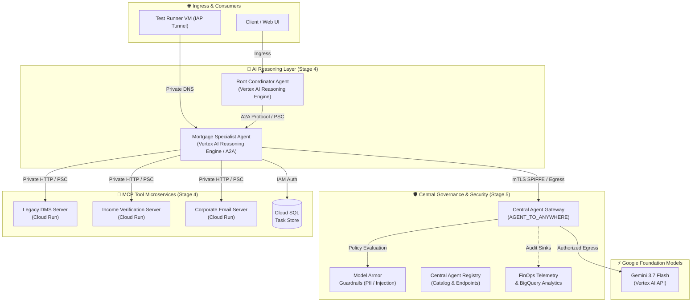

  
  <h1><code>esmeralda</code></h1>
  
An opinionated, commercial-grade blueprint designed to accelerate the path to production for AI Agents.

  

    <a href="#architecture">Architecture</a> &nbsp;&nbsp;|&nbsp;&nbsp;
    <a href="#capabilities">Capabilities</a> &nbsp;&nbsp;|&nbsp;&nbsp;
    <a href="#docs">Documentation Hub</a>
  

  

    
    
    
    
  

---

> *"O que está embaixo é como o que está no alto, e o que está no alto é como o que está embaixo."*  
> — **A Tábua de Esmeralda** (Hermes Trismegisto)

---

### 🏛️ About ESMERALDA

**ESMERALDA** is an opinionated, commercial-grade reference blueprint designed to accelerate the journey of autonomous **AI Agents and MCP servers** into production on **Google Cloud Platform**.

Built around an *"Application-First, Decoupled Infrastructure"* paradigm, the monorepo establishes a clean boundary between two worlds:
* **Above (`/apps`):** AI and software engineers focus purely on intelligence, Gemini-powered reasoning, and tool integration (MCP & A2A) using the Google ADK — free from cloud infrastructure complexity.
* **Below (`/infrastructure`):** Platform engineers maintain a declarative, zero-trust infrastructure stack via Terragrunt & Terraform, featuring multi-environment isolation, cryptographic mTLS (SPIFFE) workload identity, private networking (Shared VPC & PSC), and centralized governance (Agent Gateway, Model Armor & FinOps).

---

#### 🧭 Architectural Pillars

* 🛡️ **Enterprise Standard:** Zero-trust security by default, SecOps audit trails, and strict enterprise compliance.
* 🤖 **Multi-Agent Engine:** Seamless agent-to-agent (A2A) collaboration and orchestration governed by Central Gateways and Private Service Connect.
* 🧠 **Reasoning & Action Layer:** Advanced reasoning powered by Gemini models and open tool standards with MCP.
* ⚡ **Deployment Accelerator:** End-to-end automation from local development to production through reproducible CI/CD pipelines and built-in observability.

---

### 🗺️ Architecture at a Glance

---

### ⚡ Key Capabilities & Enterprise Highlights

| Pillar | Capability | Description |
| :--- | :--- | :--- |
| 🤖 **Multi-Agent Engine** | **Agent-to-Agent (A2A) Protocols** | Standardized asynchronous and synchronous inter-agent communication, enabling specialized agents to delegate and coordinate complex workflows. |
| 🛡️ **Zero-Trust Governance** | **Central Agent Gateway & SPIFFE Identity** | Centralized egress proxy enforcing mTLS cryptographic workload certificates, IAP IAM access boundaries, and Model Armor content sanitization. |
| 🔌 **Tool Ecosystem** | **Model Context Protocol (MCP)** | Decoupled, serverless tool microservices exposing corporate systems (DMS, email, payroll) via standardized MCP endpoints over Private Service Connect. |
| 📊 **Observability & FinOps** | **OpenTelemetry & BQ Analytics** | Native per-request token usage tracking, audit sinks, automated chargeback SQL views, and Cloud Monitoring golden signal dashboards. |
| 🏗️ **Declarative Platform** | **5-Stage Terragrunt Progression** | Modular infrastructure stack isolating Projects (S1), Networking (S2), Security (S3), Workloads (S4), and Governance (S5) across environments. |

---

### 📚 Documentation Hub

Explore in-depth documentation organized by domain:

* 🏗️ **[Platform Foundations (Stage 1-3)](docs/1-platform-foundations/README.md)** — Shared VPC, KMS CMEK encryption, IAM hierarchies, and Secret Manager architecture.
* 🤖 **[Workloads & Service Catalog (Stage 4)](docs/2-workloads-and-catalog/README.md)** — Reasoning Engine deployment specs, MCP server contracts, and Swappable Ingress Gateways.
* 📊 **[AgentOps, Governance & FinOps (Stage 5)](docs/3-agentops-and-lifecycle/README.md)** — Centralized monitoring, Multi-repo SDLC, and BigQuery FinOps views.
* 🤝 **[Contributing Guidelines](docs/contributing.md)** — Code standards, PR workflow, and testing requirements.

