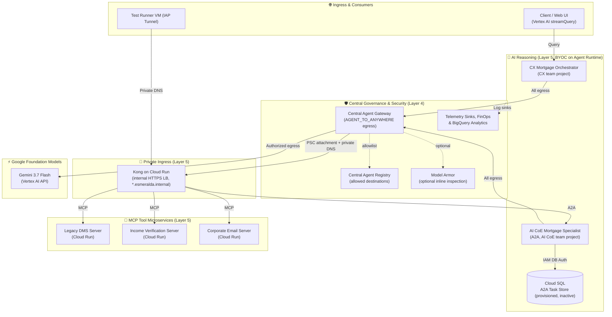

<div align="center">
  
  <h1><code>esmeralda</code></h1>
  <p>An opinionated, commercial-grade blueprint designed to accelerate the path to production for AI Agents.</p>

  <p>
    <a href="#architecture">Architecture</a> &nbsp;&nbsp;|&nbsp;&nbsp;
    <a href="#capabilities">Capabilities</a> &nbsp;&nbsp;|&nbsp;&nbsp;
    <a href="#quick-start">Quick Start</a> &nbsp;&nbsp;|&nbsp;&nbsp;
    <a href="#docs">Documentation Hub</a>
  </p>

  <p>
    <a href="LICENSE"></a>
    <a href="https://cloud.google.com/"></a>
    <a href="https://www.terraform.io/"></a>
    <a href="https://cloud.google.com/vertex-ai"></a>
  </p>
</div>

---

<div align="center">

> *"O que está embaixo é como o que está no alto, e o que está no alto é como o que está embaixo."*  
> — **A Tábua de Esmeralda** (Hermes Trismegisto/Jorge Ben Jor)

</div>

---

### 🏛️ About ESMERALDA

**ESMERALDA** is an opinionated, commercial-grade reference blueprint designed to accelerate the journey of autonomous **AI Agents and MCP servers** into production on **Google Cloud Platform**.

Built around an *"Application-First, Decoupled Infrastructure"* paradigm, the monorepo establishes a clean boundary between two worlds:
* **Above (`/apps`):** AI and software engineers focus purely on intelligence, Gemini-powered reasoning, and tool integration (MCP & A2A) using the Google ADK — free from cloud infrastructure complexity.
* **Below (`/infrastructure`):** Platform engineers maintain a declarative, zero-trust infrastructure stack via Terragrunt & Terraform, featuring multi-environment isolation, SPIFFE-based Agent Identity for every agent, private networking (Shared VPC & PSC), and centralized governance (Agent Gateway, Model Armor & FinOps).

#### 👥 Who Builds What

The reference use case is a mortgage-underwriting assistant, split across two agent teams that each own a separate GCP project:

| Team | Builds | Esmeralda example | Project |
| :--- | :--- | :--- | :--- |
| **CX team** | User-facing **orchestrator** agents (ADK) that *consume* reusable agents | `cx-mortgage-orchestrator` | `esm-<env>-cx-agents-<sfx>` |
| **AI CoE team** | Reusable **specialist** agents exposed over the **A2A** (Agent-to-Agent) protocol, which any team can call | `ai-coe-mortgage-specialist` (Document Search, Income Verification, Corporate Email skills via MCP tools) | `esm-<env>-ai-coe-agents-<sfx>` |

The orchestrator never calls the specialist directly: every call goes through the Central Agent Gateway and the Kong internal gateway, so each team stays isolated and every hop is authorized.

---

#### 🧭 Architectural Pillars

* 🛡️ **Enterprise Standard:** Zero-trust security by default, SecOps audit trails, and strict enterprise compliance.
* 🤖 **Multi-Agent Engine:** Seamless agent-to-agent (A2A) collaboration and orchestration governed by the Central Agent Gateway and a private Kong gateway.
* 🧠 **Reasoning & Action Layer:** Advanced reasoning powered by Gemini models and open tool standards with MCP.
* ⚡ **Deployment Accelerator:** End-to-end automation from local development to production through reproducible CI/CD pipelines and built-in observability.

---

<a id="architecture"></a>
### 🗺️ Architecture at a Glance


```mermaid
flowchart TD
    subgraph Clients["🌐 Ingress & Consumers"]
        User["Client / Web UI\n(Vertex AI streamQuery)"]
        TestVM["Test Runner VM (IAP Tunnel)"]
    end

    subgraph Governance["🛡️ Central Governance & Security (Layer 4)"]
        AGW["Central Agent Gateway\n(AGENT_TO_ANYWHERE egress)"]
        AR["Central Agent Registry\n(allowed destinations)"]
        MA["Model Armor\n(optional inline inspection)"]
        FinOps["Telemetry Sinks, FinOps\n& BigQuery Analytics"]
    end

    subgraph Agents["🧠 AI Reasoning (Layer 5, BYOC on Agent Runtime)"]
        Orch["CX Mortgage Orchestrator\n(CX team project)"]
        Spec["AI CoE Mortgage Specialist\n(A2A, AI CoE team project)"]
        TaskDB[("Cloud SQL\nA2A Task Store (provisioned, inactive)")]
    end

    subgraph Private["🔐 Private Ingress (Layer 5)"]
        Kong["Kong on Cloud Run\n(internal HTTPS LB, *.esmeralda.internal)"]
    end

    subgraph Tools["🔌 MCP Tool Microservices (Layer 5)"]
        DMS["Legacy DMS Server\n(Cloud Run)"]
        Income["Income Verification Server\n(Cloud Run)"]
        Email["Corporate Email Server\n(Cloud Run)"]
    end

    subgraph Models["⚡ Google Foundation Models"]
        Gemini["Gemini 3.7 Flash\n(Vertex AI API)"]
    end

    User -->|Query| Orch
    Orch -->|All egress| AGW
    Spec -->|All egress| AGW
    AGW -. allowlist .-> AR
    AGW -. optional .-> MA
    AGW -->|Authorized egress| Gemini
    AGW -->|PSC attachment + private DNS| Kong
    TestVM -->|Private DNS| Kong
    Kong -->|A2A| Spec
    Kong -->|MCP| DMS
    Kong -->|MCP| Income
    Kong -->|MCP| Email
    Spec -->|IAM DB Auth| TaskDB
    Agents -.->|Log sinks| FinOps
```

Both agents are **bring-your-own-container (BYOC)** images running on **Vertex AI Agent Engine** (Agent Runtime), each with its own SPIFFE Agent Identity. Every outbound call they make (Gemini, MCP tools, other agents) is transparently routed through the **Central Agent Gateway**, which only allows destinations registered in the **Agent Registry**. Private destinations under `*.esmeralda.internal` are served by **Kong** behind an internal HTTPS load balancer whose certificate is signed by Esmeralda's own internal Root CA. See the [Central Agent Gateway guide](docs/3-agentops-and-lifecycle/01-central-agent-gateway.md) for the full request path and certificate chain.

---

<a id="capabilities"></a>
### ⚡ Key Capabilities & Enterprise Highlights

| Pillar | Capability | Description |
| :--- | :--- | :--- |
| 🤖 **Multi-Agent Engine** | **Agent-to-Agent (A2A) Protocols** | Standard inter-agent protocol: the CX orchestrator delegates to the AI CoE's reusable specialist through its published agent card. A Cloud SQL task store is provisioned but not yet enabled (`USE_CLOUD_SQL = "0"`; tasks are kept in memory). |
| 🛡️ **Zero-Trust Governance** | **Central Agent Gateway & SPIFFE Identity** | Google-managed egress proxy that checks *who* is calling (SPIFFE Agent Identity), *where* it is going (Agent Registry allowlist + IAP `roles/iap.egressor`), and optionally *what* is sent (Model Armor, wired but disabled by default). |
| 🔌 **Tool Ecosystem** | **Model Context Protocol (MCP)** | Decoupled, serverless tool microservices exposing corporate systems (DMS, email, payroll) via standardized MCP endpoints, reachable only privately at `https://<svc>.esmeralda.internal/mcp` through Kong. |
| 📊 **Observability & FinOps** | **OpenTelemetry & BQ Analytics** | OpenTelemetry instrumentation in the agents, per-request token usage tracking, central log sinks, automated chargeback SQL views, and Cloud Monitoring golden signal dashboards. |
| 🏗️ **Declarative Platform** | **Layered Terragrunt Progression** | Modular infrastructure stack built from the ground up: shared CI/CD (L0), then per environment Projects (L1), Networking (L2), Security (L3), Governance (L4), and Workloads (L5). |

---

<a id="quick-start"></a>
### 🚀 Quick Start

Requires `gcloud`, `terraform`, `terragrunt` and [`uv`](https://docs.astral.sh/uv/). Set your billing account and organization in `infrastructure/live/<env>/env.yaml` first.

```bash
make bootstrap                 # preflight checks + uv workspace sync
make test-all                  # Python unit tests + Terraform validation
make deploy-all ENV=dev        # Layer 0 -> 1-3 -> 4 -> build images -> 5
make test-e2e ENV=dev          # specialist, then orchestrator -> specialist through the gateway
```

Run `make help` for every target (per-layer deploys, local agent tests, image promotion to `prd`).

---

<a id="docs"></a>
### 📚 Documentation Hub

Explore in-depth documentation organized by domain (start with the [Documentation Hub](docs/README.md) if you are new):

* 🏗️ **[Platform Foundations (Layer 1-3)](docs/1-platform-foundations/README.md)** — Shared VPC, KMS CMEK encryption, IAM hierarchies, and Secret Manager architecture.
* 🤖 **[Workloads & Service Catalog (Layer 5)](docs/2-workloads-and-catalog/README.md)** — Reasoning Engine deployment specs, MCP server contracts, and Swappable Ingress Gateways.
* 📊 **[AgentOps, Governance & FinOps (Layer 4)](docs/3-agentops-and-lifecycle/README.md)** — Centralized monitoring, Multi-repo SDLC, and BigQuery FinOps views.
* 🛡️ **[Central Agent Gateway Guide](docs/3-agentops-and-lifecycle/01-central-agent-gateway.md)** — How agent egress, the Agent Registry, private certificates and BYOC agents fit together.
* 📖 **[Architecture Overview & Documentation Hub](docs/README.md)** — Mental model, team ownership, request lifecycle, and the layered blueprint.
* 🤝 **[Contributing Guidelines](docs/contributing.md)** — CLA, PR workflow, and local testing commands.
* 📜 **[Code of Conduct](docs/code-of-conduct.md)** — Community engagement standards.


