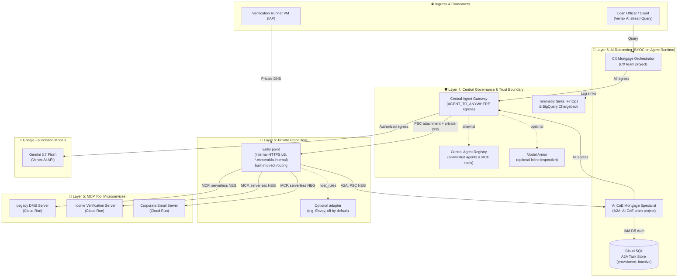

<div align="center">
  
  <h1><code>esmeralda</code></h1>
  <p>An opinionated, commercial-grade reference blueprint for taking autonomous AI Agents and MCP tool servers from prototype to zero-trust production on Google Cloud.</p>

  <p>
    <a href="#the-challenge">Why Esmeralda</a> &nbsp;&nbsp;|&nbsp;&nbsp;
    <a href="#architecture">Architecture</a> &nbsp;&nbsp;|&nbsp;&nbsp;
    <a href="#capabilities">Capabilities</a> &nbsp;&nbsp;|&nbsp;&nbsp;
    <a href="#quick-start">Quick Start</a> &nbsp;&nbsp;|&nbsp;&nbsp;
    <a href="#docs">The Esmeralda Book</a>
  </p>

  <p>
    <a href="LICENSE"></a>
    <a href="https://cloud.google.com/"></a>
    <a href="https://www.terraform.io/"></a>
    <a href="https://cloud.google.com/vertex-ai"></a>
  </p>
</div>

---

<a id="the-challenge"></a>
### Why Esmeralda: From Laptop Prototype to Multi-Team Production

Building an AI agent prototype on a laptop takes an afternoon. Taking that same agent into enterprise production—where it must verify customer identities, query sensitive document systems, collaborate with specialist agents across departments, and pass security and FinOps audits—is where most initiatives stall.

When architecture is tightly coupled, every change turns into a cross-team bottleneck: an AI engineer changing a prompt waits on a networking ticket, a backend team updating a tool forces an agent redeploy, and SecOps has to audit custom glue code for every new service.

**Esmeralda** solves this with a **Decoupled Layered Architecture that enables Multi-Track Parallelism**. By separating the platform into six composable layers (`L0 CI/CD` through `L5 Workloads`) joined by four stable contracts—private DNS (`*.esmeralda.internal`), the central `Agent Registry`, the declarative `env.yaml` service catalog, and `agent.yaml` runtime specs—seven distinct engineering tracks can build, test, and ship in parallel without blocking one another:

| Track / Team | What They Own | Contract Boundary | Example in Esmeralda |
| :--- | :--- | :--- | :--- |
| **CX Product Team** | Customer-facing **orchestrator** agents (Google ADK) | Calls specialists via `https://<agent>.esmeralda.internal` (A2A) | `cx-mortgage-orchestrator` (`esm-<env>-cx-agents-<sfx>`) |
| **AI CoE Team** | Reusable **specialist** agents published over **A2A** | Publishes an Agent Card in `Agent Registry`; calls tools via MCP | `ai-coe-mortgage-specialist` (`esm-<env>-ai-coe-agents-<sfx>`) |
| **Backend / MCP Teams** | Standalone **Model Context Protocol (MCP)** microservices | Exposes JSON-RPC tools at `https://<svc>.esmeralda.internal/mcp` (`tools.json`) | `legacy-dms`, `income-verification`, `corporate-email` (`esm-<env>-mcps-<sfx>`) |
| **Gateway / Partner API Team** | Private front door (`entrypoint`) and optional L7 adapters | Routes `catalog` hosts via built-in `direct` routing or `envoy` / `apigee` | `entrypoint`, `gateways/direct`, `gateways/envoy` (`esm-<env>-gateway-<sfx>`) |
| **Governance & FinOps Team** | Outbound policy enforcement, guardrails, and chargeback | Governs egress via **Central Agent Gateway**, `Agent Registry` & BigQuery views | `layer-4-governance` (`esm-<env>-governance-<sfx>`) |
| **SecOps & Identity Team** | Zero-trust identity, encryption, and private PKI | Provisions SPIFFE Agent Identities, KMS CMEK, and the internal Root CA | `layer-3-security` |
| **Cloud Networking Team** | Private network fabric and DNS | Owns Shared VPC, PSC attachments, and the `*.esmeralda.internal` DNS zone | `layer-1-projects`, `layer-2-networking` (`esm-<env>-net-host-<sfx>`) |

---

### The Running Story: Julian Sterling's Mortgage Application

Throughout the repository and documentation, we follow a single end-to-end scenario: a loan officer asks Esmeralda, ***"Can you verify Julian Sterling's income?"***

1. **Customer Experience (`cx-mortgage-orchestrator`):** Receives the question on Vertex AI Agent Runtime, reasons with Gemini, and discovers that mortgage underwriting belongs to the AI Center of Excellence's specialist agent.
2. **Governed Delegation (`Central Agent Gateway` → `Entry Point`):** The orchestrator sends an A2A task to `https://ai-coe-mortgage-specialist.esmeralda.internal`. The **Central Agent Gateway** verifies the orchestrator's SPIFFE Agent Identity and confirms the destination is allowlisted in the **Agent Registry**, then forwards the call privately to the internal HTTPS load balancer (**entry point**), which routes it straight to the specialist engine (`direct` backend).
3. **Private Tool Execution (`ai-coe-mortgage-specialist` → `MCP Servers`):** The specialist calls `income-verification`, `legacy-dms`, and `corporate-email` over MCP (`https://<svc>.esmeralda.internal/mcp`)—again governed by the Central Agent Gateway and routed directly to private Cloud Run services with the caller's own identity token.
4. **Full Attribution (`FinOps & Telemetry`):** Every model token, tool call, and latency span is streamed to central BigQuery chargeback views so business leaders see the exact cost and performance of each department's agent.

---

<a id="architecture"></a>
### Architecture at a Glance


```mermaid
flowchart TD
    subgraph Clients["🌐 Ingress & Consumers"]
        User["Loan Officer / Client\n(Vertex AI streamQuery)"]
        TestVM["Verification Runner VM (IAP)"]
    end

    subgraph Governance["🛡️ Layer 4: Central Governance & Trust Boundary"]
        AGW["Central Agent Gateway\n(AGENT_TO_ANYWHERE egress)"]
        AR["Central Agent Registry\n(allowlisted agents & MCP tools)"]
        MA["Model Armor\n(optional inline inspection)"]
        FinOps["Telemetry Sinks, FinOps\n& BigQuery Chargeback"]
    end

    subgraph Agents["🧠 Layer 5: AI Reasoning (BYOC on Agent Runtime)"]
        Orch["CX Mortgage Orchestrator\n(CX team project)"]
        Spec["AI CoE Mortgage Specialist\n(A2A, AI CoE team project)"]
        TaskDB[("Cloud SQL\nA2A Task Store (provisioned, inactive)")]
    end

    subgraph Private["🔐 Layer 5: Private Front Door"]
        EP["Entry point\n(internal HTTPS LB, *.esmeralda.internal)\nbuilt-in direct routing"]
        Adapter["Optional adapter\n(e.g. Envoy, off by default)"]
    end

    subgraph Tools["🔌 Layer 5: MCP Tool Microservices"]
        DMS["Legacy DMS Server\n(Cloud Run)"]
        Income["Income Verification Server\n(Cloud Run)"]
        Email["Corporate Email Server\n(Cloud Run)"]
    end

    subgraph Models["⚡ Google Foundation Models"]
        Gemini["Gemini 3.7 Flash\n(Vertex AI API)"]
    end

    User -->|Query| Orch
    Orch -->|All egress| AGW
    Spec -->|All egress| AGW
    AGW -. allowlist .-> AR
    AGW -. optional .-> MA
    AGW -->|Authorized egress| Gemini
    AGW -->|PSC attachment + private DNS| EP
    TestVM -->|Private DNS| EP
    EP -->|A2A, PSC NEG| Spec
    EP -->|MCP, serverless NEG| DMS
    EP -->|MCP, serverless NEG| Income
    EP -->|MCP, serverless NEG| Email
    EP -.->|host_rules| Adapter
    Spec -->|IAM DB Auth| TaskDB
    Agents -.->|Log sinks| FinOps
```

Both agents run as **bring-your-own-container (BYOC)** images on **Vertex AI Agent Engine** (Agent Runtime), each with its own cryptographic SPIFFE Agent Identity. Every outbound call they make—to Gemini, to MCP tools, or to other agents—passes through the **Central Agent Gateway**, which enforces a deny-by-default allowlist backed by the **Agent Registry**. Private destinations under `*.esmeralda.internal` land at the internal HTTPS load balancer (**entry point**), which routes each host straight to its Cloud Run service or Agent Runtime engine via the built-in `direct` backend (zero extra proxy VMs), or optionally through a pluggable adapter (`envoy`, `apigee`) configured in `env.yaml`.

---

<a id="capabilities"></a>
### Key Capabilities & Enterprise Highlights

| Pillar | Capability | Description |
| :--- | :--- | :--- |
| **Multi-Track Parallelism** | **Decoupled 6-Layer Architecture** | Modular Terragrunt progression—Shared CI/CD (`L0`), Projects (`L1`), Networking (`L2`), Security & PKI (`L3`), Governance (`L4`), and Workloads (`L5`)—allowing platform, security, tool, and AI teams to ship independently. |
| **Multi-Agent Engine** | **Agent-to-Agent (A2A) Protocol** | Open inter-agent delegation: the CX orchestrator discovers and invokes the AI CoE's reusable specialist via its published Agent Card. Includes a private Cloud SQL task store (`USE_CLOUD_SQL = "0"` by default; tasks kept in memory). |
| **Zero-Trust Governance** | **Central Agent Gateway & SPIFFE Identity** | Google-managed egress proxy that verifies *who* is calling (SPIFFE Agent Identity), *where* it is going (Agent Registry allowlist + IAP `roles/iap.egressor`), and optionally *what* is sent (Model Armor, wired and toggleable). |
| **Tool Ecosystem** | **Model Context Protocol (MCP)** | Serverless FastMCP microservices exposing corporate systems (DMS, income verification, email) at `https://<svc>.esmeralda.internal/mcp` with end-to-end caller identity preservation. |
| **Observability & FinOps** | **OpenTelemetry & BigQuery Chargeback** | Automatic OpenTelemetry spans, per-request token attribution, central log sinks, automated chargeback SQL views (`vw_monthly_agent_chargeback`), and Cloud Monitoring golden signals. |
| **Unified Developer CLI** | **`esmeralda` CLI & MCP Server** | First-class CLI (`uv run esmeralda ...`) and read-only MCP server (`uv run esmeralda mcp`) for local development, infrastructure planning, live verification, and AI-assisted operations. |

---

<a id="quick-start"></a>
### Quick Start

Requires `gcloud`, `terraform`, `terragrunt`, and [`uv`](https://docs.astral.sh/uv/). Export your billing account (`ESMERALDA_BILLING_ACCOUNT`, and optionally `ESMERALDA_ORG_ID`) and review `infrastructure/live/<env>/env.yaml`.

#### 1. Using the `esmeralda` CLI (Recommended)

The `esmeralda` CLI inspects your environment, validates contracts, runs local or remote agent queries, plans and applies infrastructure units with destroy-guard protection, and verifies every route end to end:

```bash
uv run esmeralda doctor --env dev          # preflight checks (tools, auth, env.yaml)
uv run esmeralda status --env dev          # live status of layers, catalog hosts & gateways
uv run esmeralda contracts                 # inspect gateway & catalog architectural contracts
uv run esmeralda guard --all               # run security & hygiene guards across the repo

# Local development: run an agent + local MCP servers in one command
uv run esmeralda query apps/agents/cx-mortgage-orchestrator \
  -q "Can you verify Julian Sterling's income?"

# Infrastructure lifecycle & end-to-end verification
uv run esmeralda units --env dev           # list all deployable Terragrunt units
uv run esmeralda plan <unit> --env dev     # plan a unit
uv run esmeralda apply <unit> --env dev    # apply a unit (enforces destroy guard)
uv run esmeralda verify --env dev          # probe every catalog route + live orchestrator query
uv run esmeralda logs cx-mortgage-orchestrator --env dev
```

Coding agents can also inspect the workspace directly via the read-only MCP server:

```bash
uv run esmeralda mcp
```

#### 2. Using `make` Targets (Full-Stack Automation)

The root `Makefile` wraps full-environment bootstrap, testing, image builds, and multi-layer deployments:

```bash
make bootstrap                 # preflight checks + uv workspace sync
make test-all                  # Python unit tests + Terraform validation + gateway harness
make deploy-all ENV=dev        # Layer 0 -> 1-3 -> 4 -> build images -> 5
make test-e2e ENV=dev          # specialist, then orchestrator -> specialist through the gateway
make test-gateway ENV=dev      # probe every *.esmeralda.internal route + live query
```

Run `uv run esmeralda --help` or `make help` for the complete command reference.

---

<a id="docs"></a>
### The Esmeralda Book (Documentation Hub)

**Read the full documentation online: <https://google.github.io/esmeralda/>** (organized as a cohesive, four-part book from Page 1 to Page N). The source pages live in [`docs/src/`](docs/src/index.md):

* **[Prologue: Architecture & Documentation Hub](docs/src/index.md)** — Why enterprise agents stall, how Esmeralda's decoupled layers enable multi-track parallelism, and Julian Sterling's end-to-end request tour.
* **[Part I — The Cast: Agents, Tools & Gateways (Layer 5)](docs/src/2-workloads-and-catalog/index.md)**
  * [Ch 1: Two Teams, Two Agents — Orchestration vs. Specialization](docs/src/2-workloads-and-catalog/03-ai-agents-and-database.md)
  * [Ch 2: Wrapping Enterprise Systems as MCP Tool Servers](docs/src/2-workloads-and-catalog/02-mcp-tool-servers.md)
  * [Ch 3: The Private Front Door & Pluggable Gateways](docs/src/2-workloads-and-catalog/01-ingress-gateways.md)
* **[Part II — The Trust Boundary: Governance, Security & Operations (Layer 4)](docs/src/3-agentops-and-lifecycle/index.md)**
  * [Ch 4: The Central Agent Gateway & Private PKI](docs/src/3-agentops-and-lifecycle/01-central-agent-gateway.md)
  * [Ch 5: Capability-Based Governance](docs/src/3-agentops-and-lifecycle/04-capability-based-governance.md)
  * [Ch 6: Centralized Monitoring, Dashboards & FinOps Chargeback](docs/src/3-agentops-and-lifecycle/03-centralized-monitoring-and-dashboards.md)
  * [Ch 7: Operating with Agents & the Esmeralda CLI](docs/src/3-agentops-and-lifecycle/04-operating-with-agents.md)
* **[Part III — The Stage: Platform Foundations (Layers 0–3)](docs/src/1-platform-foundations/index.md)**
  * [Ch 8: Projects, APIs & FinOps Isolation (Layer 1)](docs/src/1-platform-foundations/01-projects-and-finops.md)
  * [Ch 9: Private Networking, Shared VPC & DNS (Layer 2)](docs/src/1-platform-foundations/02-private-networking.md)
  * [Ch 10: Security, SPIFFE IAM, CMEK & Internal CA (Layer 3)](docs/src/1-platform-foundations/03-security-iam-and-telemetry.md)
* **[Part IV — The Developer Toolkit: Esmeralda Library & CLI](docs/src/4-esmeralda-library/index.md)**
  * [Ch 11: Developer Usage Guide](docs/src/4-esmeralda-library/guide.md) & [Ch 12: Package & CLI Reference](docs/src/4-esmeralda-library/reference.md)
* **[Reference & Community](docs/src/contributing.md)** — [Make Targets](docs/src/reference/make-targets.md), [Contributing Guide](docs/src/contributing.md), [AGENTS.md](AGENTS.md), [`llms.txt`](docs/src/llms.txt), and [Code of Conduct](docs/src/code-of-conduct.md).
