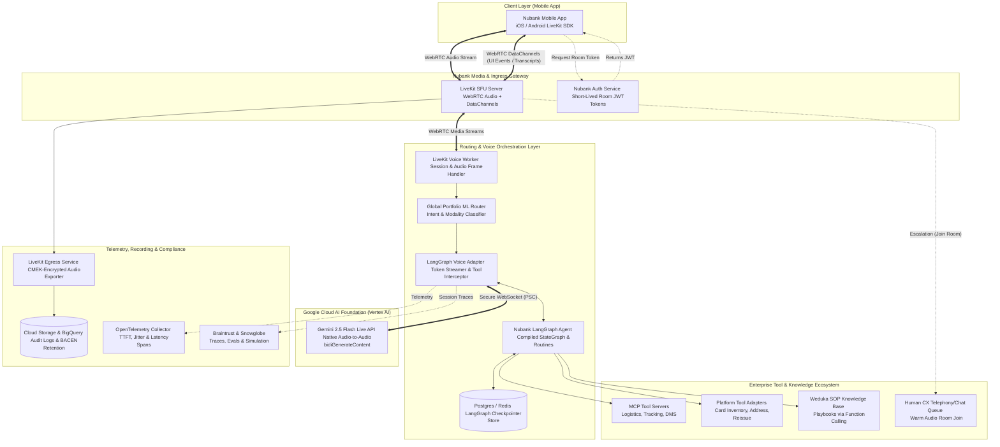
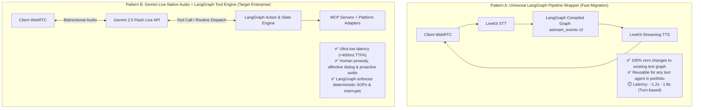
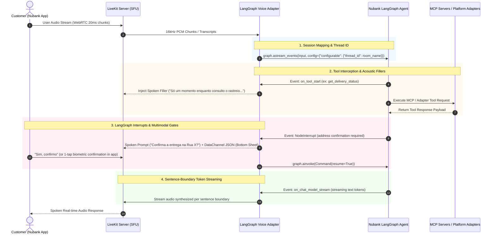
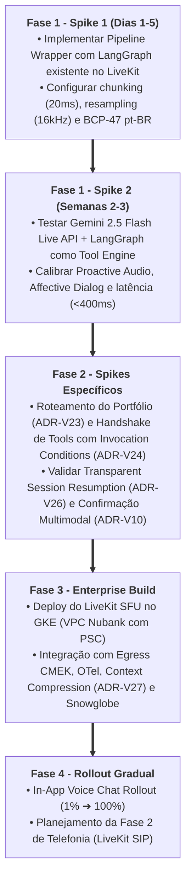

# Architecture Decision Record (ADR): Nubank Card Lifecycle AI Voice Migration

* **Project:** Bringing Card Lifecycle AI to Voice (Nubank × GCCP Partnership)
* **Status:** `PROPOSED` / `GAPS & DECISIONS INVENTORY (LIVEKIT + LANGGRAPH + GEMINI LIVE BEST PRACTICES)`
* **Date:** 2026-08-20
* **Target Audience:** Nubank CX AI Platform Engineering, AI Architects, Infosec, Mobile Leads & GCCP Specialists

---

## 1. Context & Business Drivers

Nubank operates a mature, high-volume, ReAct-style Customer Experience (CX) AI Agent for **Card Lifecycle Management** built on Nubank's agentic platform (`cx-llm-assistant`) using **LangGraph** (`StateGraph`), resolving ~250k–300k chats/month (7% of total CX chat volume, 10% of automated machine volume) with 100% rollout in Brazil.

### Key Workload & Portfolio Characteristics
* **Portfolio Scope:** Card Lifecycle Management is **one of many AICX Agents** behind a unified, central orchestration and routing layer. The global router selects among the full agent portfolio, legacy deterministic flows, and human agent queues when no AI agent is eligible.
* **Core Intents Handled:**
  1. Card delivery status / tracking investigation (~48%)
  2. Card issuance / reissue due to loss, theft, damage, expiry (~45%)
  3. Delivery address change (~7%)
* **Out of Scope (Hard Escalation to Human):** NuTag / NuCel deliveries.
* **Tool Foundation:** Hybrid ecosystem comprising **MCP Servers** (majority of tool contracts) and **Platform Tool Adapters** over existing internal services/APIs.
* **Core Design Principle:** Replicating human agent Standard Operating Procedures (SOPs) grounded in **Weduka playbooks**, executing actions via governed tools, and following structured routines (Investigate → Align → Confirm → Act) with strict confirmation gates (`interrupt()`) before state mutations (reissue, address update).
* **Current Chat Baseline Metrics:**
  * Machine tNPS: `75.8` (Relative to Human: `91%`)
  * Self-Service Rate (SSR): `74.5%`
  * Dropout / Recontact Rate (24h): `2.7% / 5.5%`

### The Objective
Extend this agent to **real-time voice using LiveKit and Gemini Live API**, initially targeting **In-App Voice Chat** (Phase 1) and establishing a scalable, channel-agnostic blueprint for eventual expansion to **Telephony / Phone (SIP/PSTN)** (Phase 2), while strictly maintaining or improving chat quality baselines and safety guardrails.

---

## 2. Target Voice Architecture: LiveKit Media Gateway + LangGraph + Gemini Live

The target architecture introduces **LiveKit** as a dedicated **WebRTC Media Gateway (SFU)** at the network edge, interacting with a backend **LangGraph Voice Runner** that bridges the conversational layer with Nubank's existing **LangGraph StateGraph**:



---

## 3. The Reusable "LangGraph-to-Voice" Integration Patterns

To allow Nubank to transform the current *Card Lifecycle* agent — and future text-mode LangGraph agents — into voice-compliant agents without rewriting business logic, two integration paradigms are supported:



### Deep Dive: How the Generic LangGraph Voice Adapter Works



---

## 4. Comparative Analysis: LiveKit vs. Custom Direct Pipeline

| Architectural Dimension | Approach A: Custom Direct WebSockets / gRPC | Approach B: LiveKit WebRTC Gateway (Recommended) | Why LiveKit Wins for Nubank |
| :--- | :--- | :--- | :--- |
| **Network & Audio Quality over Cellular (4G/5G)** | Prone to TCP head-of-line blocking. Packet loss results in audio stutter and cumulative lag. | WebRTC (UDP) with adaptive bitrate, packet loss concealment (PLC), and dynamic jitter buffer. | **Superior UX in Brazil:** Crucial for mobile users moving through erratic 4G/5G coverage without dropped voice turns. |
| **Mobile Client Implementation** | Must write low-level audio capture, downsampling, echo cancellation (AEC), and noise suppression per OS (Swift & Kotlin). | Official battle-tested SDKs for iOS (Swift), Android (Kotlin), Flutter, and React Native. | **Faster Time to Market:** Mobile team avoids building raw audio I/O engines from scratch. |
| **Multimodal Synchronization (Voice + App UI)** | Requires a separate WebSocket or polling connection to sync visual confirmation modals with audio. | Built-in **WebRTC DataChannels** multiplexed on the same connection as the audio track. | **Zero-Drift Multimodal Sync:** Instant trigger of native bottom sheets (ex: address confirmation) synced with voice. |
| **Turn-Taking & Barge-In (Interruption)** | Complex client-side buffer flushing and server-side socket frame dropping to stop speech. | Native track muting, active speaker detection (`speaker_detection`), and instant client-side playback cutoff. | **Natural Dialogue:** When user speaks over the bot, audio cutoff is instantaneous without latency lag. |
| **Human Escalation (Warm Transfer)** | Complex proxy redirection; requires tearing down client socket and re-establishing with human. | **Multi-participant Room:** Human CX agent simply joins the existing WebRTC room; bot leaves silently. | **Seamless Handoff:** No call drops or client reconnection when escalating to human CX. |
| **Phase 2 Expansion (Phone / SIP / PSTN)** | Must build or integrate an external SIP-to-WebSocket bridge (Asterisk, FreeSWITCH, Twilio). | **LiveKit SIP Module:** Connects SIP/PSTN trunks directly into LiveKit rooms out of the box. | **Channel-Agnostic Core:** 95%+ of backend agent logic written for in-app voice works unmodified on phone calls. |
| **Compliance & Audio Recording** | Must build custom audio tap inside proxy; risk of corrupted audio files during crashes. | **LiveKit Egress:** Distributed recording service saving encrypted tracks to GCS with CMEK keys. | **Regulatory Compliance:** Meets BACEN and LGPD storage and encryption standards out of the box. |
| **Operational Overhead** | Low infra footprint (simple reverse proxy), but high custom code maintenance. | Requires running LiveKit SFU cluster (Go binary) on GKE or adopting LiveKit Cloud. | **Standard Platform Ingress:** Well-documented Helm charts and Terraform modules for GKE. |

---

## 5. Comprehensive Inventory of Architectural Decisions & Knowledge Gaps

Below is the structured catalog of 27 technical decisions and discovery points required to deliver an enterprise-grade voice migration.

---

### Domain 1: Streaming Transport, Edge Ingress & Mobile Networking

* **[ADR-V23] Global Omnichannel & Portfolio Router (Voice vs. Text Routing)**
  * *Context:* Card Lifecycle is one of many AICX Agents behind the same central orchestration layer. The router selects among the full agent portfolio (and human/legacy paths). When voice is introduced, some destination agents will be voice-native, while others remain text-only.
  * *Options to evaluate:*
    1. **Upfront Speech-to-Intent Classifier at Gateway:** The ingress layer transcribes the user's initial greeting/intent, runs Nubank's ML routing model, and dispatches dynamically (Gemini Live vs Universal Pipeline Wrapper vs Human Queue).
    2. **Contextual In-App Entry Point (Phase 1 Scoping):** In-app voice activation is initially scoped to Card Lifecycle entry points (e.g. card tracking screen).
    3. **Conversational Voice Front-Door Agent:** A lightweight Gemini Live router agent conducts the initial 1-turn triage before transferring the session to the target agent subgraph.
  * *Decision Gap:* Which routing pattern best aligns with Nubank's existing ML router and prevents latency penalties at call initiation?

* **[ADR-V01] Client Audio Buffering, Resampling & Streaming Protocol**
  * *Context:* Low-latency bidirectional audio streaming between Nubank Mobile App and backend.
  * *Best Practice Specifications:*
    * **Transport:** WebRTC via LiveKit (UDP-based).
    * **Chunk Size:** Client must stream audio in **small 20ms to 40ms buffers** (never 1s chunks) to minimize entry latency.
    * **Downsampling:** Mobile client resamples mic input (44.1kHz/48kHz) to **16kHz mono PCM** before sending.
    * **Language Enforcement:** Set explicit BCP-47 codes: `speech_config=SpeechConfig(language_code="pt-BR")` and `input_audio_transcription=AudioTranscriptionConfig(language_codes=['pt-BR'])`.
  * *Decision Gap:* Confirm if Nubank Mobile App team can embed LiveKit Mobile SDK (Swift/Kotlin) with these audio pipeline presets.

* **[ADR-V02] Edge Gateway & Ingress Topology**
  * *Context:* Authenticating and routing live voice connections while enforcing zero-trust boundaries.
  * *Options to evaluate:*
    1. **LiveKit SFU behind Internal Ingress (Recommended):** Mobile app requests ephemeral JWT from Nubank Auth; connects to LiveKit SFU; backend Voice Worker forwards audio to Vertex AI Gemini Live API via Google Private Service Connect (PSC).
    2. **Direct Tokenized Client-to-Vertex:** Mobile app connects directly to Vertex AI endpoint (exposes model endpoint, bypasses central packet inspection).
  * *Decision Gap:* Confirm network topology for routing WebRTC traffic into Nubank VPC over UDP ports.

* **[ADR-V26] Transparent Session Resumption & Mobile Fault-Tolerance**
  * *Context:* Mobile users switching between 4G/5G/Wi-Fi or experiencing momentary cellular packet drops during critical card reissue steps.
  * *Architectural Design:*
    1. **Transparent Resumption Setup:** Configure `session_resumption=SessionResumptionConfig(transparent=True)`.
    2. **Handle Tracking & Message Buffering:** Listen for `session_resumption_update` events, store the `new_handle`, and maintain an indexed buffer (`index >= 1`) of transmitted client frames.
    3. **GoAway & Error Recovery:** Handle `go_away` signals and WebSocket disconnects (codes 1000/1006) by proactively reconnecting with `handle` and replaying unacknowledged messages (`last_consumed_client_message_index`).
  * *Decision Gap:* Validate message replay buffer sizing to prevent audio duplication upon reconnection.

* **[ADR-V22] LiveKit Deployment Topology & Hosting Model**
  * *Context:* Managing the LiveKit SFU and Egress infrastructure.
  * *Options to evaluate:*
    1. **Self-Hosted on Google Kubernetes Engine (GKE):** Deployed within Nubank GCP Shared VPC, using internal load balancers and PSC for zero egress exposure.
    2. **LiveKit Cloud (Managed SaaS):** Fully managed, multi-region routing, but requires Infosec approval for third-party media relay.
  * *Decision Gap:* What is Infosec's policy regarding self-hosting on GKE vs. managed cloud for real-time voice streams?

---

### Domain 2: Model Modality, System Instructions & Conversational Design

* **[ADR-V04] End-to-End Multimodal Live API vs. Cascaded Pipeline**
  * *Context:* Architecture of the speech reasoning loop.
  * *Options to evaluate:*
    1. **Native Gemini 2.5 Flash Live API (Audio-to-Audio) + LangGraph Tools (Recommended):** Lowest latency (<400ms TTFT), natural prosody, emotional tone, native barge-in handling, with deterministic tools executed by LangGraph.
    2. **Cascaded Pipeline Wrapper (LiveKit STT → LangGraph StateGraph → Streaming TTS):** Full text inspection between turns, 100% prompt parity with chat, but higher latency (1.2s–1.8s).
  * *Decision Gap:* Benchmark latency and user satisfaction of Pattern A vs. Pattern B in user testing.

* **[ADR-V05] Structured System Instructions & Prompt Chaining Architecture**
  * *Context:* Spoken voice requires crisp, modular System Instructions (SIs) to prevent TTFA latency bloat and hallucination.
  * *Best Practice SI Framework:*
    1. **Agent Persona:** Clear identity ("Nu Voice", friendly, objective, Affirm/Align/Assure tone) + strict language constraint:  
       `"RESPOND IN pt-BR. YOU MUST RESPOND UNMISTAKABLY IN pt-BR."`
    2. **Conversational Rules (One-Time vs Loops):** Delineate one-time intake (fetch customer active cards/address) from open conversational loops (carrier tracking exploration, card loss inquiry).
    3. **Tool Invocation in Distinct Sentences:** Direct declarative steps: *"Primeiro, pergunte os 4 últimos dígitos do cartão. Em seguida, invoque `get_delivery_status` com esses dados."*
    4. **Guardrails:** Explicit behavioral prohibitions using the word *unmistakably* to anchor precision.
    5. **Prompt Chaining via LangGraph:** Decompose large Jinja2 templates into state-driven sub-prompts dynamically yielded per routine.
  * *Decision Gap:* Establish prompt chaining interface between LangGraph nodes and Live API context updates.

* **[ADR-V25] Advanced Native Audio Capabilities Configuration (Affective Dialog & Proactive Audio)**
  * *Context:* Gemini Live API supports advanced native audio features that dramatically enhance natural customer service conversations.
  * *Capabilities to calibrate:*
    1. **Affective Dialog (`enable_affective_dialog=True`):** Model adapts tone, empathy, and cadence based on customer's vocal emotion (e.g. reassuring and apologetic for stolen card vs. quick and concise for status inquiry).
    2. **Proactive Audio (`proactivity=ProactivityConfig(proactive_audio=True)`):**
       * Prevents false interruptions from background noise or conversational hesitation fillers (*"hum...", "é..."*).
       * Ensures model speaks only after customer finishes speaking.
       * Enables seamless back-channeling during genuine interruptions.
    3. **HD Voice Selection:** Selection of brand-aligned timbre from the 30 supported HD voices in PT-BR.
  * *Decision Gap:* Validate whether Affective Dialog maintains strict compliance standards without introducing unexpected tone variance.

* **[ADR-V07] Turn-Taking, Voice Activity Detection (VAD) & Barge-In Policy**
  * *Context:* Customers speaking over the agent while it is explaining delivery status or reading an address.
  * *Options to evaluate:*
    1. **Gemini Live Native Activity Detection + Explicit VAD Signals:** Server-side VAD with automatic turn yielding, capturing `explicit_vad_signal=True` to animate app UI visualizers.
    2. **LiveKit Audio Turn Detector (`inference.TurnDetector`):** Local acoustic turn detection transmitting explicit `ActivityStart` / `ActivityEnd` events.
  * *Decision Gap:* What is the interruption policy during tool execution? (e.g., If the user interrupts while the agent is confirming an address, how is the state updated without losing track of the routine?).

---

### Domain 3: Tool Execution, Latency Masking & Confirmation Discipline

* **[ADR-V24] Hybrid Tool Integration (MCP Servers + Platform Adapters) & Live API Exclusivity Rule**
  * *Context:* Most Nubank tools are backed by MCP servers, with a smaller set of platform tool adapters over internal REST/gRPC services.
  * *Gemini Live API Constraints & Decisions:*
    1. **Exclusivity Constraint:** Gemini Live API **does not support combining search tools (like `googleSearch` or Vertex RAG Engine) with non-search tools (`function_declarations`) in the same session setup**.
    2. **Architectural Rule:** All tool interactions — including Weduka SOP grounding and FAQ retrieval — **must be exposed strictly as Function Declarations (`function_declarations`)** inside `LiveConnectConfig.tools`.
    3. **Mandatory Invocation Condition Syntax:** Every function declaration must explicitly document its prerequisite conditions:
       ```json
       {
         "name": "reissue_card",
         "description": "Cancela o cartão atual e solicita uma nova via com envio logístico. \n**Invocation Condition:** Invoque esta ferramenta ESTRITAMENTE APÓS: 1) O motivo do cancelamento (perda/roubo/dano) ter sido coletado; 2) O endereço de entrega ter sido revisado; 3) O cliente ter respondido 'Sim' verbalmente OU confirmado biometricamente no modal do app.",
         "parameters": { ... }
       }
       ```
  * *Decision Gap:* How to dynamically filter and register only intent-relevant MCP tools into `LiveConnectConfig.tools` to optimize token footprint?

* **[ADR-V08] Tool Calling Protocol over Live API & LangGraph Execution**
  * *Context:* Executing tools during active bidirectional audio streaming.
  * *Flow:* Gemini Live emits `message.tool_call` ➔ LangGraph executes tool (via MCP client or REST adapter) ➔ sends `session.send_tool_response(function_responses=...)` ➔ Gemini continues voice synthesis.
  * *Decision Gap:* Handling tool execution timeouts and concurrent tool calling over the live session.

* **[ADR-V09] Latency Management & Spoken Fillers (Acoustic Masking)**
  * *Context:* Backend tool calls may take 500ms–2500ms. In voice, 1 second of complete silence feels like a dropped call.
  * *Decision Gap:* Triggering conversational fillers (*"Só um instante enquanto consulto o rastreio..."*) via LangGraph `on_tool_start` hook before dispatching the RPC.

* **[ADR-V10] Voice Confirmation Discipline for Sensitive / Destructive Actions**
  * *Context:* Reissuing a card (canceling old card, generating plastic, triggering logistics) and updating delivery addresses are destructive/cost-incurring actions requiring strict explicit confirmation.
  * *Options to evaluate:*
    1. **Strict Spoken Two-Turn Gate:** Explicit confirmation in voice with phonetic address readback and explicit "Sim/Confirmo" verification before calling the write tool.
    2. **Multimodal In-App Sync via LiveKit DataChannels + LangGraph `interrupt()` (Recommended):** LangGraph triggers `interrupt()`, which speaks confirmation while sending a WebRTC DataChannel event to pop up a native in-app confirmation sheet for 1-tap biometric authorization.
  * *Decision Gap:* Can voice-only confirmation match the safety/compliance bar of the chat app, or should In-App Voice leverage multimodal visual confirmation for write operations?

* **[ADR-V11] Tool Failure, Circuit Breakers & Graceful Degradation**
  * *Context:* A downstream MCP server or logistics API times out (>3s) or returns a 500 error.
  * *Decision Gap:* What is the circuit breaker policy? When should the agent retry vs speak a friendly explanation vs escalate to human support?

---

### Domain 4: State Management, FinOps & Context Compression

* **[ADR-V27] Context Window Compression & FinOps Telemetry Tracking**
  * *Context:* Native audio generates ~25 tokens per second. Long customer sessions or complex dispute investigations can accumulate tens of thousands of tokens, increasing costs and latency.
  * *Architectural Solutions:*
    1. **Sliding Window Context Compression:** Configure `context_window_compression=ContextWindowCompressionConfig(trigger_tokens=80_000, sliding_window=SlidingWindow(target_tokens=4_000))` to prevent out-of-memory token overflow while preserving active routine state.
    2. **FinOps Token Logging:** Capture `usage_metadata` (input/output audio tokens) on every response frame and sink to BigQuery to monitor cost-per-minute metrics for voice CX.
  * *Decision Gap:* Evaluate if context window compression affects multi-turn recall during 10+ minute dispute sessions.

* **[ADR-V12] Dual-Channel Context Synchronization (Chat ↔ Voice)**
  * *Context:* Customer starts in In-App text chat, switches to voice, or drops voice and resumes in chat.
  * *Decision Gap:* How is conversational working memory shared between `cx-llm-assistant` (chat) and the voice agent? Is there a shared Redis/PostgreSQL conversation state repository using LangGraph checkpointers?

* **[ADR-V13] Agent Decomposition: Monolith vs. Multi-Agent Subgraphs**
  * *Context:* Card Lifecycle currently uses a consolidated multi-routine prompt for its 3 intents.
  * *Decision Gap:* Should voice use a single consolidated LangGraph graph with all routines, or decompose into modular subgraphs per intent?

* **[ADR-V14] Voice Session Persistence & Checkpointer Backend**
  * *Context:* Storing multi-turn tool outputs and session metadata during active voice calls.
  * *Decision Gap:* Adopting `AsyncPostgresSaver` vs Redis checkpointer for LangGraph across distributed voice worker pods.

---

### Domain 5: Security, Privacy, CMEK & PII Redaction in Streaming Audio

* **[ADR-V15] Real-Time PII Masking on Streaming Audio / Transcripts**
  * *Context:* Customers speaking sensitive financial and personal data (CPF, full name, address digits, card security numbers). In chat, PII is masked before egress.
  * *Decision Gap:* How to perform low-latency PII redaction on live audio before sending tokens to external models? Can audio token filtering or streaming transcript sanitization run within a <50ms latency budget?

* **[ADR-V16] Private Connectivity & VPC Isolation**
  * *Context:* Enterprise networking requirements (Shared VPC, Private Service Connect / PSC).
  * *Decision Gap:* Is the Gemini Live API fully reachable over Vertex AI Private Service Connect (PSC) endpoints within Nubank's Google Cloud VPC landing zone?

* **[ADR-V17] Audio Recording Retention, CMEK Encryption & Regulatory Compliance**
  * *Context:* Central Bank of Brazil (BACEN) and LGPD regulations on storing voice interactions.
  * *Decision Gap:* Using **LiveKit Egress** to push raw audio recordings to Google Cloud Storage buckets encrypted with Cloud KMS (CMEK) keys with automated 90-day retention lifecycles.

---

### Domain 6: AgentOps, Observability & Evaluation (Snowglobe / Braintrust)

* **[ADR-V18] Voice Telemetry & OpenTelemetry Span Architecture**
  * *Context:* Real-time monitoring of voice interactions.
  * *Metrics to capture:*
    * Time to First Audio Packet (TTFA / TTFT)
    * End-to-End Turn Latency (User stopped speaking → First audio packet heard)
    * Interruption / Barge-in rate
    * Tool execution latency breakdown
    * Jitter / Audio packet loss
  * *Decision Gap:* What OTel instrumentation plugins will be embedded in the LiveKit worker?

* **[ADR-V19] Adapting Snowglobe (Offline Simulation) for Voice Dialogs**
  * *Context:* Nubank evaluates chat agents offline using Snowglobe simulation before production deployment.
  * *Decision Gap:* How to simulate voice conversations in Snowglobe? (e.g. Synthetic audio turn injection, simulated network jitter, testing interruption recovery and VAD timing).

* **[ADR-V20] LLM-as-a-Judge for Voice Trajectories in Braintrust**
  * *Context:* Automated quality scoring of conversation traces.
  * *Decision Gap:* Defining evaluation criteria in Braintrust for voice:
    * SOP Adherence (Did it investigate before reissue?)
    * Confirmation Gate Integrity (Did it verify address before write?)
    * Conversational Conciseness (Did the model speak too much text?)
    * Acoustic Naturalness & Hallucination rates.

---

### Domain 7: Escalation, Human Handoff & Telephony Expansion

* **[ADR-V21] In-App Voice to Human Agent Escalation Protocol**
  * *Context:* Customer requests human transfer, or problem is out-of-scope (NuTag/NuCel delivery, complex dispute).
  * *Options to evaluate:*
    1. **Warm Audio Handoff via LiveKit Room (Recommended):** Human CX agent joins the active LiveKit WebRTC room; bot gracefully transfers and leaves.
    2. **Graceful Voice-to-Chat Handoff:** Voice agent summarizes the context, closes audio gracefully, and transitions customer to human chat queue with full structured summary.
  * *Decision Gap:* Does Nubank CX have a voice queue routing infrastructure for live agent voice pickup, or is handoff routed to the standard CX chat interface?

* **[ADR-V22] Channel-Agnostic Core for Phase 2 Phone (SIP / PSTN) Expansion**
  * *Context:* Ensuring that architecture built for In-App Voice Chat is reusable when expanding to inbound phone calls.
  * *Decision Gap:* Leveraging **LiveKit SIP** to bridge PSTN/SIP telephony trunks directly into the same LangGraph agent pipeline without altering core domain routines.

---

## 6. Summary Matrix of Decisions & Discovery Priorities

| Domain | ADR ID | Decision Topic | Priority | Proposed Direction | Stakeholders |
| :--- | :--- | :--- | :--- | :--- | :--- |
| **Routing** | `ADR-V23` | Global Portfolio Voice/Text Router | `P0` | **Gateway Intent Classifier / Contextual** | Core CX / ML Routing |
| **Ingress** | `ADR-V01` | Audio Buffering (20ms) & Resampling (16kHz)| `P0` | **LiveKit WebRTC + BCP-47 pt-BR** | Mobile Infra / GCCP |
| **Ingress** | `ADR-V02` | Gateway & Ingress Topology | `P0` | **LiveKit SFU + JWT + PSC** | PlatformOps / NetOps |
| **Resilience**|`ADR-V26` | Transparent Session Resumption | `P0` | **SessionResumptionConfig(transparent=True)**| Mobile / AI Platform |
| **Infra** | `ADR-V22` | LiveKit Deployment Model | `P0` | **Self-Hosted on GKE in VPC** | PlatformOps / Infosec |
| **Security**| `ADR-V15` | Streaming PII Redaction | `P0` | **Low-latency stream masking** | Infosec / Compliance |
| **Reasoning**| `ADR-V04`| Voice Reasoning Architecture | `P0` | **Gemini Live + LangGraph Engine** | AI Architects / GCCP |
| **Prompts** | `ADR-V05` | Structured System Instructions Framework | `P0` | **4-Part SI Framework + Prompt Chaining**| Conversational Design |
| **Audio AI**| `ADR-V25` | Affective Dialog & Proactive Audio | `P0` | **Calibrate Proactive Audio in PT-BR**| CX Design / AI Platform |
| **Tools** | `ADR-V24` | Hybrid Tools & Live API Tool Rules | `P0` | **All Tools as Function Calls + Invocation Cond**| Core AI / Tooling |
| **Tools** | `ADR-V10` | Confirmation Gates | `P0` | **DataChannel Modal + interrupt()**| CX Product / Risk |
| **FinOps** | `ADR-V27` | Context Compression & Token Telemetry | `P1` | **Sliding Window + BigQuery usage_metadata**| FinOps / AI Ops |
| **Tools** | `ADR-V09` | Latency Masking & Fillers | `P1` | **on_tool_start Filler Trigger** | Design / AI Devs |
| **Compliance**|`ADR-V17`| Audio Recording & CMEK | `P1` | **LiveKit Egress → GCS CMEK** | Infosec / SecOps |
| **Observability**|`ADR-V19`| Snowglobe Voice Simulation | `P1` | **Synthetic Audio Evals** | QA / AI Ops |
| **Handoff** | `ADR-V21` | Human Escalation Protocol | `P1` | **LiveKit Multi-party Room Join** | CX Operations |
| **Channel** | `ADR-V22` | Phase 2 Phone (SIP/PSTN) | `P2` | **LiveKit SIP Ingress** | Core Architecture |

---

## 7. Strategic Phased Roadmap & Next Steps



1. **Recomendação 1 — Fase 1 (Fast POC / Spike de Prova de Conceito):**
   * Implementar o **Pattern A (Universal LangGraph Pipeline Wrapper)** dentro de um worker `livekit-agents`.
   * **Objetivo:** Rodar o agente de *Card Lifecycle* existente do Nubank em voz em poucos dias, validando o ciclo WebRTC sem alterar nenhuma linha do grafo de negócio ou dos prompts atuais.
2. **Recomendação 2 — Fase 2 (Arquitetura de Produção de Alta Performance com Gemini Live):**
   * Implementar o **Pattern B (Gemini Live API + LangGraph Tool Engine)**.
   * **Objetivo:** Elevar a experiência para latência ultrabaixa (<400ms), prosódia humana, diálogo afetivo (`enable_affective_dialog=True`), áudio proativo (`proactivity=ProactivityConfig(proactive_audio=True)`) e resunção transparente de sessão (`session_resumption=SessionResumptionConfig(transparent=True)`).
3. **Spike de Padronização de System Instructions & Schemas (ADR-V05 / ADR-V24):** Aplicar o framework de 4 partes nas SIs e introduzir `**Invocation Condition:**` em todas as ferramentas MCP/Adapters.
4. **Spike de Roteamento de Portfólio (ADR-V23):** Avaliar com o time de ML do Nubank a viabilidade de classificação rápida de intenção no Gateway para rotear sessões de voz entre agentes nativos de voz e agentes de texto.
5. **Spike de Confirmação Multimodal (ADR-V10):** Testar o disparo de eventos de `interrupt()` do LangGraph para renderizar *bottom sheets* de confirmação de endereço no app via WebRTC DataChannels.
6. **Workshop de Infraestrutura:** Definir o deployment do cluster LiveKit no GKE dentro da VPC do Nubank e homologar os endpoints PSC da Vertex AI.
