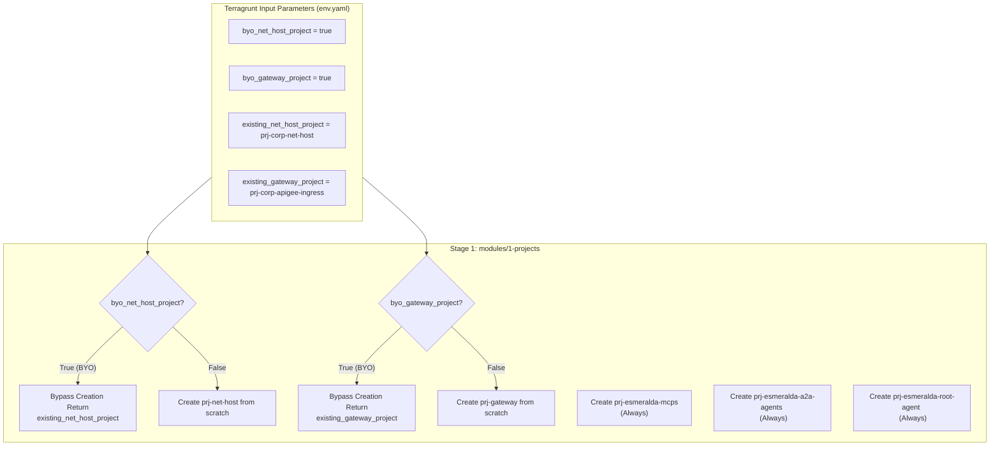

# Stage 1: Foundational Projects, Billing & APIs

### A. Architecture & Business Decisions Guide

Stage 1 manages the isolated creation of multiple GCP projects and the activation of foundational service APIs under a governance structure fully compliant with Google Cloud enterprise Landing Zone standards.

### A. Enterprise Landing Zone Simulation (SoC)
To mirror a real-world enterprise production environment, workloads are divided across **seven distinct projects**:

| Project Domain | Simulated Project ID | Role and Responsibility | Primary Hosted Resources |
| :--- | :--- | :--- | :--- |
| **Network Host** | `prj-net-host` | Managed by NetOps. Controls network traffic routing and security. | Shared VPC, Subnets, Cloud DNS, Cloud NAT, Firewalls. |
| **Traffic Ingress** | `prj-gateway` | Managed by PlatformOps. Controls enterprise API ingress. | Apigee X, Kong on Cloud Run, Internal Load Balancers. |
| **CI/CD & Artifacts** | `prj-esmeralda-cicd-artifacts` | Managed by Platform Engineering. CI/CD pipelines and container image storage. | Cloud Build, Artifact Registry Docker repositories. |
| **MCP Tools** | `prj-esmeralda-mcps` | Managed by AppDev team. Shared enterprise utility APIs. | Cloud Run (Corporate Email, Income Verifier, DMS). |
| **Core AI Platform** | `prj-esmeralda-a2a` | Managed by Core AI team. Hosts reusable cross-domain agents. | Vertex AI Reasoning Engine (A2A), Cloud SQL PostgreSQL. |
| **Business Unit Application** | `prj-esmeralda-root-agent` | Managed by Business Unit team. Client-facing user reasoning engines. | Vertex AI Reasoning Engine (Root), GCS Staging Buckets. |
| **Governance Hub** | `prj-esmeralda-governance` | Managed by SecOps. Centralizes compliance and audit logs. | KMS Keyrings, Secrets, TLS Certificates, BigQuery Analytics, Log Sinks. |

---

### B. FinOps Challenges Solved
1.  **Clean Generative AI Attribution**: Gemini API calls made by the mortgage assistant bill directly to `prj-esmeralda-root-agent`. Sub-process calls bill directly to `prj-esmeralda-a2a`.
2.  **Ephemeral vs. Persistent Cost Separation**: The PostgreSQL database (continuous 24/7 billing) is isolated inside the AI platform project. Serverless MCP tool servers (Cloud Run) scale to zero when idle, eliminating ongoing compute costs.
3.  **Zero Hidden Network Egress Costs**: All inter-service traffic flows internally over private Shared VPC IPs within the same region (`us-central1`), avoiding public NAT transit fees.

---

## Detailed Implementation Specifications & HCL Blueprints

This module manages the automated provisioning of isolated GCP service projects, links them securely to the corporate billing account, and activates standard APIs natively. Under this design, the module handles **up to seven distinct projects**, reflecting a standard enterprise landing zone.

#### B. The FinOps Challenge: Cost Attribution & Billing Isolation
Deploying agentic pipelines across multiple distinct GCP projects solves major enterprise pain points but introduces key FinOps and tracking challenges. Our multi-project structure solves these as follows:

```mermaid
graph TD
    %% FinOps visualization
    subgraph Billing["GCP Billing Account (Central Treasury)"]
        Export["Cloud Billing BigQuery Export"]
    end

    subgraph "prj-net-host (NetOps Budget)"
        C0["Shared VPC & Network Egress Costs"]
        L0["Label: cost-center=netops-core"]
    end

    subgraph "prj-gateway (PlatformOps Budget)"
        C_GW["API Gateway Appliance / ILB Costs"]
        L_GW["Label: cost-center=platformops-ingress"]
    end

    subgraph "prj-esmeralda-cicd-artifacts (Platform Eng Budget)"
        C_CI["Cloud Build & Artifact Registry Storage"]
        L_CI["Label: cost-center=platform-engineering"]
    end

    subgraph "prj-esmeralda-mcps (AppDev Tools Budget)"
        C1["Cloud Run Compute Costs"]
        L1["Label: cost-center=appdev-tools"]
    end

    subgraph "prj-esmeralda-a2a (Core AI Platform Budget)"
        C2["Vertex AI Model API Calls"]
        C3["Cloud SQL DB (Continuous Run)"]
        L2["Label: cost-center=core-ai-platform"]
    end

    subgraph "prj-esmeralda-root-agent (Business Unit Budget)"
        C4["Vertex AI Orchestrator API Calls"]
        L3["Label: cost-center=bu-mortgage"]
    end

    subgraph "prj-esmeralda-governance (SecOps Budget)"
        C_GOV["KMS Key Rings & BigQuery Telemetry Storage"]
        L_GOV["Label: cost-center=secops-governance"]
    end

    C0 & L0 -. Billing Record .-> Export
    C_GW & L_GW -. Billing Record .-> Export
    C_CI & L_CI -. Billing Record .-> Export
    C1 & L1 -. Billing Record .-> Export
    C2 & C3 & L2 -. Billing Record .-> Export
    C4 & L3 -. Billing Record .-> Export
    C_GOV & L_GOV -. Billing Record .-> Export
```



##### 1. Vertex AI Model API Billing Attribution
When multiple teams call Gemini via Vertex AI, a monolithic project makes it impossible to distinguish which team consumed how many input/output tokens. By splitting workloads:
*   Calls to Gemini made by the Root Orchestrator are charged directly to `prj-esmeralda-root-agent` (Business Unit Budget).
*   Calls to Gemini made by the A2A Agent during sub-task execution are charged to `prj-esmeralda-a2a-agents` (Core AI Budget).
*   *Implementation*: Resource labels (`env=dev`, `cost-center=...`, `team=...`) are systematically applied at the project level and resource level, flowing directly into the **GCP Billing Export to BigQuery** for clean dashboards.

##### 2. Persistent vs. Ephemeral Resource Cost Allocation
*   **Cloud SQL Instance**: Run as a shared state machine for the A2A agent, running 24/7. This represents a fixed cost that is isolated inside the Core AI Platform budget (`prj-esmeralda-a2a-agents`) and is not subsidized by the Business Unit team.
*   **Cloud Run (MCP Tool Servers)**: Run serverless, scaling to zero when there are no requests. This ensures that the AppDev team only incurs compute costs when tools are actively invoked, preventing resource wasting.

##### 3. Cross-Project Network Transit Cost Optimization
Data transferring across VPC subnets and project boundaries can incur inter-zone egress fees.
*   To address this, all projects are systematically locked to a single region (`us-central1`) and use Shared VPC Private IP communication, eliminating public internet NAT gateway egress charges for inter-agent communication.

---

#### C. The BYOInfra (Brownfield) Integration Architecture
In real enterprise deployments, customers will **never** allow a tool to provision a new Shared VPC Host Project (`net_host`) or change their centralized Gateway Ingress Project (`gateway`). 

Esmeralda elegantly handles this by using a dynamic **BYOInfra Fallback Architecture**:



*   **Conditional Project Seed**: In `main.tf`, `google_project.net_host` and `google_project.gateway` use a `count` conditional (`count = var.byo_net_host_project ? 0 : 1`).
*   **API Enablement Isolation**: Service API enablement is also conditional. If `byo_net_host_project` is true, Esmeralda skips enabling APIs in that project to prevent permission conflicts with corporate security policies (which restrict IAM permissions to create/enable APIs on shared host projects).
*   **Dynamic Outputs Mapping**: Regardless of whether a project is created from scratch or provided as pre-existing, `outputs.tf` resolves the correct active project IDs, ensuring downstream modules (networking, security, and workloads) consume them transparently.

---

#### D. File Inventory & Blueprints

```text
infrastructure/modules/1-projects/
├── versions.tf          # Mandates HashiCorp Google provider bounds (>= 5.0)
├── variables.tf         # Inputs for billing, organization folders, prefix, and BYO parameters
└── outputs.tf           # Exposes project IDs & numbers to downstream stages
```

*(With this, any client's NetOps/PlatformOps teams can hand over pre-configured net_host and gateway projects, and Esmeralda will automatically provision and deploy the isolated workload projects and attach them securely to their Shared VPC.)*
