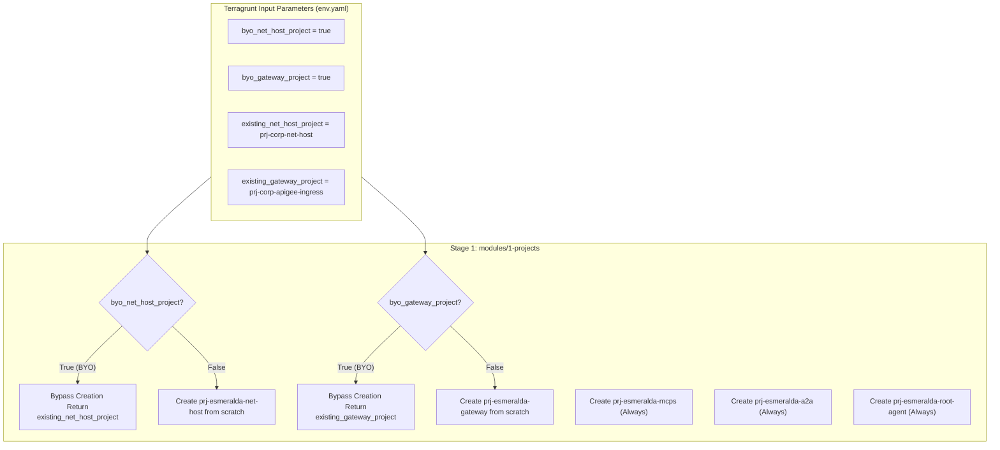
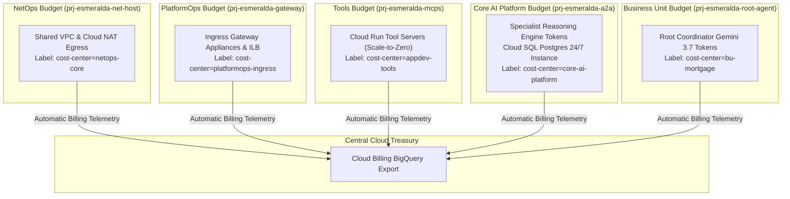

# 🏢 Stage 1: Foundational Projects, Billing & FinOps

Welcome to the technical deep-dive for **Stage 1 (Projects, Billing & APIs)**.

Stage 1 provisions and manages the isolated Google Cloud Landing Zone projects, activates essential service APIs, configures corporate billing account linkages, and bootstraps foundational Google-managed service identities.

---

## 💡 The 60-Second Mental Model: Why Stage 1 Exists

In AI agent architectures, putting everything into a single GCP project causes three catastrophic production failures:
1. **The FinOps Attribution Blackout:** Generative AI token costs (Gemini 3.7 Flash) get merged onto a single invoice, making it impossible to charge back costs to specific business units.
2. **IAM Boundary Bleeding:** Application tool developers obtain accidental visibility into platform encryption keys (KMS) or central audit logs.
3. **API Quota Starvation:** A runaway tool invocation loop in one agent consumes the entire project's Vertex AI quota, bringing down all enterprise agents simultaneously.

**Stage 1 establishes strict cryptographic and operational blast boundaries by partitioning the enterprise into 7 decoupled projects.**

---

## 🎭 Persona & Role Breakdown: Who Owns Stage 1?

| Engineering Persona | Role & Daily Responsibilities | What They Own | What They NEVER Touch |
| :--- | :--- | :--- | :--- |
| 🧑‍💼 **FinOps / Cloud Treasury** | Enforcing budget thresholds, monitoring token cost-centers, auditing monthly agent chargebacks. | Project labels (`cost-center`, `team`, `env`), Cloud Billing exports, BigQuery billing datasets. | Agent prompts, Python code, MCP tool endpoints. |
| 👷 **Platform / Landing Zone Lead** | Maintaining organizational compliance, project factories, and API activation policies. | `infrastructure/modules/1-projects/`, Terraform project resources, service agent lifecycle. | Application business logic, database SQL schemas. |
| 🧑‍💻 **AI Application Developer** | Writing prompt graphs and building agent reasoning capabilities. | Pure Python logic in `apps/`. | Project creation, billing linkages, or GCP service API enablements. |

---

## 🏛️ Architecture Decision Records (ADRs): The "Why"

### ADR-01.1: Seven Specialized GCP Projects vs. Monolithic Landing Zone
* **Context:** Enterprise organizations require strict separation of concerns between Network Engineers, Security Operations, Core AI Teams, and Line-of-Business (LOB) application developers.
* **Decision:** Provision seven isolated GCP projects:
  1. `prj-esmeralda-net-host`: Managed by **NetOps**. Owns Shared VPC, routing, Cloud NAT, and Private DNS.
  2. `prj-esmeralda-gateway`: Managed by **PlatformOps**. Owns API ingress (Apigee / Kong / ILB).
  3. `prj-esmeralda-cicd-artifacts`: Managed by **Platform Engineering**. Owns Artifact Registry and Cloud Build pipelines.
  4. `prj-esmeralda-mcps`: Managed by **AppDev Tools Team**. Hosts reusable serverless Model Context Protocol (MCP) microservices.
  5. `prj-esmeralda-a2a`: Managed by **Core AI Team**. Hosts reusable specialist reasoning engines and private Cloud SQL databases.
  6. `prj-esmeralda-root-agent`: Managed by **Business Unit Team**. Hosts customer-facing orchestrator agents.
  7. `prj-esmeralda-governance`: Managed by **SecOps**. Centralizes Cloud KMS CMEK keys, secrets, and telemetry audit sinks.
* **Trade-Offs:** Adds cross-project IAM complexity (managed declaratively via Terragrunt) in exchange for absolute security isolation, 100% granular billing attribution, and independent quota pools.

---

### ADR-01.2: BYOInfra (Brownfield Fallback) Architecture
* **Context:** Large enterprises often already have pre-existing Shared VPC Host projects (`net_host`) or centralized Ingress Gateways (`gateway`) and forbid automated tools from recreating them.
* **Decision:** Implement conditional ternary creation logic (`byo_net_host_project`, `byo_gateway_project`, `byo_governance_project`, `byo_cicd_project`) in `env.yaml`.
* **Mechanism:** If `byo_* = true`, Stage 1 bypasses project creation and API enablement for that specific project, transparently returning the customer's existing project ID to downstream stages.



---

## 💰 FinOps Cost Attribution Architecture

By partitioning resources into distinct projects, costs flow automatically into Google Cloud Billing export tables in BigQuery with zero ambiguity:



### Key FinOps Guarantees:
1. **Serverless vs. Persistent Segregation:** The continuous 24/7 cost of Cloud SQL is isolated inside the Core AI Platform budget (`prj-esmeralda-a2a`), while serverless MCP tools (`prj-esmeralda-mcps`) scale to zero when idle.
2. **Zero Hidden Network Egress:** All inter-agent and inter-tool traffic flows over internal Shared VPC private IPs within `us-central1`, eliminating public NAT transit charges.

---

## 🏗️ Technical Implementation Breakdown (`modules/1-projects/`)

### 1. Service API Enablement Matrix (`google_project_service`)
Each project receives the exact, least-privilege list of Google APIs required for its operational domain:

| Project | Enabled Google Cloud Service APIs |
| :--- | :--- |
| **`net_host`** | `compute.googleapis.com`, `dns.googleapis.com`, `servicenetworking.googleapis.com`, `networksecurity.googleapis.com`, `networkservices.googleapis.com`, `certificatemanager.googleapis.com`, `logging.googleapis.com` |
| **`gateway`** | `compute.googleapis.com`, `apigee.googleapis.com`, `certificatemanager.googleapis.com`, `logging.googleapis.com`, `secretmanager.googleapis.com`, `run.googleapis.com`, `iam.googleapis.com` |
| **`cicd`** | `compute.googleapis.com`, `artifactregistry.googleapis.com`, `cloudbuild.googleapis.com`, `logging.googleapis.com`, `storage.googleapis.com`, `secretmanager.googleapis.com` |
| **`mcps`** | `compute.googleapis.com`, `run.googleapis.com`, `artifactregistry.googleapis.com`, `secretmanager.googleapis.com`, `logging.googleapis.com`, `cloudbuild.googleapis.com` |
| **`a2a`** | `compute.googleapis.com`, `aiplatform.googleapis.com`, `sqladmin.googleapis.com`, `storage.googleapis.com`, `secretmanager.googleapis.com`, `run.googleapis.com`, `artifactregistry.googleapis.com`, `logging.googleapis.com`, `servicenetworking.googleapis.com` |
| **`root_agent`** | `compute.googleapis.com`, `aiplatform.googleapis.com`, `storage.googleapis.com`, `run.googleapis.com`, `artifactregistry.googleapis.com`, `logging.googleapis.com` |
| **`governance`** | `bigquery.googleapis.com`, `logging.googleapis.com`, `clouderrorreporting.googleapis.com`, `cloudtrace.googleapis.com`, `monitoring.googleapis.com`, `cloudkms.googleapis.com`, `secretmanager.googleapis.com`, `agentregistry.googleapis.com`, `networkservices.googleapis.com` |

---

### 2. Service Identity Bootstrapping (`google_project_service_identity`)
To prevent IAM race conditions where downstream stages attempt to grant roles to service agents that do not yet exist, Stage 1 explicitly bootstraps **nine Google-managed service identities**:

1. `cicd_build`: Cloud Build SA in `prj-esmeralda-cicd-artifacts`
2. `mcps_run`: Cloud Run SA in `prj-esmeralda-mcps`
3. `gateway_run`: Cloud Run SA in `prj-esmeralda-gateway`
4. `a2a_run`: Cloud Run SA in `prj-esmeralda-a2a`
5. `a2a_vertex`: Vertex AI SA in `prj-esmeralda-a2a`
6. `a2a_sql`: Cloud SQL SA in `prj-esmeralda-a2a`
7. `root_vertex`: Vertex AI SA in `prj-esmeralda-root-agent`
8. `root_run`: Cloud Run SA in `prj-esmeralda-root-agent`
9. `governance_secrets`: Secret Manager SA in `prj-esmeralda-governance`

---

## 🛠️ Verification & Runbook

### Inspect Provisioned Projects
```bash
# List all Esmeralda projects in current environment
gcloud projects list --filter="name:esm-dev-*" --format="table(projectId, projectNumber, name)"
```

### Validate Billing Linkage & Cost Labels
```bash
# Inspect billing account and cost labels on the A2A project
gcloud beta billing projects describe $(cd infrastructure/live/dev/stage-1-projects && terragrunt output -raw a2a_project_id)
```
 to their Shared VPC.)*
