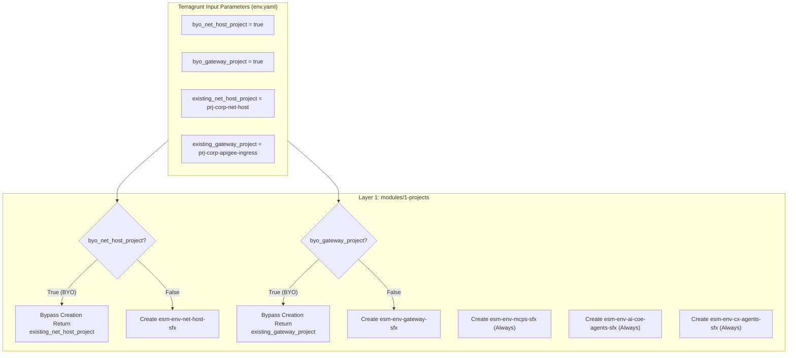
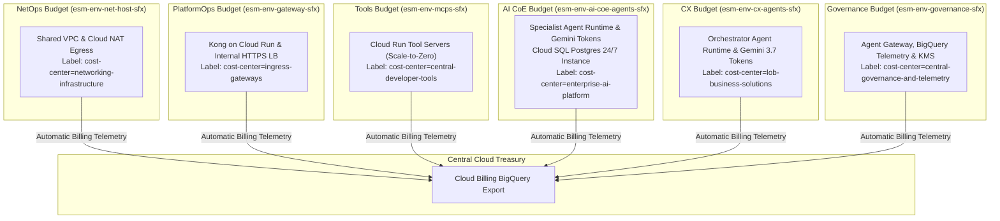

# 🏢 Layer 1: Foundational Projects, Billing & FinOps

Welcome to the technical deep-dive for **Layer 1 (Projects, Billing & APIs)**.

Layer 1 provisions and manages the isolated Google Cloud projects of one environment, activates essential service APIs, links them to the billing account, applies cost-attribution labels, and bootstraps foundational Google-managed service identities.

* **Module:** [`infrastructure/modules/1-projects/`](../../infrastructure/modules/1-projects/main.tf)
* **Live config:** `infrastructure/live/<env>/layer-1-projects/` (inputs from `infrastructure/live/<env>/env.yaml`)
* **Deploy:** `make deploy-projects ENV=<env>` (or `make deploy-foundations ENV=<env>` for Layers 1–3)

> [!NOTE]
> The CI/CD project is **not** part of Layer 1. It is created once, for all environments, by Layer 0 (`make deploy-cicd`, module [`0-cicd`](../../infrastructure/modules/0-cicd/main.tf)) as `esm-cicd-<sfx>`. It holds the mutable dev image repository (`esmeralda-containers`), the immutable release repository (`esmeralda-containers-release`), and the `sa-esmeralda-builder` / `sa-esmeralda-promoter` service accounts.

---

## 💡 The 60-Second Mental Model: Why Layer 1 Exists

In AI agent architectures, putting everything into a single GCP project causes three catastrophic production failures:
1. **The FinOps Attribution Blackout:** Generative AI token costs (Gemini 3.7 Flash) get merged onto a single invoice, making it impossible to charge back costs to specific business units.
2. **IAM Boundary Bleeding:** Application tool developers obtain accidental visibility into platform encryption keys (KMS) or central audit logs.
3. **API Quota Starvation:** A runaway tool invocation loop in one agent consumes the entire project's Vertex AI quota, bringing down all enterprise agents simultaneously.

**Layer 1 establishes operational blast boundaries by giving each team its own project: six per environment, plus the shared CI/CD project from Layer 0.**

---

## 🎭 Persona & Role Breakdown: Who Owns Layer 1?

| Engineering Persona | Role & Daily Responsibilities | What They Own | What They NEVER Touch |
| :--- | :--- | :--- | :--- |
| 🧑‍💼 **FinOps / Cloud Treasury** | Enforcing budget thresholds, monitoring token cost-centers, auditing monthly agent chargebacks. | Project labels (`cost-center`, `team`, `env`), Cloud Billing exports, BigQuery billing datasets. | Agent prompts, Python code, MCP tool endpoints. |
| 👷 **Platform / Landing Zone Lead** | Maintaining organizational compliance, project factories, and API activation policies. | `infrastructure/modules/1-projects/`, Terraform project resources, service agent lifecycle. | Application business logic, database SQL schemas. |
| 🧑‍💻 **AI Application Developer** (CX or AI CoE team) | Writing prompt graphs and building agent reasoning capabilities. | Python logic in `apps/agents/<agent>/`. | Project creation, billing linkages, or GCP service API enablements. |

---

## 🏛️ Architecture Decision Records (ADRs): The "Why"

### ADR-01.1: Seven Specialized GCP Projects vs. Monolithic Landing Zone
* **Context:** Enterprise organizations require strict separation of concerns between Network Engineers, Security Operations, the AI Center of Excellence, and Line-of-Business (LOB) application developers.
* **Decision:** Provision six isolated projects per environment, named `<project_prefix>-<name>-<sfx>` (`project_prefix` is `esm-dev` / `esm-prd`; `<sfx>` is a random 4-hex suffix shared by all projects of the environment), plus one shared CI/CD project:

  | # | Project | Owner (`team` label) | Purpose |
  | :- | :--- | :--- | :--- |
  | 1 | `esm-<env>-net-host-<sfx>` | **NetOps** (`netops`) | Shared VPC, routing, Cloud NAT and the private DNS zone `esmeralda.internal.` |
  | 2 | `esm-<env>-gateway-<sfx>` | **PlatformOps** (`platformops`) | API ingress: Kong on Cloud Run behind an internal HTTPS load balancer (Apigee optional via `gateway_product`) |
  | 3 | `esm-<env>-mcps-<sfx>` | **AppDev Tools** (`appdev-tools`) | Reusable serverless Model Context Protocol (MCP) tool servers (`legacy-dms`, `income-verification`, `corporate-email`) |
  | 4 | `esm-<env>-ai-coe-agents-<sfx>` | **AI CoE team** (`ai-coe`) | Reusable A2A specialist agents (`ai-coe-mortgage-specialist`) and their private Cloud SQL task store |
  | 5 | `esm-<env>-cx-agents-<sfx>` | **CX team** (`cx`) | User-facing orchestrator agents (`cx-mortgage-orchestrator`), which consume the AI CoE agents; also hosts the test VM |
  | 6 | `esm-<env>-governance-<sfx>` | **Security & PlatformOps** (`security-and-platformops`) | Agent Gateway, Agent Registry, KMS keys, secrets, telemetry sinks, alerts and FinOps views |
  | 7 | `esm-cicd-<sfx>` (shared, Layer 0) | **Platform Engineering** (`platform-engineering`) | Cloud Build and the dev/release Artifact Registry repositories |

* **Why two agent projects?** The CX team and the AI CoE team ship on different cadences and pay from different budgets. Separate projects give each team its own IAM boundary, quota pool and bill, and give each team's agents their own Agent Identity `principalSet` (see [Layer 3](./03-security-iam-and-telemetry.md)).
* **Trade-Offs:** Adds cross-project IAM complexity (managed declaratively via Terragrunt) in exchange for security isolation, per-project billing attribution, and independent quota pools.

---

### ADR-01.2: BYOInfra (Brownfield Fallback) Architecture
* **Context:** Large enterprises often already have pre-existing Shared VPC Host projects (`net_host`), centralized Ingress Gateways (`gateway`) or security projects (`governance`), and forbid automated tools from recreating them.
* **Decision:** Implement conditional creation toggles in `env.yaml`: `byo_net_host_project`, `byo_gateway_project` and `byo_governance_project`, each paired with an `existing_*_project` ID.
* **Mechanism:** If `byo_* = true`, Layer 1 skips project creation and API enablement for that specific project, and returns the customer's existing project ID to downstream layers. The `mcps`, `ai-coe-agents` and `cx-agents` projects are always created. Later layers have their own toggles (`byo_networking` in Layer 2, `byo_security` in Layer 3).


```mermaid
flowchart TD
    subgraph Inputs["Terragrunt Input Parameters (env.yaml)"]
        BYO_Net["byo_net_host_project = true"]
        BYO_Gwy["byo_gateway_project = true"]
        Exist_Net["existing_net_host_project = prj-corp-net-host"]
        Exist_Gwy["existing_gateway_project = prj-corp-apigee-ingress"]
    end

    subgraph Layer1["Layer 1: modules/1-projects"]
        Check_Net{byo_net_host_project?}
        Check_Gwy{byo_gateway_project?}
        
        Check_Net -- "True (BYO)" --> Skip_Net["Bypass Creation <br/> Return existing_net_host_project"]
        Check_Net -- "False" --> Create_Net["Create esm-env-net-host-sfx"]
        
        Check_Gwy -- "True (BYO)" --> Skip_Gwy["Bypass Creation <br/> Return existing_gateway_project"]
        Check_Gwy -- "False" --> Create_Gwy["Create esm-env-gateway-sfx"]
        
        Create_MCPS["Create esm-env-mcps-sfx (Always)"]
        Create_AICOE["Create esm-env-ai-coe-agents-sfx (Always)"]
        Create_CX["Create esm-env-cx-agents-sfx (Always)"]
    end

    Inputs --> Check_Net
    Inputs --> Check_Gwy
```

*(`byo_governance_project` follows the same pattern as the two toggles shown.)*

---

## 💰 FinOps Cost Attribution Architecture

Because every team has its own project, and every project carries `cost-center`, `team` and `env` labels, costs can be attributed in the Cloud Billing BigQuery export without guesswork:


```mermaid
flowchart TD
    subgraph Treasury["Central Cloud Treasury"]
        Export["Cloud Billing BigQuery Export"]
    end

    subgraph NetOps["NetOps Budget (esm-env-net-host-sfx)"]
        C0["Shared VPC & Cloud NAT Egress<br/>Label: cost-center=networking-infrastructure"]
    end

    subgraph PlatformOps["PlatformOps Budget (esm-env-gateway-sfx)"]
        C_GW["Kong on Cloud Run & Internal HTTPS LB<br/>Label: cost-center=ingress-gateways"]
    end

    subgraph AppDev["Tools Budget (esm-env-mcps-sfx)"]
        C1["Cloud Run Tool Servers (Scale-to-Zero)<br/>Label: cost-center=central-developer-tools"]
    end

    subgraph CoreAI["AI CoE Budget (esm-env-ai-coe-agents-sfx)"]
        C2["Specialist Agent Runtime & Gemini Tokens<br/>Cloud SQL Postgres 24/7 Instance<br/>Label: cost-center=enterprise-ai-platform"]
    end

    subgraph BU["CX Budget (esm-env-cx-agents-sfx)"]
        C3["Orchestrator Agent Runtime & Gemini 3.7 Tokens<br/>Label: cost-center=lob-business-solutions"]
    end

    subgraph Gov["Governance Budget (esm-env-governance-sfx)"]
        C4["Agent Gateway, BigQuery Telemetry & KMS<br/>Label: cost-center=central-governance-and-telemetry"]
    end

    C0 & C_GW & C1 & C2 & C3 & C4 -->|Automatic Billing Telemetry| Export
```

> [!NOTE]
> The Cloud Billing export itself is a billing-account setting managed by your billing administrators; Esmeralda does not create it. Esmeralda adds a **token-level** chargeback on top (BigQuery view `vw_monthly_agent_chargeback`, built in Layer 4). See [Centralized Monitoring & FinOps](../3-agentops-and-lifecycle/03-centralized-monitoring-and-dashboards.md).

### Key FinOps Guarantees:
1. **Serverless vs. Persistent Segregation:** The continuous 24/7 cost of Cloud SQL is isolated inside the AI CoE budget (`esm-<env>-ai-coe-agents-<sfx>`), while serverless MCP tools (`esm-<env>-mcps-<sfx>`) scale to zero when idle.
2. **Consumer vs. Provider Segregation:** When the CX orchestrator calls the AI CoE specialist, each agent's model tokens land on its own team's project, so a reusable agent's cost is visible separately from the agents that consume it.
3. **Private Service-to-Service Traffic:** Agent-to-tool and agent-to-agent traffic reaches Kong over private IPs inside the Shared VPC in `us-central1`, not over the public internet.

---

## 🏗️ Technical Implementation Breakdown (`modules/1-projects/`)

### 1. Service API Enablement Matrix (`google_project_service`)
Each project receives the list of Google APIs required for its operational domain. Layer 1 first enables `serviceusage` and `cloudresourcemanager` on every new project with `gcloud` (a bootstrap step), then enables the rest declaratively:

| Project | Enabled Google Cloud Service APIs |
| :--- | :--- |
| **`net_host`** | `compute`, `dns`, `servicenetworking`, `networksecurity`, `networkservices`, `certificatemanager`, `logging`, `cloudresourcemanager` |
| **`gateway`** | `compute`, `apigee`, `certificatemanager`, `logging`, `secretmanager`, `run`, `iam`, `cloudresourcemanager` |
| **`mcps`** | `compute`, `run`, `artifactregistry`, `secretmanager`, `logging`, `cloudbuild`, `agentregistry`, `cloudresourcemanager` |
| **`ai_coe_agents`** and **`cx_agents`** (identical lists) | Runtime: `aiplatform`, `run`, `compute`, `storage`, `sqladmin`, `servicenetworking`, `artifactregistry`, `secretmanager`. Agent Gateway & identity: `agentregistry`, `agentidentity`, `iap`, `iam`, `iamcredentials`, `networkservices`, `networksecurity`, `modelarmor`. Telemetry: `logging`, `monitoring`, `cloudtrace`, `telemetry`, `observability`, `bigquerystorage`. Plus `cloudresourcemanager`, `apphub`, `apptopology`, `cloudapiregistry`, `dataform`, `notebooks`, `appengine`, `securitycenter`, `texttospeech`, `saasservicemgmt`. |
| **`governance`** | `bigquery`, `logging`, `clouderrorreporting`, `cloudtrace`, `monitoring`, `cloudkms`, `secretmanager`, `dlp`, `pubsub`, `looker`, `modelarmor`, `networkservices`, `networksecurity`, `agentregistry`, `iap`, `compute`, `aiplatform`, `cloudresourcemanager` (Layer 4 additionally enables `certificatemanager` for the Agent Gateway TrustConfig) |
| **`cicd`** (Layer 0) | `artifactregistry`, `cloudbuild`, `storage`, `logging`, `iam`, `serviceusage`, `cloudresourcemanager` |

*(All entries are `<name>.googleapis.com`.)*

---

### 2. Service Identity Bootstrapping (`google_project_service_identity`)
**What it is:** a *service agent* is a Google-managed service account (for example `service-<PROJECT_NUMBER>@gcp-sa-aiplatform.iam.gserviceaccount.com`) that a Google service uses to act inside your project. Google normally creates it lazily, the first time the service is used.

**In Esmeralda:** later layers grant roles to these service agents (network access in Layer 2, KMS and Artifact Registry access in Layer 3). To prevent IAM race conditions where a grant targets a service agent that does not exist yet, Layer 1 explicitly bootstraps **eight** of them:

1. `mcps_run`: Cloud Run service agent in `esm-<env>-mcps-<sfx>`
2. `gateway_run`: Cloud Run service agent in `esm-<env>-gateway-<sfx>`
3. `ai_coe_agents_run`: Cloud Run service agent in `esm-<env>-ai-coe-agents-<sfx>`
4. `ai_coe_agents_vertex`: Vertex AI service agent in `esm-<env>-ai-coe-agents-<sfx>`
5. `ai_coe_agents_sql`: Cloud SQL service agent in `esm-<env>-ai-coe-agents-<sfx>`
6. `cx_agents_vertex`: Vertex AI service agent in `esm-<env>-cx-agents-<sfx>`
7. `cx_agents_run`: Cloud Run service agent in `esm-<env>-cx-agents-<sfx>`
8. `governance_secrets`: Secret Manager service agent in `esm-<env>-governance-<sfx>` (skipped when `byo_governance_project = true`)

The Cloud Build service agent of the shared CI/CD project is bootstrapped by Layer 0.

---

## 🛠️ Verification & Runbook

### Inspect Provisioned Projects
```bash
# List all Esmeralda projects in the dev environment
gcloud projects list --filter="name:esm-dev-*" --format="table(projectId, projectNumber, labels.team, labels.cost-center)"
```

### Validate Billing Linkage & Cost Labels
```bash
# Inspect billing linkage of the AI CoE agents project
gcloud beta billing projects describe $(cd infrastructure/live/dev/layer-1-projects && terragrunt output -raw ai_coe_agents_project_id)
```
