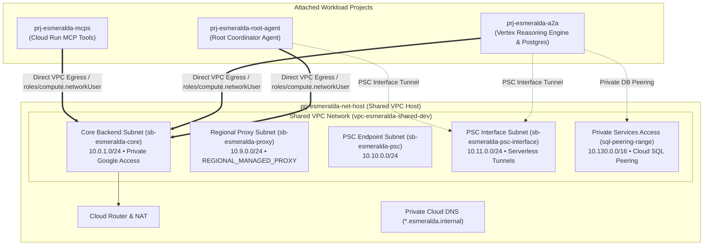

# 🌐 Stage 2: Private Networking, DNS & Private Service Connect (PSC)

Welcome to the technical deep-dive for **Stage 2 (Private Networking & Connectivity)**.

Stage 2 deploys a zero-trust enterprise Shared VPC hub network inside `prj-esmeralda-net-host`, establishes private subnet topologies, configures Private Service Connect (PSC) Network Attachments for serverless AI reasoning engines, and deploys private Cloud DNS zones.

---

## 💡 The 60-Second Mental Model: Why Stage 2 Exists

AI Reasoning Engines running in Google Cloud Vertex AI execute inside Google-managed tenant networks. By default, communicating with private databases (Cloud SQL) or corporate tools (Cloud Run MCPs) would require either:
1. Exposing database and tool ports to the public internet (a severe enterprise security violation).
2. Complex VPC Peering meshes that exhaust IP address space (CIDR) and suffer from non-transitive routing.

**Stage 2 creates a centralized Shared VPC and uses Private Service Connect (PSC) to bridge serverless AI reasoning engines securely into the private corporate intranet with zero public IPs.**

---

## 🎭 Persona & Role Breakdown: Who Owns Stage 2?

| Engineering Persona | Role & Daily Responsibilities | What They Own | What They NEVER Touch |
| :--- | :--- | :--- | :--- |
| 🌐 **Network Operations (NetOps)** | Managing CIDR allocations, routing tables, Cloud NAT, firewall ingress rules, and DNS resolution. | `infrastructure/modules/2-networking/`, Shared VPC host, subnets, firewall rules, Cloud Router. | Application Python code, agent prompt graphs, SQL schemas. |
| 👷 **Platform / SecOps Engineer** | Auditing private egress paths and ensuring zero-trust traffic segmentation. | Subnet IAM bindings (`roles/compute.networkUser`), PSC attachments. | Direct database query tuning or tool implementations. |
| 🧑‍💻 **AI Application Developer** | Consuming internal private domain names (`*.esmeralda.internal`). | Agent tool client configurations (e.g. `http://legacy-dms.esmeralda.internal/mcp`). | Subnet IP math, VPC peering, firewall configurations. |

---

## 🏛️ Architecture Decision Records (ADRs): The "Why"

### ADR-02.1: Shared VPC Hub-and-Spoke vs. VPC Peering Mesh
* **Context:** Interconnecting 7 GCP projects via standard VPC Peering requires 21 distinct bilateral peering links, cannot route transitively, and risks overlapping IP space.
* **Decision:** Provision a single, authoritative **Shared VPC** in `prj-esmeralda-net-host` and attach workload projects as **Service Projects** via `google_compute_shared_vpc_service_project`.
* **Benefit:** Centralizes firewall and routing policies under NetOps while allowing workload runtimes in spoke projects to bind to host subnets seamlessly via `roles/compute.networkUser`.

---

### ADR-02.2: Private Service Connect (PSC) Network Attachment vs. Serverless VPC Access Connector
* **Context:** Traditional Serverless VPC Access Connectors require dedicated `/28` subnets with underlying e2-micro VM instances that incur fixed hourly costs and have scaling bottlenecks during bursty agent traffic.
* **Decision:** Utilize **Direct VPC Egress** and **Private Service Connect (PSC) Network Attachments** (`google_compute_network_attachment`) in `sb-esmeralda-psc-interface`.
* **Benefit:** Eliminates connector VM overhead, provides line-rate throughput for Vertex AI Reasoning Engines, and establishes a deterministic L4 private tunnel.

---

## 🗺️ Shared VPC Network Topology



---

## 🏗️ Technical Implementation Breakdown (`modules/2-networking/`)

### 1. Subnet Classifications & CIDR Allocations

| Subnet Identifier | CIDR Block | Purpose & Role | Connected Workloads |
| :--- | :--- | :--- | :--- |
| **`sb-esmeralda-core`** | `10.0.1.0/24` | Primary backend compute subnet with Private Google Access enabled. | Cloud Run instances, test jumpbox VMs, internal services. |
| **`sb-esmeralda-proxy`** | `10.9.0.0/24` | `REGIONAL_MANAGED_PROXY` (Active) for Envoy proxies. | Regional Internal Application Load Balancers (ILB), Apigee X. |
| **`sb-esmeralda-psc`** | `10.10.0.0/24` | Private Service Connect consumer endpoint range. | Forwarding rules to Google-managed and third-party APIs. |
| **`sb-esmeralda-psc-interface`** | `10.11.0.0/24` | Regular subnetwork bound to PSC Network Attachment. | Inbound PSC interface tunnels for Vertex AI Reasoning Engines. |
| **`sql-peering-range`** | `10.130.0.0/16` | Allocated `/16` range for Private Services Access (PSA). | Private Cloud SQL PostgreSQL instances in `prj-esmeralda-a2a`. |

---

### 2. Serverless PSC Network Attachment (`google_compute_network_attachment`)
```hcl
resource "google_compute_network_attachment" "psc_attachment" {
  name                  = "gateway-psc-interface-attachment-${var.environment}"
  project               = var.net_host_project_id
  region                = var.region
  connection_preference = "ACCEPT_AUTOMATIC"
  subnetworks           = [google_compute_subnetwork.psc_interface[0].id]
}
```
When an ADK Reasoning Engine is deployed in Stage 4, its `psc_interface_config` references this network attachment, creating an isolated, bi-directional tunnel from Google's runtime into `10.11.0.0/24`.

---

### 3. Subnet IAM Network User Permissions (`roles/compute.networkUser`)
To permit serverless containers in spoke projects to consume host subnets, Stage 2 grants `roles/compute.networkUser` to the 7 required service robot identities:
* `service-{mcps_number}@serverless-robot-prod.iam.gserviceaccount.com`
* `service-{a2a_number}@serverless-robot-prod.iam.gserviceaccount.com`
* `service-{a2a_number}@gcp-sa-aiplatform.iam.gserviceaccount.com`
* `service-{a2a_number}@gcp-sa-aiplatform-re.iam.gserviceaccount.com`
* `service-{root_number}@gcp-sa-aiplatform.iam.gserviceaccount.com`
* `service-{root_number}@gcp-sa-aiplatform-re.iam.gserviceaccount.com`
* `service-{gateway_number}@serverless-robot-prod.iam.gserviceaccount.com`

---

## 🛠️ Verification & Runbook

### Test Private DNS Resolution from Jumpbox VM
```bash
# SSH into the test jumpbox VM via IAP tunnel
gcloud compute ssh test-vm-dev --zone=us-central1-f --project=$(cd infrastructure/live/dev/stage-1-projects && terragrunt output -raw root_project_id) --tunnel-through-iap

# Inside VM: Verify internal DNS resolves to private VIP
dig +short a2a-mortgage-agent.esmeralda.internal
# Output: 10.0.1.200 (or ILB VIP)
```

### Inspect PSC Network Attachment Status
```bash
gcloud compute network-attachments describe gateway-psc-interface-attachment-dev \
    --region=us-central1 \
    --project=$(cd infrastructure/live/dev/stage-1-projects && terragrunt output -raw net_host_project_id)
```
