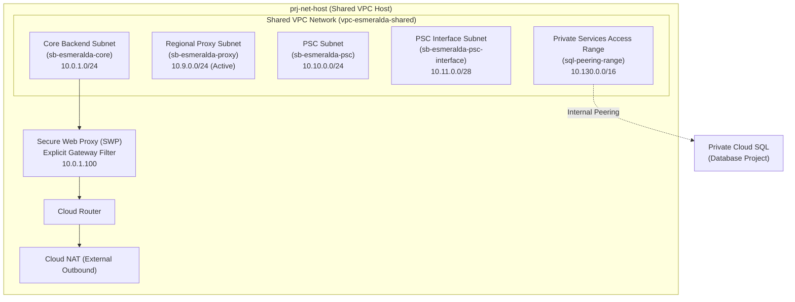
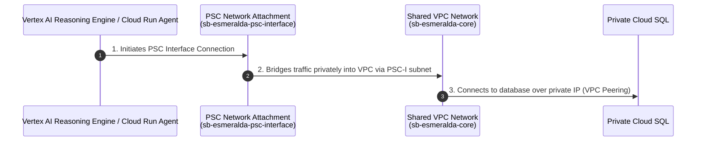
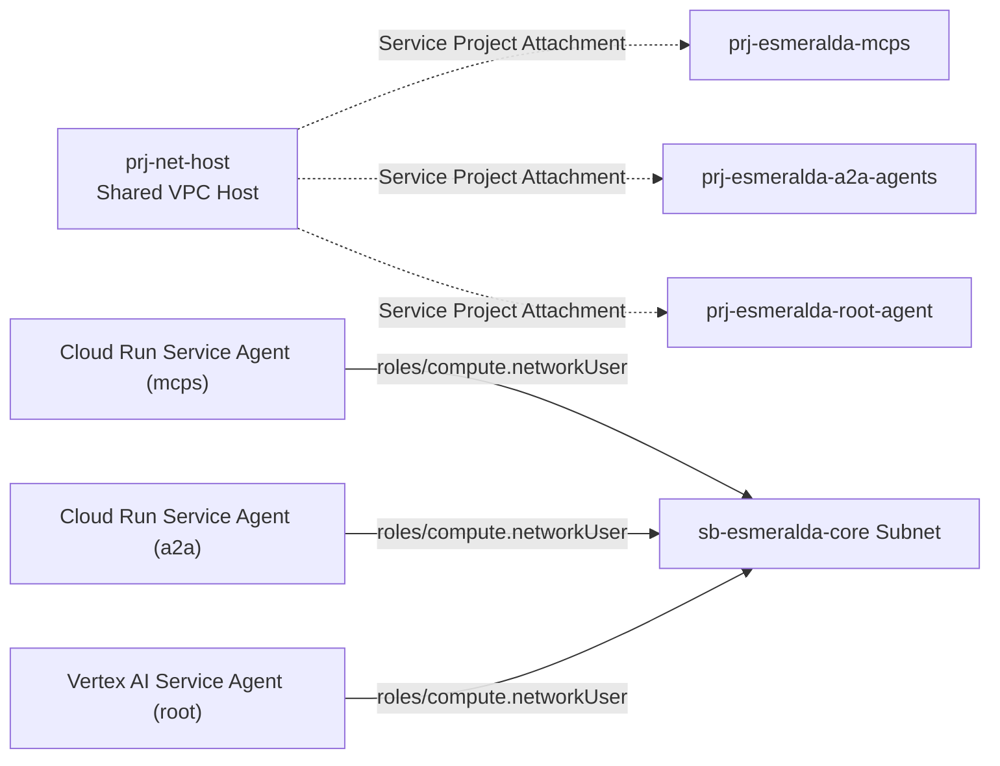

# Stage 2: Private Networking, DNS & PSC

### A. Network Architecture & Topology Guide

Stage 2 implements Zero-Trust network infrastructure to ensure that no API or AI agent communicates over public internet channels.

### A. VPC Subnet Topology (`gateway-vpc`)
In the `prj-net-host` project, we allocate the following CIDR ranges:
*   **Core Workload Subnet (`gke-subnet`)**: `10.0.0.0/20` for internal compute runtimes and test VMs.
*   **Regional Envoy Proxy Subnet (`gateway-proxy-subnet`)**: `10.9.0.0/24` dedicated exclusively to Envoy-based internal Application Load Balancers (ILB).
*   **PSC NAT Subnet (`gateway-psc-subnet`)**: `10.10.0.0/24` for outbound Private Service Connect connections.
*   **PSC Interface Subnet (`psc-interface-subnet`)**: `10.11.0.0/28` providing local private endpoints for Vertex AI Reasoning Engines operating within Google-managed VPCs.

### B. Private DNS and Gateway Static Routing
To decouple dynamic Vertex AI service URLs, we establish a private Cloud DNS zone named `internal.gateway.` pointing all tool and agent routes to the internal IP (`10.0.0.5`) of the Internal Load Balancer (ILB):
*   `email.internal.gateway` -> `10.0.0.5`
*   `income-verification.internal.gateway` -> `10.0.0.5`
*   `dms.internal.gateway` -> `10.0.0.5`

---

### B. Detailed Implementation Specifications & HCL Blueprints

# Stage 2: Shared VPC Host Networking & Secure Egress

This module handles core network topologies including private IP address allocation, Shared VPC, Cloud NAT gateway egress, Secure Web Proxy (SWP) whitelist policies, and Private Service Connect (PSC).

### 7.2 Stage 2: `modules/2-networking/` Specification

This module establishes the Shared VPC network, configures the internal subnet routing topologies, sets up Private Service Connect (PSC) Network Attachments, deploys Google Cloud's Secure Web Proxy (SWP) for audited internet egress, and handles corporate DNS zones. It is designed to run on the Shared VPC Host Project (`prj-net-host`), but can be toggled to a pure-attachment mode for pre-existing (brownfield) customer networks.

#### A. Network Subnet and Routing Architecture
In Greenfield mode, the module provisions a comprehensive hub network with dedicated subnets for core workloads, proxy-only routing, PSC endpoints, serverless integration, and database peering:



##### 1. Subnet Classifications
*   **Core Backend Subnet (`sb-esmeralda-core`)**: Host IP range `10.0.1.0/24`. All primary internal workloads (Cloud Run instances, VPC connectors, and private VMs) operate inside this range. Private Google Access is enabled to permit calling Vertex AI and Secret Manager without traversing the public internet.
*   **Regional Envoy Proxy Subnet (`sb-esmeralda-proxy`)**: Host IP range `10.9.0.0/24`. Required by regional internal Application Load Balancers or secure regional gateways (Apigee or Kong). Configured with purpose `REGIONAL_MANAGED_PROXY` and role `ACTIVE`.
*   **PSC Endpoint Subnet (`sb-esmeralda-psc`)**: Host IP range `10.10.0.0/24` reserved for private Google services PSC endpoints.
*   **PSC Interface Subnet (`sb-esmeralda-psc-interface`)**: Host IP range `10.11.0.0/28`. A highly specific regular subnet utilized solely to bind Google-managed Serverless runtimes.
*   **Private Services Access (`sql-peering-range`)**: Allocated block `10.130.0.0/16` reserved for Serverless Cloud SQL Private Services peering connections.

---

#### B. Serverless Bridges: Private Service Connect (PSC) Network Attachment
Because Vertex AI Reasoning Engines and serverless Cloud Run agents reside natively in Google-managed tenant projects, they do not have direct access to resources inside custom customer VPCs. Esmeralda bridges this boundary using a **PSC Network Attachment**:



1.  **Subnet Isolation**: A dedicated regular subnetwork (`sb-esmeralda-psc-interface`) is configured.
2.  **Compute Network Attachment**: The resource `google_compute_network_attachment` references the PSC-I subnet and is set to `ACCEPT_AUTOMATIC`. This creates a PSC interface point. Serverless agents use this resource link to establish incoming tunnels directly into the VPC.
3.  **Firewall Protection**: Ingress firewalls are restricted to only allow ports `22` (SSH for debugging), `443` (HTTPS for APIs), and `ICMP` originating from the PSC Interface subnet (`10.11.0.0/28`).

---

#### C. Egress Auditing & Filtering: Secure Web Proxy (SWP)
To comply with enterprise security requirements, reasoning engines and corporate AI agents are not permitted to establish arbitrary connections to the public internet. Stage 2 provisions a **Secure Web Proxy (SWP)** to audit and control egress traffic:
*   **The SWP Instance**: Deployed via GCP's `google_network_security_gateway_security_policy` (or Fabric's `net-swp` module) in the workloads subnet with a static internal IP (`10.0.1.100`).
*   **Egress Interception**: Workloads communicating via the PSC Interface are configured with an explicit proxy pointing to `10.0.1.100:443`.
*   **Access Rules**: Configured with strict session matching and rules (e.g., matching corporate whitelisted LLMs and SaaS tools while blocking unauthorized domains, with error logging activated).

---

#### D. Shared VPC Attachments & Network User IAM Bindings
To allow the separate workload projects to send private traffic across the Shared VPC, they must be attached as service projects, and their respective service agents must be granted subnet execution rights:



For workloads in service projects to bind VPC Connectors or establish PSC attachments in the host subnet, the host project must authorize the following service agents with the `roles/compute.networkUser` role on the specific subnet:
1.  **Google APIs Service Agent**: `service-[PROJECT_NUMBER]@cloudservices.gserviceaccount.com` (Handles backend resources orchestration).
2.  **Serverless VPC Access Robot**: `service-[PROJECT_NUMBER]@serverless-robot-prod.iam.gserviceaccount.com` (Enables Serverless VPC Access Connectors).
3.  **Vertex AI Agent**: `service-[PROJECT_NUMBER]@gcp-sa-aiplatform.iam.gserviceaccount.com` (Allows Direct VPC egress for Vertex AI Reasoning Engines).

---

#### E. DNS Service Discovery Layout
To facilitate service discovery, Stage 2 deploys two central private DNS zones visible inside the Shared VPC:
1.  **`esmeralda.internal` Zone**: Used for internal service-to-service discovery (e.g., `dms.esmeralda.internal`, `calculator.esmeralda.internal`).
2.  **`internal.gateway` Zone**: Used to peering PSC interfaces. Contains:
    *   Wildcard record `*.internal.gateway.` resolving to the Internal Load Balancer VIP.
    *   Static record `swp.internal.gateway.` resolving to the Secure Web Proxy IP (`10.0.1.100`).

---

#### F. Greenfield vs. Brownfield (BYO) Logic
When `byo_networking = true` is supplied:
*   We **bypass** creating the VPC, subnetworks (core, proxy, psc, psc-interface), Cloud Router, NAT, and the service networking connection.
*   We **still execute** Shared VPC Host Project enablement, Service Project Attachments, Subnet IAM bindings, and DNS Zones, hooking the three new service projects directly into the customer's pre-configured Shared VPC and SWP infrastructure.

---

#### G. File Inventory & Blueprints

```text
infrastructure/modules/2-networking/
├── versions.tf          # Mandates HashiCorp Google provider bounds (>= 5.0)
├── variables.tf         # Host project IDs, service project IDs, CIDR overrides, and BYO flags
├── main.tf              # Greenfield VPC, NAT, PSA + PSC Attachments, SWP, IAM network users, Cloud DNS
└── outputs.tf           # Exports VPC network ID, Subnet self-links, and DNS private zone name
```

##### 1. Versions Specification (`versions.tf`)
> [!TIP]
> 📁 **Source Code File Available:**
> The Terraform code defining networking version constraints is available at:
> 👉 [`versions.tf`](../migration/01_platform_foundations/infrastructure/modules/2-networking/versions.tf)


##### 2. Variables Specification (`variables.tf`)
> [!TIP]
> 📁 **Source Code File Available:**
> The Terraform code defining input variables for VPC subnets and routing is available at:
> 👉 [`variables.tf`](../migration/01_platform_foundations/infrastructure/modules/2-networking/variables.tf)


##### 3. Implementation Logic (`main.tf`)
> [!TIP]
> 📁 **Source Code File Available:**
> The main Terraform configuration implementing VPC topologies, Cloud DNS, and PSC attachments is available at:
> 👉 [`main.tf`](../migration/01_platform_foundations/infrastructure/modules/2-networking/main.tf)


##### 4. Outputs Specification (`outputs.tf`)
> [!TIP]
> 📁 **Source Code File Available:**
> The exported network IDs, subnet links, and DNS names are available at:
> 👉 [`outputs.tf`](../migration/01_platform_foundations/infrastructure/modules/2-networking/outputs.tf)
