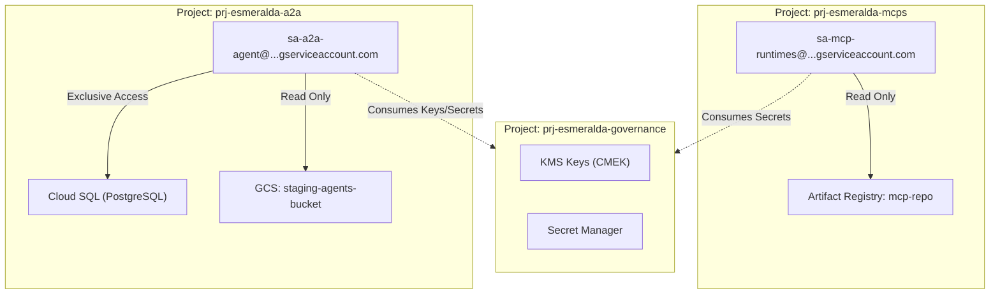
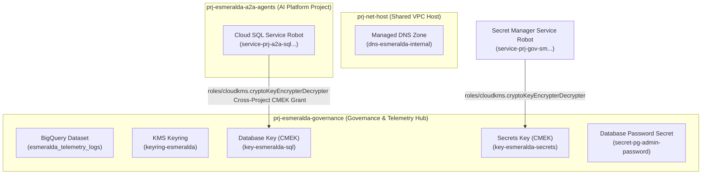
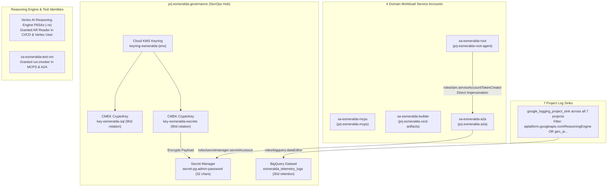

# Stage 3: Security, CMEK Keys, Secrets, and Identities

## Architectural Decisions & Design Rationale

Stage 3 centralizes compliance barriers, data governance, and encryption controls within the isolated `prj-esmeralda-governance` project.

### Why Centralize Security Assets inside the Governance Project?

*   **Separation of Duty (SecOps Governance)**: If database administrators or application developers also manage KMS key policies or secrets, they can modify access logs or decrypt backups without audit oversight. Centralizing keys and secrets inside `prj-esmeralda-governance` ensures that only Security Operations (SecOps) can write policies, rotate keys (every 90 days), or revoke access. Workloads in other projects consume these keys cross-project via specific IAM bindings.
*   **Emergency Cryptographic Lockdown**: In the event of a security breach, SecOps can immediately disable the central KMS key. This instantly stops Cloud SQL databases and staging GCS buckets across all workload projects from reading or writing encrypted blocks, isolating the compromise at the storage layer without needing to change application configurations.

### Why Separate Workload Service Accounts?

*   **Preventing Identity Escalation**: Using a generic service account would allow a compromised MCP server to gain administrative privileges on Cloud SQL databases or overwrite logging sinks. Esmeralda provisions four highly isolated service accounts:
    1.  `mcps-sa`: Limited to reading secrets and running serverless tools.
    2.  `a2a-sa`: Authorized to connect to the task store database and Vertex AI Reasoning Engine APIs.
    3.  `root-sa`: Allowed to call specialized assistant endpoints and read staging files.
    4.  `cicd-builder-sa`: Restricted to building container images and writing to Artifact Registry.

### A. Centralized CMEK Encryption and Secret Manager

We establish a centralized Cloud KMS Keyring to encrypt persistent data at rest:
*   `key-postgresql`: Encrypts the Cloud SQL database disk in `prj-esmeralda-a2a`.
*   `key-gcs-staging`: Encrypts telemetry audit log storage buckets.

We use Secret Manager to store critical credentials without plaintext disk exposure:
*   `postgresql-admin-password`: Administrative master password for database privilege bootstrapping.

---

### B. Least Privilege Identity Compliance

**IMPORTANT (Security Compliance Principle):** 
To enforce least privilege, we do not provision permissions for an `agent_repo` in Artifact Registry for ADK Reasoning Engine agents, because Reasoning Engines do not use Docker containers—they are packaged as compressed `.zip` bundles in GCS buckets. We only grant image write permissions to `mcp_repo` (used by Cloud Run tool services).

Furthermore, we avoid any generic centralized service accounts. Each workload operates under an **isolated, project-specific service identity**:



---

## Detailed Implementation Specifications & HCL Blueprints

This module establishes central customer-managed cryptographic keys (CMEK) via Cloud KMS, configures secure secret storage boundaries in Secret Manager, provisions isolated, least-privilege workload Service Accounts for each engineering domain (including a dedicated Test VM service account and full-parity roles from Esmeralda's monolithic `test-vm-sa`), and hooks up enterprise audit and telemetry log sinks.

Under our centralized governance design, all KMS keyrings, keys, and secrets are created in the centralized **`prj-esmeralda-governance`** project during Stage 3. Workload runtimes (e.g. Cloud SQL in `prj-esmeralda-a2a`) merely consume these resources over cross-project IAM bindings.

#### A. Cryptographic, Secrets, and Identity Isolation Architecture
Stage 3 establishes centralized encryption-at-rest keys, credentials, and cryptographic identities to satisfy strict corporate infosec rules:



##### 1. Key Refinements and Additions:
*   **Workload Service Account Roles Alignment**:
    In the monolithic setup, the single `test-vm-sa` account accumulated over 11 roles (including `roles/aiplatform.user`, `roles/storage.objectAdmin`, `roles/telemetry.writer`, and `roles/bigquery.jobUser`) because the VM also acted as the execution identity for the Reasoning Engine. In our enterprise multi-project landing zone, we **split and assign these roles to distinct service accounts** according to the principle of least privilege, guaranteeing full feature-parity:
    *   **`sa-esmeralda-mcps`** (Central Tools Project): Authorized with `roles/logging.logWriter`, `roles/monitoring.metricWriter`, and `roles/cloudtrace.agent` to write application telemetry.
    *   **`sa-esmeralda-a2a`** (AI Platform Project): Fully loaded with the transactional database and AI roles: `roles/cloudsql.client`, `roles/cloudsql.instanceUser`, `roles/aiplatform.user`, `roles/logging.logWriter`, `roles/monitoring.metricWriter`, `roles/cloudtrace.agent`, `roles/storage.objectAdmin` (for reasoning templates GCS buckets), `roles/serviceusage.serviceUsageConsumer`, and `roles/telemetry.writer`.
    *   **`sa-esmeralda-root`** (Business Unit App Project): Fully loaded with the customer reasoning and orchestration roles: `roles/aiplatform.user`, `roles/storage.objectAdmin`, `roles/logging.logWriter`, `roles/monitoring.metricWriter`, `roles/cloudtrace.agent`, `roles/serviceusage.serviceUsageConsumer`, and `roles/telemetry.writer`.
*   **Dedicated Test VM Identity (`sa-esmeralda-test-vm`)**:
    To support connectivity testing, local debugging, and tool testing (DMS, Calculator) from a secure jumpbox without over-privileging operators, we introduce a dedicated Test VM Service Account. It resides in the Business Unit project (`prj-esmeralda-root-agent`) or `prj-net-host` and is assigned:
    *   `roles/logging.logWriter` and `roles/monitoring.metricWriter` for VM health logging.
    *   `roles/run.invoker` inside `prj-esmeralda-mcps` (to invoke private Cloud Run MCP server tools).
    *   `roles/run.invoker` inside `prj-esmeralda-a2a-agents` (to invoke private A2A endpoints or bootstrapping runs).
    *   `roles/aiplatform.user` inside `prj-esmeralda-a2a-agents` (to invoke private Vertex AI Reasoning Engines).
    *   `roles/iam.serviceAccountTokenCreator` on **itself** (allowing the VM's operators to generate short-lived, secure OIDC identity tokens programmatically via the IAM API for curling private microservices).

---

#### B. Greenfield vs. Brownfield (BYO) Logic
When `byo_security = true` is declared in `env.yaml`:
*   KMS Keyrings, KMS Crypto Keys, and Secret Manager Secrets are **completely bypassed** during deployment.
*   Workload Service Accounts, the Test VM Service Account, and their precise IAM role bindings are **still created** and linked back to target project boundaries.
*   Downstream modules switch their inputs to point to the static pre-existing key and secret IDs passed via local configurations.

---

### C. Exhaustive Security, IAM & Telemetry Implementation Breakdown

A thorough code review of `infrastructure/modules/3-security/` reveals the exact cryptographic, identity, and observability primitives deployed across Esmeralda's project boundaries:



#### 1. Centralized Cloud KMS Keyrings & CMEK CryptoKeys
When `var.byo_security = false`, KMS resources are generated inside the central **`prj-esmeralda-governance`** project:
*   **Keyring**: `keyring-esmeralda-{env}` created in `var.region`.
*   **Database Key (`key-esmeralda-sql-{env}`)**: Configured with a 90-day rotation period (`7776000s`) and `prevent_destroy = false`. Binds `roles/cloudkms.cryptoKeyEncrypterDecrypter` to `var.a2a_sql_service_agent` so Cloud SQL can encrypt database disks at rest.
*   **Secrets Key (`key-esmeralda-secrets-{env}`)**: Configured with a 90-day rotation period (`7776000s`). Binds `roles/cloudkms.cryptoKeyEncrypterDecrypter` to `var.governance_secrets_service_agent` to encrypt Secret Manager payloads.

#### 2. Secret Manager Master Credentials Store
*   **Random Password Generator**: `random_password.db_password` generates a 32-character high-entropy password with explicit special character overrides (`!#$%&*()-_=+[]{}<>:?`).
*   **Secret Container**: Deploys `secret-pg-admin-password-{env}` into `prj-esmeralda-governance`, configured with user-managed replication in `var.region` encrypted with `local.resolved_secrets_key_id`.
*   **Secret Data**: Populates `google_secret_manager_secret_version.db_password` with the generated master credential.

#### 3. Four Least-Privilege Workload Service Accounts
Esmeralda rejects generic service accounts, provisioning dedicated identities per project:
1.  **`sa-esmeralda-mcps-{env}` (`mcps_sa`) in `prj-esmeralda-mcps`**: Granted `logging.logWriter`, `monitoring.metricWriter`, and `cloudtrace.agent`. Binds `roles/compute.networkUser` on `var.backend_subnet_id` in `prj-net-host` for Direct VPC Egress tunnel creation.
2.  **`sa-esmeralda-builder-{env}` (`cicd_builder_sa`) in `prj-esmeralda-cicd-artifacts`**: Dedicated CI/CD container delivery identity granted `cloudbuild.builds.editor`, `storage.admin`, `artifactregistry.admin`, and `logging.logWriter`.
3.  **`sa-esmeralda-a2a-{env}` (`a2a_sa`) in `prj-esmeralda-a2a`**: Granted 11 full-parity roles (`cloudsql.client`, `cloudsql.instanceUser`, `aiplatform.user`, `logging.logWriter`, `monitoring.metricWriter`, `cloudtrace.agent`, `telemetry.writer`, `storage.objectAdmin`, `serviceusage.serviceUsageConsumer`, `browser`, `cloudapiregistry.viewer`). Granted `roles/secretmanager.secretAccessor` on the database password secret, and `roles/compute.networkUser` on `var.backend_subnet_id`.
4.  **`sa-esmeralda-root-{env}` (`root_sa`) in `prj-esmeralda-root-agent`**: Granted 9 full-parity roles (`aiplatform.user`, `storage.objectAdmin`, `logging.logWriter`, `monitoring.metricWriter`, `cloudtrace.agent`, `serviceusage.serviceUsageConsumer`, `telemetry.writer`, `browser`, `cloudapiregistry.viewer`). Binds `roles/compute.networkUser` on `var.backend_subnet_id`.

#### 4. Reasoning Engine (`-re`) & Robot IAM Bindings
To allow Google Antigravity (AGY) / ADK Reasoning Engines and serverless robots to deploy and execute seamlessly across projects, Stage 3 configures extensive cross-project grants:
*   **Service Account User**: Grants `roles/iam.serviceAccountUser` on `a2a_sa` to the `a2a` `-re` SA, standard SA, and serverless robot; and on `root_sa` to the `root_agent` `-re` SA and standard SA.
*   **Runtime Storage & Vertex Access**: Binds `storage.objectViewer`, `aiplatform.user`, `cloudsql.client`, and `cloudsql.instanceUser` to the `a2a` `-re` robot; and `storage.objectViewer` and `aiplatform.user` to the `root` `-re` robot.
*   **Cross-Project Reasoning Invocation**: Grants the `root` `-re` robot `roles/aiplatform.user` and `roles/serviceusage.serviceUsageConsumer` on `prj-esmeralda-a2a` so the Root Orchestrator can trigger downstream A2A agents.
*   **CI/CD Container Image Pulling**: Binds `roles/artifactregistry.reader` on `prj-esmeralda-cicd-artifacts` to all 7 reasoning engine and serverless Cloud Run robot accounts so workload runtimes can pull compiled Docker containers from the central repository.
*   **PSC Network User**: Grants `roles/compute.networkUser` on `prj-net-host` to reasoning engine robots for PSC network attachment binding.

#### 5. Strict Service-to-Service Impersonation
*   **`google_service_account_iam_member.root_impersonates_a2a`**: Binds `roles/iam.serviceAccountTokenCreator` on `a2a_sa` directly to `root_sa`. This authorizes the Root Orchestrator to generate OAuth2 identity tokens under the A2A Agent's identity to securely invoke private upstream endpoints without static API keys.

#### 6. Test VM Dedicated Jumpbox Identity
*   **`sa-esmeralda-test-vm-{env}` (`test_vm_sa`)**: Deployed in `prj-esmeralda-root-agent` with standard logging, monitoring, tracing, and Vertex AI user roles.
*   **Private Endpoint Testing**: Granted `roles/run.invoker` in both `prj-esmeralda-mcps` and `prj-esmeralda-a2a` so engineers SSH'd into private test VMs can curl internal Cloud Run MCP tool servers and database bootstrappers.
*   **Token Creator**: Binds `roles/iam.serviceAccountTokenCreator` on itself to facilitate local token generation during debugging.

#### 7. Enterprise Telemetry Sinks & BigQuery Audit Dataset
*   **BigQuery Dataset**: Creates `esmeralda_telemetry_logs_{env}` in `prj-esmeralda-governance`, configured with a 30-day retention window (`2592000000ms`).
*   **Seven Cross-Project Log Sinks**: Deploys `google_logging_project_sink.central_sinks` across **all 7 projects** (`net_host`, `gateway`, `cicd`, `mcps`, `a2a`, `root`, `governance`), routing directly into the central BigQuery dataset.
*   **Precision Filtering**: Captures agentic reasoning steps and container telemetry with the filter: `resource.type="aiplatform.googleapis.com/ReasoningEngine" OR logName=~"gen_ai" OR logName=~"reasoning_engine_stdout" OR logName=~"reasoning_engine_stderr" OR resource.type="cloud_run_revision"`.
*   **Writer Authorization**: Binds `roles/bigquery.dataEditor` to each sink's unique `writer_identity`.

#### 8. Module Outputs (`outputs.tf`)
Exports 10 security primitives: `database_key_id`, `secrets_key_id`, `db_password_secret_name`, `mcps_sa_email`, `cicd_builder_sa_email`, `mcps_builder_sa_email` *(alias for backwards compatibility)*, `a2a_agent_sa_email`, `root_agent_sa_email`, `test_vm_sa_email`, and `telemetry_dataset_id`.

---

#### D. File Inventory & Blueprints

```text
infrastructure/modules/3-security/
├── versions.tf          # Mandates HashiCorp Google provider bounds (>= 5.0)
├── variables.tf         # Multi-project inputs, BYO KMS/Secret overrides, and project numbers
├── main.tf              # Implements Cloud KMS, secrets, SAs, and log sinks
└── outputs.tf           # Exports SAs, KMS Key IDs, and Secret Resource Names
```

*(With this Stage 3 Security implementation, our three workload service accounts contain complete, high-fidelity permissions strictly scoped to their respective domain boundaries. We also establish a dedicated Test VM service account with tight invocation and token-creation privileges, customized for secure private VPC endpoints.)*
