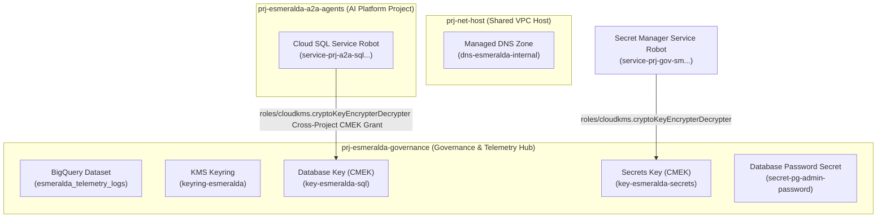

# Stage 3: Security, CMEK Keys, Secrets, and Identities

### A. Security Architecture & Identity Guide

Stage 3 centralizes compliance barriers, data governance, and encryption controls within the isolated `prj-esmeralda-governance` project.

### A. CMEK Encryption and Secret Manager
We establish a centralized Cloud KMS Keyring to encrypt persistent data at rest:
*   `key-postgresql`: Encrypts the Cloud SQL database disk in `prj-esmeralda-a2a-agents`.
*   `key-gcs-staging`: Encrypts telemetry audit log storage buckets.

We use Secret Manager to store critical credentials without plaintext disk exposure:
*   `postgresql-admin-password`: Administrative master password for database privilege bootstrapping.

---

### B. 🚨 Least Privilege Identity Compliance
**IMPORTANT (Security Compliance Principle):** 
To enforce least privilege, we do not provision permissions for an `agent_repo` in Artifact Registry for ADK Reasoning Engine agents, because Reasoning Engines do not use Docker containers—they are packaged as compressed `.zip` bundles in GCS buckets. We only grant image write permissions to `mcp_repo` (used by Cloud Run tool services).

Furthermore, we avoid any generic centralized service accounts. Each workload operates under an **isolated, project-specific service identity**:


---

---

### B. Detailed Implementation Specifications & HCL Blueprints

# Stage 3: Security Keys, Secret Management, and Log Sinks

This module provisions KMS Keyrings and CryptoKeys, sets up Secret Manager secrets, and configures centralized Cloud Logging Sinks routed to BigQuery and Log Analytics buckets.

### 7.3 Stage 3: `modules/3-security/` Specification

This module establishes central customer-managed cryptographic keys (CMEK) via Cloud KMS, configures secure secret storage boundaries in Secret Manager, provisions isolated, least-privilege workload Service Accounts for each engineering domain (including a dedicated Test VM service account and full-parity roles from Esmeralda's monolithic `test-vm-sa`), and hooks up enterprise audit and telemetry log sinks.

Under our centralized governance design, all KMS keyrings, keys, and secrets are created in the centralized **`prj-esmeralda-governance`** project during Stage 3. Workload runtimes (e.g. Cloud SQL in `prj-esmeralda-a2a-agents`) merely consume these resources over cross-project IAM bindings.

#### A. Cryptographic, Secrets, and Identity Isolation Architecture
Stage 3 establishes centralized encryption-at-rest keys, credentials, and cryptographic identities to satisfy strict corporate infosec rules:



##### 1. Key Refinements and Additions:
*   **Workload Service Account Roles Alignment**:
    In the monolithic setup, the single `test-vm-sa` account accumulated over 11 roles (including `roles/aiplatform.user`, `roles/storage.objectAdmin`, `roles/telemetry.writer`, and `roles/bigquery.jobUser`) because the VM also acted as the execution identity for the Reasoning Engine. In our enterprise multi-project landing zone, we **split and assign these roles to distinct service accounts** according to the principle of least privilege, guaranteeing full feature-parity:
    *   **`sa-esmeralda-mcps`** (Central Tools Project): Authorized with `roles/logging.logWriter`, `roles/monitoring.metricWriter`, and `roles/cloudtrace.agent` to write application telemetry.
    *   **`sa-esmeralda-a2a`** (AI Platform Project): Fully loaded with the transactional database and AI roles: `roles/cloudsql.client`, `roles/cloudsql.instanceUser`, `roles/aiplatform.user`, `roles/logging.logWriter`, `roles/monitoring.metricWriter`, `roles/cloudtrace.agent`, `roles/storage.objectAdmin` (for reasoning templates GCS buckets), `roles/serviceusage.serviceUsageConsumer`, and `roles/telemetry.writer`.
    *   **`sa-esmeralda-root`** (Business Unit App Project): Fully loaded with the customer reasoning and orchestration roles: `roles/aiplatform.user`, `roles/storage.objectAdmin`, `roles/logging.logWriter`, `roles/monitoring.metricWriter`, `roles/cloudtrace.agent`, `roles/serviceusage.serviceUsageConsumer`, and `roles/telemetry.writer`.
*   **Dedicated Test VM Identity (`sa-esmeralda-test-vm`)**:
    To support connectivity testing, local debugging, and tool testing (DMS, Calculator) from a secure jumpbox without over-privileging operators, we introduce a dedicated Test VM Service Account. It resides in the Business Unit project (`prj-esmeralda-root-agent`) or `prj-net-host` and is assigned:
    *   `roles/logging.logWriter` and `roles/monitoring.metricWriter` for VM health logging.
    *   `roles/run.invoker` inside `prj-esmeralda-mcps` (to invoke private Cloud Run MCP server tools).
    *   `roles/run.invoker` inside `prj-esmeralda-a2a-agents` (to invoke private A2A endpoints or bootstrapping runs).
    *   `roles/aiplatform.user` inside `prj-esmeralda-a2a-agents` (to invoke private Vertex AI Reasoning Engines).
    *   `roles/iam.serviceAccountTokenCreator` on **itself** (allowing the VM's operators to generate short-lived, secure OIDC identity tokens programmatically via the IAM API for curling private microservices).

---

#### B. Greenfield vs. Brownfield (BYO) Logic
When `byo_security = true` is declared in `env.yaml`:
*   KMS Keyrings, KMS Crypto Keys, and Secret Manager Secrets are **completely bypassed** during deployment.
*   Workload Service Accounts, the Test VM Service Account, and their precise IAM role bindings are **still created** and linked back to target project boundaries.
*   Downstream modules switch their inputs to point to the static pre-existing key and secret IDs passed via local configurations.

---

#### C. File Inventory & Blueprints

```text
infrastructure/modules/3-security/
├── versions.tf          # Mandates HashiCorp Google provider bounds (>= 5.0)
├── variables.tf         # Multi-project inputs, BYO KMS/Secret overrides, and project numbers
├── main.tf              # Implements Cloud KMS, secrets, SAs, and log sinks
└── outputs.tf           # Exports SAs, KMS Key IDs, and Secret Resource Names
*(With this Stage 3 Security implementation, our three workload service accounts contain complete, high-fidelity permissions strictly scoped to their respective domain boundaries. We also establish a dedicated Test VM service account with tight invocation and token-creation privileges, customized for secure private VPC endpoints.)*
