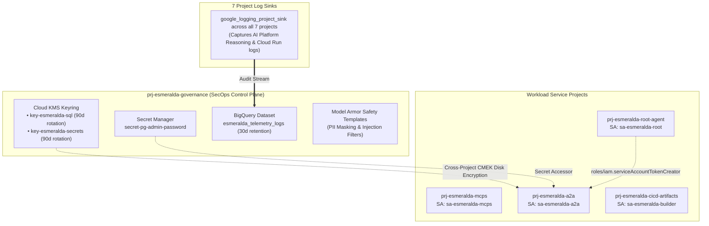

# 🛡️ Stage 3: Centralized Security, IAM, CMEK & Telemetry

Welcome to the technical deep-dive for **Stage 3 (Security, IAM, CMEK & Telemetry)**.

Stage 3 centralizes cryptographic keys (Cloud KMS CMEK), secret stores (Secret Manager), least-privilege workload service identities, Model Armor safety templates, and multi-project audit log sinks in `prj-esmeralda-governance`.

---

## 💡 The 60-Second Mental Model: Why Stage 3 Exists

In AI agent platforms, security vulnerabilities fall into three distinct vectors:
1. **Uncontrolled Secret Proliferation:** Developers hardcoding database passwords or API keys in git or agent prompt strings.
2. **Over-Privileged Service Accounts:** A compromised tool microservice having IAM rights to read all customer databases or modify audit trails.
3. **Data Loss & Exfiltration:** Lack of encryption-at-rest keys (CMEK) that can be revoked instantly during an incident.

**Stage 3 isolates all cryptographic keys, master secrets, and audit sinks inside a dedicated `prj-esmeralda-governance` project managed exclusively by SecOps.**

---

## 🎭 Persona & Role Breakdown: Who Owns Security & IAM?

| Engineering Persona | Role & Daily Responsibilities | What They Own | What They NEVER Touch |
| :--- | :--- | :--- | :--- |
| 🛡️ **SecOps / Security Lead** | Managing CMEK key rotation policies (90 days), Secret Manager access policies, and Model Armor floor settings. | `infrastructure/modules/3-security/`, KMS keyrings, secrets, BigQuery audit sinks. | Application prompt graphs, tool Python code. |
| 👷 **Platform / Identity Engineer** | Provisioning workload Service Accounts and cross-project IAM bindings. | Service Account definitions (`sa-esmeralda-a2a`, `sa-esmeralda-root`, `sa-esmeralda-mcps`). | Direct database SQL schemas or prompt tuning. |
| 🧑‍💻 **AI Application Developer** | Consuming IAM-authenticated identities to call private APIs without hardcoded tokens. | Utilizing `roles/run.invoker` and Google OIDC tokens programmatically. | KMS key policies, root passwords, or IAM role definitions. |

---

## 🏛️ Architecture Decision Records (ADRs): The "Why"

### ADR-03.1: Centralized Governance Project vs. In-Project Security Assets
* **Context:** Allowing application teams to manage their own KMS keys or BigQuery log sinks allows compromised workloads to decrypt data or erase audit logs.
* **Decision:** Centralize all KMS keyrings, CMEK crypto keys, Secret Manager secrets, and BigQuery audit datasets inside `prj-esmeralda-governance`.
* **Benefit:** Enforces strict Separation of Duties (SoD). SecOps can execute an **Emergency Cryptographic Lockdown** by disabling a KMS key in `prj-esmeralda-governance`, instantly freezing all database and storage access without touching workload code.

---

### ADR-03.2: Principle of Least Privilege & Service Account Isolation
* **Context:** Monolithic architectures use a single service account across VMs, containers, and databases, creating identity escalation risks.
* **Decision:** Provision 4 isolated Workload Service Accounts + 1 dedicated Test Jumpbox SA:
  1. `sa-esmeralda-mcps`: Cloud Run MCP tool execution.
  2. `sa-esmeralda-a2a`: Specialist Reasoning Engine + Cloud SQL PostgreSQL client.
  3. `sa-esmeralda-root`: Root Orchestrator Reasoning Engine + A2A token impersonator.
  4. `sa-esmeralda-builder`: Dedicated CI/CD container delivery identity.
  5. `sa-esmeralda-test-vm`: Private jumpbox VM identity with strictly scoped invoker permissions.

---

## 🗺️ Security, IAM & Telemetry Topology



---

## 🏗️ Technical Implementation Breakdown (`modules/3-security/`)

### 1. Cloud KMS CMEK Keys (`google_kms_crypto_key`)
* **Database Key (`key-esmeralda-sql-{env}`)**: 90-day automatic rotation (`7776000s`). Binds `roles/cloudkms.cryptoKeyEncrypterDecrypter` to the Cloud SQL service identity (`var.a2a_sql_service_agent`).
* **Secrets Key (`key-esmeralda-secrets-{env}`)**: 90-day automatic rotation (`7776000s`). Binds `roles/cloudkms.cryptoKeyEncrypterDecrypter` to Secret Manager service identity.

---

### 2. Workload Identities & Permissions

| Service Account | Hosted Project | Granted IAM Roles | Purpose |
| :--- | :--- | :--- | :--- |
| **`sa-esmeralda-mcps`** | `prj-esmeralda-mcps` | `logging.logWriter`, `monitoring.metricWriter`, `cloudtrace.agent`, `compute.networkUser` | Cloud Run MCP server execution & telemetry. |
| **`sa-esmeralda-a2a`** | `prj-esmeralda-a2a` | `cloudsql.client`, `cloudsql.instanceUser`, `aiplatform.user`, `secretmanager.secretAccessor`, `compute.networkUser` | Specialist Reasoning Engine & PostgreSQL access. |
| **`sa-esmeralda-root`** | `prj-esmeralda-root-agent` | `aiplatform.user`, `storage.objectAdmin`, `compute.networkUser`, `roles/iam.serviceAccountTokenCreator` (on A2A SA) | Master Orchestration & downstream A2A delegation. |
| **`sa-esmeralda-builder`** | `prj-esmeralda-cicd-artifacts` | `cloudbuild.builds.editor`, `artifactregistry.admin`, `storage.admin` | CI/CD container builds & image pushing. |
| **`sa-esmeralda-test-vm`** | `prj-esmeralda-root-agent` | `roles/run.invoker` (on MCPS & A2A), `aiplatform.user`, `iam.serviceAccountTokenCreator` (on self) | Private jumpbox debugging & testing. |

---

### 3. Multi-Project Log Sinks & BigQuery Telemetry (`google_logging_project_sink`)
* **BigQuery Dataset:** Provisions `esmeralda_telemetry_logs_{env}` with 30-day table expiration.
* **Aggregated Log Sinks:** Deployed across all 7 projects with the filter:
  `resource.type="aiplatform.googleapis.com/ReasoningEngine" OR logName=~"gen_ai" OR resource.type="cloud_run_revision"`.

---

## 🛠️ Verification & Runbook

### Verify Cross-Project KMS Access
```bash
# Verify Cloud SQL service robot has Encrypter/Decrypter on the CMEK key
gcloud kms keys get-iam-policy key-esmeralda-sql-dev \
    --keyring=keyring-esmeralda-dev \
    --location=us-central1 \
    --project=$(cd infrastructure/live/dev/stage-1-projects && terragrunt output -raw governance_project_id)
```
