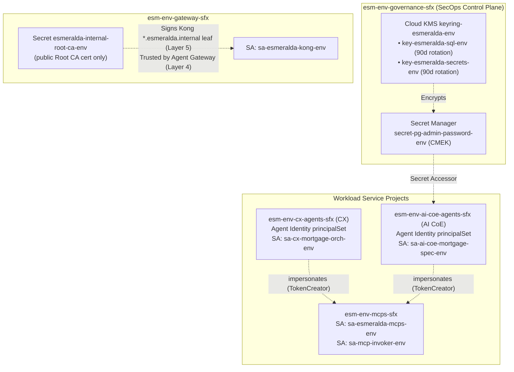

# 🛡️ Layer 3: Security, IAM, CMEK & Internal PKI

Welcome to the technical deep-dive for **Layer 3 (Security, IAM, CMEK & Internal PKI)**.

Layer 3 creates the least-privilege workload service accounts, grants IAM to each team's **Agent Identity**, provisions Cloud KMS keys (CMEK) and platform secrets in `esm-<env>-governance-<sfx>`, grants image-pull access on the shared CI/CD repository, and creates the **internal Root CA** that secures `*.esmeralda.internal`.

* **Module:** [`infrastructure/modules/3-security/`](../../infrastructure/modules/3-security/main.tf) (`main.tf`, [`agent_identity.tf`](../../infrastructure/modules/3-security/agent_identity.tf), [`pki.tf`](../../infrastructure/modules/3-security/pki.tf))
* **Live config:** `infrastructure/live/<env>/layer-3-security/`
* **Deploy:** `make deploy-security ENV=<env>`

> [!NOTE]
> **Telemetry lives in Layer 4.** Log sinks, the BigQuery telemetry dataset, DLP, alerts, dashboards, FinOps views and Model Armor templates are created by the governance layer (`modules/4-governance`). See [Centralized Monitoring & FinOps](../3-agentops-and-lifecycle/03-centralized-monitoring-and-dashboards.md) and the [Central Agent Gateway](../3-agentops-and-lifecycle/01-central-agent-gateway.md).

---

## 💡 The 60-Second Mental Model: Why Layer 3 Exists

In AI agent platforms, security vulnerabilities fall into three distinct vectors:
1. **Uncontrolled Secret Proliferation:** Developers hardcoding database passwords or API keys in git or agent prompt strings.
2. **Over-Privileged Identities:** A compromised tool or agent having IAM rights to read all customer databases or modify audit trails.
3. **Unverifiable Private Traffic:** Internal services without real TLS, so nobody can prove who is on the other end of a connection.

**Layer 3 gives every workload its own narrowly scoped identity, keeps keys and secrets in the SecOps-owned governance project, and creates the private CA that makes TLS to internal services verifiable.**

---

## 🎭 Persona & Role Breakdown: Who Owns Security & IAM?

| Engineering Persona | Role & Daily Responsibilities | What They Own | What They NEVER Touch |
| :--- | :--- | :--- | :--- |
| 🛡️ **SecOps / Security Lead** | Managing CMEK key rotation policies (90 days), Secret Manager access policies, and the internal Root CA. | `infrastructure/modules/3-security/`, KMS key ring, secrets, Root CA. | Application prompt graphs, tool Python code. |
| 👷 **Platform / Identity Engineer** | Provisioning workload Service Accounts, Agent Identity grants and cross-project IAM bindings. | Service Account definitions (`sa-ai-coe-mortgage-spec-<env>`, `sa-cx-mortgage-orch-<env>`, `sa-esmeralda-mcps-<env>`, `sa-mcp-invoker-<env>`, ...). | Direct database SQL schemas or prompt tuning. |
| 🧑‍💻 **AI Application Developer** (CX or AI CoE team) | Consuming IAM-authenticated identities to call private APIs without hardcoded tokens. | Minting Google ID tokens (via `sa-mcp-invoker-<env>`) programmatically. | KMS key policies, root passwords, or IAM role definitions. |

---

## 🏛️ Architecture Decision Records (ADRs): The "Why"

### ADR-03.1: Centralized Governance Project vs. In-Project Security Assets
* **Context:** Allowing application teams to manage their own KMS keys or secrets lets a compromised workload decrypt data or tamper with its own controls.
* **Decision:** Create the KMS key ring, CMEK crypto keys and platform secrets inside `esm-<env>-governance-<sfx>`, and grant workload identities only the roles they need on them.
* **Benefit:** Enforces Separation of Duties (SoD): SecOps can disable or rotate a key in one project without touching workload code.

> [!WARNING]
> **Current state of CMEK consumption:** the Secret Manager secret `secret-pg-admin-password-<env>` is encrypted with `key-esmeralda-secrets-<env>`. The **Cloud SQL instance** created in Layer 5 does **not** reference `key-esmeralda-sql-<env>` yet (it uses Google-managed encryption), and it uses its own generated `postgres` password and IAM database authentication rather than `secret-pg-admin-password-<env>`. Disabling the SQL key therefore does not lock the database today.

---

### ADR-03.2: Agent Identity First, Service Accounts as Supporting Identities
* **What Agent Identity is:** a Google-issued, SPIFFE-based identity given to each Agent Runtime (Reasoning Engine) deployed with `identity_type = AGENT_IDENTITY`. All engines of one project share a `principalSet`:
  `principalSet://agents.global.org-<ORG_ID>.system.id.goog/attribute.platformContainer/aiplatform/projects/<PROJECT_NUMBER>`
* **In Esmeralda:** both agents run with Agent Identity (the default, `enable_agent_identity = true`). Because the CX and AI CoE agents live in separate projects, each team's agents get their **own** `principalSet`, so Layer 3 can grant the CX orchestrator and the AI CoE specialist different permissions. This identity is also the "who" the Agent Gateway authorizes (`roles/iap.egressor`); see the [Agent Gateway guide](../3-agentops-and-lifecycle/01-central-agent-gateway.md#32-agent-identity-spiffe).
* **Decision:** Provision isolated service accounts per workload instead of one shared SA:
  1. `sa-esmeralda-mcps-<env>`: Cloud Run MCP tool execution.
  2. `sa-mcp-invoker-<env>`: the only identity with `roles/run.invoker` on the MCPs project. Agents **impersonate** it to mint Google ID tokens for MCP calls; it is also on Kong's Cloud Run invoker list.
  3. `sa-ai-coe-mortgage-spec-<env>`: AI CoE specialist. Used as the Cloud SQL IAM database user and by the database bootstrap job; runtime fallback if Agent Identity is disabled.
  4. `sa-cx-mortgage-orch-<env>`: CX orchestrator. Runtime fallback if Agent Identity is disabled.
  5. `sa-esmeralda-kong-<env>`: Kong gateway runtime.
  6. `sa-esmeralda-test-vm-<env>`: Private test VM identity with scoped invoker permissions.

  The CI/CD identities `sa-esmeralda-builder` and `sa-esmeralda-promoter` are created in the shared Layer 0 project, not here.

---

## 🗺️ Security, IAM & PKI Topology


```mermaid
flowchart TD
    subgraph Gov["esm-env-governance-sfx (SecOps Control Plane)"]
        KMS["Cloud KMS keyring-esmeralda-env<br/>• key-esmeralda-sql-env (90d rotation)<br/>• key-esmeralda-secrets-env (90d rotation)"]
        Secrets["Secret Manager<br/>secret-pg-admin-password-env (CMEK)"]
    end

    subgraph GW["esm-env-gateway-sfx"]
        CA["Secret esmeralda-internal-root-ca-env<br/>(public Root CA cert only)"]
        KongSA["SA: sa-esmeralda-kong-env"]
    end

    subgraph Workloads["Workload Service Projects"]
        P_MCPS["esm-env-mcps-sfx<br/>SA: sa-esmeralda-mcps-env<br/>SA: sa-mcp-invoker-env"]
        P_AICOE["esm-env-ai-coe-agents-sfx (AI CoE)<br/>Agent Identity principalSet<br/>SA: sa-ai-coe-mortgage-spec-env"]
        P_CX["esm-env-cx-agents-sfx (CX)<br/>Agent Identity principalSet<br/>SA: sa-cx-mortgage-orch-env"]
    end

    KMS -.->|Encrypts| Secrets
    Secrets -.->|Secret Accessor| P_AICOE
    P_CX -.->|"impersonates (TokenCreator)"| P_MCPS
    P_AICOE -.->|"impersonates (TokenCreator)"| P_MCPS
    CA -.->|"Signs Kong *.esmeralda.internal leaf (Layer 5)<br/>Trusted by Agent Gateway (Layer 4)"| KongSA
```

---

## 🏗️ Technical Implementation Breakdown (`modules/3-security/`)

### 1. Cloud KMS CMEK Keys (`google_kms_crypto_key`)
**What it is:** a Customer-Managed Encryption Key (CMEK) is a Cloud KMS key you own and control that a Google service uses to encrypt your data at rest; disabling it makes the data unreadable.

**In Esmeralda** (key ring `keyring-esmeralda-<env>` in the governance project):
* **Database Key (`key-esmeralda-sql-<env>`)**: 90-day automatic rotation (`7776000s`). Grants `roles/cloudkms.cryptoKeyEncrypterDecrypter` to the AI CoE project's Cloud SQL service agent, ready for the Cloud SQL instance to adopt (see the warning above).
* **Secrets Key (`key-esmeralda-secrets-<env>`)**: 90-day automatic rotation. Grants `roles/cloudkms.cryptoKeyEncrypterDecrypter` to the governance Secret Manager service agent; used by `secret-pg-admin-password-<env>`.
* **Brownfield:** with `byo_security = true`, the key ring, keys and secret are skipped and `existing_database_key_id`, `existing_secrets_key_id` and `existing_db_password_secret_id` are used instead.

---

### 2. Workload Service Accounts & Permissions

| Service Account | Hosted Project | Granted IAM Roles | Purpose |
| :--- | :--- | :--- | :--- |
| **`sa-esmeralda-mcps-<env>`** | `esm-<env>-mcps-<sfx>` | `logging.logWriter`, `monitoring.metricWriter`, `cloudtrace.agent`; `compute.networkUser` on the core subnet | Cloud Run MCP server execution & telemetry. |
| **`sa-mcp-invoker-<env>`** | `esm-<env>-mcps-<sfx>` | `run.invoker` on the MCPs project. Both agent `principalSet`s hold `iam.serviceAccountTokenCreator` on it | Identity agents impersonate to call MCP tools. |
| **`sa-ai-coe-mortgage-spec-<env>`** | `esm-<env>-ai-coe-agents-<sfx>` | `cloudsql.client`, `cloudsql.instanceUser`, `aiplatform.user`, `storage.objectAdmin`, `telemetry.writer`, logging/monitoring/trace writers, `secretmanager.secretAccessor` (on the PG secret); `compute.networkUser` on the core subnet | AI CoE specialist: Cloud SQL IAM user & bootstrap job. |
| **`sa-cx-mortgage-orch-<env>`** | `esm-<env>-cx-agents-<sfx>` | `aiplatform.user`, `storage.objectAdmin`, `telemetry.writer`, logging/monitoring/trace writers; `compute.networkUser` on the core subnet; `iam.serviceAccountTokenCreator` on the specialist SA | CX orchestrator (fallback runtime identity). |
| **`sa-esmeralda-kong-<env>`** | `esm-<env>-gateway-<sfx>` | `aiplatform.user`, `run.invoker`, logging/monitoring/trace writers | Kong on Cloud Run. |
| **`sa-esmeralda-test-vm-<env>`** | `esm-<env>-cx-agents-<sfx>` | `run.invoker` (on the MCPs & AI CoE projects), `aiplatform.user`, logging/monitoring/trace writers, `iam.serviceAccountTokenCreator` (on self) | Private test VM debugging & testing. |

---

### 3. Agent Identity Grants ([`agent_identity.tf`](../../infrastructure/modules/3-security/agent_identity.tf))

| `principalSet` of… | Roles in its own project | Agent Gateway egress (`roles/iap.egressor`) |
| :--- | :--- | :--- |
| **CX agents** project | `aiplatform.user`, `storage.objectAdmin`, `bigquery.dataEditor`, `bigquery.jobUser`, `telemetry.writer`, logging/monitoring/trace writers, `serviceusage.serviceUsageConsumer`, ... | on the `mcps` **and** `ai-coe-agents` projects (tools + the reusable specialist) |
| **AI CoE agents** project | the above plus `cloudsql.client`, `cloudsql.instanceUser` | on the `mcps` project (tools) |

This encodes the team model: the **CX** orchestrator may call MCP tools and the **AI CoE** specialist; the specialist may call MCP tools. The registry-level `iap.egressor` grants used by the gateway are added later by [`grant_iap_egress.sh`](../../infrastructure/modules/_shared/scripts/grant_iap_egress.sh) (Layers 4 and 5).

---

### 4. Platform Service-Agent Grants
* **Artifact Registry reader:** the Vertex AI, Reasoning Engine and Cloud Run service agents of the agent, MCPs and gateway projects get `roles/artifactregistry.reader` on **this environment's repository only** in the shared CI/CD project (dev → `esmeralda-containers`, prd → `esmeralda-containers-release`), so BYOC images can be pulled.
* **Agent Gateway binding:** the Vertex AI service agents of both agent projects get `roles/networkservices.viewer` on the governance project, so their engines can bind to the central Agent Gateway.
* **Network:** the same service agents get `roles/compute.networkUser` on the net-host project.

---

### 5. Internal Root CA ([`pki.tf`](../../infrastructure/modules/3-security/pki.tf))
**What it is:** a self-signed root certificate authority that only clients which explicitly install it will trust. Esmeralda needs one because no public CA issues certificates for the private `esmeralda.internal` zone.

**In Esmeralda:**
* `tls_private_key.internal_ca` + `tls_self_signed_cert.internal_ca` ("Esmeralda Internal Root CA", RSA 2048, 10 years), generated by the Terraform `tls` provider.
* The **public** certificate (never the key) is stored in Secret Manager as `esmeralda-internal-root-ca-<env>` in the gateway project, for operators and test clients.
* Layer 4 puts the Root CA into the Agent Gateway TrustConfig and the agent trust bundle; Layer 5 uses it to sign Kong's `*.esmeralda.internal` leaf. Nothing is baked into images: certificates reach the agents at deploy time via `AGENT_GATEWAY_ROOT_CERTIFICATES`. Full walkthrough: [TLS and certificates](../3-agentops-and-lifecycle/01-central-agent-gateway.md#-5-tls-and-certificates-why-we-need-self-signed-cas) and [BYOC](../3-agentops-and-lifecycle/01-central-agent-gateway.md#-6-bring-your-own-container-byoc).

> [!CAUTION]
> The Root CA private key is stored in Terraform state. Treat the state backend as secret material.

---

## 🛠️ Verification & Runbook

### Verify Cross-Project KMS Access
```bash
# Verify the Cloud SQL service agent has Encrypter/Decrypter on the CMEK key
gcloud kms keys get-iam-policy key-esmeralda-sql-dev \
    --keyring=keyring-esmeralda-dev \
    --location=us-central1 \
    --project=$(cd infrastructure/live/dev/layer-1-projects && terragrunt output -raw governance_project_id)
```

### Read the Internal Root CA Certificate
```bash
gcloud secrets versions access latest --secret=esmeralda-internal-root-ca-dev \
    --project=$(cd infrastructure/live/dev/layer-1-projects && terragrunt output -raw gateway_project_id) \
  | openssl x509 -noout -subject -enddate
```
