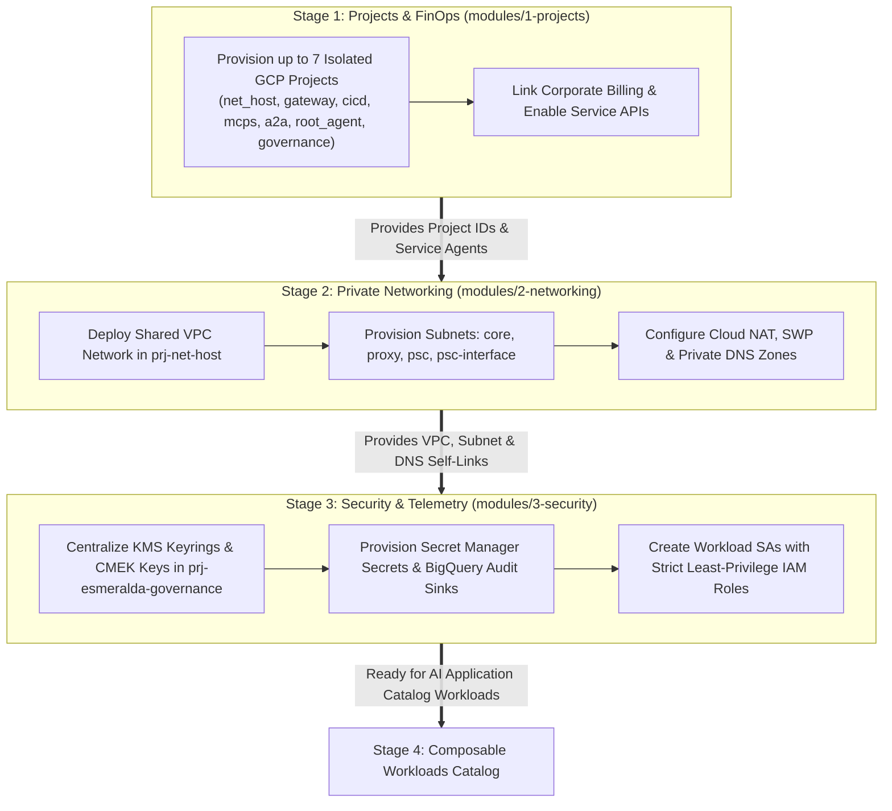

# Platform Foundations (Stages 1, 2, and 3)

This section of the documentation unifies all conceptual details, architectural infrastructure decisions, FinOps principles, and production-ready Terraform/HCL blueprints for Esmeralda's foundational platform (Stages 1, 2, and 3).

### The 3-Stage Landing Zone Foundation Pipeline

Before any AI reasoning engine or MCP tool container can be executed, Esmeralda establishes a zero-trust enterprise landing zone through three sequential infrastructure stages:

---

## Foundations Deployment Index

1. **[Stage 1: Foundational Projects, Billing (FinOps), and APIs](./01-projects-and-finops.md)**
   - Architectural & FinOps Overview
   - Technical Specifications & HCL Blueprints (`modules/1-projects/`)
2. **[Stage 2: Private Networking, DNS, and Private Service Connect (PSC)](./02-private-networking.md)**
   - Network Topology & Secure Egress Overview
   - Technical Specifications & HCL Blueprints (`modules/2-networking/`)
3. **[Stage 3: Security, CMEK Keys, Secrets, and Identities](./03-security-iam-and-telemetry.md)**
   - Encryption, Service Accounts, and Least-Privilege IAM Overview
   - Technical Specifications & HCL Blueprints (`modules/3-security/`)
