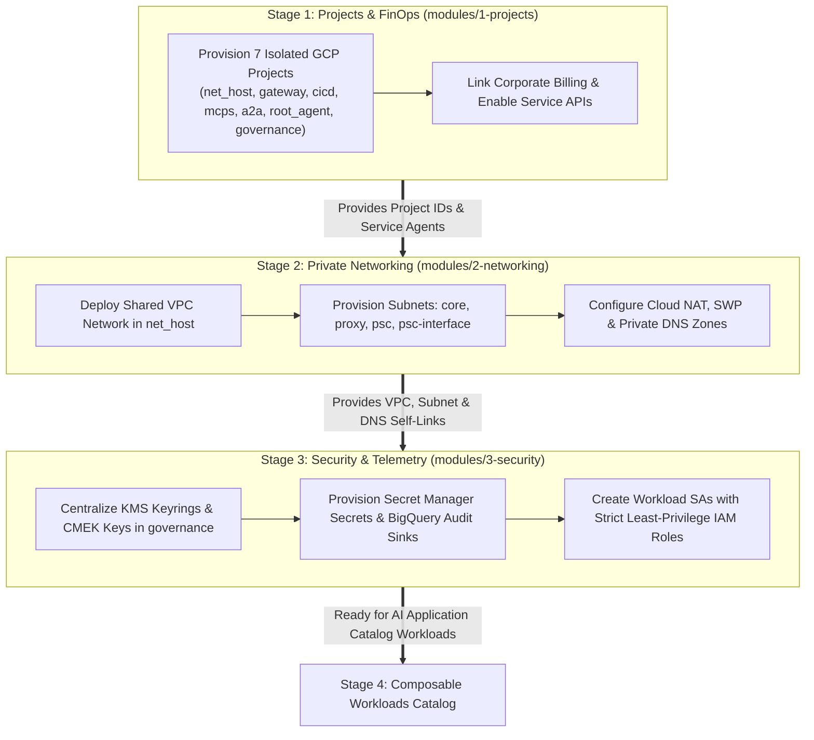

# 🏗️ Platform Foundations (Stages 1, 2, and 3)

This section of the documentation details the conceptual architecture, **Architectural Decision Records (ADRs)**, FinOps governance principles, and production-grade Terraform/Terragrunt implementations for Esmeralda's foundational platform.

---

## 🏛️ Architecture Decision Records (ADRs): The "Why" Behind Foundations

### 1. ADR-01: Why 7 Isolated GCP Projects Instead of a Monolith?
* **The Problem:** In monolith deployments, all workloads share a single GCP project. This leads to **FinOps attribution blackouts** (inability to distinguish which business unit consumed Vertex AI tokens), **IAM privilege bleeding** (tool developers can inspect platform security keys), and **API quota starvation** (one rogue agent loop kills all corporate workloads).
* **The Decision:** Segregate workloads across **seven specialized GCP projects**:
  * `net-host`: Network Operations boundary (Shared VPC, Cloud NAT, DNS).
  * `gateway`: Platform ingress boundary (Apigee / Kong).
  * `cicd-artifacts`: Build pipeline and container registry boundary.
  * `mcps`: Reusable corporate tool microservices.
  * `a2a`: Core AI Platform assistant engines and Cloud SQL task stores.
  * `root-agent`: Client-facing business unit reasoning engine.
  * `governance`: Centralized security (KMS, Secrets) and telemetry audit hub.
* **The Benefit:** Strict blast-radius containment, 100% granular billing attribution in BigQuery, and guaranteed API quota isolation.

---

### 2. ADR-02: Why Shared VPC + Private Service Connect (PSC) Over VPC Peering?
* **The Problem:** Traditional VPC Peering is non-transitive (Spoke A cannot reach Spoke B via Host) and leads to severe IP address (CIDR) exhaustion and subnet overlap issues across large enterprise networks.
* **The Decision:** Deploy a **Hub-and-Spoke Shared VPC** in `prj-esmeralda-net-host` with **Private Service Connect (PSC)** network attachments.
* **The Benefit:**
  * Serverless workloads (Cloud Run MCP tools and Vertex AI Reasoning Engines) communicate securely over private internal IPs without traversing the public internet.
  * Zero subnet overlap conflicts.
  * Transitive, unidirectional service-level access enforced cryptographically.

---

### 3. ADR-03: Why Centralized Security & Secrets in a Dedicated Governance Project?
* **The Problem:** When KMS encryption keys and secrets are created locally within workload projects, rotating keys, auditing access logs, and proving compliance (SOC 2, ISO 27001) requires querying dozens of separate project perimeters.
* **The Decision:** Centralize all **Customer-Managed Encryption Keys (CMEK)** and corporate secrets in `prj-esmeralda-governance`, granting workload Service Accounts strictly scoped `roles/cloudkms.cryptoKeyEncrypterDecrypter` and `roles/secretmanager.secretAccessor`.
* **The Benefit:** Complete separation of duties between Security Administrators (SecOps) and Application Developers (AppDev), with centralized tamper-proof audit trails.

---

## 🧭 Foundations 3-Stage Progression Pipeline

---

## 📚 Foundations Detailed Guides

1. **[Stage 1: Foundational Projects, Billing (FinOps), and APIs](./01-projects-and-finops.md)**
   * Architectural & FinOps Deep-Dive
   * Technical Specifications & HCL Blueprints (`modules/1-projects/`)
2. **[Stage 2: Private Networking, DNS, and Private Service Connect (PSC)](./02-private-networking.md)**
   * Network Topology & Secure Egress Overview
   * Technical Specifications & HCL Blueprints (`modules/2-networking/`)
3. **[Stage 3: Security, CMEK Keys, Secrets, and Identities](./03-security-iam-and-telemetry.md)**
   * Encryption, Service Accounts, and Least-Privilege IAM Overview
   * Technical Specifications & HCL Blueprints (`modules/3-security/`)
