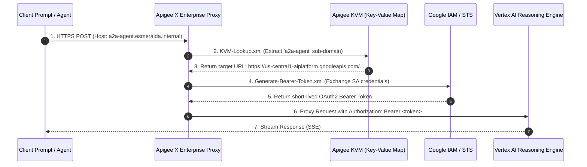
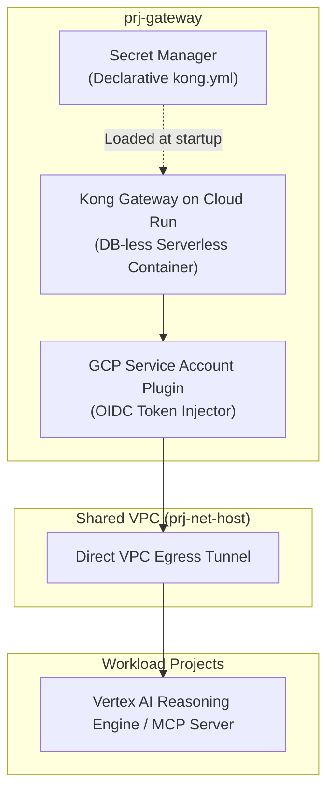

# Stage 4: Workloads Catalog (`modules/4-workloads/`)

### A. Gateway Adapter Pattern: Swappable Ingress Gateways

Stage 4 transitions Esmeralda from foundational infrastructure into **Composable AI Applications**. The architecture adopts an independent catalog pattern: every gateway, MCP tool, or AI agent is structured as a reusable module, enabling granular deployments onto the foundational projects provisioned in Stage 1.

---

### A. Gateway Adapter Pattern: Swappable Ingress Gateways

To ensure the platform can be deployed into any enterprise environment (from agile developer sandboxes to highly governed corporate networks), Esmeralda enforces the **Gateway Adapter Pattern**. Downstream Vertex AI Reasoning Engine agents remain completely agnostic of which ingress gateway technology is active on the network.

We define three ingress adapters under `/modules/4-workloads/gateways/` that adhere to the exact same **unified variable interface contract**:

#### Swappable Gateways Technical Specifications

# Stage 4 Workloads: Swappable Ingress Gateways

This directory houses swappable entry points for external and internal traffic, including Apigee proxies, Kong on private Cloud Run, or an Internal Load Balancer.

### 7.4 Stage 4: `modules/4-workloads/` Specification

Stage 4 transitions Esmeralda from foundational infrastructure (projects, networking, security) into the **Composable Workloads Space**. It acts as a modular "Product Catalog Shelf", allowing platform operators to selectively deploy gateways, MCP tool API servers, and ADK reasoning engine agents onto the pre-existing foundational projects.

This design enforces the **Gateway Adapter Pattern**: downstream agents (the reasoning engine workloads) remain completely agnostic of *how* ingress is routed or which API gateway is active. They simply interact with a standard set of interface variables, allowing seamless toggling between different gateway products.

---

#### 7.4.1 Swappable Gateway Ingress Adapters

We define three distinct gateway options under `/modules/4-workloads/gateways/`. Platform engineers can select their desired adapter by changing the `source` path of their live gateway Terragrunt configuration:

```text
infrastructure/modules/4-workloads/gateways/
├── apigee/                 # Option A: Enterprise-grade Apigee X Ingress
├── kong/                   # Option B: Lightweight, serverless Kong Gateway on Cloud Run
└── ilb/                    # Option C: Direct GCP Regional L7 Internal HTTP(S) Load Balancer
```

##### The Swappable Gateway Contract

To maintain complete interchangeability, all three gateway sub-modules **must accept the exact same input variables** and **expose the exact same output variables**. This contract enforces the **Gateway Adapter Pattern**: downstream agents (the reasoning engine workloads) remain completely agnostic of *how* ingress is routed or which API gateway is active.

##### A. Option A: Apigee X Enterprise Gateway (`gateways/apigee/`)

The Apigee X adapter implements an enterprise-grade API management plane. It provisions an Apigee Organization, binds an Apigee Environment to the gateway project, creates an Environment Group to register hostnames (`*.esmeralda.internal`), and hooks up the Apigee runtime plane to the Shared VPC via Private Service Connect (PSC).



To handle dynamic Vertex AI Reasoning Engine IDs (which change on every deployment), the Apigee adapter populates an **Apigee Key Value Map (KVM)** using Terraform's `null_resource` local-exec trigger. At runtime, an Apigee Proxy intercepts `*.esmeralda.internal`, extracts the logical agent name from the host header, looks up the target endpoint URL in the KVM, performs Google Service Account token exchange, and proxies the query to Vertex AI.

Inside the Apigee API Proxy (`/apiproxy/policies/`), we implement:
*   **KVM-Lookup.xml** (extracts the sub-domain e.g. `a2a-agent` from `request.header.host`, looks up target in KVM)
*   **Generate-Bearer-Token.xml** (uses Google Application Default Credentials or the Apigee Service Account's Identity Token to authenticate with Vertex AI)

---

##### B. Option B: Lightweight Kong Gateway on Cloud Run (`gateways/kong/`)

The Kong adapter deploys the lightweight, open-source Kong Gateway container in a DB-less serverless mode on Cloud Run inside the gateway project (`prj-gateway`). It uses Secret Manager to load Kong's declarative configuration routing rules and binds to the central Shared VPC via Direct VPC Egress for low-latency, private routing to downstream agents.



To support swappability, we compile the DB-less `kong.yml` dynamically inside Terraform using the `templatefile()` function, mapping each logical name from `var.agent_endpoints` to its dynamic Vertex AI Reasoning Engine URL. We also configure Kong's **GCP Service Account plugin** to transparently inject the Google OIDC tokens required to authorize calls to private Vertex AI reasoning engine endpoints.

---

##### C. Option C: Direct Regional L7 Internal HTTP(S) Load Balancer (`gateways/ilb/`)

The direct L7 Internal Load Balancer (ILB) bypasses API gateway appliances entirely, routing traffic directly using Google Cloud's managed regional L7 load balancer. However, because an ILB lacks a programming engine and cannot natively rewrite paths or dynamically inject Google OIDC tokens to private Vertex AI Reasoning Engine API endpoints, a **Routing Broker proxy container** (Cloud Run + Serverless NEG) is packaged **inside** the ILB module itself.

```mermaid
graph LR
    Client([Client / Root Agent]) -->|*.esmeralda.internal| ILB[Regional L7 Internal Load Balancer]
    ILB -->|Serverless NEG| Broker[Routing Broker Container<br/>(Cloud Run Proxy)]
    
    subgraph BrokerLogic["Routing Broker Runtime"]
        Env["AGENT_ENDPOINTS_JSON<br/>(Dynamic Route Map)"]
        Meta["GCP Metadata Server<br/>(Fetch IAM ID Token)"]
    end

    Broker -. Reads .-> Env
    Broker -. Fetches Token .-> Meta
    Broker -->|Authenticated Proxy| Vertex[Vertex AI Reasoning Engine API]
```

This preserves the unified interface contract! The ILB routes all `*.esmeralda.internal` traffic to the `routing_broker` Cloud Run service. The Routing Broker container reads the dynamic `agent_endpoints` map via an environment variable (`AGENT_ENDPOINTS_JSON`), intercepts incoming agent requests, matches the host header prefix to obtain the target engine URL, retrieves an IAM ID Token from the metadata server, and proxies the query payload directly to the Vertex AI Reasoning Engine.
