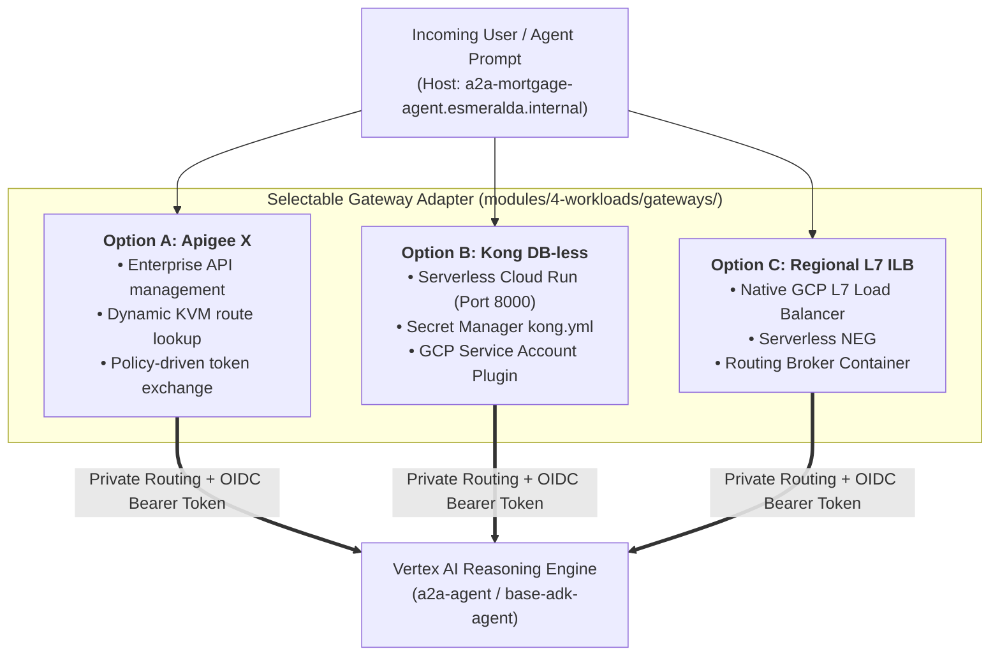

# 🚪 Stage 4 Workloads: Swappable Ingress Gateways

Welcome to the technical deep-dive for **Stage 4 Ingress Gateways**.

Stage 4 transitions Esmeralda into **Composable AI Workloads**. This guide details the **Gateway Adapter Pattern** that decouples API traffic ingress from downstream AI Reasoning Engines and MCP microservices.

---

## 💡 The 60-Second Mental Model: Why Swappable Gateways?

In enterprise environments, different business units and IT organizations have divergent API gateway standards:
* **Large Financial Enterprises** mandate **Apigee X** for API product cataloging, rate limiting, and compliance auditing.
* **Agile Cloud-Native Teams** prefer **Kong Gateway on Cloud Run** for lightweight, zero-cost serverless DB-less execution.
* **Internal Platform Teams** prefer native **Regional L7 Internal Load Balancers (ILB)** with a **Routing Broker** to avoid running third-party gateway appliances.

**Esmeralda enforces an abstracted Gateway Adapter Pattern: downstream AI agents and MCP tools expose the exact same interface contract regardless of which gateway adapter is active.**

---

## 🎭 Persona & Role Breakdown: Who Owns Ingress Gateways?

| Engineering Persona | Role & Daily Responsibilities | What They Own | What They NEVER Touch |
| :--- | :--- | :--- | :--- |
| 🛡️ **PlatformOps / Ingress Lead** | Managing SSL certificates, ingress security policies, API proxy policies, and token exchange. | `infrastructure/modules/4-workloads/gateways/`, Apigee proxy XMLs, `kong.yml`, ILB URL maps. | Internal agent prompt graphs, Python business logic. |
| 🌐 **NetOps Engineer** | Providing proxy-only subnets and managing Cloud DNS bindings. | `sb-esmeralda-proxy` subnetwork, DNS A records (`*.esmeralda.internal`). | Ingress route transformation policies. |
| 🧑‍💻 **AI Application Developer** | Calling target endpoints via standard internal DNS hostnames. | Consuming `http://a2a-mortgage-agent.esmeralda.internal/v1/message:send`. | Gateway configuration, OIDC token generation, or proxy infrastructure. |

---

## 🏛️ Architecture Decision Records (ADRs): The "Why"

### ADR-04.1: Gateway Adapter Contract & OIDC Token Injection
* **Context:** Private Vertex AI Reasoning Engines and Cloud Run MCP servers require Google IAM OIDC tokens with `roles/run.invoker` or `roles/aiplatform.user` to authorize requests. Hardcoding token-generation logic inside Python agent code tightly couples business logic to Google Cloud and breaks local testing.
* **Decision:** The Ingress Gateway acts as an **Identity-Injecting Reverse Proxy**:
  1. Intercepts incoming requests on `*.esmeralda.internal`.
  2. Resolves target endpoint URLs from dynamic environment mappings.
  3. Fetches short-lived Google OIDC ID tokens from the GCP Metadata Server (or IAM STS).
  4. Injects `Authorization: Bearer <oidc_token>` before proxying the payload over Private Service Connect.
* **Benefit:** AI developers write pure HTTP/JSON requests with zero IAM boilerplate.

---

## 🧭 The 3 Swappable Gateway Options



---

## 🏗️ Technical Specifications & Blueprints

### 1. Option A: Apigee X Enterprise Gateway (`gateways/apigee/`)
* **Organization & Environment:** Provisions `google_apigee_organization` bound to `var.vpc_id`, an environment (`var.environment`), and an Environment Group registering `*.esmeralda.internal`.
* **Runtime Plane:** Deploys `google_apigee_instance` with peering range `10.12.0.0/22`.
* **Dynamic Route KVM:** The `null_resource.populate_apigee_kvm` step iterates over `var.agent_endpoints`, populating Apigee Key-Value Maps with logical-to-dynamic target URLs.
* **Proxy Policies:** `KVM-Lookup.xml` extracts the subdomain and `Generate-Bearer-Token.xml` injects the GCP OAuth2 Bearer token.

---

### 2. Option B: Lightweight Kong Gateway on Cloud Run (`gateways/kong/`)
* **Serverless DB-less Mode:** Runs the standard `kong:3.4` container on Cloud Run in `prj-esmeralda-gateway` with `KONG_DATABASE=off`.
* **Dynamic Declarative Config:** Compiles `templates/kong.yml.tpl` inside Terraform and stores it in Secret Manager (`kong-config-{env}`).
* **OIDC Injection Plugin:** Uses Kong's GCP SA Plugin to inject Google ID tokens into headers before routing across the Direct VPC Egress tunnel.

---

### 3. Option C: Direct Regional L7 ILB & Routing Broker (`gateways/ilb/`)
* **L7 ILB Infrastructure:** Provisions `google_compute_forwarding_rule` on TCP port 80 and `google_compute_region_url_map` for `*.esmeralda.internal`.
* **Routing Broker Proxy (`routing-broker`)**: Because GCP ILB cannot rewrite payloads or generate IAM tokens on the fly, a lightweight Python/FastAPI container runs on Cloud Run behind a Serverless NEG (`google_compute_region_network_endpoint_group`).
* **Runtime Logic:** Intercepts `Host: {agent}.esmeralda.internal`, reads `AGENT_ENDPOINTS_JSON`, fetches `http://metadata.google.internal/.../identity?audience=...`, and proxies the request to Vertex AI.

---

## 🛠️ Verification & Runbook

### Test Ingress Routing via Test VM
```bash
# SSH into the test jumpbox VM
gcloud compute ssh test-vm-dev --zone=us-central1-f --project=$(cd infrastructure/live/dev/stage-1-projects && terragrunt output -raw root_project_id) --tunnel-through-iap

# Inside VM: Test AgentCard discovery through the active gateway
curl -s http://a2a-mortgage-agent.esmeralda.internal/v1/card | jq .
```
