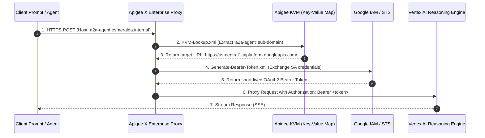
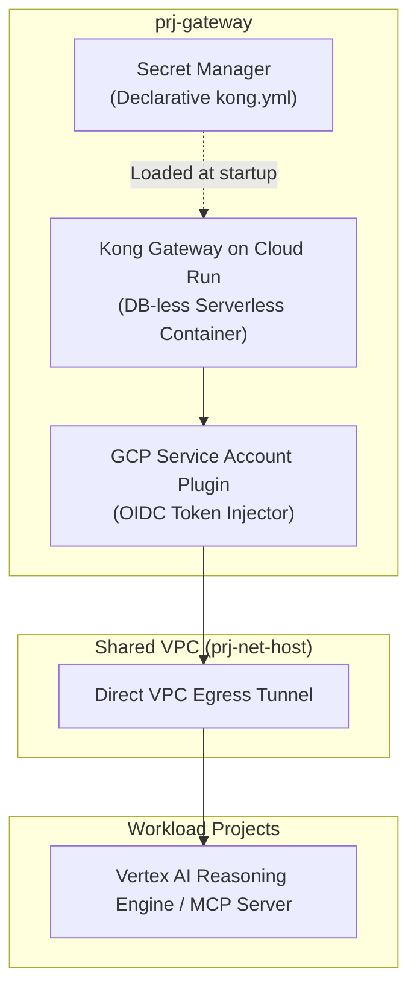
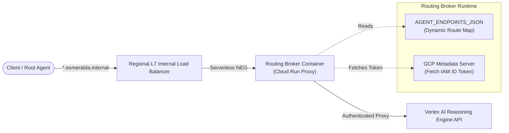
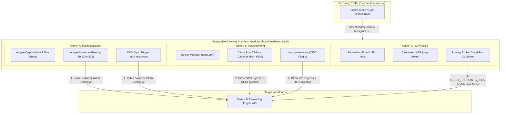

# Stage 4 Workloads: Swappable Ingress Gateways

Stage 4 transitions Esmeralda from foundational infrastructure into **Composable AI Applications**. The architecture adopts an independent catalog pattern: every gateway, MCP tool, or AI agent is structured as a reusable module, enabling granular deployments onto the foundational projects provisioned in Stage 1.

## Gateway Adapter Pattern: Swappable Ingress Gateways

To ensure the platform can be deployed into any enterprise environment (from agile developer sandboxes to highly governed corporate networks), Esmeralda enforces the **Gateway Adapter Pattern**. Downstream Vertex AI Reasoning Engine agents remain completely agnostic of which ingress gateway technology is active on the network. They simply interact with a standard set of interface variables, allowing seamless toggling between different gateway products.

We define three distinct gateway options under `/modules/4-workloads/services/`. Platform engineers can select their desired adapter by changing the `source` path of their live gateway Terragrunt configuration:

```text
infrastructure/modules/4-workloads/services/
├── apigee/                 # Option A: Enterprise-grade Apigee X Ingress
├── kong/                   # Option B: Lightweight, serverless Kong Gateway on Cloud Run
└── ilb/                    # Option C: Direct GCP Regional L7 Internal HTTP(S) Load Balancer
```

### The Swappable Gateway Contract

To maintain complete interchangeability, all three gateway sub-modules **must accept the exact same input variables** and **expose the exact same output variables**. This contract enforces the **Gateway Adapter Pattern**: downstream agents (the reasoning engine workloads) remain completely agnostic of *how* ingress is routed or which API gateway is active.

### Option A: Apigee X Enterprise Gateway (`services/apigee/`)

The Apigee X adapter implements an enterprise-grade API management plane. It provisions an Apigee Organization, binds an Apigee Environment to the gateway project, creates an Environment Group to register hostnames (`*.esmeralda.internal`), and hooks up the Apigee runtime plane to the Shared VPC via Private Service Connect (PSC).



To handle dynamic Vertex AI Reasoning Engine IDs (which change on every deployment), the Apigee adapter populates an **Apigee Key Value Map (KVM)** using Terraform's `null_resource` local-exec trigger. At runtime, an Apigee Proxy intercepts `*.esmeralda.internal`, extracts the logical agent name from the host header, looks up the target endpoint URL in the KVM, performs Google Service Account token exchange, and proxies the query to Vertex AI.

Inside the Apigee API Proxy (`/apiproxy/policies/`), we implement:
*   **KVM-Lookup.xml** (extracts the sub-domain e.g. `a2a-agent` from `request.header.host`, looks up target in KVM)
*   **Generate-Bearer-Token.xml** (uses Google Application Default Credentials or the Apigee Service Account's Identity Token to authenticate with Vertex AI)

---

### Option B: Lightweight Kong Gateway on Cloud Run (`services/kong/`)

The Kong adapter deploys the lightweight, open-source Kong Gateway container in a DB-less serverless mode on Cloud Run inside the gateway project (`prj-gateway`). It uses Secret Manager to load Kong's declarative configuration routing rules and binds to the central Shared VPC via Direct VPC Egress for low-latency, private routing to downstream agents.



To support swappability, we compile the DB-less `kong.yml` dynamically inside Terraform using the `templatefile()` function, mapping each logical name from `var.agent_endpoints` to its dynamic Vertex AI Reasoning Engine URL. We also configure Kong's **GCP Service Account plugin** to transparently inject the Google OIDC tokens required to authorize calls to private Vertex AI reasoning engine endpoints.

---

### Option C: Direct Regional L7 Internal HTTP(S) Load Balancer (`services/ilb/`)

The direct L7 Internal Load Balancer (ILB) bypasses API gateway appliances entirely, routing traffic directly using Google Cloud's managed regional L7 load balancer. However, because an ILB lacks a programming engine and cannot natively rewrite paths or dynamically inject Google OIDC tokens to private Vertex AI Reasoning Engine API endpoints, a **Routing Broker proxy container** (Cloud Run + Serverless NEG) is packaged **inside** the ILB module itself.



This preserves the unified interface contract! The ILB routes all `*.esmeralda.internal` traffic to the `routing_broker` Cloud Run service. The Routing Broker container reads the dynamic `agent_endpoints` map via an environment variable (`AGENT_ENDPOINTS_JSON`), intercepts incoming agent requests, matches the host header prefix to obtain the target engine URL, retrieves an IAM ID Token from the metadata server, and proxies the query payload directly to the Vertex AI Reasoning Engine.

---

## Exhaustive Gateway Adapter Implementation Breakdown

A code inspection of `infrastructure/modules/4-workloads/services/` reveals the exact Terraform and serverless resources deployed by each gateway adapter:



### 1. Option A: Apigee X Enterprise Gateway (`services/apigee/main.tf`)
*   **Organization & Environment Plane**: Provisions `google_apigee_organization.apigee_org` bound directly to `var.vpc_id`, alongside `google_apigee_environment.apigee_env` (`var.environment`).
*   **Environment Group**: Creates `google_apigee_envgroup.apigee_envgroup` registering the corporate domain hostname `*.esmeralda.internal`, attached via `google_apigee_envgroup_attachment.env_to_group`.
*   **Runtime Instance & PSC Peering**: Deploys `google_apigee_instance.apigee_instance` in `var.region`, allocating peering CIDR range `10.12.0.0/22` inside the Shared VPC.
*   **Dynamic KVM Sync (`null_resource.populate_apigee_kvm`)**: Iterates across `var.agent_endpoints`, executing a local-exec curl command with `gcloud auth print-access-token` to PUT/POST logical-to-dynamic endpoint URL mappings directly into Apigee Key Value Map `agent-routes`.

### 2. Option B: Serverless Kong on Cloud Run (`services/kong/main.tf`)
*   **Dynamic Configuration Compilation**: `local.kong_config` uses `templatefile()` to inject `var.agent_endpoints` into `templates/kong.yml.tpl`.
*   **Secret Manager Storage**: Provisions `google_secret_manager_secret.kong_config` (`kong-config-{env}`) with automatic replication, storing the compiled YAML in `google_secret_manager_secret_version.kong_config`.
*   **Service Identity & OIDC Authorization**: Creates `google_service_account.kong_sa` (`kong-gateway-sa-{env}`), granted `roles/aiplatform.user` on `var.project_id` and `roles/secretmanager.secretAccessor` on the config secret. *(Note: includes an import block for pre-existing developer identities)*.
*   **Cloud Run DB-less Container**: Deploys `google_cloud_run_v2_service.kong_gateway` (`kong-gateway-{env}`) on port `8000` with `INGRESS_TRAFFIC_INTERNAL_ONLY`. Injects environment variables `KONG_DATABASE = off` and `KONG_DECLARATIVE_CONFIG = /etc/kong/kong.yml`, mounting the Secret Manager config volume at `/etc/kong`.
*   **Direct VPC Egress**: Configures `vpc_access` with `egress = "ALL_TRAFFIC"` bound to `var.vpc_id` and `var.subnet_id`.

### 3. Option C: Direct ILB & Routing Broker (`services/ilb/main.tf`)
*   **Routing Broker Container (`google_cloud_run_v2_service.routing_broker`)**: Deploys `routing-broker-{env}` running `var.routing_broker_image` under `google_service_account.broker_sa` (granted `roles/aiplatform.user`). Injects `AGENT_ENDPOINTS_JSON = jsonencode(var.agent_endpoints)` and `LOG_LEVEL = info`, with Direct VPC Egress (`ALL_TRAFFIC`).
*   **Serverless NEG (`google_compute_region_network_endpoint_group.broker_neg`)**: Provisions a `SERVERLESS` network endpoint group pointing to the routing broker service.
*   **Managed Backend Service (`google_compute_region_backend_service.broker_backend`)**: Deploys an `INTERNAL_MANAGED` HTTP backend service attaching the Serverless NEG.
*   **Regional URL Map (`google_compute_region_url_map.ilb_url_map`)**: Configures host rule `*.esmeralda.internal` and default path matcher `all-agents` routing to the backend service.
*   **HTTP Proxy & Forwarding Rule**: Provisions `google_compute_region_target_http_proxy.ilb_proxy` and `google_compute_forwarding_rule.ilb_forwarding_rule` on TCP port `80` inside `var.vpc_id` and `var.subnet_id`.

---

### File Inventory & Blueprints

```text
infrastructure/modules/4-workloads/services/
├── apigee/                 # Apigee X organization, env groups, instances, KVM sync triggers
├── kong/                   # Kong Cloud Run service, Secret Manager YAML store, SA OIDC bindings
└── ilb/                    # ILB forwarding rule, URL map, Serverless NEG, Routing Broker container
```
