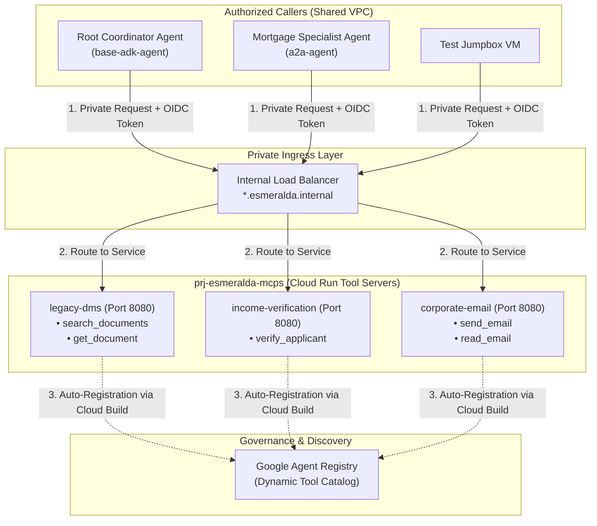

# 🔌 Stage 4 Workloads: Composable Model Context Protocol (MCP) Tool Servers

Welcome to the technical deep-dive for **Stage 4 MCP Tool Servers & API Hub**.

Stage 4 establishes the reusable corporate tool ecosystem. This guide details how enterprise data utilities (Legacy DMS, Income Verification, Corporate Email) are built with **FastMCP** and deployed as serverless Cloud Run microservices on Google Cloud.

---

## 💡 The 60-Second Mental Model: Why Standalone MCP Servers?

In conventional prototype agents, tool logic (e.g. `def verify_income()`) is written as Python helper functions embedded inside the agent repo. This causes major enterprise friction:
1. **Coupled Release Cycles:** Fixing a bug in a SQL connector forces a full redeployment and re-evaluation (LLM-as-judge) of the AI Agent reasoning engine.
2. **Monolithic Security Risk:** The AI agent needs broad database and API permissions, violating least privilege.
3. **No Cross-Agent Sharing:** Other business unit agents cannot reuse the same tool without duplicating code.

**Esmeralda packages each tool as a standalone Model Context Protocol (MCP) microservice on Cloud Run with its own dedicated Service Account, auto-scaling to zero when idle.**

---

## 🎭 Persona & Role Breakdown: Who Owns MCP Tools?

| Engineering Persona | Role & Daily Responsibilities | What They Own | What They NEVER Touch |
| :--- | :--- | :--- | :--- |
| 🧑‍💻 **AppDev / Tools Engineer** | Building API connectors, wrapping enterprise systems in FastMCP, maintaining tool schemas (`tools.json`). | `apps/services/` (Python/FastMCP code), tool unit tests, `cloudbuild.yaml`. | Terraform infrastructure, Shared VPC subnets, KMS keyrings. |
| 🛡️ **SecOps / Platform Engineer** | Governing tool authentication (`roles/run.invoker`), network ingress filters, and Agent Registry catalogs. | `infrastructure/modules/4-workloads/services/`, Cloud Run IAM policies, Direct VPC Egress. | Tool Python business logic, prompt engineering. |
| 🤖 **AI Reasoning Engineer** | Discovering and invoking tools via JSON-RPC / MCP protocols. | Specifying tools in `agent.yaml` and ADK toolsets. | Tool hosting, backend system authentication. |

---

## 🏛️ Architecture Decision Records (ADRs): The "Why"

### ADR-04.2: Standalone FastMCP Microservices vs. In-Process Python Tools
* **Context:** Enterprise tools connect to heterogeneous backend systems (legacy mainframes, SaaS APIs, SQL databases) maintained by distinct teams.
* **Decision:** Expose every utility as an HTTP/JSON-RPC **Model Context Protocol (MCP)** server on Cloud Run with `INGRESS_TRAFFIC_INTERNAL_LOAD_BALANCER` and `no-allow-unauthenticated`.
* **Benefit:**
  * **Scale-to-Zero FinOps:** Idle tools incur zero compute cost.
  * **Language Agnostic:** Tools can be implemented in Python (FastMCP), Go, or TypeScript.
  * **Zero Agent Redeployment:** Tool updates occur independently without restarting or re-deploying the AI Reasoning Engines.

---

## 🗺️ MCP Tool Server Architecture



---

## 🏗️ Technical Implementation Breakdown (`apps/services/` & `modules/4-workloads/services/`)

### 1. The 3 Standard Corporate Tool Microservices

| Tool Service Name | Directory Path | MCP Protocol URL | Key Operations Declared in `tools.json` |
| :--- | :--- | :--- | :--- |
| **`legacy-dms`** | `apps/services/legacy-dms/` | `http://legacy-dms.esmeralda.internal/mcp` | `search_documents`, `get_document` |
| **`income-verification`** | `apps/services/income-verification/` | `http://income-verification.esmeralda.internal/mcp` | `verify_applicant` |
| **`corporate-email`** | `apps/services/corporate-email/` | `http://corporate-email.esmeralda.internal/mcp` | `send_email`, `read_email` |

---

### 2. Cloud Run Service Configuration (`modules/4-workloads/services/`)
* **Private Network Ingress:** `INGRESS_TRAFFIC_INTERNAL_LOAD_BALANCER` restricts access exclusively to VPC-internal callers.
* **Direct VPC Egress:** Configured with `vpc_access { egress = "ALL_TRAFFIC" }` bound to `sb-esmeralda-core` for private database and API access.
* **Custom Audience Validation:** Configures explicit audiences (`http://{service}.internal.gateway/mcp`) to ensure Google OIDC tokens are verified securely.
* **IAM Least Privilege:** Only identities in `var.invoker_service_accounts` (e.g. `sa-esmeralda-root`, `sa-esmeralda-a2a`, `test-vm-sa`) are granted `roles/run.invoker`.

---

### 3. Automated Agent Registry CI/CD Cataloging
During container compilation in `apps/services/{tool}/cloudbuild.yaml`, Cloud Build automatically registers tool definitions into the **Google Cloud Agent Registry**:
```bash
gcloud alpha agent-registry services create ${SERVICE_NAME} \
    --project=${PROJECT_ID} \
    --location=${REGION} \
    --display-name="${DISPLAY_NAME}" \
    --mcp-server-spec-type=tool-spec \
    --tools-file=tools.json \
    --url="http://${SERVICE_NAME}.esmeralda.internal/mcp"
```

---

## 🛠️ Verification & Runbook

### Test MCP Server Directly via Jumpbox VM
```bash
# SSH into the test jumpbox VM
gcloud compute ssh test-vm-dev --zone=us-central1-f --project=$(cd infrastructure/live/dev/stage-1-projects && terragrunt output -raw root_project_id) --tunnel-through-iap

# Inside VM: Test Legacy DMS search via FastMCP JSON-RPC
TOKEN=$(gcloud auth print-identity-token --audiences="http://legacy-dms.internal.gateway/mcp")

curl -s -X POST http://legacy-dms.esmeralda.internal/mcp \
    -H "Authorization: Bearer ${TOKEN}" \
    -H "Content-Type: application/json" \
    -d '{"jsonrpc": "2.0", "method": "tools/call", "params": {"name": "search_documents", "arguments": {"applicant_name": "Julian Sterling"}}, "id": 1}' | jq .
```
