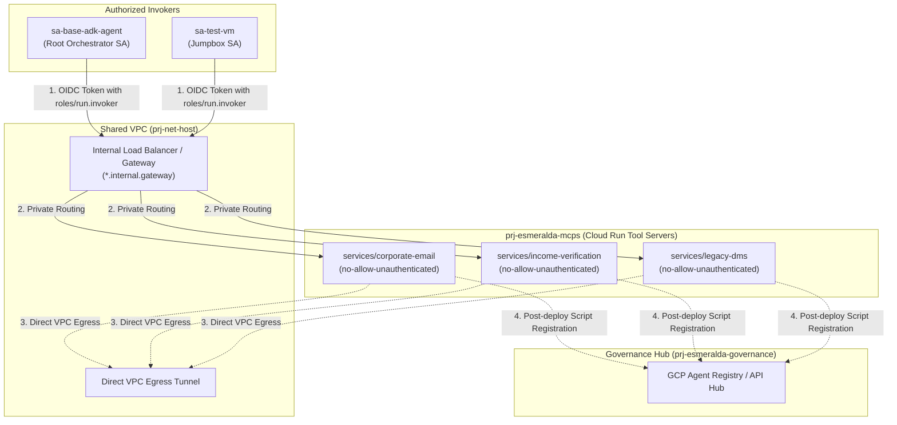

# Standalone API Hub & Composable MCP Server Tools

## Standalone API Hub (`modules/4-workloads/apihub/`)

The API Hub governance catalog runs as an isolated adjacent workload within `prj-gateway`. It automatically catalogs enterprise APIs without interfering with active live traffic routing.

---

## Composable MCP Server Tools (`modules/4-workloads/services/`)

Shared enterprise backend utilities exposed via the Model Context Protocol (DMS, Email, Income Verification) reside in the `prj-esmeralda-mcps` tool project. To achieve complete modularity and operational flexibility, each Model Context Protocol (MCP) server from the `/tools_mcp/servers/` directory is isolated into a standalone sub-module under `/modules/4-workloads/services/`. This allows platform operators to independently update, patch, and redeploy specific tool services without affecting other workloads or gateways.

Each server is deployed independently to Cloud Run under strict security controls:
*   `no-allow-unauthenticated` status enforced.
*   Outbound traffic mandated to flow 100% via Direct VPC Egress into the Shared VPC network.
*   Explicit custom audiences configured targeting the stable network IP of the Ingress Gateway.
*   Post-deployment triggers executing Python scripts to dynamically catalog tools inside Google Agent Registry.

We define three self-contained sub-modules:
1.  **Corporate Email Tool Server** (`services/corporate-email/`)
2.  **Income Verification Tool Server** (`services/income-verification/`)
3.  **Legacy DMS Tool Server** (`services/legacy-dms/`)

To preserve the zero-trust security paradigm established in Stage 3, each MCP server is deployed to Cloud Run with `no-allow-unauthenticated` status, bound directly to the Shared VPC network via Direct VPC Egress, and protected by Cloud Run IAM invoker bindings. Furthermore, each module incorporates post-deployment registration blocks to dynamically catalog available tools in the GCP Agent Registry and API Hub:



```text
infrastructure/modules/4-workloads/services/
├── corporate-email/        # Corporate Email tool container on Cloud Run + Agent Registry script
├── income-verification/    # Income Verification tool container + OTLP telemetry injection
├── legacy-dms/             # Document Management System tool container + custom audiences
├── repository/             # Unified Docker Artifact Registry repository (esmeralda-containers)
└── test-vm/                # Private jumpbox VM with Shielded integrity & IAP SSH access
```

---

### 1. Corporate Email Server (`services/corporate-email/`)

This module deploys the `corporate-email` tool server on Cloud Run. It mounts the service directly inside the Shared VPC to resolve downstream targets privately, locks down the service's HTTP ingress, and grants invoker privileges exclusively to designated agent service accounts.

---

### 2. Income Verification Server (`services/income-verification/`)

This module deploys the `income-verification` tool server. It integrates the verification server with regional telemetry logs and enforces strict IAM token-based OIDC protection.

---

### 3. Legacy DMS Server (`services/legacy-dms/`)

This module deploys the `legacy-dms` (Document Management System) tool server on Cloud Run. It secures interactions with the core asset store and registers with API Hub.

---

## Composed Inputs-Outputs Mapping Matrix

To help operators configure their Terragrunt dependency blocks, this matrix maps the variable bindings across the gateway layer and the composable MCP tool servers:

| MCP Sub-module | Input Source (`terragrunt.hcl`) | Authorized Invokers (`invoker_service_accounts`) | Regional Custom Audience Endpoint | Matches Route Path in ILB |
| :--- | :--- | :--- | :--- | :--- |
| **`corporate-email`** | Output of `prj-esmeralda-mcps` and `base-adk-agent` | `base-adk-agent-sa` email, `test-vm-sa` email | `http://email.internal.gateway/mcp` | `/email/*`, `/email/mcp` |
| **`income-verification`** | Output of `prj-esmeralda-mcps` and `base-adk-agent` | `base-adk-agent-sa` email, `test-vm-sa` email | `http://income-verification.internal.gateway/mcp` | `/income-verification/*` |
| **`legacy-dms`** | Output of `prj-esmeralda-mcps` and `base-adk-agent` | `base-adk-agent-sa` email, `test-vm-sa` email | `http://dms.internal.gateway/mcp` | `/dms/*`, `/dms/mcp` |

---

## Exhaustive MCP Tools & Utility Services Implementation Breakdown

A code analysis of `infrastructure/modules/4-workloads/apihub/` and `infrastructure/modules/4-workloads/services/` reveals how Esmeralda provisions enterprise tool catalogs, container registries, and verification jumpboxes:

```mermaid
flowchart TD
    subgraph Gov["prj-gateway & prj-esmeralda-governance"]
        Hub["API Hub Instance (apihub/main.tf)<br/>Catalog Governance & Search"]
        Reg["GCP Agent Registry<br/>Dynamic Python Script Registration"]
    end

    subgraph CICD["prj-esmeralda-cicd-artifacts"]
        AR["Artifact Registry Docker Repo<br/>esmeralda-containers"]
    end

    subgraph Root["prj-esmeralda-root-agent"]
        VM["Private Test Jumpbox VM<br/>e2-micro, Shielded, OS Login, Zero-External-IP"]
    end

    subgraph Tools["prj-esmeralda-mcps (Cloud Run v2 Services)"]
        Email["services/corporate-email (Port 8080)"]
        Income["services/income-verification (Port 8080)"]
        DMS["services/legacy-dms (Port 8080)"]
    end

    AR -->|Pulls Docker Images| Email & Income & DMS
    Email & Income & DMS -->|1. Direct VPC Egress (ALL_TRAFFIC)| Root & Gov
    Email & Income & DMS -->|2. OTLP Exporter| Telemetry["http://collector.telemetry.internal:4317"]
    Email & Income & DMS -.->|3. register_mcp.py| Reg
    VM -.->|IAP SSH & curl test| Email & Income & DMS
```

### 1. Standalone API Hub (`4-workloads/apihub/main.tf`)
*   **Service Identity Bootstrapping**: Deploys `google_project_service_identity.apihub_service_identity` (`apihub.googleapis.com`) using the `google-beta` provider.
*   **Administrative Permissions**: Binds `roles/apihub.admin` and `roles/apihub.runtimeProjectServiceAgent` onto the API Hub service identity.
*   **Host Registration & Instance**: Registers `google_apihub_host_project_registration.apihub_host_project` in `var.region`, and provisions `google_apihub_api_hub_instance.main` (`var.api_hub_instance_id`) with `disable_search = false`, `vertex_location = us`, and a 35-minute creation timeout.

### 2. Unified Container Registry (`4-workloads/services/repository/main.tf`)
*   **Docker Repository**: Provisions `google_artifact_registry_repository.esmeralda_containers` in `var.region` inside the CI/CD project (`prj-esmeralda-cicd-artifacts`), configured with format `DOCKER`. This serves as the single source of truth for all built tool and reasoning engine container images.

### 3. Private Test Jumpbox VM (`4-workloads/services/test-vm/main.tf`)
*   **Zero-External-IP Compute Instance**: Deploys `google_compute_instance.test_vm` (`test-vm-{env}`) as an `e2-micro` VM in `var.zone` running `debian-cloud/debian-12`. Explicitly omits `access_config`, ensuring the VM has no public IP and is reachable exclusively via Google Identity-Aware Proxy (IAP) SSH.
*   **Shielded & OS Login Security**: Runs under `var.service_account_email` (`test_vm_sa` from Stage 3) with full `cloud-platform` scopes. Enforces OS Login metadata (`enable-oslogin = TRUE`) and activates Shielded Instance features (`enable_secure_boot`, `enable_vtpm`, `enable_integrity_monitoring`).

### 4. Composable MCP Tool Servers (`services/corporate-email`, `services/income-verification`, `services/legacy-dms`)
Each tool server adheres to an identical, secure container architecture:
*   **Cloud Run Service v2**: Deploys `google_cloud_run_v2_service` (`{service_name}-{env}`) on container port `8080` with ingress set to `INGRESS_TRAFFIC_INTERNAL_LOAD_BALANCER`, restricting traffic to private VPC callers and load balancers. *(Note: `corporate-email` and `legacy-dms` include import blocks for pre-existing dev services)*.
*   **Custom Audiences for Gateway Routing**: Configures explicit OIDC token audience validation (`http://{service}.internal.gateway`, `https://{service}.internal.gateway`, `https://{service}.internal.gateway/mcp`), ensuring tokens generated by Ingress Gateways or Root Agents are cryptographically verified.
*   **Telemetry Injection & Direct VPC Egress**: Injects environment variable `OTEL_EXPORTER_OTLP_ENDPOINT = http://collector.telemetry.internal:4317` and mounts `vpc_access` with `egress = "ALL_TRAFFIC"` bound to `var.network_id` and `var.subnet_id`.
*   **IAM Invoker Lockdown**: Restricts `roles/run.invoker` (`google_cloud_run_v2_service_iam_binding.invokers`) exclusively to `var.invoker_service_accounts` (e.g., `base-adk-agent-sa` and `test-vm-sa`).
*   **Automated Agent Registry Cataloging (`null_resource.mcp_registration`)**: Executes a local-exec provisioner triggering `python3 tools_mcp/register_mcp.py` to register the running server URL dynamically into the Google Cloud Agent Registry.
