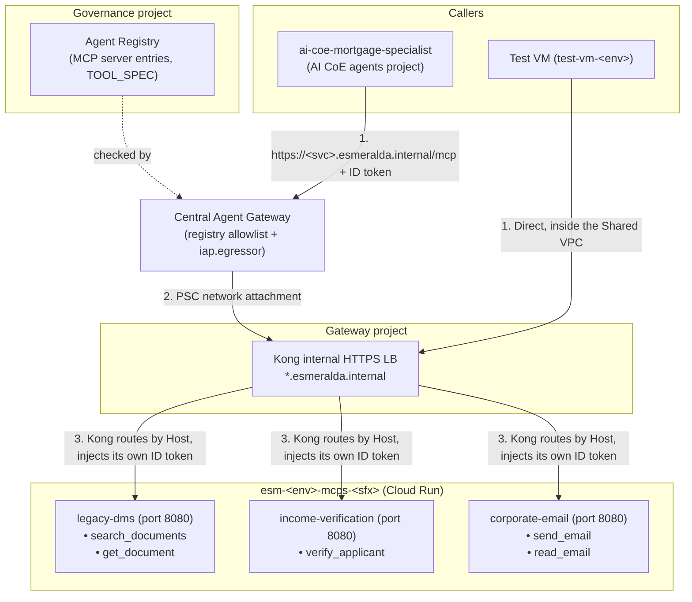

# 🔌 Layer 5 Workloads: Composable Model Context Protocol (MCP) Tool Servers

Welcome to the technical deep-dive for **Layer 5 MCP Tool Servers**.

**What MCP is:** the **Model Context Protocol** is an open protocol that lets an LLM agent *discover* the tools a server offers (`tools/list`) and *call* them (`tools/call`) over JSON-RPC. An **MCP server** is any service that speaks it; **FastMCP** is a Python framework for writing one.

**How Esmeralda uses it:** enterprise data utilities (Legacy DMS, Income Verification, Corporate Email) are built with FastMCP and deployed as serverless Cloud Run microservices in the MCPs project (`esm-<env>-mcps-<sfx>`), owned by the AppDev tools team. The AI CoE team's specialist agent (`ai-coe-mortgage-specialist`) is the consumer; the CX team's orchestrator reaches these tools only indirectly, by delegating to the specialist over A2A.

---

## 💡 The 60-Second Mental Model: Why Standalone MCP Servers?

In conventional prototype agents, tool logic (e.g. `def verify_income()`) is written as Python helper functions embedded inside the agent repo. This causes major enterprise friction:
1. **Coupled Release Cycles:** Fixing a bug in a SQL connector forces a full redeployment and re-evaluation (LLM-as-judge) of the AI Agent reasoning engine.
2. **Monolithic Security Risk:** The AI agent needs broad database and API permissions, violating least privilege.
3. **No Cross-Agent Sharing:** Other business unit agents cannot reuse the same tool without duplicating code.

**Esmeralda packages each tool as a standalone MCP microservice on Cloud Run with its own invoker allowlist and its own Agent Registry entry, auto-scaling to zero when idle.**

---

## 🎭 Persona & Role Breakdown: Who Owns MCP Tools?

| Engineering Persona | Role & Daily Responsibilities | What They Own | What They NEVER Touch |
| :--- | :--- | :--- | :--- |
| 🧑‍💻 **AppDev / Tools Engineer** | Building API connectors, wrapping enterprise systems in FastMCP, maintaining tool schemas (`tools.json`). | `apps/services/<tool>/` (Python/FastMCP code, `Dockerfile`, `tools.json`), tool unit tests. | Terraform infrastructure, Shared VPC subnets, KMS keyrings. |
| 🛡️ **SecOps / Platform Engineer** | Governing tool authentication (`roles/run.invoker`), network ingress, Agent Registry entries and `roles/iap.egressor` grants. | `infrastructure/modules/5-workloads/services/<tool>/`, Cloud Run IAM policies, Direct VPC Egress. | Tool Python business logic, prompt engineering. |
| 🤖 **AI Reasoning Engineer** (AI CoE team) | Discovering and invoking tools via MCP. | MCP URLs in `agent.yaml` (`DMS_MCP_URL`, ...) and the ADK MCP toolsets in `agent/tools.py`. | Tool hosting, backend system authentication. |

---

## 🏛️ Architecture Decision Records (ADRs): The "Why"

### ADR-04.2: Standalone FastMCP Microservices vs. In-Process Python Tools
* **Context:** Enterprise tools connect to heterogeneous backend systems (legacy mainframes, SaaS APIs, SQL databases) maintained by distinct teams.
* **Decision:** Expose every utility as an HTTP/JSON-RPC **MCP** server on Cloud Run with `INGRESS_TRAFFIC_INTERNAL_LOAD_BALANCER` and no unauthenticated access (only listed identities hold `roles/run.invoker`).
* **Benefit:**
  * **Scale-to-Zero FinOps:** Idle tools incur zero compute cost.
  * **Language Agnostic:** Tools can be implemented in Python (FastMCP), Go, or TypeScript.
  * **Zero Agent Redeployment:** Tool updates occur independently without restarting or re-deploying the AI Reasoning Engines.

---

## 🗺️ MCP Tool Server Architecture


```mermaid
flowchart TD
    subgraph Clients["Callers"]
        A2AAgent["ai-coe-mortgage-specialist<br/>(AI CoE agents project)"]
        TestVM["Test VM (test-vm-#60;env#62;)"]
    end

    AGW["Central Agent Gateway<br/>(registry allowlist + iap.egressor)"]

    subgraph Gateway["Gateway project"]
        ILB["Kong internal HTTPS LB<br/>*.esmeralda.internal"]
    end

    subgraph Tools["esm-#60;env#62;-mcps-#60;sfx#62; (Cloud Run)"]
        DMS["legacy-dms (port 8080)<br/>• search_documents<br/>• get_document"]
        Income["income-verification (port 8080)<br/>• verify_applicant"]
        Email["corporate-email (port 8080)<br/>• send_email<br/>• read_email"]
    end

    subgraph Catalog["Governance project"]
        Registry["Agent Registry<br/>(MCP server entries, TOOL_SPEC)"]
    end

    A2AAgent -->|"1. https://#60;svc#62;.esmeralda.internal/mcp + ID token"| AGW
    AGW -->|2. PSC network attachment| ILB
    TestVM -->|1. Direct, inside the Shared VPC| ILB
    ILB -->|"3. Kong routes by Host, injects its own ID token"| DMS & Income & Email
    Registry -.->|checked by| AGW
```

---

## 🏗️ Technical Implementation Breakdown (`apps/services/` & `modules/5-workloads/services/`)

### 1. The 3 Standard Corporate Tool Microservices

| Tool Service Name | Directory Path | MCP Protocol URL | Key Operations Declared in `tools.json` |
| :--- | :--- | :--- | :--- |
| **`legacy-dms`** | `apps/services/legacy-dms/` | `https://legacy-dms.esmeralda.internal/mcp` | `search_documents`, `get_document` |
| **`income-verification`** | `apps/services/income-verification/` | `https://income-verification.esmeralda.internal/mcp` | `verify_applicant` |
| **`corporate-email`** | `apps/services/corporate-email/` | `https://corporate-email.esmeralda.internal/mcp` | `send_email`, `read_email` |

Images are built with `make build-service-<name>` (or `make build-services`) through Cloud Build in the shared CI/CD project and deployed by digest; `make deploy-services ENV=<env>` deploys the three Cloud Run services.

---

### 2. Cloud Run Service Configuration (`modules/5-workloads/services/<tool>/`)
* **Private Network Ingress:** `INGRESS_TRAFFIC_INTERNAL_LOAD_BALANCER` restricts access to internal load balancers. In practice every call arrives through Kong.
* **Direct VPC Egress:** `vpc_access { egress = "ALL_TRAFFIC" }` on the Shared VPC core subnet (`sb-esmeralda-core-<env>`) for private backend access.
* **Custom Audiences:** each service accepts ID tokens for its `*.esmeralda.internal` hostname (and the legacy `*.internal.gateway` names) in addition to its default `run.app` URI. Kong uses the `run.app` URI as the audience when it injects its token.
* **IAM Least Privilege:** only the identities in `invoker_service_accounts` hold `roles/run.invoker`: `sa-esmeralda-kong-<env>` (the normal path), `sa-esmeralda-test-vm-<env>` and `sa-cx-mortgage-orch-<env>`.
* **End-to-end identity:** the specialist runs with Agent Identity and mints an ID token by impersonating `sa-mcp-invoker-<env>` (see [Layer 3 security](../1-platform-foundations/03-security-iam-and-telemetry.md)). That token authorizes the call **to Kong**; Kong then authorizes the call **to the MCP service** with its own service account.

> [!NOTE]
> The Cloud Run services don't set a runtime `service_account`, so they run as the MCPs project's default compute service account. Layer 3 creates `sa-esmeralda-mcps-<env>`, but the service modules don't attach it yet.

---

### 3. Agent Registry Cataloging

**What Agent Registry is:** a central catalog of the agents, MCP servers and API endpoints an organization allows. The Agent Gateway treats it as a **deny-by-default allowlist**: an agent can only reach a hostname registered there, with an exact URL match (see [Central Agent Gateway §3.3](../3-agentops-and-lifecycle/01-central-agent-gateway.md#33-agent-registry)).

**In Esmeralda:** registration is deploy-time Terraform, not part of the image build. Each service module creates a `google_agent_registry_service.governance_mcp` entry in the **governance project**:

```hcl
resource "google_agent_registry_service" "governance_mcp" {
  project    = var.governance_project_id
  service_id = "legacy-dms"
  interfaces {
    url              = "https://${var.internal_hostname}/mcp"   # e.g. https://legacy-dms.esmeralda.internal/mcp
    protocol_binding = "JSONRPC"
  }
  mcp_server_spec {
    type    = "TOOL_SPEC"
    content = file(var.tools_spec_path)   # apps/services/<tool>/tools.json
  }
}
```

After the entries exist, the `services/iap-egress` stack (`make deploy-iap-egress`) grants `roles/iap.egressor` on them so the agents' identities are authorized.

Each module also runs `apps/services/register_mcp.py`, which only records the Cloud Run URL in a local, gitignored `apps/services/mcp_registry.json` for developer convenience. It does not call any Google API.

---

## 🛠️ Verification & Runbook

### Test an MCP Server via the Test VM
The test VM calls Kong directly inside the Shared VPC (no Agent Gateway on this path). Copy the internal Root CA to the VM first, as shown in [Ingress Gateways → Verification & Runbook](./01-ingress-gateways.md).

```bash
CX_PROJ=$(cd infrastructure/live/dev/layer-1-projects && terragrunt output -raw cx_agents_project_id)
gcloud compute ssh test-vm-dev --zone=us-central1-f --project=$CX_PROJ --tunnel-through-iap

# Inside VM: call Legacy DMS through Kong via FastMCP JSON-RPC
HOST=legacy-dms.esmeralda.internal
TOKEN=$(curl -s -H "Metadata-Flavor: Google" \
  "http://metadata.google.internal/computeMetadata/v1/instance/service-accounts/default/identity?audience=https://${HOST}")

curl -s --cacert /tmp/root-ca.pem -X POST https://${HOST}/mcp \
    -H "Authorization: Bearer ${TOKEN}" \
    -H "Content-Type: application/json" \
    -H "Accept: application/json, text/event-stream" \
    -d '{"jsonrpc": "2.0", "method": "tools/call", "params": {"name": "search_documents", "arguments": {"applicant_last_name": "Sterling", "document_type": "tax_return"}}, "id": 1}' | jq .
```

`scripts/test_mcp_on_vm.sh` wraps the same call (`--service`, `--method`, `--params`).
