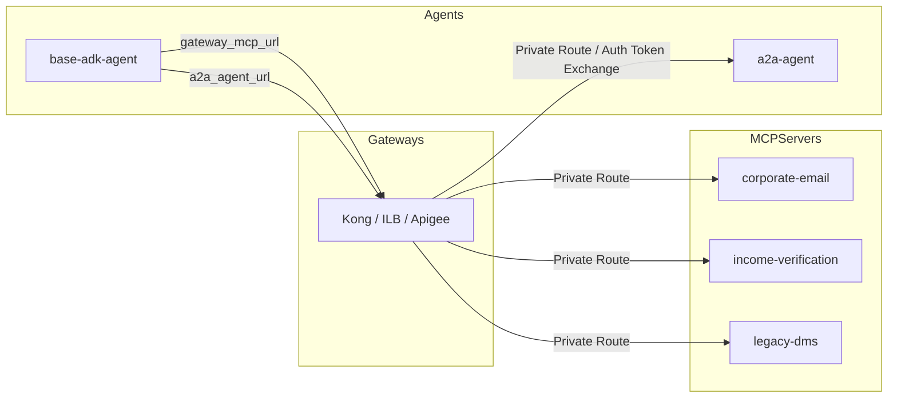
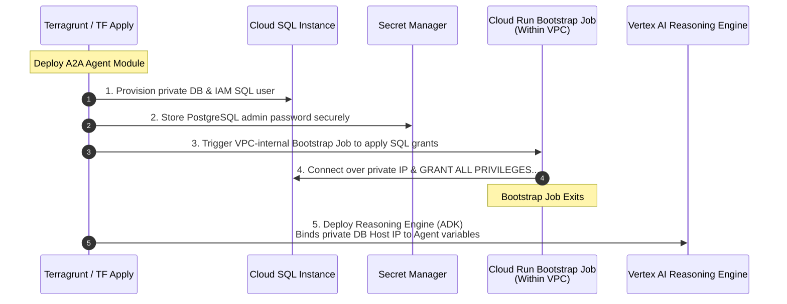
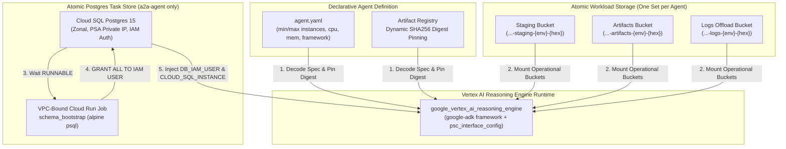

# Atomic AI Agents & Database Bootstrapping

## Atomic Agent Reasoning Engines (`modules/4-workloads/agents/`)

In Esmeralda, ADK agents operate in completely isolated environments with declarative dynamic dependency injection orchestrated by Terragrunt. Esmeralda's downstream execution flow relies on Vertex AI Reasoning Engines deployed declaratively via the Google Antigravity (AGY) / ADK framework. We organize these agents into two separate, self-contained sub-modules:
1.  **Mortgage Assistant Agent (`agents/a2a-agent/`)**: The downstream, specialized reasoning engine executing tasks and storing operational states.
2.  **Root Orchestrator Agent (`agents/base-adk-agent/`)**: The master coordinator handling multi-agent graph routing and dispatching queries.

```text
infrastructure/modules/4-workloads/agents/
├── a2a-agent/                 # Downstream reasoning engine + Atomic Cloud SQL Postgres task store
│   ├── main.tf
│   ├── variables.tf
│   └── outputs.tf
└── base-adk-agent/            # Root Orchestrator reasoning engine
    ├── main.tf
    ├── variables.tf
    └── outputs.tf
```

---

### 1. Atomic Mortgage Assistant (`agents/a2a-agent/`)

To guarantee absolute **self-contained portability**, the Cloud SQL PostgreSQL task store, its private subnet service IP allocation ranges, its IAM-authenticated DB user accounts, and database readiness bootstrappers are **fully packaged inside this single workload module**. This encapsulates all infrastructure and database requirements into an atomic, standalone unit. Calling `terragrunt apply` on this module will automatically spin up PostgreSQL, initialize the schema tables via a containerized bootstrap job, and deploy the Vertex AI Reasoning Engine with Direct VPC access peering.

---

### 2. Root Orchestrator Agent (`agents/base-adk-agent/`)

The active API Ingress Gateway acts as the single, secure entry point and transit router for all Esmeralda agent traffic. The client-side **User Prompt** first hits the gateway, which routes it to the **Root Orchestrator Agent** (`base-adk-agent`). The Root Orchestrator then parses the prompt, and routes any downstream tool service (MCP) requests or specialized downstream assistant queries (such as the `a2a-agent`) **back through the gateway**.

Because we decoupled routing mechanics, **we pass both the Gateway MCP URL and the Gateway-abstracted A2A Agent Ingress URL (`http://a2a-agent.esmeralda.internal`) as standard, runtime variables**. This guarantees complete composition flexibility and eliminates cyclic Terragrunt dependency blocks during platform deployments:


## Composed Inputs-Outputs Mapping Matrix

To configure Terragrunt cross-dependency wiring, this matrix outlines the data flow between gateway adapters, downstream tool servers, and the orchestration engines:



The runtime linkage in `terragrunt.hcl` is established as follows:

| Target Component | Dependency Variable | Injected Value Source | Security Context / IAM Role | Private Network Egress Transit |
| :--- | :--- | :--- | :--- | :--- |
| **`base-adk-agent`** | `gateway_mcp_url` | Output of the selected Gateway adapter module (`outputs.gateway_mcp_url`) | Requires `roles/run.invoker` on targets | Private Load Balancer VIP (`gateway.internal.gateway`) |
| **`base-adk-agent`** | `a2a_agent_url` | Static private DNS zone routing string (`http://a2a-agent.esmeralda.internal`) | Resolved dynamically by the swappable gateway | Resolves to the selected Gateway Ingress VIP inside the Shared VPC |
| **`a2a-agent`** | `database_host` | Output of atomic database user block (`outputs.db_private_ip`) | Requires `roles/cloudsql.client` & `instanceUser` | Private Services Access (PSA) internal range |

---

## Live Orchestrator Configurations (Terragrunt Live HCL)

To understand how these independent microservices and agents are dynamically assembled and wired in live environments under `live/dev/stage-4-workloads/`, see the Terragrunt configurations below. They use `dependency` blocks to inject real resource outputs from preceding stages transparently, enabling 100% automation without manual IP or parameter entry.

---

## Database Bootstrap & SQL Lifecycle

A frequent challenge in corporate CI/CD pipelines is tightly coupled and insecure database privilege provisioning. To guarantee a 100% atomic and secure deployment, Esmeralda encapsulates the PostgreSQL database and its bootstrap initialization directly within the `a2a-agent` workload module:

### Database Orchestration Sequencing



---

## Exhaustive Reasoning Engine & Database Implementation Breakdown

A comprehensive analysis of `infrastructure/modules/4-workloads/agents/a2a-agent/` and `base-adk-agent/` reveals how Esmeralda orchestrates atomic agent runtimes, serverless database bootstrappers, and dynamic container digest pinning:



### 1. Atomic Mortgage Assistant (`agents/a2a-agent/main.tf`)
*   **Private Cloud SQL PostgreSQL (`google_sql_database_instance.task_store`)**: Deploys `POSTGRES_15` with `ZONAL` availability, a 15 GB disk, and `cloudsql.iam_authentication = on`. Enforces absolute network isolation by disabling IPv4 (`ipv4_enabled = false`) and binding exclusively to `var.vpc_id` via Private Services Access.
*   **Database & IAM Authentication Users**: Provisions `google_sql_database.tasks_db`, generates a 24-character root superuser password (`random_password.postgres_pwd`), and creates `google_sql_user.agent_iam_user` of type `CLOUD_IAM_SERVICE_ACCOUNT` derived via `trimsuffix(var.agent_service_account, ".gserviceaccount.com")`.
*   **Readiness Polling Buffer (`null_resource.db_ready`)**: Executes a local-exec loop polling `gcloud sql instances describe` for up to 30 attempts (10-second intervals) until the database reports `RUNNABLE` status, plus an extra 10-second stabilization buffer.
*   **IAM Client & User Role Grants**: Binds `roles/cloudsql.client` and `roles/cloudsql.instanceUser` to `var.agent_service_account` on `var.project_id`.
*   **VPC-Bound Cloud Run Bootstrap Job (`google_cloud_run_v2_job.schema_bootstrap`)**: Eliminates insecure local-exec postgresql clients or Terraform database providers by deploying an administrative container job inside the Shared VPC (`egress = "ALL_TRAFFIC"` on `var.vpc_id` and `var.subnet_id`). The job executes an `alpine:latest` container running `psql` over the private IP to grant all schema and database privileges to the IAM user.
*   **Job Execution Trigger (`null_resource.trigger_bootstrap`)**: Automatically triggers `gcloud run jobs execute {bootstrap_job} --wait` during Terraform apply.
*   **Three Atomic GCS Buckets**: Provisions `staging`, `artifacts`, and `logs` buckets named with a 4-byte random hex suffix (`...-{env}-{hex}`) and uniform bucket-level access.
*   **Declarative YAML & Runtime Overrides**: Reads `var.agent_config_path` (`agent.yaml`), decodes YAML specifications (mapping framework `a2a` to `google-adk`), extracts compute limits (`min_instances`, `max_instances`, `concurrency`, `cpu`, `memory`), and merges runtime environment variable overrides: `GCS_BUCKET`, `CLOUD_SQL_INSTANCE` (`{project}:{region}:{instance_name}`), `DB_IAM_USER`, and `DB_NAME`.
*   **Container Digest Pinning**: Queries `data.google_artifact_registry_docker_image.agent_image` to resolve the exact SHA256 digest of `var.agent_image_uri`, guaranteeing immutable deployments.
*   **Vertex AI Reasoning Engine (`google_vertex_ai_reasoning_engine.agent`)**: Deploys the reasoning engine container runtime, injecting dynamic environment variables and attaching `psc_interface_config` (if `var.network_attachment` is provided) for private VPC ingress.

### 2. Root Orchestrator Agent (`agents/base-adk-agent/main.tf`)
*   **Three Atomic GCS Buckets**: Provisions dedicated `staging`, `artifacts`, and `logs` buckets with unique random hex suffixes.
*   **YAML Config Resolution & Runtime Overrides**: Decodes `agent.yaml` specifications and injects runtime environment variables: `GCS_BUCKET`, `GATEWAY_MCP_URL`, and `A2A_AGENT_URL`.
*   **Container Digest Pinning**: Resolves and pins the exact SHA256 container digest from Artifact Registry.
*   **Vertex AI Reasoning Engine (`google_vertex_ai_reasoning_engine.agent`)**: Deploys the master orchestrator reasoning engine with `psc_interface_config`.
*   **Runtime Dependency Sync (`null_resource.runtime_config_sync`)**: Synchronizes runtime gateway and upstream agent dependency variables into local runtime configuration (`.env.runtime`) upon deployment updates.

---

### File Inventory & Blueprints

```text
infrastructure/modules/4-workloads/agents/
├── a2a-agent/              # Cloud SQL Postgres, VPC bootstrap job, GCS buckets, Reasoning Engine
└── base-adk-agent/         # Root orchestrator Reasoning Engine, GCS buckets, runtime config sync
```
