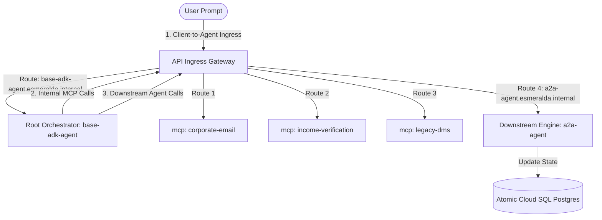
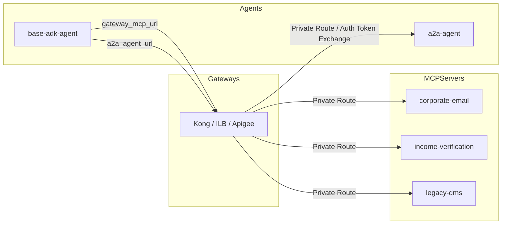
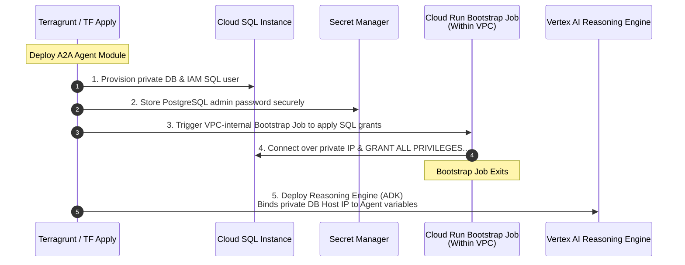

# Atomic AI Agents & Database Bootstrapping

### D. Atomic Agent Reasoning Engines

(`modules/4-workloads/agents/`)

In Esmeralda, ADK agents operate in completely isolated environments with declarative dynamic dependency injection orchestrated by Terragrunt:

#### Atomic ADK AI Agent Technical Specifications

# Stage 4 Workloads: Atomic Agent Reasoning Engines

This module packages Python ADK agent runtimes, automates GCS staging uploads, and provisions Vertex AI Reasoning Engines with fully atomic staging, artifacts, and log buckets.

#### 7.4.3 AI Platform Agent Reasoning Engines (`modules/4-workloads/agents/`)

Esmeralda's downstream execution flow relies on Vertex AI Reasoning Engines deployed declaratively via the Google Antigravity (AGY) / ADK framework. We organize these agents into two separate, self-contained sub-modules:
1.  **Mortgage Assistant Agent (`agents/a2a-agent/`)**: The downstream, specialized reasoning engine executing tasks and storing operational states.
2.  **Root Orchestrator Agent (`agents/base-adk-agent/`)**: The master coordinator handling multi-agent graph routing and dispatching queries.

```text
infrastructure/modules/4-workloads/agents/
├── a2a-agent/                 # Downstream reasoning engine + Atomic Cloud SQL Postgres task store
│   ├── main.tf
│   ├── variables.tf
│   └── outputs.tf
└── base-adk-agent/            # Root Orchestrator reasoning engine
    ├── main.tf
    ├── variables.tf
    └── outputs.tf
```

---

##### A. Sub-Module A: Atomic Mortgage Assistant (`agents/a2a-agent/`)

To guarantee absolute **self-contained portability**, the Cloud SQL PostgreSQL task store, its private subnet service IP allocation ranges, its IAM-authenticated DB user accounts, and database readiness bootstrappers are **fully packaged inside this single workload module**. This encapsulates all infrastructure and database requirements into an atomic, standalone unit. Calling `terragrunt apply` on this module will automatically spin up PostgreSQL, initialize the schema tables via a containerized bootstrap job, and deploy the Vertex AI Reasoning Engine with Direct VPC access peering.

---

##### B. Sub-Module B: Root Orchestrator Agent (`agents/base-adk-agent/`)

The active API Ingress Gateway acts as the single, secure entry point and transit router for all Esmeralda agent traffic. The client-side **User Prompt** first hits the gateway, which routes it to the **Root Orchestrator Agent** (`base-adk-agent`). The Root Orchestrator then parses the prompt, and routes any downstream tool service (MCP) requests or specialized downstream assistant queries (such as the `a2a-agent`) **back through the gateway**.

Because we decoupled routing mechanics, **we pass both the Gateway MCP URL and the Gateway-abstracted A2A Agent Ingress URL (`http://a2a-agent.esmeralda.internal`) as standard, runtime variables**. This guarantees complete composition flexibility and eliminates cyclic Terragrunt dependency blocks during platform deployments:



###### 4. Composed Inputs-Outputs Mapping Matrix

To configure Terragrunt cross-dependency wiring, this matrix outlines the data flow between gateway adapters, downstream tool servers, and the orchestration engines:



The runtime linkage in `terragrunt.hcl` is established as follows:

| Target Component | Dependency Variable | Injected Value Source | Security Context / IAM Role | Private Network Egress Transit |
| :--- | :--- | :--- | :--- | :--- |
| **`base-adk-agent`** | `gateway_mcp_url` | Output of the selected Gateway adapter module (`outputs.gateway_mcp_url`) | Requires `roles/run.invoker` on targets | Private Load Balancer VIP (`gateway.internal.gateway`) |
| **`base-adk-agent`** | `a2a_agent_url` | Static private DNS zone routing string (`http://a2a-agent.esmeralda.internal`) | Resolved dynamically by the swappable gateway | Resolves to the selected Gateway Ingress VIP inside the Shared VPC |
| **`a2a-agent`** | `database_host` | Output of atomic database user block (`outputs.db_private_ip`) | Requires `roles/cloudsql.client` & `instanceUser` | Private Services Access (PSA) internal range |

---

### E. Live Orchestrator Configurations (Terragrunt Live HCL)

To understand how these independent microservices and agents are dynamically assembled and wired in live environments under `live/dev/stage-4-workloads/`, see the Terragrunt configurations below. They use `dependency` blocks to inject real resource outputs from preceding stages transparently, enabling 100% automation without manual IP or parameter entry.

---

## 🔄 3. Database Bootstrap & SQL Lifecycle

A frequent challenge in corporate CI/CD pipelines is tightly coupled and insecure database privilege provisioning. To guarantee a 100% atomic and secure deployment, Esmeralda encapsulates the PostgreSQL database and its bootstrap initialization directly within the `a2a-agent` workload module:

### Database Orchestration Sequencing


