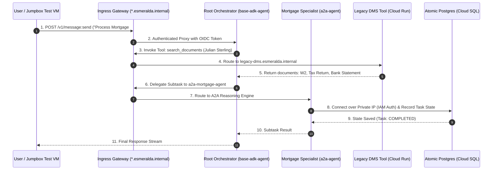

# 🧠 Stage 4 Workloads: Atomic AI Reasoning Engines & Database Bootstrapping

Welcome to the technical deep-dive for **Stage 4 AI Agents & Databases**.

Stage 4 deploys the reasoning engines onto Google Cloud **Vertex AI Reasoning Engines (Agent Engine)** and establishes isolated state stores (Cloud SQL PostgreSQL) with zero-bastion serverless schema bootstrap jobs.

---

## 💡 The 60-Second Mental Model: Why Atomic Agent Packaging?

In standard enterprise cloud architectures, deploying an AI agent requires filing tickets across 3 teams:
1. **DBA Team:** Create a database instance, assign passwords, and run SQL DDL migrations.
2. **InfOps Team:** Configure VPC connectors, private IP peerings, and firewall rules.
3. **AI Dev Team:** Build the agent container and inject database connection strings.

**Esmeralda solves this by packaging the agent runtime, its private Cloud SQL PostgreSQL instance, IAM-authenticated DB user accounts, and a serverless schema bootstrap job into a single, atomic Terraform module.**

---

## 🎭 Persona & Role Breakdown: Who Owns AI Agents & Databases?

| Engineering Persona | Role & Daily Responsibilities | What They Own | What They NEVER Touch |
| :--- | :--- | :--- | :--- |
| 🤖 **AI Reasoning Engineer** | Prompt graph development, multi-agent delegation, tool orchestration, evaluating accuracy. | `apps/agents/` (Python/ADK code), `agent.yaml`, prompt templates. | VPC subnetting, Cloud SQL replication, IAM project bindings. |
| 👷 **Platform / Database Lead** | Ensuring automated database backups, zero public IPs, and IAM-authenticated SQL connections. | `infrastructure/modules/4-workloads/agents/`, Cloud SQL specs, bootstrap Cloud Run jobs. | Agent prompt engineering, LLM model fine-tuning. |
| 🛡️ **SecOps / Identity Auditor** | Enforcing zero-trust database authentication and SPIFFE / OIDC agent identity. | Service Account definitions (`sa-esmeralda-a2a`), Cloud SQL IAM user grants. | Python business logic. |

---

## 🏛️ Architecture Decision Records (ADRs): The "Why"

### ADR-04.3: Atomic Agent + Cloud SQL Packaging
* **Context:** Shared databases across multiple AI agents violate zero-trust boundaries and create tight coupling during schema migrations.
* **Decision:** Each stateful agent (e.g. `a2a-agent`) owns its private Cloud SQL PostgreSQL 15 instance inside its dedicated project (`prj-esmeralda-a2a`).
* **Benefit:** Workloads can be provisioned, upgraded, or destroyed independently with zero cross-agent blast radius.

---

### ADR-04.4: Zero-Bastion Serverless DB Bootstrapping (Cloud Run Job)
* **Context:** Private databases have no public IP, preventing CI/CD runners (like Cloud Build) from running SQL `GRANT` and DDL statements without launching vulnerable public bastion VMs.
* **Decision:** Deploy a temporary, VPC-internal Cloud Run Job (`schema_bootstrap`) running `alpine:latest` and `psql` directly attached to the Shared VPC via Direct VPC Egress (`10.0.1.0/24`).
* **Benefit:** Runs DDL securely inside the private VPC and exits immediately—eliminating persistent bastion costs and security risks.

---

## 🗺️ Multi-Agent Interaction & Database Architecture



---

## 🏗️ Technical Implementation Breakdown (`infrastructure/modules/4-workloads/agents/`)

### 1. Atomic Mortgage Assistant (`agents/a2a-agent/main.tf`)
* **Private Cloud SQL Instance:** Provisions `google_sql_database_instance.task_store` (`POSTGRES_15`, `ZONAL`) with `ipv4_enabled = false` and `private_network = var.vpc_id` (via PSA `10.130.0.0/16`).
* **IAM Database Authentication:** Sets `cloudsql.iam_authentication = on` and provisions `google_sql_user` derived from the agent's Service Account.
* **VPC-Bound Schema Bootstrapper:** `google_cloud_run_v2_job.schema_bootstrap` executes inside `sb-esmeralda-core` to run SQL initialization scripts.
* **Vertex AI Reasoning Engine:** Provisions `google_vertex_ai_reasoning_engine.agent` pinning the exact Artifact Registry container SHA256 digest, configured with `psc_interface_config` for private VPC egress.

---

### 2. Root Orchestrator Agent (`agents/base-adk-agent/main.tf`)
* **Multi-Agent Coordinator:** Deployed onto Vertex AI Reasoning Engine without local database dependencies.
* **Dynamic Variable Injection:** Receives `GATEWAY_MCP_URL` and `A2A_AGENT_URL` (`http://a2a-mortgage-agent.esmeralda.internal`) from Terragrunt output references.
* **PSC Private Egress:** Attached to `gateway-psc-interface-attachment` in `prj-esmeralda-net-host`.

---

## 🛠️ Verification & Runbook

### Execute End-to-End Multi-Agent Test via Jumpbox VM
```bash
# Execute the automated multi-agent verification script on the test VM
gcloud compute ssh test-vm-dev --zone=us-central1-f --project=$(cd infrastructure/live/dev/stage-1-projects && terragrunt output -raw root_project_id) --tunnel-through-iap --command="bash -s" < apps/agents/a2a-agent/scripts/test_through_gateway.sh
```

