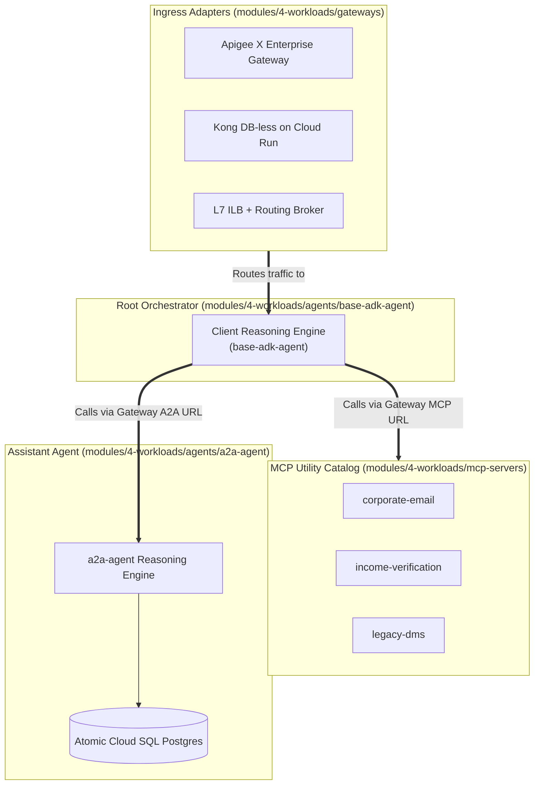

# Workloads & Catalog (Stage 4)

This section of the documentation unifies all specifications for Esmeralda's Stage 4 workloads (Swappable Ingress Gateways, Standalone API Hub, Composable MCP Server Tools, and Atomic AI Agents with Database Bootstrapping).

### The Composable AI Workloads Matrix

Stage 4 operates as an independent product shelf: operators select an ingress gateway adapter, deploy reusable MCP tool servers, and assemble reasoning engines onto the foundational projects:

---

## 🗺️ Workloads Catalog Index

1. **[Swappable Ingress Gateways](./01-ingress-gateways.md)**
   - Apigee X Enterprise Gateway
   - Lightweight Kong Gateway on Cloud Run
   - Direct Regional L7 Internal HTTP(S) Load Balancer (ILB)
2. **[Standalone API Hub & Composable MCP Server Tools](./02-mcp-tool-servers.md)**
   - Standalone API Hub
   - Corporate Email Server (`mcp-servers/corporate-email/`)
   - Income Verification Server (`mcp-servers/income-verification/`)
   - Legacy DMS Server (`mcp-servers/legacy-dms/`)
3. **[Atomic AI Agents & Database Bootstrapping](./03-ai-agents-and-database.md)**
   - Atomic Mortgage Assistant (`agents/a2a-agent/`)
   - Root Orchestrator Reasoning Engine (`agents/base-adk-agent/`)
   - Database Bootstrap & SQL Lifecycle
   - Live Orchestrator Configurations (Terragrunt Live HCL)
