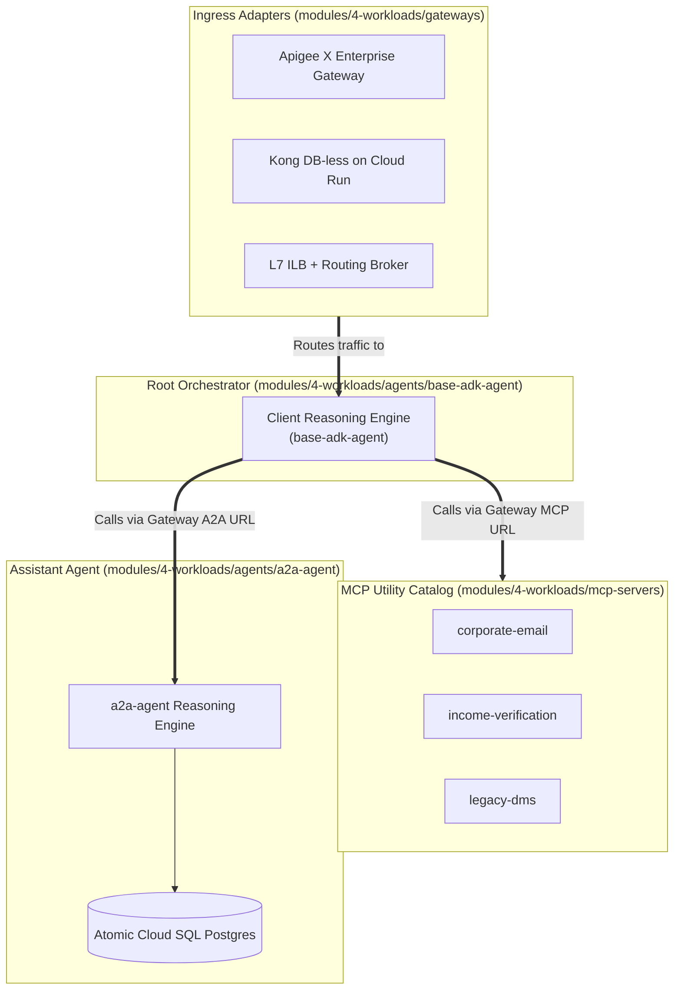

# ⚙️ Workloads & Catalog (Stage 4)

This section of the documentation unifies the architectural specifications, **Architectural Decision Records (ADRs)**, and implementation blueprints for Esmeralda's Stage 4 workloads (Swappable Ingress Gateways, Standalone API Hub, Composable MCP Tool Servers, and Atomic AI Agents).

---

## 🏛️ Architecture Decision Records (ADRs): The "Why" Behind Workloads

### 1. ADR-04: Why Standalone MCP Microservices Instead of Embedded Python Tools?
* **The Problem:** In traditional agent projects, tool functions (`get_payroll()`, `search_dms()`) are hardcoded as internal Python functions within the agent process. If a backend API changes, the entire AI agent must be re-tested, re-evaluated with LLM-as-judge, and redeployed. Furthermore, tools cannot scale independently or be shared across different business unit agents.
* **The Decision:** Expose every corporate tool as a standalone **Model Context Protocol (MCP)** server on Cloud Run over Private Service Connect (PSC).
* **The Benefit:**
  * **Polyglot & Decoupled:** Tools can be implemented in Python (FastMCP), TypeScript, or Go.
  * **Zero-Downtime Agent Upgrades:** Tools scale to zero when idle and can be updated without touching agent code.
  * **Fine-Grained Security:** Each tool has its own dedicated Service Account and IAM perimeter.

---

### 2. ADR-05: Why Multi-Agent Delegation (A2A Protocol) Over a Single Mega-Prompt?
* **The Problem:** Cramming dozens of tool definitions and hundreds of instruction rules into a single "Mega-Agent" degrades LLM reasoning accuracy, inflates token costs, and creates context pollution.
* **The Decision:** Implement the **Agent-to-Agent (A2A) protocol**:
  * **Root Coordinator Agent (`base-adk-agent`)**: Interacts with the user, determines intent, and delegates domain tasks.
  * **Specialist Agent (`a2a-agent`)**: Dedicated mortgage underwriting assistant with deep tool calling access (DMS, Income, Email) and state persistence in PostgreSQL.
* **The Benefit:** Clean separation of concerns, modular prompt engineering, reduced token consumption, and independent evaluation loops.

---

### 3. ADR-06: Why Automated VPC-Internal Database Bootstrapping?
* **The Problem:** In a zero-trust architecture, Cloud SQL PostgreSQL instances have **no public IP address** and are accessible only from within the Shared VPC. Manual schema execution (`psql`) is impossible from local developer laptops.
* **The Decision:** Terragrunt provisions an ephemeral **Cloud Run DB Bootstrap Job** inside the private subnet that executes schema creation and IAM grants automatically during `stage-4-workloads` deployment.
* **The Benefit:** 100% automated, deterministic, zero-touch greenfield deployments with zero exposed public IPs.

---

## 🧭 Composable AI Workloads Matrix

---

## 📚 Workloads Catalog Detailed Guides

1. **[Swappable Ingress Gateways](./01-ingress-gateways.md)**
   * Apigee X Enterprise Gateway
   * Lightweight Kong Gateway on Cloud Run
   * Direct Regional L7 Internal HTTP(S) Load Balancer (ILB)
2. **[Standalone API Hub & Composable MCP Server Tools](./02-mcp-tool-servers.md)**
   * Standalone API Hub & Service Catalog
   * Corporate Email Server (`services/corporate-email/`)
   * Income Verification Server (`services/income-verification/`)
   * Legacy DMS Server (`services/legacy-dms/`)
3. **[Atomic AI Agents & Database Bootstrapping](./03-ai-agents-and-database.md)**
   * Atomic Mortgage Assistant (`agents/a2a-agent/`)
   * Root Orchestrator Reasoning Engine (`agents/base-adk-agent/`)
   * Database Bootstrap & SQL Lifecycle
   * Live Orchestrator Configurations (Terragrunt Live HCL)
