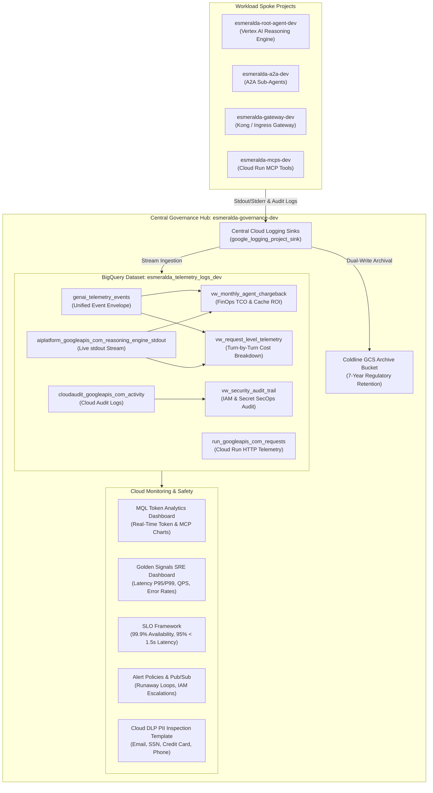
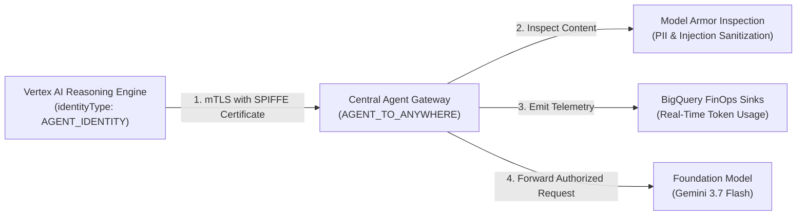

# Centralized Governance, Observability & FinOps Guide (Stage 5)

## Overview

Esmeralda centralizes all platform observability, real-time token cost accounting, security audit logging, PII inspection, and compliance archival into **`prj-esmeralda-governance`** following a Hub-and-Spoke Telemetry Architecture.



---

## 1. Telemetry Ingestion & Storage Architecture

### Central Logging Sinks (`modules/1_telemetry_sinks`)
Central Cloud Logging sinks (`google_logging_project_sink.central_sinks`) are deployed across all spoke projects (`esmeralda-root-agent-dev`, `esmeralda-a2a-dev`, `esmeralda-gateway-dev`, `esmeralda-mcps-dev`). 

* **Routing Filter**:
  ```hcl
  filter = "resource.type=\"aiplatform.googleapis.com/ReasoningEngine\" OR logName=~\"gen_ai\" OR logName=~\"reasoning_engine_stdout\" OR logName=~\"reasoning_engine_stderr\" OR resource.type=\"cloud_run_revision\" OR logName=~\"cloudaudit.googleapis.com\""
  ```
* **Exclusions**: Debug logs (`severity < INFO`) are automatically excluded unless they contain structured `genai_token_consumption` events to optimize BigQuery ingestion costs.

### 7-Year Regulatory Coldline Archival
* **Bucket Name**: `esmeralda-telemetry-archive-${governance_project_id}`
* **Storage Class**: `COLDLINE`
* **Retention Policy**: Enforces a 7-year regulatory compliance hold (`retention_period = 220898400` seconds / 2555 days) with automated lifecycle deletion.

---

## 2. BigQuery Data Engine (`modules/4_finops_analytics`)

Dataset `esmeralda_telemetry_logs_dev` in project `esmeralda-governance-dev` hosts native tables and analytical SQL views:

### Primary Tables

| Table ID | Partitioning & Clustering | Description |
| :--- | :--- | :--- |
| **`genai_telemetry_events`** | Partitioned `DAY` (`timestamp`), Clustered `(event_type, agent_id, session_id)` | Unified JSON Event Envelope storing `timestamp`, `event_type`, `session_id`, `user_id`, `agent_id`, `execution_path`, and `payload` (`JSON`). |
| **`cloudaudit_googleapis_com_activity`** | Partitioned `DAY` (`timestamp`) | Streamed GCP Cloud Audit Activity logs for IAM, Secret Manager, and Reasoning Engine operations. |
| **`aiplatform_googleapis_com_reasoning_engine_stdout`** | Partitioned `DAY` (`timestamp`) | Real-time stdout stream logs from Vertex AI Reasoning Engines across all agent spoke projects. |
| **`run_googleapis_com_requests`** | Partitioned `DAY` (`timestamp`) | Cloud Run HTTP request logs (Ingress Gateway and MCP microservices). |

### Analytical Views

#### 1. `vw_monthly_agent_chargeback` (FinOps Monthly TCO & Cache ROI)
Calculates monthly agent cost breakdown and context caching savings based on Gemini 3.7 SKU pricing:
* **Uncached Prompt Tokens**: `$0.075` per 1M tokens
* **Cached Prompt Tokens**: `$0.01875` per 1M tokens (**75% cost reduction**)
* **Response & Reasoning Tokens**: `$0.30` per 1M tokens

```sql
SELECT 
  billing_month,
  agent_id,
  model,
  total_requests,
  total_tokens,
  cache_hit_ratio_pct,
  net_total_chargeback_usd
FROM `esmeralda-governance-dev.esmeralda_telemetry_logs_dev.vw_monthly_agent_chargeback`
ORDER BY billing_month DESC;
```

#### 2. `vw_request_level_telemetry` (Turn-by-Turn Cost Breakdown)
Unifies real-time stdout streams and event envelopes to output exact per-request costs (`request_cost_usd`), token counts (`prompt`, `completion`, `thoughts`, `cached`), `execution_path`, and session context.

#### 3. `vw_security_audit_trail` (SecOps Compliance Audit)
Filters audit logs for security critical methods:
* `SetIamPolicy`: Tracks IAM role modifications and privilege escalations.
* `AccessSecretVersion`: Audits Secret Manager credential reads.
* `ReasoningEngine`: Tracks Reasoning Engine deployments, updates, and deletions.

---

## 3. Provisioned Cloud Monitoring Dashboards (`modules/3_alert_policies`)

### 1. FinOps Real-Time Token Analytics Dashboard
* **Dashboard ID**: `projects/644727420518/dashboards/99d5f7a5-fccd-4de2-85c2-d33c68d94b75`
* **Widgets**:
  1. **Total LLM Token Consumption Volume over Time** (MQL Line Chart: `fetch aiplatform.googleapis.com/ReasoningEngine | metric 'logging.googleapis.com/user/genai/realtime_token_consumption' | align delta(1m) | sum`)
  2. **Prompt Cache Hit Token Savings over Time** (MQL Line Chart: `fetch aiplatform.googleapis.com/ReasoningEngine | metric 'logging.googleapis.com/user/genai/cached_tokens' | align delta(1m) | sum`)
  3. **Gemini 3.7 Reasoning (Thoughts) Tokens over Time** (MQL Line Chart: `fetch aiplatform.googleapis.com/ReasoningEngine | metric 'logging.googleapis.com/user/genai/thoughts_tokens' | align delta(1m) | sum`)
  4. **MCP Tool Executions Count over Time** (Line Chart: `logging.googleapis.com/user/genai/mcp_tool_execution_count`)
  5. **P99 Token Consumption Spike (Runaway Loop Detector)** (Line Chart: `ALIGN_PERCENTILE_99`)
  6. **MCP Execution Frequency Breakdown by Tool Name** (Bar Chart grouped by `metric.label.tool_name`)

### 2. Golden Signals & SRE Health Dashboard
* **Dashboard ID**: `projects/644727420518/dashboards/9ce0dd33-650e-4c42-acd3-31ab034ab680`
* **Widgets**: Container Latency P50/P95/P99, HTTP Request Volume, Error Rate Breakdown (2xx/4xx/5xx), Synthetic Uptime Probes, Container Instance Concurrency.

---

## 4. Alert Policies, SLOs & DLP Safety (`modules/3_alert_policies`, `modules/2_dlp_inspection`)

### Automated Alert Policies

| Alert Policy Name | Filter / Condition | Action / Target |
| :--- | :--- | :--- |
| **Runaway Loop Token Cap** | Total tokens > 1,000,000 / min | Pub/Sub Topic `esmeralda-monitoring-alerts-dev` -> Circuit Breaker Service |
| **P95 Latency Degradation** | Ingress Gateway P95 > 2500ms | Pub/Sub Topic `esmeralda-monitoring-alerts-dev` |
| **IAM Privilege Escalation** | `protoPayload.methodName:"SetIamPolicy"` | SecOps Pub/Sub Alert |
| **Secret Access Audit** | `protoPayload.methodName:"AccessSecretVersion"` | SecOps Pub/Sub Alert |
| **Token Anomaly Spike** | Reasoning Engine Token Spike | Pub/Sub Alert Notification |

### Platform Service Level Objectives (SLOs)
* **Ingress Gateway Availability SLO**: 99.9% success rate target over a 30-day rolling window.
* **Ingress Gateway Latency SLO**: 95% of HTTP requests served under 1500ms target over a 30-day rolling window.

### Cloud Data Loss Prevention (DLP) & Model Armor PII Template
* **Template ID**: `projects/esmeralda-governance-dev/locations/global/inspectTemplates/1234567890123456789`
* **Inspected infoTypes**: `EMAIL_ADDRESS`, `CREDIT_CARD_NUMBER`, `US_SOCIAL_SECURITY_NUMBER`, `PHONE_NUMBER`.
* **Likelihood Threshold**: `POSSIBLE`.

---

## 5. Central Agent Gateway v2 & Model Armor Guardrails (`modules/6_agent_gateway`)

To guarantee zero-trust egress and prevent data exfiltration, all outbound reasoning engine traffic is intercepted by the **Central Agent Gateway** in `prj-esmeralda-governance`:



### Key Gateway Controls & Security Features:
1. **SPIFFE Workload Identity Verification (`roles/iap.egressor`)**:
   * The Agent Engine sandbox kernel negotiates an mTLS session presenting its cryptographic container identity (`principalSet://agents.global.org-${ORG_ID}.system.id.goog/*`).
   * The gateway evaluates IAP access policies before permitting egress to any endpoint registered in Google Agent Registry.
2. **Model Armor Guardrails**:
   * Automatically sanitizes sensitive customer data (PII) before prompts reach external models.
   * Intercepts and neutralizes prompt injection and jailbreak payloads in real time.
3. **Deterministic Token Auditing**:
   * Emits structured audit logs directly to Cloud Logging and BigQuery for turn-by-turn FinOps cost attribution without requiring code changes in agent logic.

