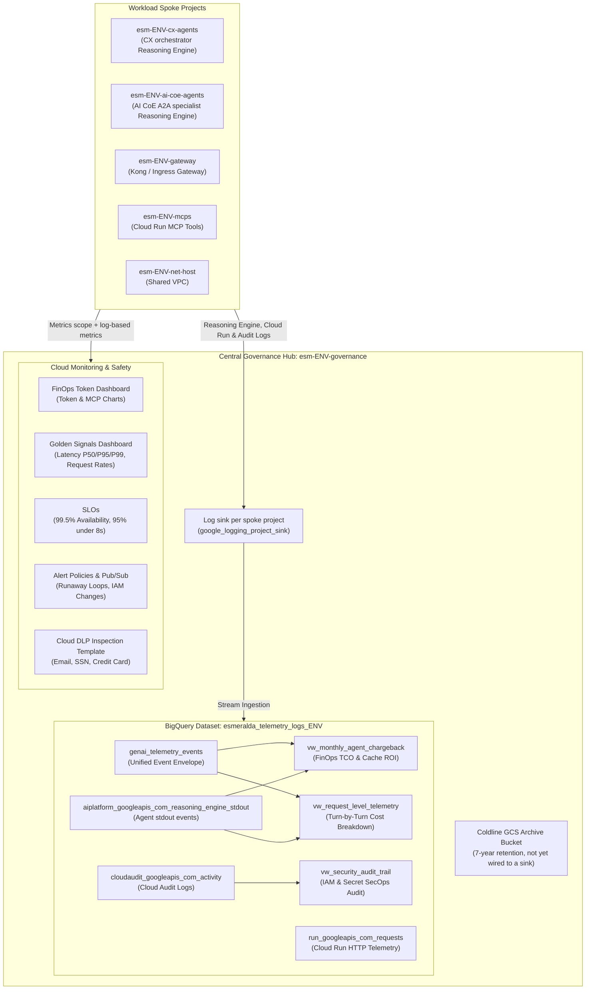
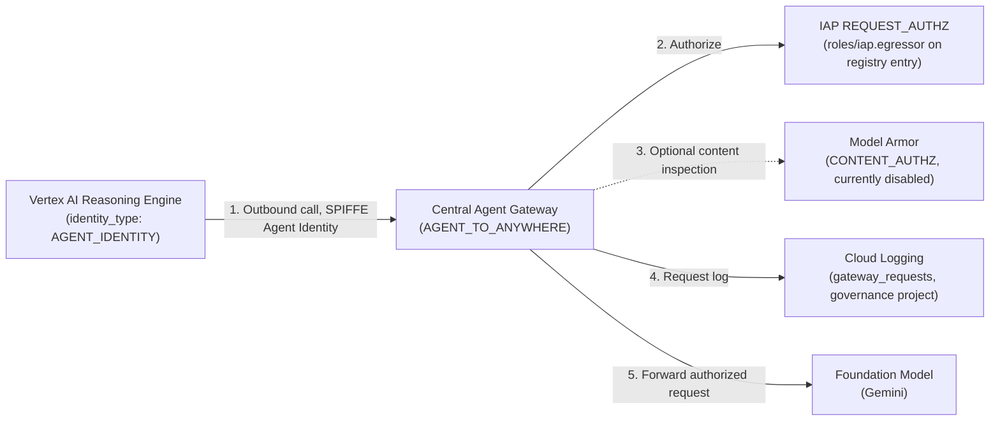

# Centralized Governance, Observability & FinOps Guide (Layer 4)

## Overview

Esmeralda centralizes platform observability, token cost accounting, security audit logging and PII inspection templates in the **governance project** `esm-<env>-governance-<sfx>`, following a **hub-and-spoke telemetry architecture**: every workload project (a *spoke*) forwards its logs to one central project (the *hub*), so that SecOps and FinOps get a single place to query, chart and alert, while application teams keep their own projects.

All resources on this page are created by the Layer 4 module [`infrastructure/modules/4-governance`](../../infrastructure/modules/4-governance/main.tf) (`make deploy-governance ENV=<env>`). The Agent Gateway, which lives in the same module, has its own guide: **[01. Central Agent Gateway](./01-central-agent-gateway.md)**.


```mermaid
flowchart TD
    subgraph Spokes["Workload Spoke Projects"]
        CX["esm-ENV-cx-agents<br/>(CX orchestrator Reasoning Engine)"]
        AICOE["esm-ENV-ai-coe-agents<br/>(AI CoE A2A specialist Reasoning Engine)"]
        GW["esm-ENV-gateway<br/>(Kong / Ingress Gateway)"]
        MCP["esm-ENV-mcps<br/>(Cloud Run MCP Tools)"]
        NET["esm-ENV-net-host<br/>(Shared VPC)"]
    end

    subgraph Hub["Central Governance Hub: esm-ENV-governance"]
        SINK["Log sink per spoke project<br/>(google_logging_project_sink)"]

        subgraph BigQuery["BigQuery Dataset: esmeralda_telemetry_logs_ENV"]
            ENV["genai_telemetry_events<br/>(Unified Event Envelope)"]
            AUDIT_TBL["cloudaudit_googleapis_com_activity<br/>(Cloud Audit Logs)"]
            STDOUT_TBL["aiplatform_googleapis_com_reasoning_engine_stdout<br/>(Agent stdout events)"]
            RUN_TBL["run_googleapis_com_requests<br/>(Cloud Run HTTP Telemetry)"]

            VW1["vw_monthly_agent_chargeback<br/>(FinOps TCO & Cache ROI)"]
            VW2["vw_request_level_telemetry<br/>(Turn-by-Turn Cost Breakdown)"]
            VW3["vw_security_audit_trail<br/>(IAM & Secret SecOps Audit)"]
        end

        GCS["Coldline GCS Archive Bucket<br/>(7-year retention, not yet wired to a sink)"]

        subgraph Monitoring["Cloud Monitoring & Safety"]
            MQL["FinOps Token Dashboard<br/>(Token & MCP Charts)"]
            GOLD["Golden Signals Dashboard<br/>(Latency P50/P95/P99, Request Rates)"]
            SLO["SLOs<br/>(99.5% Availability, 95% under 8s)"]
            ALERTS["Alert Policies & Pub/Sub<br/>(Runaway Loops, IAM Changes)"]
            DLP["Cloud DLP Inspection Template<br/>(Email, SSN, Credit Card)"]
        end
    end

    Spokes -->|Reasoning Engine, Cloud Run & Audit Logs| SINK
    SINK -->|Stream Ingestion| BigQuery
    ENV --> VW1 & VW2
    STDOUT_TBL --> VW1 & VW2
    AUDIT_TBL --> VW3
    Spokes -->|Metrics scope + log-based metrics| Monitoring
```

---

## 1. Telemetry Ingestion & Storage Architecture

### Central Logging Sinks (`modules/1_telemetry_sinks`)

**What it is:** a Cloud Logging *sink* is a routing rule on a project that copies every log entry matching a filter to a destination (BigQuery, Cloud Storage, Pub/Sub or another log bucket).

**In Esmeralda:** one sink, `esmeralda-central-telemetry-sink-<env>` (`google_logging_project_sink.central_sinks`), is created in each of the five spoke projects: net-host, gateway, mcps, ai-coe-agents and cx-agents. Each sink writes into the governance BigQuery dataset with partitioned tables, and its writer identity gets `roles/bigquery.dataEditor` on that dataset.

* **Routing Filter**:
  ```hcl
  filter = "resource.type=\"aiplatform.googleapis.com/ReasoningEngine\" OR logName=~\"gen_ai\" OR logName=~\"reasoning_engine_stdout\" OR logName=~\"reasoning_engine_stderr\" OR resource.type=\"cloud_run_revision\" OR logName=~\"cloudaudit.googleapis.com\""
  ```
* **Exclusions**: Debug logs (`severity < INFO`) are excluded unless they contain structured `genai_token_consumption` events, to reduce BigQuery ingestion costs.
* **Metrics scope**: the spoke projects are also attached to the governance project's Cloud Monitoring metrics scope (`google_monitoring_monitored_project`), so dashboards and alerts in the hub can see spoke metrics.
* **Agent Gateway audit logs**: `ADMIN_READ`, `DATA_READ` and `DATA_WRITE` audit logs are enabled on the governance project for `iap`, `networkservices` and `agentregistry`, and the `_Default` log buckets have Log Analytics enabled (with a linked BigQuery dataset `default_logs_analytics` in governance).

### 7-Year Regulatory Coldline Archival
* **Bucket Name**: `esmeralda-telemetry-archive-<governance_project_id>`
* **Storage Class**: `COLDLINE`
* **Retention Policy**: a 7-year retention policy (`retention_period = 220898400` seconds, not locked) plus a lifecycle rule that deletes objects after 2555 days.

> [!NOTE]
> The sink writer identities already have `roles/storage.objectCreator` on this bucket, but **no sink routes logs to it yet**: the sinks above only target BigQuery. Archival requires adding a second sink (or a scheduled export) with the bucket as destination.

---

## 2. BigQuery Data Engine (`modules/4_finops_analytics`)

**What it is:** BigQuery is Google Cloud's serverless data warehouse. A *view* is a saved SQL query that behaves like a read-only table.

**In Esmeralda:** the dataset `esmeralda_telemetry_logs_<env>` in the governance project hosts the sink tables and the analytical views below.

### Primary Tables

| Table ID | Created by | Partitioning & Clustering | Description |
| :--- | :--- | :--- | :--- |
| **`genai_telemetry_events`** | Terraform | Partitioned `DAY` (`timestamp`), Clustered `(event_type, agent_id, session_id)` | Unified JSON Event Envelope storing `timestamp`, `event_type`, `session_id`, `user_id`, `agent_id`, `execution_path`, and `payload` (`JSON`). |
| **`cloudaudit_googleapis_com_activity`** | Terraform (schema), filled by the sinks | Partitioned `DAY` (`timestamp`) | Cloud Audit Activity logs for IAM, Secret Manager, and Reasoning Engine operations. |
| **`aiplatform_googleapis_com_reasoning_engine_stdout`** | The sinks, on first log | Partitioned `DAY` | Reasoning Engine stdout from both agent projects, including the agents' structured `genai_token_consumption` and `mcp_tool_execution` events. |
| **`run_googleapis_com_requests`** | The sinks, on first log | Partitioned `DAY` | Cloud Run HTTP request logs (Kong and the MCP servers). |

### Analytical Views

> [!IMPORTANT]
> `vw_monthly_agent_chargeback` and `vw_request_level_telemetry` query the stdout table, which only exists after the agents have served traffic. They are therefore **off on a fresh environment**. Run `make deploy-governance-views ENV=<env>` after the first agent traffic, then set `enable_analytics_views = true` in `infrastructure/live/<env>/env.yaml` to keep them on later re-applies. `vw_security_audit_trail` is always created.

#### 1. `vw_monthly_agent_chargeback` (FinOps Monthly TCO & Cache ROI)
Calculates monthly agent cost and context-caching savings. The rates are **estimates hard-coded** in [`sql/vw_monthly_agent_chargeback.sql.tpl`](../../infrastructure/modules/4-governance/sql/vw_monthly_agent_chargeback.sql.tpl) (Gemini 3.7 Flash tier); update them to match your contract:
* **Uncached Prompt Tokens**: `$0.075` per 1M tokens
* **Cached Prompt Tokens**: `$0.01875` per 1M tokens (**75% cost reduction**)
* **Response & Reasoning Tokens**: `$0.30` per 1M tokens

```sql
SELECT
  billing_month,
  agent_id,
  model,
  total_requests,
  total_tokens,
  cache_hit_ratio_pct,
  net_total_chargeback_usd
FROM `esm-<env>-governance-<sfx>.esmeralda_telemetry_logs_<env>.vw_monthly_agent_chargeback`
ORDER BY billing_month DESC;
```

#### 2. `vw_request_level_telemetry` (Turn-by-Turn Cost Breakdown)
Unifies the stdout stream and the event envelope to output per-request costs (`request_cost_usd`), token counts (`prompt`, `completion`, `thoughts`, `cached`), `execution_path`, and session context.

#### 3. `vw_security_audit_trail` (SecOps Compliance Audit)
Filters audit logs for security-critical methods:
* `SetIamPolicy`: Tracks IAM role modifications and privilege escalations.
* `AccessSecretVersion`: Audits Secret Manager credential reads.
* `ReasoningEngine`: Tracks Reasoning Engine deployments, updates, and deletions.

---

## 3. Log-Based Metrics & Cloud Monitoring Dashboards (`modules/3_alert_policies`)

**What it is:** a *log-based metric* turns matching log entries into a Cloud Monitoring time series (a counter or a distribution of an extracted value). Dashboards and alert policies can then use it like any built-in metric.

**In Esmeralda:** the agents print structured JSON events to stdout ([`agent/telemetry.py`](../../apps/agents/cx-mortgage-orchestrator/agent/telemetry.py)), and Layer 4 turns them into metrics. Token and MCP metrics are created in the governance project **and** every spoke project; security metrics only in the governance project.

| Metric (`logging.googleapis.com/user/...`) | Source event / filter | Labels |
| :--- | :--- | :--- |
| `genai/realtime_token_consumption` | `genai_token_consumption` (`tokens.total_tokens`) | `agent_id`, `user_id`, ... |
| `genai/prompt_tokens`, `genai/completion_tokens`, `genai/cached_tokens`, `genai/thoughts_tokens` | `genai_token_consumption` (per token type) | |
| `genai/mcp_tool_execution_count` | `mcp_tool_execution` | `tool_name`, `mcp_service`, `status` |
| `security/iam_privilege_changes`, `security/secret_access_operations`, `security/reasoning_engine_deployments` | Cloud Audit Logs (`SetIamPolicy`, `AccessSecretVersion`, `ReasoningEngine`) | |

Two dashboards are provisioned in the governance project. Get their IDs with `terragrunt output golden_signals_dashboard_id` / `finops_dashboard_id` in `infrastructure/live/<env>/layer-4-governance`.

### 1. `[Esmeralda <env>] FinOps - Real-Time Token Budget & Usage`
* **Widgets**:
  1. **Total LLM Token Consumption Volume over Time** (MQL: `fetch aiplatform.googleapis.com/ReasoningEngine | metric 'logging.googleapis.com/user/genai/realtime_token_consumption' | align delta(1m) | sum`)
  2. **Prompt Cache Hit Token Savings over Time** (MQL on `genai/cached_tokens`)
  3. **Gemini 3.7 Reasoning (Thoughts) Tokens over Time** (MQL on `genai/thoughts_tokens`)
  4. **MCP Tool Executions Count over Time** (`genai/mcp_tool_execution_count`)
  5. **P99 Token Consumption Spike (Runaway Loop Detector)** (`ALIGN_PERCENTILE_99`)
  6. **MCP Tool Execution Frequency per Microservice** (grouped by `metric.label.tool_name`)

### 2. `[Esmeralda <env>] Agent Platform - Golden Signals & Health`
* **Widgets**: Cloud Run latencies (P50/P95/P99), Cloud Run request volume & HTTP status, Reasoning Engine query rates & 429s, Cloud Run instance count, Ingress Gateway synthetic uptime check status.

---

## 4. Alert Policies, SLOs & DLP Safety (`modules/3_alert_policies`, `modules/2_dlp_inspection`)

### Automated Alert Policies

**What it is:** a Cloud Monitoring *alert policy* evaluates a metric condition and notifies one or more *notification channels* when it is breached.

**In Esmeralda:** two channels are created: an email channel (address set in the Layer 4 live config) and a Pub/Sub channel on topic `esmeralda-monitoring-alerts-<env>`, available for automated remediation.

| Alert Policy (`[Esmeralda <env>] ...`) | Condition | Channels |
| :--- | :--- | :--- |
| **Runaway Agent Loop - Token Budget Exceeded** | P99 of `genai/realtime_token_consumption` > `runaway_loop_token_threshold` (50,000 in dev) for 60s | Email + Pub/Sub |
| **Reasoning Engine High Query Rate / 429 Quota** | Reasoning Engine `request_count` rate > 80 for 3 min | Email + Pub/Sub |
| **High P95 Latency (>10s)** | Cloud Run `request_latencies` P95 > 10,000 ms for 5 min | Email |
| **Token Rate-of-Change Anomaly (>300% Spike)** | P99 of `genai/realtime_token_consumption` > 500,000 over 5 min | Email + Pub/Sub |
| **SecOps - Privilege Escalation & IAM Modification Alert** | Any `security/iam_privilege_changes` event | Email + Pub/Sub |

> [!NOTE]
> Secret access and Reasoning Engine deployments are tracked as metrics and in `vw_security_audit_trail`, but have no alert policy. The Pub/Sub topic has no subscriber in the IaC yet.

### Platform Service Level Objectives (SLOs)

**What it is:** an *SLO* is a reliability target over a time window (e.g. "99.5% of requests succeed over 30 days"); the shortfall you may still afford is the *error budget*.

**In Esmeralda:** a custom monitored service `esmeralda-agent-platform-<env>` carries two SLOs, both on a 30-day rolling window:
* **Availability SLO**: 99.5% success rate (`platform-availability-995`).
* **Latency SLO**: 95% of Cloud Run requests served under 8,000 ms (`reasoning-latency-95-8s`).

### Cloud Data Loss Prevention (DLP) PII Template

**What it is:** a Cloud DLP *inspect template* is a reusable definition of which sensitive data types (*infoTypes*) to look for, and at what confidence.

**In Esmeralda:**
* **Template**: "Esmeralda Telemetry PII Inspection Template" in the governance project. Its generated ID is the Layer 4 output `dlp_inspect_template_id`.
* **Inspected infoTypes**: `EMAIL_ADDRESS`, `CREDIT_CARD_NUMBER`, `US_SOCIAL_SECURITY_NUMBER`.
* **Likelihood Threshold**: `LIKELY`.
* The template is available for DLP inspection jobs; it is **not** applied automatically to the log sinks.

---

## 5. Central Agent Gateway & Model Armor Guardrails (`modules/6_agent_gateway`, `modules/5_model_armor`)

**Agent Gateway** is a Google-managed egress proxy: every outbound call from the two Reasoning Engines (Gemini, MCP tools, the A2A specialist) is transparently routed through `esmeralda-agent-egress-gateway-<env>` in the governance project. The full design (identity, registry, certificates, BYOC) is in **[01. Central Agent Gateway](./01-central-agent-gateway.md)**; this section only covers its governance and observability touchpoints.


```mermaid
flowchart LR
    RE["Vertex AI Reasoning Engine<br/>(identity_type: AGENT_IDENTITY)"]
    AGW["Central Agent Gateway<br/>(AGENT_TO_ANYWHERE)"]
    IAP["IAP REQUEST_AUTHZ<br/>(roles/iap.egressor on registry entry)"]
    MA["Model Armor<br/>(CONTENT_AUTHZ, currently disabled)"]
    LOG["Cloud Logging<br/>(gateway_requests, governance project)"]
    Gemini["Foundation Model<br/>(Gemini)"]

    RE -->|1. Outbound call, SPIFFE Agent Identity| AGW
    AGW -->|2. Authorize| IAP
    AGW -.->|3. Optional content inspection| MA
    AGW -->|4. Request log| LOG
    AGW -->|5. Forward authorized request| Gemini
```

### Key Gateway Controls & Security Features:
1. **SPIFFE Agent Identity Authorization (`roles/iap.egressor`)**:
   * Each engine runs with its own Agent Identity; Esmeralda grants roles per team project (`principalSet://agents.global.org-<ORG_ID>.system.id.goog/attribute.platformContainer/aiplatform/projects/<PROJECT_NUMBER>`).
   * The gateway is deny-by-default: it forwards a request only if the hostname is registered in Agent Registry and IAP confirms the identity holds `roles/iap.egressor` on that entry.
2. **Model Armor Guardrails**:
   * Two templates are deployed: `esmeralda-prompt-guardrails-<env>` (prompt injection & jailbreak, malicious URIs, RAI filters) and `esmeralda-response-guardrails-<env>`.
   * The gateway's `CONTENT_AUTHZ` extension that would send decrypted payloads to Model Armor is written but **disabled** (`count = 0`); the service-agent grants are already in place.
3. **Gateway Request Logs**:
   * Every gateway decision (host, status, allow/deny) is logged in the governance project: `gcloud logging read 'logName:"gateway_requests"' --project=<governance-project-id>`.
   * Token counts for FinOps do **not** come from the gateway; they come from the agents' own `genai_token_consumption` events (sections 2 and 3).
