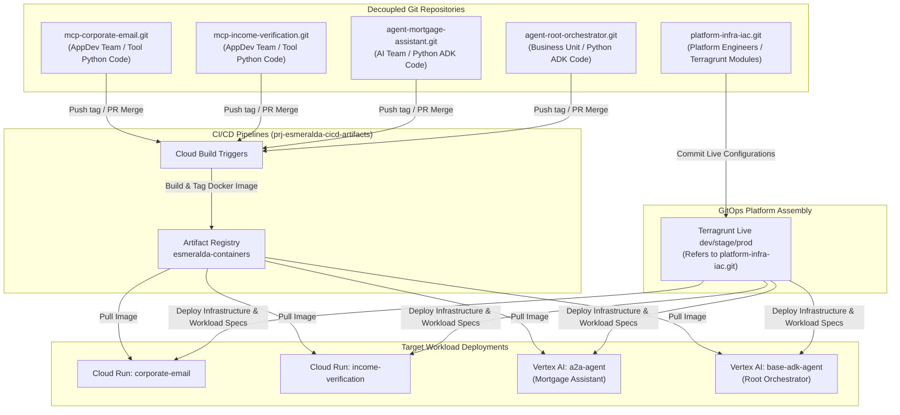
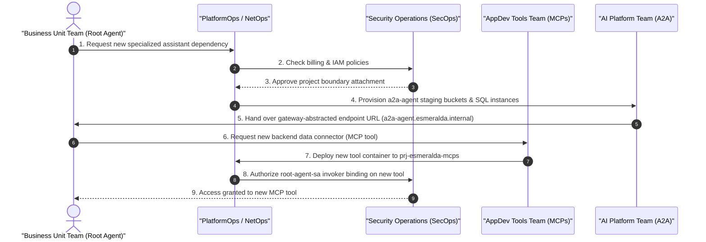

# AgentOps, Lifecycle & Platform Governance

To maintain a scalable, secure, and resilient enterprise AI agent platform, Esmeralda enforces an opinionated **AgentOps** and **Software Development Lifecycle (SDLC)** strategy. Rather than consolidating the entire system into a monolithic codebase, Esmeralda models the platform as a collection of decoupled, loosely-coupled microservices and reasoning engines. 

This guide details the repository strategy, the cross-team coordination workflows, the automated CI/CD container promotion pipeline, and the operational governance rules required to run Esmeralda at scale.

---

## The Decoupled Multi-Repository Strategy

While the Esmeralda blueprint is presented as a centralized codebase for easy distribution, running a production-grade agent platform with multiple teams inside a single monorepo introduces significant operational bottlenecks:
*   **Release Coupling**: Updating a single helper tool forces a rebuild or recalculation of downstream AI agent tests, leading to deployment delays.
*   **IAM Boundary Bleeding**: Developers building lightweight tool connectors should not have access to core project security keys, billing configurations, or Shared VPC routing modules.
*   **Audit Trail Confusion**: In strict compliance environments, changes to networking or database encryption must be segregated from changes to agent prompts or prompt engineering.

To solve this, Esmeralda mandates a **Decoupled Multi-Repository Strategy**:

### 1. Platform Infrastructure Repository (`platform-infra-iac.git`)
*   **Owners**: Platform Engineers, NetOps, and SecOps.
*   **Contents**: Standard Terragrunt modules (`modules/1-projects`, `modules/2-networking`, `modules/3-security`, and Stage 4 workload scaffolding) along with live environment orchestrators (`live/dev/`, `live/prod/`).
*   **Deployment**: Merges trigger automated Terragrunt runs, modifying projects, subnets, firewall rules, and IAM bindings.

### 2. Composable MCP Tool Repositories (e.g., `mcp-corporate-email.git`)
*   **Owners**: AppDev Tools Team.
*   **Contents**: Python or Go MCP server code, Dockerfiles, and tool test suites.
*   **Deployment**: Merges build a container image, push it to Artifact Registry in `prj-esmeralda-cicd-artifacts`, and optionally update the target image tag in the platform IaC repository.

### 3. AI Agent Reasoning Engine Repositories (e.g., `agent-mortgage-assistant.git`)
*   **Owners**: Core AI Platform Team or Business Unit Teams.
*   **Contents**: Python ADK agent scripts, `agent.yaml` specifications, prompt templates, and evaluation datasets (evalsets).
*   **Deployment**: Merges run evaluations (using LLM-as-a-judge), compile the ADK runtime environment, upload staging dependencies to GCS, and deploy the new Vertex AI Reasoning Engine ID.

---

## Cross-Team Governance & Coordination Model

Decoupling source repositories requires a clear cross-team governance model to coordinate changes. Without explicit boundaries, platform updates can break downstream agents, and agent developers might request changes that violate corporate security policy.

### Engineering Roles and Project Boundaries

To maintain separation of concerns, Esmeralda maps roles to specific projects and resources:

| Engineering Team | Primary Role / Responsibility | Owned GCP Project | Target Infrastructure Resources |
| :--- | :--- | :--- | :--- |
| **NetOps** | Network architecture, routing, egress security. | `prj-net-host` | Shared VPC, Subnets, Cloud NAT, Secure Web Proxy, Private DNS. |
| **PlatformOps** | Ingress, routing, general automation. | `prj-gateway` | API Gateways (Apigee, Kong, ILB target forwarding rules). |
| **SecOps & Governance** | Cryptographic key lifecycle, secrets, telemetry auditing. | `prj-esmeralda-governance` | Cloud KMS, Secret Manager database keys, BigQuery log datasets. |
| **Platform Engineering** | CI/CD systems, container registries. | `prj-esmeralda-cicd-artifacts` | Artifact Registry, Cloud Build triggers, shared build SAs. |
| **AppDev Tools Team** | Enterprise data connectors, backend integrations. | `prj-esmeralda-mcps` | Cloud Run MCP server tools, tool registries. |
| **Core AI Platform Team** | Shared assistant agents, database systems. | `prj-esmeralda-a2a` | Cloud SQL task store instances, downstream specialized agents. |
| **Business Unit Teams** | User-facing solutions, client reasoning engines. | `prj-esmeralda-root-agent` | Root Orchestrator agents, BU prompt templates. |

---

### Cross-Team Workflows & Coordination Sequence

When a Business Unit team requests a new feature that requires platform integration, the teams coordinate through a standard routing workflow:

1.  **Workload Request**: The Business Unit Team opens an architectural request for a new Specialized Assistant agent.
2.  **Platform & Security Check**: PlatformOps and SecOps review billing allocations and verify the security posture of the new assistant.
3.  **Infrastructure Provisioning**: PlatformOps uses Terragrunt to provision staging GCS buckets, Cloud SQL PostgreSQL databases, and IAM service accounts in `prj-esmeralda-a2a`.
4.  **Endpoint Handoff**: The AI Platform Team deploys the assistant reasoning engine and registers its dynamic Vertex AI endpoint inside the active gateway KVM or Routing Broker. They return the static route `http://a2a-agent.esmeralda.internal` to the Business Unit Team.
5.  **Tool Request**: The Business Unit Team requests access to legacy data systems via an MCP tool.
6.  **Tool Compilation & Deployment**: The AppDev Tools Team writes the tool code, builds the container in `prj-esmeralda-cicd-artifacts`, and deploys it as a private Cloud Run service in `prj-esmeralda-mcps`.
7.  **IAM Access Grant**: PlatformOps applies least-privilege invoker bindings (`roles/run.invoker`) allowing the Root Orchestrator service account to query the new tool endpoint.

---

## AgentOps CI/CD & Image Promotion Pipeline

To ensure that only tested and secure container images run in production environments, Esmeralda enforces an automated promotion pipeline using Cloud Build and Artifact Registry:

### 1. Developer Workspaces & Local Iteration
*   Developers build, test, and run containers locally or inside their development environments.
*   Once tests pass, code is committed, and a Pull Request is opened against the main branch of the service repository (e.g., `mcp-corporate-email.git`).

### 2. CI Validation & Security Scanning
*   Cloud Build triggers on PR creation:
    *   Runs Python linting and unit tests.
    *   Executes a container build.
    *   Scans container images for vulnerabilities (using Google Container Analysis).
    *   *(For agents)* Runs evaluation pipelines against standard evalsets, outputting trajectory scores.

### 3. CD Merges & Registry Push
*   Once approved and merged, Cloud Build compiles the final production container image.
*   The image is pushed to the central Artifact Registry repository `esmeralda-containers` located in `prj-esmeralda-cicd-artifacts`, tagged with the git commit SHA.

### 4. GitOps Terragrunt Deployment
*   The deployment pipeline updates the `var.agent_image_uri` (or `var.container_image`) parameter in the live environment file (`terragrunt.hcl`) inside `platform-infra-iac.git`.
*   Terragrunt runs:
    *   Resolves the container image using its SHA256 digest (preventing container drift).
    *   Executes database schema migrations via a private Cloud Run job.
    *   Updates the Cloud Run service or Vertex AI Reasoning Engine runtime configuration.

---

## Operational Observability & Telemetry Governance

Centralized governance requires collecting telemetry from all workloads without exposing data to unauthorized users. Esmeralda implements this using a hub-and-spoke telemetry model:

### Spoke Sinks (Log and Trace Generation)
*   **MCP Tool Servers**: Cloud Run containers stream stdout and stderr logs natively. They run OpenTelemetry exporters directing tracing data to the local telemetry agent.
*   **AI Agent Reasoning Engines**: Vertex AI Reasoning Engines stream trace spans, token counts, execution trajectories, and system metrics using the ADK framework.

### Hub Dataset (Centralized Audit Platform)
*   Stage 3 deploys project-level log sinks (`google_logging_project_sink`) across all 7 projects.
*   These sinks route agentic executions and container telemetries into the central BigQuery dataset `esmeralda_telemetry_logs_{environment}` inside `prj-esmeralda-governance`.
*   Because logs are centralized in the governance project:
    *   BU developers can analyze agent trajectories without accessing underlying database systems.
    *   Security auditors can track token spend, prompt performance, and API calls across the entire enterprise.
    *   All telemetry logs are automatically expired after 30 days, complying with corporate retention policies.
