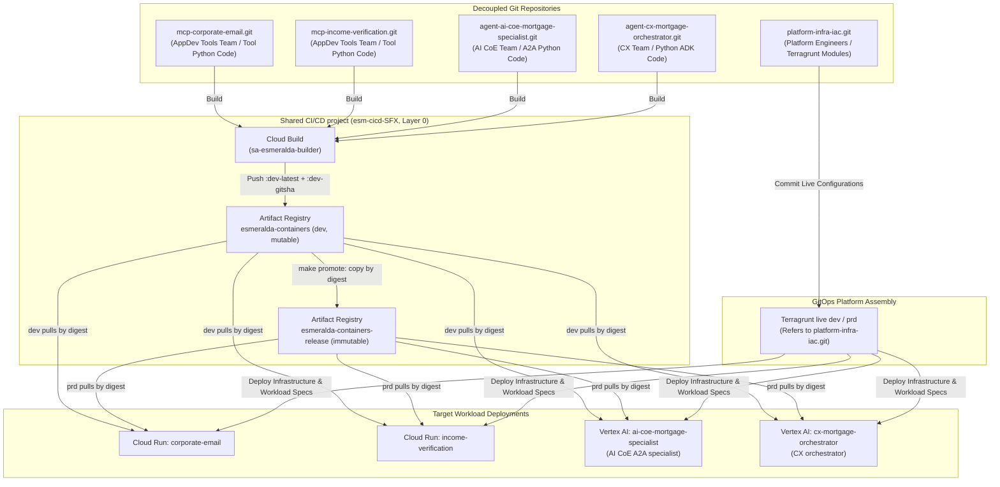
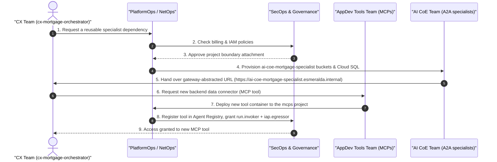

# 📊 AgentOps, Lifecycle & Platform Governance

**AgentOps** is the operational discipline for AI agents: how they are built, released, secured, observed and paid for once several teams run them in production. It extends the classic **Software Development Lifecycle (SDLC)** with agent-specific concerns such as egress control, token cost attribution and prompt-safety screening. Esmeralda enforces an opinionated AgentOps and SDLC strategy so that the platform stays scalable, secure and resilient as more teams onboard.

### 📚 Guides in this section

| Guide | What it covers |
| :--- | :--- |
| 🛡️ **[01. Central Agent Gateway: How It Works and How to Deploy It](./01-central-agent-gateway.md)** | The featured deep-dive. How Agent Gateway intercepts, inspects and authorizes agent traffic; every component (Agent Registry, IAP authz, ACT, TrustConfig, PSC attachment); why the gateway needs our self-signed internal Root CA; how BYOC agents get the gateway's trust bundle at deploy time. |
| 📈 **[03. Centralized Governance, Observability & FinOps](./03-centralized-monitoring-and-dashboards.md)** | Layer 4 telemetry: log sinks, the BigQuery dataset and views, Cloud Monitoring dashboards, alert policies, SLOs and the DLP template. |

---

## 👥 Who Owns What: CX Team vs AI CoE Team

Esmeralda separates agent work between two application teams, each with its **own GCP project** (and therefore its own Agent Identity `principalSet`):

| Team | Builds | Example | Project |
| :--- | :--- | :--- | :--- |
| **CX team** | User-facing **orchestrator** agents (ADK). They own the conversation and *consume* reusable agents. | `cx-mortgage-orchestrator` | `esm-<env>-cx-agents-<sfx>` (label `team=cx`) |
| **AI CoE team** | Reusable **A2A specialist** agents that any orchestrator can call over the A2A protocol. | `ai-coe-mortgage-specialist` | `esm-<env>-ai-coe-agents-<sfx>` (label `team=ai-coe`) |

The orchestrator never calls the specialist directly: it calls `https://ai-coe-mortgage-specialist.esmeralda.internal`, and the request flows through the **Central Agent Gateway** and **Kong** (see [01. Central Agent Gateway §4.2](./01-central-agent-gateway.md#-4-life-of-a-request)). This lets the AI CoE team redeploy or scale its specialist without any change on the CX side.

---

## 🏛️ Architecture Decision Records (ADRs): The "Why" Behind Governance

### 1. ADR-07: Why Central Agent Gateway (AGENT_TO_ANYWHERE) + SPIFFE Identity Over Direct Public NAT Egress?
* **The Problem:** Allowing AI agents to directly access external Foundation Models or public endpoints via standard Cloud NAT creates critical enterprise vulnerabilities:
  * **Prompt Injection & Data Exfiltration:** Malicious user inputs can hijack agent execution and exfiltrate customer databases to untrusted third-party servers.
  * **PII Leaks:** Unsanitized prompts containing Social Security Numbers, credit cards, or passwords leak into external model providers.
  * **Uncontrolled Token Spend:** Finance teams have zero centralized visibility into per-request token consumption or rogue runaway agent loops.
* **The Decision:** Deploy the **Central Agent Gateway** (a Google-managed egress proxy) in the governance project `esm-<env>-governance-<sfx>`, authorize every agent by its **SPIFFE Agent Identity** through **IAP**, and keep **Model Armor** templates ready for inline payload inspection.
* **The Benefit:**
  1. **Zero-Trust Workload Authorization:** Every Reasoning Engine runs with its own Agent Identity. The gateway is deny-by-default: it only forwards a request if the destination is registered in Agent Registry **and** IAP confirms the identity holds `roles/iap.egressor` on that entry.
  2. **Content Sanitization (ready to enable):** Model Armor templates (PII, prompt injection, jailbreak, malicious URLs) are deployed in Layer 4. The gateway's `CONTENT_AUTHZ` hook that sends decrypted payloads to Model Armor is written but **disabled** today; enabling it is a one-line change (see [01. Central Agent Gateway §3.5](./01-central-agent-gateway.md#35-model-armor-optional-content_authz)).
  3. **Granular FinOps:** Agents emit structured per-request token events (`genai_token_consumption`) to stdout. Central log sinks stream them into BigQuery, where views such as `vw_monthly_agent_chargeback` attribute cost per agent, and alert policies catch runaway loops (see [03. Centralized Governance, Observability & FinOps](./03-centralized-monitoring-and-dashboards.md)).

---

### 2. ADR-08: Why Decoupled Multi-Repository SDLC for Enterprise Production?
* **The Problem:** Monolithic codebases with multiple collaborating teams create severe operational friction:
  * **Release Coupling:** Updating a minor corporate email tool forces a recalculation and test cycle of all downstream reasoning engines.
  * **IAM Privilege Bleeding:** Tool developers should not have permission to modify platform KMS keys or Shared VPC subnets.
* **The Decision:** Structure production development across **three decoupled repository classes** (Platform IaC, MCP Tool Microservices, and AI Reasoning Engines) bound via **Artifact Registry immutable SHA256 image digests**.

---

## The Decoupled Multi-Repository Strategy

While the Esmeralda blueprint is presented as a centralized codebase for easy distribution, running a production-grade agent platform with multiple teams inside a single monorepo introduces operational bottlenecks. Esmeralda recommends a **Decoupled Multi-Repository Strategy** for production:


```mermaid
flowchart TD
    subgraph Repos["Decoupled Git Repositories"]
        R_Platform["platform-infra-iac.git<br/>(Platform Engineers / Terragrunt Modules)"]
        R_Email["mcp-corporate-email.git<br/>(AppDev Tools Team / Tool Python Code)"]
        R_Income["mcp-income-verification.git<br/>(AppDev Tools Team / Tool Python Code)"]
        R_A2A["agent-ai-coe-mortgage-specialist.git<br/>(AI CoE Team / A2A Python Code)"]
        R_Root["agent-cx-mortgage-orchestrator.git<br/>(CX Team / Python ADK Code)"]
    end

    subgraph Pipelines["Shared CI/CD project (esm-cicd-SFX, Layer 0)"]
        CB["Cloud Build<br/>(sa-esmeralda-builder)"]
        AR_DEV["Artifact Registry<br/>esmeralda-containers (dev, mutable)"]
        AR_REL["Artifact Registry<br/>esmeralda-containers-release (immutable)"]
    end

    subgraph RunOps["Target Workload Deployments"]
        Run_Email["Cloud Run: corporate-email"]
        Run_Income["Cloud Run: income-verification"]
        Run_A2A["Vertex AI: ai-coe-mortgage-specialist<br/>(AI CoE A2A specialist)"]
        Run_Root["Vertex AI: cx-mortgage-orchestrator<br/>(CX orchestrator)"]
    end

    subgraph IaCOps["GitOps Platform Assembly"]
        TG["Terragrunt live dev / prd<br/>(Refers to platform-infra-iac.git)"]
    end

    R_Email & R_Income & R_A2A & R_Root -->|Build| CB
    CB -->|Push :dev-latest + :dev-gitsha| AR_DEV
    AR_DEV -->|make promote: copy by digest| AR_REL
    AR_DEV -->|dev pulls by digest| Run_Email & Run_Income & Run_A2A & Run_Root
    AR_REL -->|prd pulls by digest| Run_Email & Run_Income & Run_A2A & Run_Root
    R_Platform -->|Commit Live Configurations| TG
    TG -->|Deploy Infrastructure & Workload Specs| Run_Email & Run_Income & Run_A2A & Run_Root
```

### Directory-to-Repository Migration Map

When migrating from this monorepo developer blueprint to a production-ready decoupled multi-repository architecture, map files and folders as follows:

| Blueprint Folder (Monorepo) | Target Production Git Repository | Deployment Endpoint |
| :--- | :--- | :--- |
| `infrastructure/modules/0-cicd/`<br/>`infrastructure/modules/1-projects/`<br/>`infrastructure/modules/2-networking/`<br/>`infrastructure/modules/3-security/`<br/>`infrastructure/modules/4-governance/`<br/>`infrastructure/modules/5-workloads/`<br/>`infrastructure/live/` | **`platform-infra-iac.git`** | GCP Projects, VPCs, KMS Keys, IAM Policies, and Terragrunt orchestrations |
| `apps/services/kong/` | **`platform-infra-iac.git`** (or a dedicated `gateway-kong.git`) | Cloud Run Service: `kong-gateway-{env}` in `esm-<env>-gateway-<sfx>` |
| `apps/services/corporate-email/` | **`mcp-corporate-email.git`** | Cloud Run Service: `corporate-email-{env}` in `esm-<env>-mcps-<sfx>` |
| `apps/services/income-verification/` | **`mcp-income-verification.git`** | Cloud Run Service: `income-verification-{env}` in `esm-<env>-mcps-<sfx>` |
| `apps/services/legacy-dms/` | **`mcp-legacy-dms.git`** | Cloud Run Service: `legacy-dms-{env}` in `esm-<env>-mcps-<sfx>` |
| `apps/agents/ai-coe-mortgage-specialist/` | **`agent-ai-coe-mortgage-specialist.git`** | Vertex AI Reasoning Engine in `esm-<env>-ai-coe-agents-<sfx>` |
| `apps/agents/cx-mortgage-orchestrator/` | **`agent-cx-mortgage-orchestrator.git`** | Vertex AI Reasoning Engine in `esm-<env>-cx-agents-<sfx>` |

---

### The Parameter Linkage Pattern

Decoupling repositories requires a clear mechanism to link them. Rather than allowing application repos to directly execute Terraform, the platform infrastructure repository (`platform-infra-iac.git`) acts as the central binder. Each environment declares **which image tag to run** in one place, `infrastructure/live/<env>/env.yaml`:

```hcl
# infrastructure/live/<env>/env.yaml (HCL locals, read by Terragrunt)
image_repository = "dev"         # dev → esmeralda-containers; prd uses "release" → esmeralda-containers-release
container_tag    = "dev-latest"  # prd: "vX.Y.Z", rewritten by `make promote`
```

Terragrunt then builds every image URI from the Layer 0 repository outputs plus that tag:

#### 1. Tool Container Image (`live/<env>/layer-5-workloads/services/corporate-email/terragrunt.hcl`)
```hcl
inputs = {
  container_image = "${<dev or release repository_url from layer-0-cicd>}/corporate-email:${local.env_vars.locals.container_tag}"
  invoker_service_accounts = [
    dependency.security.outputs.cx_mortgage_orchestrator_sa_email,
    dependency.security.outputs.test_vm_sa_email,
    dependency.security.outputs.kong_sa_email
  ]
}
```

#### 2. Agent Container Digest Pinning (`live/<env>/layer-5-workloads/agents/ai-coe-mortgage-specialist/terragrunt.hcl`)
To prevent container drift and guarantee that the Vertex AI Reasoning Engine runs exactly the code validated by the owning team, the agent modules resolve the tag to its **immutable digest** at apply time (`data.google_artifact_registry_docker_image`) and deploy `image@sha256:...`:
```hcl
inputs = {
  agent_image_uri       = "${<dev or release repository_url>}/ai-coe-mortgage-specialist:${local.env_vars.locals.container_tag}"
  agent_service_account = dependency.security.outputs.ai_coe_mortgage_specialist_sa_email
}
```

---

## Cross-Team Governance & Coordination Model

Decoupling source repositories requires a clear cross-team governance model to coordinate changes. Without explicit boundaries, platform updates can break downstream agents, and agent developers might request changes that violate corporate security policy.

### Engineering Roles and Project Boundaries

To maintain separation of concerns, Esmeralda maps roles to specific projects and resources (the `team` column matches the project's `team` label):

| Engineering Team (`team` label) | Primary Role / Responsibility | Owned GCP Project | Target Infrastructure Resources |
| :--- | :--- | :--- | :--- |
| **NetOps** (`netops`) | Network architecture, routing, egress security. | `esm-<env>-net-host-<sfx>` | Shared VPC, Subnets, Cloud NAT, Private DNS (`esmeralda.internal.`), optional Secure Web Proxy (disabled in dev/prd). |
| **PlatformOps** (`platformops`) | Ingress, routing, general automation. | `esm-<env>-gateway-<sfx>` | Kong on Cloud Run + internal HTTPS LB (Apigee optional via `gateway_product`). |
| **SecOps & Governance** (`security-and-platformops`) | Agent egress control, key lifecycle, secrets, telemetry auditing. | `esm-<env>-governance-<sfx>` | Agent Gateway, Agent Registry, Model Armor, Cloud KMS, Secret Manager, BigQuery telemetry dataset, dashboards and alerts. |
| **Platform Engineering** | CI/CD systems, container registries. | `esm-cicd-<sfx>` (shared, Layer 0) | Artifact Registry (`esmeralda-containers`, `esmeralda-containers-release`), Cloud Build, `sa-esmeralda-builder`, `sa-esmeralda-promoter`. |
| **AppDev Tools Team** (`appdev-tools`) | Enterprise data connectors, backend integrations. | `esm-<env>-mcps-<sfx>` | Cloud Run MCP tool servers and their Agent Registry entries. |
| **AI CoE Team** (`ai-coe`) | Reusable A2A specialist agents and their data stores. | `esm-<env>-ai-coe-agents-<sfx>` | `ai-coe-mortgage-specialist` Reasoning Engine, Cloud SQL, buckets, BigQuery dataset, Agent Registry agent card. |
| **CX Team** (`cx`) | User-facing orchestrator agents. | `esm-<env>-cx-agents-<sfx>` | `cx-mortgage-orchestrator` Reasoning Engine and its prompts. |

---

### Cross-Team Workflows & Coordination Sequence

When the CX team needs a new capability that requires platform integration, the teams coordinate through a standard routing workflow:


```mermaid
sequenceDiagram
    autonumber
    actor CX as "CX Team (cx-mortgage-orchestrator)"
    participant PlatformOps as "PlatformOps / NetOps"
    participant SecOps as "SecOps & Governance"
    participant AppDev as "AppDev Tools Team (MCPs)"
    participant AICoE as "AI CoE Team (A2A specialists)"

    CX->>PlatformOps: 1. Request a reusable specialist dependency
    PlatformOps->>SecOps: 2. Check billing & IAM policies
    SecOps-->>PlatformOps: 3. Approve project boundary attachment
    PlatformOps->>AICoE: 4. Provision ai-coe-mortgage-specialist buckets & Cloud SQL
    AICoE->>CX: 5. Hand over gateway-abstracted URL (https://ai-coe-mortgage-specialist.esmeralda.internal)
    CX->>AppDev: 6. Request new backend data connector (MCP tool)
    AppDev->>PlatformOps: 7. Deploy new tool container to the mcps project
    PlatformOps->>SecOps: 8. Register tool in Agent Registry, grant run.invoker + iap.egressor
    SecOps-->>CX: 9. Access granted to new MCP tool
```

1.  **Workload Request**: The CX team opens an architectural request for a new reusable specialist agent.
2.  **Platform & Security Check**: PlatformOps and SecOps review billing allocations and verify the security posture of the new specialist.
3.  **Infrastructure Provisioning**: PlatformOps uses Terragrunt to provision GCS buckets, the Cloud SQL PostgreSQL database (schema bootstrapped by a private Cloud Run job) and service accounts in `esm-<env>-ai-coe-agents-<sfx>`.
4.  **Endpoint Handoff**: The AI CoE team deploys the specialist Reasoning Engine, which registers its **agent card** in the governance Agent Registry. PlatformOps re-applies Kong (`make deploy-gateway`) so the `ai-coe-mortgage-specialist.esmeralda.internal` Host route points at the new engine ID. The CX team receives only the stable URL `https://ai-coe-mortgage-specialist.esmeralda.internal` (set as `A2A_AGENT_URL` on the orchestrator).
5.  **Tool Request**: The CX team requests access to legacy data systems via an MCP tool.
6.  **Tool Compilation & Deployment**: The AppDev Tools team writes the tool code, builds the container in `esm-cicd-<sfx>` and deploys it as a private Cloud Run service (internal-LB ingress) in `esm-<env>-mcps-<sfx>`, registered in Agent Registry as `https://<svc>.esmeralda.internal/mcp`.
7.  **IAM Access Grant**: PlatformOps applies least-privilege `roles/run.invoker` bindings on the tool and re-runs the `services/iap-egress` stack (`make deploy-iap-egress`) so the agents' identities hold `roles/iap.egressor` on the new registry entry.

---

## AgentOps CI/CD & Image Promotion Pipeline

To ensure that only tested container images run in production, Esmeralda builds images **once**, in an environment-neutral form, and promotes the exact same bytes from dev to prd by digest. Images contain no environment-specific configuration or certificates; those are injected at deploy time (see [01. Central Agent Gateway §6](./01-central-agent-gateway.md#-6-bring-your-own-container-byoc)).

### 1. Developer Workspaces & Local Iteration
*   Developers run unit tests and local servers with `make test-agents`, `make test-terraform`, `make run-mcp-local` and the `make test-*-local` targets.
*   Once tests pass, code is committed and a Pull Request is opened against the main branch of the service repository (e.g., `mcp-corporate-email.git`). Example Cloud Build configs for PR checks live in [`.cloudbuild/`](../../.cloudbuild/) (`pr_checks.yaml`: unit + integration tests).

### 2. Build & Registry Push (dev)
*   `make build-*` (e.g. `make build-cx-mortgage-orchestrator`, `make build-images`) submits a Cloud Build job in the shared CI/CD project `esm-cicd-<sfx>`, running as `sa-esmeralda-builder`.
*   The image is pushed to the **mutable dev repository** `esmeralda-containers` with two tags: `:dev-latest` and `:dev-<gitsha>`.

### 3. Deploy to dev
*   `make deploy-workloads ENV=dev` (or the per-component `make deploy-*` targets) applies Layer 5. Agent modules resolve the tag to its SHA256 digest, so the Reasoning Engine always runs a pinned image.
*   The AI CoE specialist module also runs its database schema bootstrap as a private Cloud Run job.
*   Verify with `make test-e2e ENV=dev`.

### 4. Promote to release (prd)
*   `make promote TAG=vX.Y.Z` (or `make promote-patch` / `make promote-minor`) runs [`scripts/promote_release.sh`](../../scripts/promote_release.sh): it copies the dev images **by digest** into the **immutable release repository** `esmeralda-containers-release` (writable by `sa-esmeralda-promoter`) and rewrites `container_tag` in `infrastructure/live/prd/env.yaml`. It does not deploy.
*   `make status-release` shows what is in the release repository.
*   prd pulls **only** from the release repository; deploy it with `make deploy-workloads ENV=prd`.

---

## Operational Observability & Telemetry Governance

Centralized governance requires collecting telemetry from all workloads without exposing data to unauthorized users. Esmeralda implements this using a hub-and-spoke telemetry model (full detail in [03. Centralized Governance, Observability & FinOps](./03-centralized-monitoring-and-dashboards.md)):

### Spoke Sources (Log and Metric Generation)
*   **MCP Tool Servers**: Cloud Run containers write stdout/stderr and request logs natively, and export OpenTelemetry metrics to the Cloud Telemetry API (`telemetry.googleapis.com`).
*   **AI Agent Reasoning Engines**: both agents print structured JSON events (`genai_token_consumption`, `mcp_tool_execution`) with token counts, execution path and session context to stdout, alongside the platform's own Reasoning Engine logs.
*   **Agent Gateway**: request logs (`logName:"gateway_requests"`: host, status, allow/deny decision) land in the governance project.

### Hub Dataset (Centralized Audit Platform)
*   Layer 4 deploys a project-level log sink (`google_logging_project_sink`) in each of the five workload projects: net-host, gateway, mcps, ai-coe-agents and cx-agents.
*   These sinks route Reasoning Engine logs, Cloud Run logs and Cloud Audit logs into the central BigQuery dataset `esmeralda_telemetry_logs_<env>` inside `esm-<env>-governance-<sfx>`. Spoke projects are also added to the governance project's Cloud Monitoring metrics scope.
*   Because logs are centralized in the governance project:
    *   CX and AI CoE developers can analyze agent trajectories without accessing underlying database systems.
    *   Security auditors can track token spend, prompt performance, and API calls across the entire enterprise.
