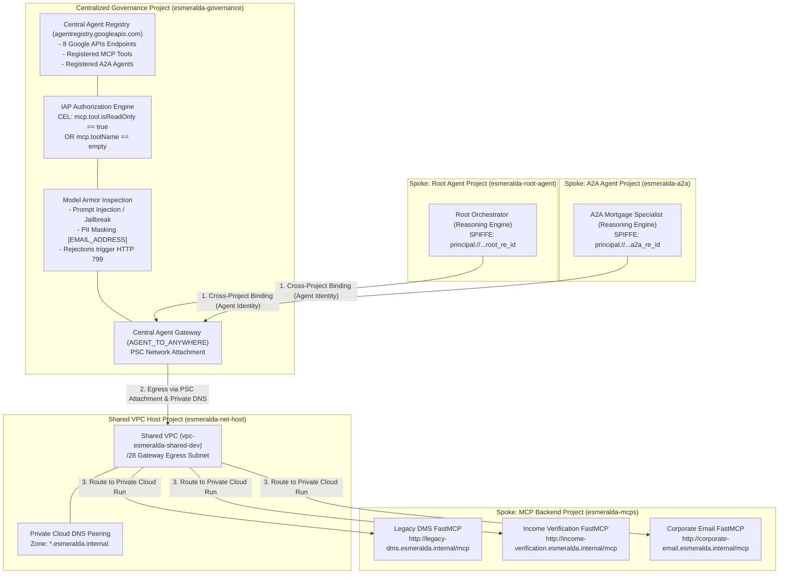

# Centralized Agent Gateway & Agent Registry Integration Plan (August 2026 Release)

This document provides an exhaustive architectural analysis and step-by-step implementation plan for integrating Google Cloud's **Centralized Agent Gateway** (`AGENT_TO_ANYWHERE`), **Agent Registry** (`agentregistry.googleapis.com`), **SPIFFE Agent Identity** (`principal://...`), **IAP CEL Authorization Policies**, and **Model Armor Guardrails** into the **Esmeralda** multi-project enterprise agent architecture.

This plan incorporates every specification, constraint, and gotcha from Google Cloud's official August 7, 2026 architectural paradigm (*Cross Project Agent Runtime & Agent Gateway* by James Duncan, following the **August 4, 2026 GA rollout** of cross-project bindings; internal tracking references `b/535999861`, `b/536001237`).

---

## 1. Executive Summary & Paradigm Shift

In our prior implementation attempts (Phases 3 and 4), Esmeralda attempted to deploy independent Agent Registry and Agent Gateway instances inside each individual agent spoke project (`prj-esmeralda-root-agent` and `prj-esmeralda-a2a`). That approach suffered from three critical flaws:
1. **Redundant Network Attachments**: Each spoke required its own Private Service Connect (PSC) Network Attachment to the Shared VPC.
2. **Fragmented Tool Catalog**: MCP servers had to be discovered and registered redundantly across multiple spoke projects.
3. **Lack of Central SecOps Control**: Guardrails, PII masking, and egress authorization could not be audited or enforced from a single governance perimeter.

### The August 2026 Centralized Architecture
Google Cloud's new cross-project binding support allows **all Agent Runtime spoke projects** to bind to a **single, central Agent Gateway (`AGENT_TO_ANYWHERE`) and Agent Registry** hosted inside a dedicated **Centralized Governance Project** (`prj-esmeralda-governance`).



> **Roadmap Note (Resource Manager Auto-Discovery)**: In the current implementation, agents and MCP servers are manually registered into the central governance project's Agent Registry via `gcloud agent-registry services create`. In an upcoming release, Agent Registry will automatically discover and register agents and MCP servers across all projects under a specified Resource Manager folder into the designated management project.

---

## 2. Esmeralda Project Allocation & Responsibilities Table

| Project Name | GCP Project ID | Role in Centralized Architecture | Key Managed Resources |
| :--- | :--- | :--- | :--- |
| **Networking Host** | `esmeralda-net-host-3a3d` | **Underlying Network Backbone** | Shared VPC (`vpc-esmeralda-shared-dev`), `/28` Proxy/Egress Subnet, Private Cloud DNS (`esmeralda.internal.`). |
| **Central Governance** | `esmeralda-governance-3a3d` | **Central SecOps & Gateway Perimeter** | Central `Agent Registry`, `AGENT_TO_ANYWHERE` Agent Gateway, PSC Network Attachment, Model Armor templates, IAP CEL policies. |
| **Root Agent Spoke** | `esmeralda-root-agent-3a3d` | **LOB Application & Root Execution** | Vertex AI Reasoning Engine (`root-agent`), bound via `agentGatewayConfig` to `esmeralda-governance`. **No local VPC needed.** |
| **A2A Agent Spoke** | `esmeralda-a2a-3a3d` | **Specialized Mortgage Execution** | Vertex AI Reasoning Engine (`a2a-mortgage-agent`), bound via `agentGatewayConfig` to `esmeralda-governance`. **No local VPC needed.** |
| **MCP Tools Spoke** | `esmeralda-mcps-3a3d` | **Backend Business Services** | Cloud Run FastMCP servers (`legacy-dms`, `income-verification`, `corporate-email`), private Internal Load Balancer VIP (`10.0.1.3`). |

---

## 3. Detailed Architectural Specification by Tier

### Tier 1: Centralized Governance Perimeter (`esmeralda-governance-3a3d`)

#### 3.1 Shared VPC Connectivity, Network Attachment & Cloud DNS Peering
* **Subnet Sizing Requirement**: A minimum `/28` subnet inside `esmeralda-net-host-3a3d` is required for the Agent Gateway network attachment (providing 12 usable IPs for a single gateway instance).
* **Resource Ownership Model**: Use **Service/Governance Project Attachment** (Recommended):
  * Create `google_compute_network_attachment` inside `esmeralda-governance-3a3d` referencing the host subnet in `esmeralda-net-host-3a3d`.
* **Immutability Warning**: The `networkAttachment` field on `Agent Gateway` is **immutable** once configured.
* **Shared VPC IAM Matrix**:

| Principal or Identity | Target Project | Required Role | Purpose |
| :--- | :--- | :--- | :--- |
| **Provisioning Identity** (`terraform-sa`) | `esmeralda-net-host-3a3d` | `roles/compute.networkViewer`, `roles/dns.reader` | Validates host network, subnets, and private DNS zones during gateway deployment. |
| **Network Attachment Creator** (`terraform-sa`) | `esmeralda-net-host-3a3d` | `roles/compute.networkUser` | Authorizes creation of PSC network attachment referencing host subnet. |
| **Agent Gateway Service Agent** (`service-${GOV_NUM}@gcp-sa-agentgateway...`) | `esmeralda-net-host-3a3d` | `roles/compute.networkUser`, `roles/dns.peer` | Allows gateway service agent to attach to host subnet and peer with private DNS zones. |

* **DNS Peering Configuration (`dnsPeeringConfig`)**:
  * On the `AGENT_TO_ANYWHERE` gateway, configure `dnsPeeringConfig` for domain suffix `"esmeralda.internal."` targeting `esmeralda-net-host-3a3d` (`targetNetwork = "projects/${HOST_ID}/global/networks/${VPC_NAME}"`).
  * *Constraint 1*: Must specify exact domain suffixes with trailing dot (`"esmeralda.internal."`). **Never use root wildcard (`.`) or `googleapis.com.`** to prevent rerouting public Google API traffic.
  * *Constraint 2*: The network attachment subnet and targetNetwork in `dnsPeeringConfig` must reside in the **exact same VPC network** in the host project.

#### 3.2 Central Agent Registry (`agentregistry.googleapis.com`)
In Agent Registry, `mcp-servers`, `endpoints`, and `agents` are read-only projections; all write operations use `gcloud agent-registry services create`.

##### A. Required 8 Google APIs Endpoints (Tier 1 Baseline)
All agent runtimes require access to a standard set of Google Cloud APIs to discover tools, mint tokens, stream telemetry, and perform inference. Register these 8 endpoints in the central Agent Registry:
1. `https://agentregistry.googleapis.com` (Tool and service discovery)
2. `https://aiplatform.mtls.googleapis.com` (Vertex AI mTLS endpoint)
3. `https://cloudresourcemanager.mtls.googleapis.com` (Project number and resource resolution)
4. `https://iamcredentials.mtls.googleapis.com` (Credential and token generation)
5. `https://telemetry.mtls.googleapis.com` (Metrics and trace export)
6. `https://us-central1-aiplatform.mtls.googleapis.com` (Regional Vertex AI mTLS)
7. `https://us-central1-aiplatform.googleapis.com` (Regional Vertex AI standard endpoint)
8. `https://aiplatform.us-central1.rep.googleapis.com` (Regional Endpoint Protocol)

##### B. Cross-Project MCP Server Registration (Tier 2 Tools)
When registering Cloud Run MCP servers (`legacy-dms`, `income-verification`, `corporate-email`):
* **CRITICAL REQUIREMENT**: The `--interfaces url` parameter **must include the full `/mcp` endpoint path** (e.g. `http://legacy-dms.esmeralda.internal/mcp`), not just the service root!

```bash
gcloud agent-registry services create legacy-dms-mcp \
    --project="esmeralda-governance-3a3d" \
    --location="us-central1" \
    --display-name="Legacy DMS Document Search & Retrieval" \
    --mcp-server-spec-type=tool-spec \
    --mcp-server-spec-content="$(cat toolspec_dms.json)" \
    --interfaces="protocolBinding=JSONRPC,url=http://legacy-dms.esmeralda.internal/mcp"
```

##### C. Cross-Project Agent-to-Agent (A2A) Registration (Tier 2 Peers)
When registering an A2A agent (`a2a-mortgage-agent`) so the Root Agent can discover and call it:
* If calling the standard Vertex AI REST query endpoint:
  `url=https://us-central1-aiplatform.googleapis.com/v1beta1/projects/${A2A_PROJECT_NUMBER}/locations/us-central1/reasoningEngines/${ENGINE_ID}:query`
* If calling our private internal A2A extension endpoint over ILB/VPC:
  `url=http://a2a-mortgage-agent.esmeralda.internal`

```bash
gcloud agent-registry services create a2a-mortgage-agent-service \
    --project="esmeralda-governance-3a3d" \
    --location="us-central1" \
    --display-name="A2A Mortgage Underwriting Specialist" \
    --agent-spec-type=a2a-agent-card \
    --agent-spec-content="$(cat agentcard_a2a.json)" \
    --interfaces="protocolBinding=JSON_HTTP,url=http://a2a-mortgage-agent.esmeralda.internal"
```

#### 3.3 Two-Tier IAP Authorization & CEL Guardrails
IAP evaluates the SPIFFE identity of the calling agent against server-generated registry resource IDs (`agentregistry-00000000-...`).

> **CRITICAL SPIFFE GOTCHA**: In individual agent principal URIs (`principal://...`), you **MUST use the numeric `PROJECT_NUMBER`** (`projects/9876543210`), never the string `PROJECT_ID`. Using `PROJECT_ID` will fail IAM evaluation.

##### Scoping & Identity Decision Matrix Table
| Target Resource | Scope | Principal Identifier Type | Recommended Role | CEL Condition |
| :--- | :--- | :--- | :--- | :--- |
| **Google APIs Endpoint** | Project or Org | `principalSet://` | `roles/iap.egressor` on Google APIs endpoint | *None* |
| **Internal MCP Server (Read-only)** | Per-Agent | `principal://` (Reasoning Engine ID) | `roles/iap.egressor` on MCP server resource | `mcp.tool.isReadOnly == true \|\| mcp.toolName == ''` |
| **Internal MCP Server (Read/Write)** | Per-Agent | `principal://` (Reasoning Engine ID) | `roles/iap.egressor` on MCP server resource | *None (or explicit `mcp.toolName` allowlist)* |
| **Agent-to-Agent (A2A)** | Per-Agent | `principal://` (Calling Engine ID) | `roles/iap.egressor` on target Agent Registry service | *Optional method filter* |

##### Step-by-Step IAP Authorization for MCP Tools (`--resource-type=agent-registry --mcp-server`)
1. Fetch the server-generated resource ID:
```bash
REGISTRY_RESOURCE=$(gcloud agent-registry services describe legacy-dms-mcp \
    --project="esmeralda-governance-3a3d" \
    --location="us-central1" \
    --format='value(registryResource)')
RESOURCE_ID=$(basename "$REGISTRY_RESOURCE")
```
2. Grant `roles/iap.egressor` on that specific MCP server with mandatory CEL condition:
```bash
CALLING_PRINCIPAL="principal://agents.global.org-${ORG_ID}.system.id.goog/resources/aiplatform/projects/${A2A_PROJECT_NUMBER}/locations/us-central1/reasoningEngines/${A2A_ENGINE_ID}"

gcloud iap web add-iam-policy-binding \
    --project="esmeralda-governance-3a3d" \
    --region="us-central1" \
    --resource-type=agent-registry \
    --mcp-server="${RESOURCE_ID}" \
    --member="${CALLING_PRINCIPAL}" \
    --role="roles/iap.egressor" \
    --condition="expression=api.getAttribute('iap.googleapis.com/mcp.tool.isReadOnly', false) == true || api.getAttribute('iap.googleapis.com/mcp.toolName', '') == '',title=ReadOnlyOrList"
```
*Why `mcp.toolName == ''` is required*: Initial session discovery (`tools/list` JSON-RPC calls) carries no specific `toolName` attribute. Omitting `mcp.toolName == ''` blocks `tools/list` handshake!

##### Step-by-Step IAP Authorization for A2A Peer Agents (`--resource-type=agent-registry --agent`)
Notice `--agent="${RESOURCE_ID}"` instead of `--mcp-server`:
```bash
gcloud iap web add-iam-policy-binding \
    --project="esmeralda-governance-3a3d" \
    --region="us-central1" \
    --resource-type=agent-registry \
    --agent="${A2A_RESOURCE_ID}" \
    --member="principal://agents.global.org-${ORG_ID}.system.id.goog/resources/aiplatform/projects/${ROOT_PROJECT_NUMBER}/locations/us-central1/reasoningEngines/${ROOT_ENGINE_ID}" \
    --role="roles/iap.egressor"
```

#### 3.4 Central Model Armor Inspection & HTTP 799 Rejections
* Configure `google_model_armor_template` in `esmeralda-governance-3a3d`:
  * **Prompt Injection & Jailbreak**: `filter_enforcement = "BLOCK"`, `confidence_level = "LOW_AND_ABOVE"`.
  * **Sensitive Data Protection (DLP)**: Masking PII (`[EMAIL_ADDRESS]`, `[SSN]`, `[CREDIT_CARD_NUMBER]`) on responses returned from MCP servers back to agents.
  * **Violation Behavior**: Model Armor inspection rejections trigger an immediate **HTTP 799 status code** back to the calling agent.

---

### Tier 2: Agent Runtime Spoke Projects (`esmeralda-root-agent` & `esmeralda-a2a`)

#### 4.1 Cross-Project IAM Binding
Grant the runtime project's Vertex AI Service Agent (`service-${AE_PROJECT_NUMBER}@gcp-sa-aiplatform.iam.gserviceaccount.com`) access to the central Agent Gateway in `esmeralda-governance-3a3d`:

```bash
# Create Custom Least-Privilege Role in Central Governance Project
gcloud iam roles create ae_agw_cross_project_sa \
  --project="esmeralda-governance-3a3d" \
  --title="AE AGW Cross Project SA" \
  --description="Custom role for cross-project service agent to access Agent Gateways and Operations" \
  --permissions="networkservices.agentGateways.get,networkservices.operations.get" \
  --stage="GA"

# Bind Custom Role to Spoke Project's Vertex AI Service Agent
gcloud projects add-iam-policy-binding "esmeralda-governance-3a3d" \
  --member="serviceAccount:service-${AE_PROJECT_NUMBER}@gcp-sa-aiplatform.iam.gserviceaccount.com" \
  --role="projects/esmeralda-governance-3a3d/roles/ae_agw_cross_project_sa"
```

#### 4.2 Reasoning Engine Deployment Configuration (`agent_gateway_config`)
When deploying or upgrading `ReasoningEngine` instances via Python SDK:

```python
remote_agent = client.agent_engines.create(
    agent=local_agent,
    config={
        "agent_gateway_config": {
            "agent_to_anywhere_config": {
                "agent_gateway": (
                    "projects/esmeralda-governance-3a3d/locations/us-central1/"
                    "agentGateways/esmeralda-central-gateway-dev"
                )
            },
        },
        "identity_type": types.IdentityType.AGENT_IDENTITY,
        "env_vars": {
            # Disable legacy CAA token sharing opt-out so agent identity tokens work with GCP APIs
            "GOOGLE_API_PREVENT_AGENT_TOKEN_SHARING_FOR_GCP_SERVICES": False,
        },
    },
)
```

#### 4.3 BYOC Custom Container Trust & CA Patching (Lessons from Phase 4)
Because Esmeralda uses custom Bring Your Own Container (BYOC) images for A2A (`a2a-agent@sha256:...`), we must ensure the custom container trusts the Agent Gateway proxy CA:
1. **CA Certificate Injection**: In the Dockerfile or startup script, ensure `/etc/ssl/certs/ca-certificates.crt` includes the GCP Agent Gateway proxy root CA (or inherit from the Google-provided base Agent Engine runtime image).
2. **HTTP Client Proxy Awareness**: Ensure Python HTTP clients (`httpx`, `aiohttp`, `requests`) respect the proxy environment variables injected by Agent Gateway (`http_proxy`, `https_proxy`, `SSL_CERT_FILE`).

---

## 5. Esmeralda Implementation Roadmap & Migration Plan

### Step 1: Central Governance Terraform Module (`infrastructure/modules/5-governance/agent-gateway/`)
* Create a dedicated Terraform module in `esmeralda-governance-3a3d` provisioning:
  1. `google_compute_network_attachment` (PSC attachment to `/28` subnet in `esmeralda-net-host`).
  2. `google_network_services_agent_gateway` (`AGENT_TO_ANYWHERE` with `dnsPeeringConfig`).
  3. `google_model_armor_template` (Guardrails & DLP PII masking).
  4. Custom IAM Role `ae_agw_cross_project_sa` & bindings for `root-agent` and `a2a-agent` Vertex AI service agents.

### Step 2: Automated Registry Catalog Registration Script (`scripts/register_central_catalog.sh`)
* Create a script to idempotently register all 8 Google APIs, MCP servers, and A2A agents into `esmeralda-governance-3a3d`.
* Automatically query the generated `registryResource` IDs and attach `roles/iap.egressor` bindings with the CEL read-only condition (`mcp.tool.isReadOnly == true || mcp.toolName == ''`) for `a2a-mortgage-agent`.

### Step 3: Update Reasoning Engine Modules & Remove Spoke VPCs
* Update `infrastructure/modules/4-workloads/agents/a2a-agent/main.tf` and `base-adk-agent/main.tf`:
  * Remove local PSC network attachments in the spoke projects.
  * Add `agent_gateway_config` pointing to `esmeralda-governance-3a3d`'s central `AGENT_TO_ANYWHERE` gateway.
  * Ensure `identity_type = "AGENT_IDENTITY"`.

### Step 4: End-to-End Verification via `test_through_gateway.sh`
* Run our newly created `apps/agents/a2a-agent/scripts/test_through_gateway.sh` to verify:
  1. OIDC token minting under Agent Identity (`principal://...`).
  2. Routing through `AGENT_TO_ANYWHERE` in `esmeralda-governance-3a3d`.
  3. IAP CEL policy evaluation (`mcp.toolName == ''` or `mcp.tool.isReadOnly == true`).
  4. Model Armor PII masking verification on returned tax return documents (and verifying `HTTP 799` rejection on malicious injection prompts).
