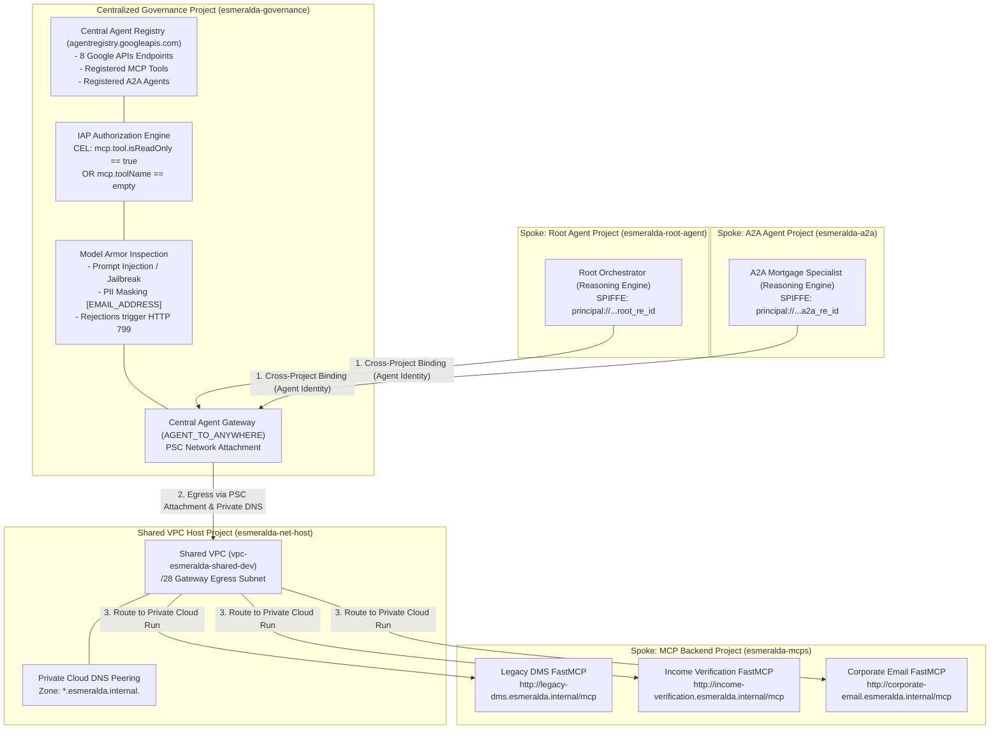

# Centralized Agent Gateway & Agent Registry Integration Plan (August 2026 Release)

This document provides an exhaustive architectural analysis and step-by-step implementation plan for integrating Google Cloud's **Centralized Agent Gateway** (`AGENT_TO_ANYWHERE`), **Agent Registry** (`agentregistry.googleapis.com`), **SPIFFE Agent Identity** (`principal://...`), **IAP CEL Authorization Policies**, and **Model Armor Guardrails** into the **Esmeralda** multi-project enterprise agent architecture.

This plan incorporates every specification, constraint, and gotcha from Google Cloud's official August 7, 2026 architectural specification (*Cross Project Agent Runtime & Agent Gateway*, following the **August 4, 2026 GA rollout** of cross-project bindings).

---

## 1. Executive Summary & Paradigm Shift

In our prior implementation attempts (Phases 3 and 4), Esmeralda attempted to deploy independent Agent Registry and Agent Gateway instances inside each individual agent spoke project (`prj-esmeralda-root-agent` and `prj-esmeralda-a2a`). That approach suffered from three critical flaws:
1. **Redundant Network Attachments**: Each spoke required its own Private Service Connect (PSC) Network Attachment to the Shared VPC.
2. **Fragmented Tool Catalog**: MCP servers had to be discovered and registered redundantly across multiple spoke projects.
3. **Lack of Central SecOps Control**: Guardrails, PII masking, and egress authorization could not be audited or enforced from a single governance perimeter.

### The August 2026 Centralized Architecture
Google Cloud's new cross-project binding support allows **all Agent Runtime spoke projects** to bind to a **single, central Agent Gateway (`AGENT_TO_ANYWHERE`) and Agent Registry** hosted inside a dedicated **Centralized Governance Project** (`prj-esmeralda-governance`).



> **Roadmap Note (Resource Manager Auto-Discovery)**: In the current implementation, agents and MCP servers are manually registered into the central governance project's Agent Registry via `gcloud agent-registry services create`. In an upcoming release, Agent Registry will automatically discover and register agents and MCP servers across all projects under a specified Resource Manager folder into the designated management project.

---

## 2. Esmeralda Project Allocation & Responsibilities Table

| Project Name | GCP Project ID | Role in Centralized Architecture | Key Managed Resources |
| :--- | :--- | :--- | :--- |
| **Networking Host** | `esmeralda-net-host-3a3d` | **Underlying Network Backbone** | Shared VPC (`vpc-esmeralda-shared-dev`), `/28` Proxy/Egress Subnet, Private Cloud DNS (`esmeralda.internal.`). |
| **Central Governance** | `esmeralda-governance-3a3d` | **Central SecOps & Gateway Perimeter** | Central `Agent Registry`, `AGENT_TO_ANYWHERE` Agent Gateway, PSC Network Attachment, Model Armor templates, IAP CEL policies. |
| **Root Agent Spoke** | `esmeralda-root-agent-3a3d` | **LOB Application & Root Execution** | Vertex AI Reasoning Engine (`root-agent`), bound via `agentGatewayConfig` to `esmeralda-governance`. **No local VPC needed.** |
| **A2A Agent Spoke** | `esmeralda-a2a-3a3d` | **Specialized Mortgage Execution** | Vertex AI Reasoning Engine (`a2a-mortgage-agent`), bound via `agentGatewayConfig` to `esmeralda-governance`. **No local VPC needed.** |
| **MCP Tools Spoke** | `esmeralda-mcps-3a3d` | **Backend Business Services** | Cloud Run FastMCP servers (`legacy-dms`, `income-verification`, `corporate-email`), private Internal Load Balancer VIP (`10.0.1.3`). |

### 2.1 Mandatory Project API Enablement Matrix
To support Centralized Agent Gateway v2, the following GCP APIs must be enabled via `google_project_service` inside `infrastructure/modules/1-projects/main.tf`:

| GCP API Service (`*.googleapis.com`) | `net-host` | `governance` | `cicd` | `root-agent` | `a2a-agent` | `mcps` | Purpose |
| :--- | :--- | :--- | :--- | :--- | :--- | :--- | :--- |
| **`serviceusage.googleapis.com`** | ✅ | ✅ | ✅ | ✅ | ✅ | ✅ | API enablement and quota enforcement |
| **`networkservices.googleapis.com`** | | ✅ | | | | | Central Agent Gateway (`AGENT_TO_ANYWHERE`) |
| **`agentregistry.googleapis.com`** | | ✅ | | | | | Central Agent Registry catalog & tool specs |
| **`modelarmor.googleapis.com`** | | ✅ | | | | | Prompt injection defense & PII masking (`[EMAIL_ADDRESS]`) |
| **`iap.googleapis.com`** | | ✅ | | | | | IAP authorization engine & CEL rule evaluation |
| **`secretmanager.googleapis.com`** | | ✅ | ✅ | ✅ | ✅ | ✅ | Two-Vault Secret Manager config & credentials |
| **`aiplatform.googleapis.com`** | | | | ✅ | ✅ | | Vertex AI Reasoning Engines & Agent Identity |
| **`run.googleapis.com`** | | ✅ | | | | ✅ | Cloud Run FastMCP tool servers & Kong proxy |
| **`dns.googleapis.com`** | ✅ | | | | | | Private Cloud DNS managed zones (`esmeralda.internal.`) |

---

## 3. Detailed Architectural Specification by Tier

### Tier 1: Centralized Governance Perimeter (`esmeralda-governance-3a3d`)

#### 3.1 Shared VPC Connectivity, Network Attachment & Cloud DNS Peering
* **Subnet Sizing Requirement**: A minimum `/28` subnet inside `esmeralda-net-host-3a3d` is required for the Agent Gateway network attachment (providing 12 usable IPs for a single gateway instance).
* **Resource Ownership Model**: Use **Service/Governance Project Attachment** (Recommended):
  * Create `google_compute_network_attachment` inside `esmeralda-governance-3a3d` referencing the host subnet in `esmeralda-net-host-3a3d`.
* **Immutability Warning**: The `networkAttachment` field on `Agent Gateway` is **immutable** once configured.
* **Shared VPC IAM Matrix**:

| Principal or Identity | Target Project | Required Role | Purpose |
| :--- | :--- | :--- | :--- |
| **Provisioning Identity** (`terraform-sa`) | `esmeralda-net-host-3a3d` | `roles/compute.networkViewer`, `roles/dns.reader` | Validates host network, subnets, and private DNS zones during gateway deployment. |
| **Network Attachment Creator** (`terraform-sa`) | `esmeralda-net-host-3a3d` | `roles/compute.networkUser` | Authorizes creation of PSC network attachment referencing host subnet. |
| **Agent Gateway Service Agent** (`service-${GOV_NUM}@gcp-sa-agentgateway...`) | `esmeralda-net-host-3a3d` | `roles/compute.networkUser`, `roles/dns.peer` | Allows gateway service agent to attach to host subnet and peer with private DNS zones. |

* **DNS Peering Configuration (`dnsPeeringConfig`)**:
  * On the `AGENT_TO_ANYWHERE` gateway, configure `dnsPeeringConfig` for domain suffix `"esmeralda.internal."` targeting `esmeralda-net-host-3a3d` (`targetNetwork = "projects/${HOST_ID}/global/networks/${VPC_NAME}"`).
  * *Constraint 1*: Must specify exact domain suffixes with trailing dot (`"esmeralda.internal."`). **Never use root wildcard (`.`) or `googleapis.com.`** to prevent rerouting public Google API traffic.
  * *Constraint 2*: The network attachment subnet and targetNetwork in `dnsPeeringConfig` must reside in the **exact same VPC network** in the host project.

#### 3.2 Central Agent Registry (`agentregistry.googleapis.com`)
In Agent Registry, `mcp-servers`, `endpoints`, and `agents` are read-only projections; all write operations use `gcloud agent-registry services create`.

##### A. Required 8 Google APIs Endpoints (Tier 1 Baseline)
All agent runtimes require access to a standard set of Google Cloud APIs to discover tools, mint tokens, stream telemetry, and perform inference. Register these 8 endpoints in the central Agent Registry:
1. `https://agentregistry.googleapis.com` (Tool and service discovery)
2. `https://aiplatform.mtls.googleapis.com` (Vertex AI mTLS endpoint)
3. `https://cloudresourcemanager.mtls.googleapis.com` (Project number and resource resolution)
4. `https://iamcredentials.mtls.googleapis.com` (Credential and token generation)
5. `https://telemetry.mtls.googleapis.com` (Metrics and trace export)
6. `https://us-central1-aiplatform.mtls.googleapis.com` (Regional Vertex AI mTLS)
7. `https://us-central1-aiplatform.googleapis.com` (Regional Vertex AI standard endpoint)
8. `https://aiplatform.us-central1.rep.googleapis.com` (Regional Endpoint Protocol)

##### B. Cross-Project MCP Server Registration (Tier 2 Tools)
When registering Cloud Run MCP servers (`legacy-dms`, `income-verification`, `corporate-email`), preserve Esmeralda's exact `cloudbuild.yaml` specification using `tools.json` and `--interfaces="url=http://...,protocolBinding=jsonrpc"`:
* **CRITICAL REQUIREMENT**: The `--interfaces url` parameter **must include the full `/mcp` endpoint path** (e.g. `http://legacy-dms.esmeralda.internal/mcp`), not just the service root!

```bash
gcloud agent-registry services create legacy-dms \
    --project="${_GOVERNANCE_PROJECT_ID}" \
    --location="${_REGION}" \
    --display-name="legacy-dms" \
    --description="FastMCP service providing legacy document management and retrieval tools" \
    --interfaces="url=http://legacy-dms.esmeralda.internal/mcp,protocolBinding=jsonrpc" \
    --mcp-server-spec-type=tool-spec \
    --mcp-server-spec-content=tools.json
```

##### C. Cross-Project Agent-to-Agent (A2A) Registration (Tier 2 Peers)
When registering an A2A agent (`a2a-mortgage-agent`), preserve Esmeralda's exact `agent.yaml` manifest parser step from [`apps/agents/a2a-agent/cloudbuild.yaml`](file:///usr/local/google/home/afonsomenegola/codigos/esmeralda/apps/agents/a2a-agent/cloudbuild.yaml#L19-L39). The script dynamically extracts `agent_card` from `agent.yaml` and embeds `supportedInterfaces` (with `protocolVersion: "0.3"`):

```bash
# 1. Parse agent.yaml into exact A2A Agent Card JSON schema
CARD_JSON=$(python3 -c "import yaml, json; data=yaml.safe_load(open('agent.yaml'))['agent_card']; print(json.dumps({'name': data['name'], 'description': data['description'], 'version': data['version'], 'capabilities': data.get('capabilities', {}), 'defaultInputModes': data.get('default_input_modes', ['text/plain']), 'defaultOutputModes': data.get('default_output_modes', ['application/json']), 'supportedInterfaces': [{'url': i['url'], 'protocolBinding': i['protocol_binding'], 'protocolVersion': i.get('protocol_version', '0.3')} for i in data.get('supported_interfaces', [])], 'skills': data.get('skills', [])}))")

# 2. Register into Central Governance Project
gcloud agent-registry services create a2a-mortgage-agent \
    --project="${_GOVERNANCE_PROJECT_ID}" \
    --location="${_REGION}" \
    --display-name="a2a-mortgage-agent" \
    --description="A2A Agent providing domain mortgage processing capabilities" \
    --agent-spec-type=a2a-agent-card \
    --agent-spec-content="$CARD_JSON"
```

#### 3.3 Two-Tier IAP Authorization & CEL Guardrails (Executed in CI/CD `cloudbuild.yaml`)
IAP evaluates the SPIFFE identity of the calling agent against server-generated registry resource IDs (`agentregistry-00000000-...`).

> **CI/CD EXECUTION REQUIREMENT**: The IAP authorization commands below (`gcloud iap web add-iam-policy-binding`) must be executed **inside the respective service or agent `cloudbuild.yaml` pipelines** immediately after `gcloud agent-registry services create`. Because `registryResource` IDs are dynamically generated by GCP upon registration, binding IAP egress inside `cloudbuild.yaml` ensures atomic registration and authorization.

> **CRITICAL SPIFFE GOTCHA**: In individual agent principal URIs (`principal://...`), you **MUST use the numeric `PROJECT_NUMBER`** (`projects/9876543210`), never the string `PROJECT_ID`. Using `PROJECT_ID` will fail IAM evaluation.

##### Scoping & Identity Decision Matrix Table
| Target Resource | Scope | Principal Identifier Type | Recommended Role | CEL Condition |
| :--- | :--- | :--- | :--- | :--- |
| **Google APIs Endpoint** | Project or Org | `principalSet://` | `roles/iap.egressor` on Google APIs endpoint | *None* |
| **Internal MCP Server (Read-only)** | Per-Agent | `principal://` (Reasoning Engine ID) | `roles/iap.egressor` on MCP server resource | `mcp.tool.isReadOnly == true \|\| mcp.toolName == ''` |
| **Internal MCP Server (Read/Write)** | Per-Agent | `principal://` (Reasoning Engine ID) | `roles/iap.egressor` on MCP server resource | *None (or explicit `mcp.toolName` allowlist)* |
| **Agent-to-Agent (A2A)** | Per-Agent | `principal://` (Calling Engine ID) | `roles/iap.egressor` on target Agent Registry service | *Optional method filter* |

##### Step-by-Step IAP Authorization for MCP Tools (`--resource-type=agent-registry --mcp-server`)
1. Fetch the server-generated resource ID:
```bash
REGISTRY_RESOURCE=$(gcloud agent-registry services describe legacy-dms \
    --project="${_GOVERNANCE_PROJECT_ID}" \
    --location="${_REGION}" \
    --format='value(registryResource)')
RESOURCE_ID=$(basename "$REGISTRY_RESOURCE")
```
2. Grant `roles/iap.egressor` on that specific MCP server with mandatory CEL condition:
```bash
CALLING_PRINCIPAL="principal://agents.global.org-${_ORG_ID}.system.id.goog/resources/aiplatform/projects/${_A2A_PROJECT_NUMBER}/locations/${_REGION}/reasoningEngines/${_A2A_ENGINE_ID}"

gcloud iap web add-iam-policy-binding \
    --project="${_GOVERNANCE_PROJECT_ID}" \
    --region="${_REGION}" \
    --resource-type=agent-registry \
    --mcp-server="${RESOURCE_ID}" \
    --member="${CALLING_PRINCIPAL}" \
    --role="roles/iap.egressor" \
    --condition="expression=api.getAttribute('iap.googleapis.com/mcp.tool.isReadOnly', false) == true || api.getAttribute('iap.googleapis.com/mcp.toolName', '') == '',title=ReadOnlyOrList"
```
*Why `mcp.toolName == ''` is required*: Initial session discovery (`tools/list` JSON-RPC calls) carries no specific `toolName` attribute. Omitting `mcp.toolName == ''` blocks `tools/list` handshake!

##### Step-by-Step IAP Authorization for A2A Peer Agents (`--resource-type=agent-registry --agent`)
Notice `--agent="${RESOURCE_ID}"` instead of `--mcp-server`:
```bash
gcloud iap web add-iam-policy-binding \
    --project="${_GOVERNANCE_PROJECT_ID}" \
    --region="${_REGION}" \
    --resource-type=agent-registry \
    --agent="${A2A_RESOURCE_ID}" \
    --member="principal://agents.global.org-${_ORG_ID}.system.id.goog/resources/aiplatform/projects/${_ROOT_PROJECT_NUMBER}/locations/${_REGION}/reasoningEngines/${_ROOT_ENGINE_ID}" \
    --role="roles/iap.egressor"
```

#### 3.4 Central Model Armor Inspection & HTTP 799 Rejections
* Configure `google_model_armor_template` in the Central Governance Project (`var.governance_project_id`):
  * **Prompt Injection & Jailbreak**: `filter_enforcement = "BLOCK"`, `confidence_level = "LOW_AND_ABOVE"`.
  * **Sensitive Data Protection (DLP)**: Masking PII (`[EMAIL_ADDRESS]`, `[SSN]`, `[CREDIT_CARD_NUMBER]`) on responses returned from MCP servers back to agents.
  * **Violation Behavior**: Model Armor inspection rejections trigger an immediate **HTTP 799 status code** back to the calling agent.

---

### Tier 2: Agent Runtime Spoke Projects (`root-agent` & `a2a-agent`)

#### 4.1 Cross-Project IAM Binding
Grant the runtime project's Vertex AI Service Agent (`service-${AE_PROJECT_NUMBER}@gcp-sa-aiplatform.iam.gserviceaccount.com`) access to the central Agent Gateway:

```bash
# Create Custom Least-Privilege Role in Central Governance Project
gcloud iam roles create ae_agw_cross_project_sa \
  --project="${GOVERNANCE_PROJECT_ID}" \
  --title="AE AGW Cross Project SA" \
  --description="Custom role for cross-project service agent to access Agent Gateways and Operations" \
  --permissions="networkservices.agentGateways.get,networkservices.operations.get" \
  --stage="GA"

# Bind Custom Role to Spoke Project's Vertex AI Service Agent
gcloud projects add-iam-policy-binding "${GOVERNANCE_PROJECT_ID}" \
  --member="serviceAccount:service-${AE_PROJECT_NUMBER}@gcp-sa-aiplatform.iam.gserviceaccount.com" \
  --role="projects/${GOVERNANCE_PROJECT_ID}/roles/ae_agw_cross_project_sa"
```

#### 4.2 Reasoning Engine Deployment Configuration (`agent_gateway_config`)
When deploying or upgrading `ReasoningEngine` instances via Python SDK:

```python
remote_agent = client.agent_engines.create(
    agent=local_agent,
    config={
        "agent_gateway_config": {
            "agent_to_anywhere_config": {
                "agent_gateway": (
                    f"projects/{governance_project_id}/locations/{region}/"
                    f"agentGateways/{central_gateway_name}"
                )
            },
        },
        "identity_type": types.IdentityType.AGENT_IDENTITY,
        "env_vars": {
            # Disable legacy CAA token sharing opt-out so agent identity tokens work with GCP APIs
            "GOOGLE_API_PREVENT_AGENT_TOKEN_SHARING_FOR_GCP_SERVICES": False,
        },
    },
)
```

#### 4.3 BYOC Custom Container Trust & CA Patching (Leveraging `feat/phase-4-agent-gateway`)
Because Esmeralda uses custom Bring Your Own Container (BYOC) images (`a2a-agent@sha256:...`), the container does not automatically include Agent Gateway's TLS proxy root CA or force Python asynchronous HTTP clients to route through `http_proxy`/`https_proxy`. We must cherry-pick two critical fixes from our `feat/phase-4-agent-gateway` branch:

1. **Dynamic CA Certificate Injection (`scripts/entrypoint.sh`)**:
   At container startup, query GCP Secret Manager for the Agent Gateway root CA certificate (`agw-root-ca-cert`) and register it into `/usr/local/share/ca-certificates/`:
   ```bash
   # From apps/agents/a2a-agent/scripts/entrypoint.sh
   url = f'https://secretmanager.googleapis.com/v1/{secret_name}/versions/latest:access'
   # ... save cert to /usr/local/share/ca-certificates/agw-gateway.crt ...
   os.system('update-ca-certificates')
   ```
2. **`aiohttp.ClientSession(trust_env=True)` Patch (`agent/__init__.py`)**:
   By default, Python's `aiohttp` library ignores `http_proxy`/`https_proxy` environment variables unless `trust_env=True` is explicitly set. Patch `aiohttp.ClientSession.__init__` globally when the agent app boots:
   ```python
   # From apps/agents/a2a-agent/agent/__init__.py
   import aiohttp
   _orig_aiohttp_init = aiohttp.ClientSession.__init__
   def _patched_aiohttp_init(self, *args, **kwargs):
       if "trust_env" not in kwargs:
           kwargs["trust_env"] = True
       _orig_aiohttp_init(self, *args, **kwargs)
   aiohttp.ClientSession.__init__ = _patched_aiohttp_init
   ```

#### 4.4 Zero-Config CI/CD Discovery via the Two-Vault Secret Manager Pattern
To avoid granting organization-wide `roles/resourcemanager.projectViewer` to CI/CD pipelines just to discover where `agentregistry.googleapis.com` lives, Esmeralda implements the **Two-Vault Secret Manager Pattern**:

1. **CI/CD Pointer Vault (`prj-esmeralda-cicd`)**:
   In `infrastructure/modules/3-security/main.tf`, provision a single bootstrap secret inside `esmeralda-cicd-3a3d`:
   ```hcl
   resource "google_secret_manager_secret" "gov_project_id" {
     secret_id = "secret-esmeralda-governance-id-${var.environment}"
     project   = var.cicd_project_id
   }

   resource "google_secret_manager_secret_version" "gov_project_id" {
     secret      = google_secret_manager_secret.gov_project_id.id
     secret_data = var.governance_project_id
   }
   ```
   Grant `roles/secretmanager.secretAccessor` on this secret to the CI/CD builder identity (`sa-esmeralda-builder@esmeralda-cicd-3a3d.iam.gserviceaccount.com`).
2. **Central Platform Vault (`prj-esmeralda-governance`)**:
   Because `sa-esmeralda-builder` runs inside `esmeralda-cicd-3a3d`, any Cloud Build step can read `secret-esmeralda-governance-id` without specifying `--project`:
   ```bash
   GOV_PROJECT=$(gcloud secrets versions access latest --secret="secret-esmeralda-governance-id-${_ENV}")
   echo "Resolved Central Governance Project: $GOV_PROJECT"
   ```
   Once `$GOV_PROJECT` is resolved, `sa-esmeralda-builder` uses its `roles/agentregistry.admin` and `roles/iap.admin` permissions on `$GOV_PROJECT` to register MCP tool specs and bind spoke agent SPIFFE principals.

---

## 5. Exhaustive Refactoring & Migration Guide (Files to Create, Modify, and Delete)

### 5.1 New Files to CREATE
1. **`infrastructure/modules/5-governance/agent-gateway/main.tf`**
   * Creates `google_compute_network_attachment` inside `esmeralda-governance-3a3d` referencing `/28` subnet in `esmeralda-net-host-3a3d`.
   * Creates `google_network_services_agent_gateway` (`AGENT_TO_ANYWHERE`) with `dnsPeeringConfig` targeting `esmeralda.internal.`.
   * Creates `google_model_armor_template` for prompt injection (`LOW_AND_ABOVE`) and PII masking (`[EMAIL_ADDRESS]`, `[SSN]`).
   * Creates custom role `ae_agw_cross_project_sa` and binds `root-agent` & `a2a-agent` Vertex AI service agents.
2. **`scripts/register_central_catalog.sh`**
   * Idempotently registers all 8 Google APIs endpoints into `esmeralda-governance-3a3d`.
   * Registers `legacy-dms`, `income-verification`, `corporate-email`, and `a2a-mortgage-agent` into `esmeralda-governance-3a3d`.
   * Queries generated `registryResource` IDs and attaches `roles/iap.egressor` CEL bindings (`mcp.toolName == ''` or read-only restriction).

### 5.2 Existing Files to MODIFY
1. **`infrastructure/modules/1-projects/main.tf`**
   * Add `networkservices.googleapis.com`, `agentregistry.googleapis.com`, `modelarmor.googleapis.com`, `iap.googleapis.com` to `google_project_service` for `var.governance_project_id`.
2. **`infrastructure/modules/3-security/main.tf`**
   * Add `secret-esmeralda-governance-id` resource to `var.cicd_project_id`.
   * Grant `roles/agentregistry.admin` and `roles/iap.admin` on `var.governance_project_id` to `sa-esmeralda-builder`.
3. **`apps/services/legacy-dms/cloudbuild.yaml`, `income-verification/cloudbuild.yaml`, `corporate-email/cloudbuild.yaml`, `apps/agents/a2a-agent/cloudbuild.yaml`**
   * Replace the `gcloud projects list --filter="labels.agent_platform=agent-spoke-project"` loop with:
     `GOV_PROJECT=$(gcloud secrets versions access latest --secret="secret-esmeralda-governance-id-${_ENV}")`.
   * Register service into `$GOV_PROJECT` and query `registryResource` to attach `roles/iap.egressor` bindings.
4. **`infrastructure/modules/4-workloads/agents/a2a-agent/main.tf` & `base-adk-agent/main.tf`**
   * Remove `psc_interface_config` block from `deployment_spec`.
   * Add `agent_gateway_config` to `deployment_spec` pointing to `esmeralda-governance-3a3d`'s central `AGENT_TO_ANYWHERE` gateway.
   * Set `identity_type = "AGENT_IDENTITY"`.
   * Add `"GOOGLE_API_PREVENT_AGENT_TOKEN_SHARING_FOR_GCP_SERVICES": "False"` to environment variables.
5. **`apps/agents/a2a-agent/Dockerfile` & `scripts/entrypoint.sh`**
   * Add Secret Manager root CA bundle fetcher and system trust store registration (`update-ca-certificates`).
6. **`apps/agents/a2a-agent/agent/__init__.py`**
   * Add `aiohttp.ClientSession(trust_env=True)` monkeypatch so asynchronous HTTP requests route through `http_proxy`/`https_proxy`.
7. **`Makefile`**
   * Add `deploy-agent-gateway-central`, `register-catalog`, and verification targets.

### 5.3 Files / Resources to DELETE
1. **Per-Spoke PSC Network Attachments (`google_compute_network_attachment`)**
   * Delete local network attachment resources inside `infrastructure/modules/4-workloads/agents/a2a-agent/main.tf` and `base-adk-agent/main.tf` (spokes no longer need local VPC attachments).
2. **Per-Spoke Agent Gateways**
   * Delete redundant per-spoke Agent Gateway definitions inside `infrastructure/modules/4-workloads/gateways/agent-gateway/a2a-agent/` and `root-agent/`.

