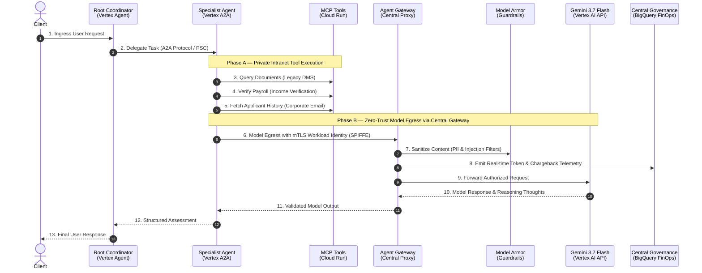
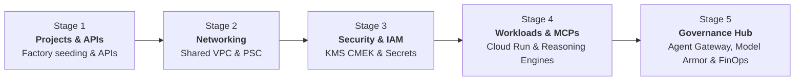

# 📖 Esmeralda Architecture & Documentation Hub

Welcome to the **Official Esmeralda Documentation Hub**.

If you are new to the project, this guide will give you a **crystal-clear understanding** of what Esmeralda is, why it was designed this way, and how the entire ecosystem fits together.

---

## 💡 The 60-Second Mental Model: What is Esmeralda?

> *"O que está embaixo é como o que está no alto, e o que está no alto é como o que está embaixo."*  
> — **A Tábua de Esmeralda** (Hermes Trismegisto)

In most enterprises, AI Agent prototypes remain stuck in notebooks or local scripts because **taking agents to production is an infrastructure, security, and governance challenge**, not just a prompt engineering challenge.

**Esmeralda bridges this gap by enforcing a strict duality:**

```
               ┌────────────────────────────────────────────────────────┐
               │  🟢 NO ALTO (Application Layer - apps/)                │
               │  Pure Python reasoning, Gemini 3.7 Flash, ADK agents,  │
               │  and standardized Model Context Protocol (MCP) tools.   │
               └─────────────────────────┬──────────────────────────────┘
                                         │  Zero-Trust Integration
               ┌─────────────────────────┴──────────────────────────────┐
               │  🔵 EMBAIXO (Platform Layer - infrastructure/)         │
               │  5-stage Terragrunt IaC, Shared VPC, mTLS SPIFFE,      │
               │  Central Agent Gateway, Model Armor & BigQuery FinOps. │
               └────────────────────────────────────────────────────────┘
```

---

## 🎭 The Two Personas: Separation of Concerns

Esmeralda is designed around two distinct developer personas who collaborate without stepping on each other's toes:

| Persona | Where they work | What they care about | What they NEVER have to touch |
| :--- | :--- | :--- | :--- |
| 🧑‍💻 **AI / Application Developer** | [`apps/`](../apps/) | Writing agent logic with **Google ADK**, defining **MCP tool servers** (FastAPI/FastMCP), testing prompts with **Gemini 3.7 Flash**, and orchestrating multi-agent **A2A protocols**. | Terraform, Terragrunt, VPC peering, KMS IAM roles, subnets, firewall rules, or DNS zones. |
| 👷 **Platform / SecOps Engineer** | [`infrastructure/`](../infrastructure/) | Managing declarative **Terragrunt & Terraform modules**, isolated GCP projects, Private Service Connect (PSC), **Central Agent Gateway** egress, and **BigQuery FinOps** chargeback views. | Python application business logic, agent prompts, or internal tool schemas. |

---

## 🔄 End-to-End Request & Security Lifecycle

Here is what happens under the hood when a user submits a prompt (e.g., *"Process mortgage application 2024-7891 for Julian Sterling"*):



---

## 🏗️ The 5-Stage Progressive Infrastructure Blueprint

Infrastructure is provisioned sequentially in **5 decoupled stages** using Terragrunt:



1. 🏢 **[Stage 1: Projects & FinOps (`stage-1-projects`)](./1-platform-foundations/01-projects-and-finops.md)**:
   Provisions isolated GCP spoke projects (`net-host`, `gateway`, `cicd`, `mcps`, `a2a`, `root-agent`, `governance`) and activates required APIs.
2. 🌐 **[Stage 2: Private Networking (`stage-2-networking`)](./1-platform-foundations/02-private-networking.md)**:
   Deploys the central Shared VPC, private subnets, Cloud DNS zones (`*.esmeralda.internal`), and Private Service Connect (PSC) attachments.
3. 🔐 **[Stage 3: Security & Secrets (`stage-3-security`)](./1-platform-foundations/03-security-iam-and-telemetry.md)**:
   Configures Cloud KMS CMEK encryption keyrings, Secret Manager secrets, and workload Service Accounts with least-privilege IAM bindings.
4. ⚙️ **[Stage 4: Workloads & Tool Catalog (`stage-4-workloads`)](./2-workloads-and-catalog/README.md)**:
   Deploys the runtime applications:
   * **MCP Microservices** (Cloud Run): Corporate Email, Income Verification, Legacy DMS.
   * **AI Reasoning Engines** (Vertex AI): Root Coordinator Agent (`base-adk-agent`) and Mortgage Specialist Agent (`a2a-agent`) backed by Cloud SQL.
5. 🛡️ **[Stage 5: Central Governance Hub (`stage-5-governance`)](./3-agentops-and-lifecycle/README.md)**:
   Establishes the enterprise control plane:
   * **Central Agent Gateway**: Intercepts model egress using `AGENT_TO_ANYWHERE` with mTLS SPIFFE identity.
   * **Model Armor**: Enforces PII sanitization and prompt injection filters.
   * **FinOps Analytics**: Sinks telemetry events to BigQuery views (`vw_monthly_agent_chargeback`, `vw_request_level_telemetry`) and Cloud Monitoring dashboards.

---

## 🧭 Documentation Roadmap & Sub-Guides

Deep-dive into specific areas of the platform:

| Guide | Description | Key Topics |
| :--- | :--- | :--- |
| 🏢 **[1. Platform Foundations](./1-platform-foundations/README.md)** | Core cloud landing zone and infrastructure specs. | [Projects & APIs](./1-platform-foundations/01-projects-and-finops.md), [Shared VPC Networking](./1-platform-foundations/02-private-networking.md), [Security, CMEK & IAM](./1-platform-foundations/03-security-iam-and-telemetry.md). |
| 🤖 **[2. Workloads & Catalog](./2-workloads-and-catalog/README.md)** | Runtimes, microservices, and AI engines. | [Ingress Gateways](./2-workloads-and-catalog/01-ingress-gateways.md), [MCP Tool Servers](./2-workloads-and-catalog/02-mcp-tool-servers.md), [Reasoning Engines & Database](./2-workloads-and-catalog/03-ai-agents-and-database.md). |
| 📊 **[3. AgentOps & Governance](./3-agentops-and-lifecycle/README.md)** | Enterprise governance, security, and observability. | [Centralized Monitoring & FinOps Dashboards](./3-agentops-and-lifecycle/03-centralized-monitoring-and-dashboards.md), Multi-repo SDLC, FinOps chargebacks. |
| 🤝 **[Contributing Guidelines](./contributing.md)** | Contribution standards and testing guidelines. | Git conventions, PR requirements, test coverage expectations. |
| 📜 **[Code of Conduct](./code-of-conduct.md)** | Community engagement standards. | Respect, inclusivity, and community ethics. |
