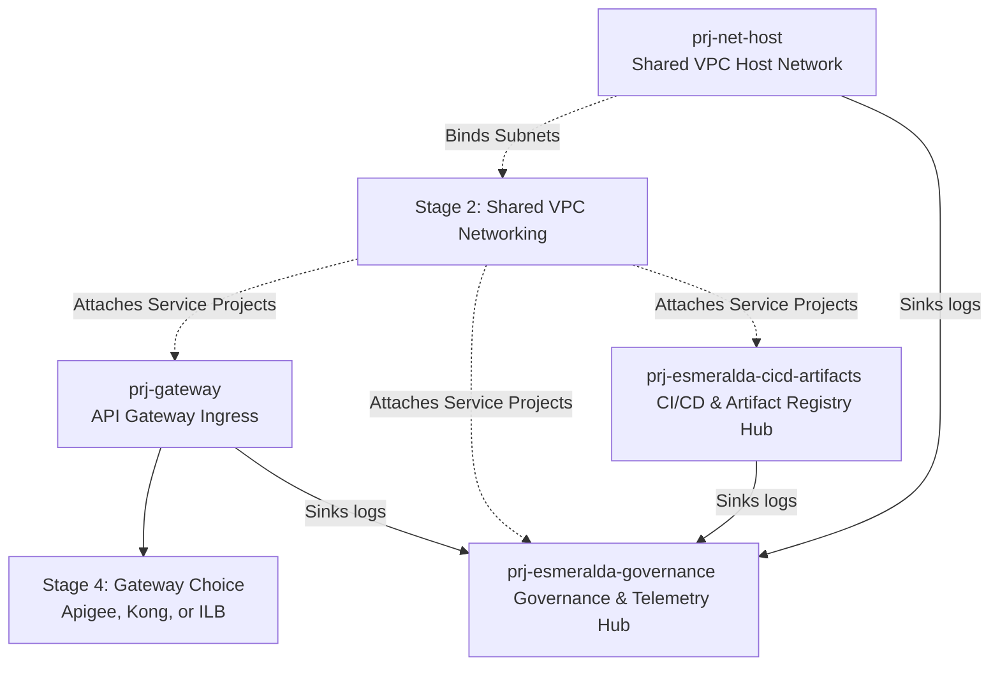
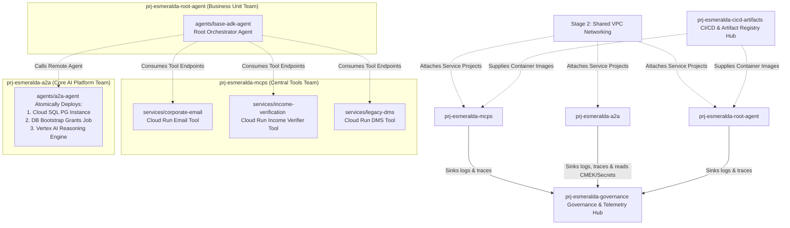
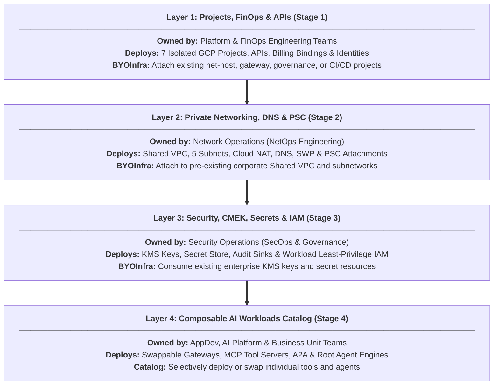

# Official Esmeralda Architecture Documentation

Welcome to the **Official Esmeralda Architecture Documentation**.

Esmeralda is an opinionated, commercial-grade monorepo blueprint designed to accelerate the path to production for AI Agents and Model Context Protocol (MCP) servers on Google Cloud Platform. By separating runtime application logic from cloud infrastructure, Esmeralda allows software developers to focus purely on agent reasoning while platform engineers manage secure, declarative infrastructure with Terragrunt.

This documentation organizes the platform's architecture into **self-contained modular master guides** that combine conceptual design explanations, architectural diagrams, and production-ready Terraform and script implementations.

---

## Enterprise Multi-Project Topology & Architecture Philosophy

To enforce strict Separation of Concerns (SoC) and align infrastructure with Google Cloud enterprise Landing Zone best practices, Esmeralda's architecture is segregated into **seven independent GCP projects**, ensuring that each operational domain controls its own security and resource boundary.

### Architecture Philosophy
*   **Strict Separation of Concerns (SoC)**: In traditional deployments, infrastructure logic and application runtime code are tangled together. Esmeralda enforces strict boundaries: platform engineers own Declarative Infrastructure (`.tf`/`.hcl` in `infrastructure/`) while AI developers own Agent Logic (`.py`/`.json` in `app/`).
*   **The "Product Shelf vs. Shopping Cart" Model**:
    *   **The Shelf (`infrastructure/modules/`)**: Pure, reusable Terraform modules that act as a product catalog of validated patterns (projects, networks, gateways, tools, agents).
    *   **The Shopping Cart (`infrastructure/live/`)**: Dynamic environment assemblies (dev, staging, prod, client-prod) where Terragrunt wires these modules together using clean DAG dependencies.

### Multi-Project Architecture
We organize Esmeralda's lifecycle stages to map directly to Google Cloud's enterprise landing zone standards. We divide our workloads across **five independent workload and service projects** representing distinct engineering and business teams, connected back to a central Shared VPC, alongside a dedicated central governance and telemetry hub project:

#### 1. Foundational Platform & Governance Topology (Stages 1–3)

#### 2. Composable AI Workloads & Agent Orchestration Topology (Stage 4)

### Team Responsibilities & Project Mapping
*   **The Shared VPC Project (`prj-net-host`)**: Managed by NetOps. Owns the core routing, private DNS zones, and Private Service Connect (PSC).
*   **The Ingress Project (`prj-gateway`)**: Managed by PlatformOps. Hosts the public gateway endpoint.
*   **The CI/CD & Artifacts Project (`prj-esmeralda-cicd-artifacts`)**: Managed by Platform Engineering. Hosts central CI/CD pipelines (Cloud Build), container images, and Artifact Registry repositories shared across workloads.
*   **The Central Tools Project (`prj-esmeralda-mcps`)**: Managed by the AppDev Team. Deploys the reusable corporate tool API servers.
*   **The AI Platform Project (`prj-esmeralda-a2a`)**: Managed by the Core AI Team. Hosts cross-company reusable assistant agents (`a2a-agent`) and their Cloud SQL task stores.
*   **The Business Unit Application Project (`prj-esmeralda-root-agent`)**: Managed by specific Business Unit Teams. Owns the customer-facing user reasoning engine, which orchestrates calls to the other projects.
*   **The Governance & Telemetry Hub Project (`prj-esmeralda-governance`)**: Managed by SecOps / PlatformOps. Centralizes security elements (KMS Keyrings, Secrets, Certificate Manager certificates) and telemetry components (Log Analytics buckets, Cloud Trace datasets, BigQuery tables), completely separating security/observability governance from core workloads.

---

## Modular & Composable Infrastructure Architecture

Esmeralda builds enterprise AI infrastructure **from the ground up** using a modular, composable, four-layer approach. Rather than locking platforms into a monolithic stack, each stage operates as an independent building block. This allows organizations to either deploy a complete greenfield architecture from scratch or leverage the **BYOInfra (Bring Your Own Infrastructure)** pattern to selectively attach Esmeralda workloads to pre-existing corporate networks, security keys, and GCP projects.

### Detailed Layer Responsibilities & Component Mappings

#### 1. Layer 1: Projects, FinOps & APIs (Stage 1)
* **Target Teams**: Platform Engineering & FinOps (`netops`, `platformops`, `platform-engineering`, `appdev-tools`, `core-ai-agents`, `business-unit-teams`, `secops`).
* **What it Deploys**: Provisions and manages up to **seven isolated GCP projects**, activates foundational Google Cloud service APIs, links corporate billing accounts, and force-creates GCP service agents. The seven projects are:
  1. `prj-net-host` (Shared VPC host network)
  2. `prj-gateway` (API ingress gateway)
  3. `prj-esmeralda-cicd-artifacts` (CI/CD pipelines & container image registry)
  4. `prj-esmeralda-mcps` (Composable utility tool API servers)
  5. `prj-esmeralda-a2a` (Cross-domain assistant agents & database task stores)
  6. `prj-esmeralda-root-agent` (Client-facing user reasoning orchestrators)
  7. `prj-esmeralda-governance` (Central KMS encryption keys & telemetry audit sinks)
* **BYOInfra Integration**: If `byo_net_host_project`, `byo_gateway_project`, `byo_governance_project`, or `byo_cicd_project` toggles are enabled in `env.yaml`, Esmeralda skips creating those projects and enabling APIs, consuming pre-existing enterprise projects instead.

| Component | Target Terragrunt Stage | Target GCP Project(s) | Cross-Dependency Inputs (`terragrunt.hcl`) |
| :--- | :--- | :--- | :--- |
| **Foundational Projects & APIs** | `stage-1-projects` | Up to 7 Isolated Projects (`net_host`, `gateway`, `cicd`, `mcps`, `a2a`, `root_agent`, `governance`) | `billing_account`, `byo_net_host_project`, `byo_gateway_project`, `byo_governance_project`, `byo_cicd_project` |

---

#### 2. Layer 2: Private Networking, DNS & PSC (Stage 2)
* **Target Team**: Network Operations (`NetOps`).
* **What it Deploys**: Provisions a zero-trust Shared VPC network inside **`prj-net-host`**, internal subnetworks (`core`, `proxy`, `psc`, `psc-interface`), Cloud NAT gateway, private Cloud DNS zones (`*.esmeralda.internal` and `*.internal.gateway`), Private Service Connect (PSC) Network Attachments for serverless VPC access, and a Secure Web Proxy (SWP) for audited internet egress.
* **BYOInfra Integration**: When `byo_networking = true` is supplied, Esmeralda bypasses VPC and subnet creation and attaches workload projects directly to the customer's pre-configured Shared VPC subnets.

| Component | Target Terragrunt Stage | Target GCP Project | Cross-Dependency Inputs (`terragrunt.hcl`) |
| :--- | :--- | :--- | :--- |
| **Shared VPC & Egress Controls** | `stage-2-networking` | `prj-net-host` | `net_host_project_id` (from stage-1), `governance_project_id` (from stage-1) |

---

#### 3. Layer 3: Security, CMEK Keys, Secrets & IAM (Stage 3)
* **Target Team**: Security Operations (`SecOps`) & Platform Governance.
* **What it Deploys**: Centralizes Cloud KMS Keyrings and CMEK encryption keys in **`prj-esmeralda-governance`** to encrypt workloads at rest, provisions Secret Manager secrets, configures centralized audit log sinks (BigQuery datasets and Cloud Storage log buckets across all seven projects), and creates dedicated workload Service Accounts with strict least-privilege IAM bindings.
* **BYOInfra Integration**: When `byo_security = true` is declared, KMS key and secret creation is skipped, and workload identities bind directly to enterprise-managed KMS keys and existing secrets.

| Component | Target Terragrunt Stage | Target GCP Project(s) | Cross-Dependency Inputs (`terragrunt.hcl`) |
| :--- | :--- | :--- | :--- |
| **KMS, Secrets & Log Sinks** | `stage-3-security` | `prj-esmeralda-governance` & Workload SAs | `governance_project_id` (stage-1), audit sinks destinations across all 7 projects |

---

#### 4. Layer 4: Composable AI Workloads Catalog (Stage 4)
* **Target Teams**: Application Developers, Core AI Platform Engineers, and Business Unit Teams.
* **What it Deploys**: A composable catalog of AI application runtime modules deployed onto the dedicated workload projects:
  * **Swappable Gateways (`services/apigee`, `services/kong`, `services/ilb`)**: Deployed into **`prj-gateway`** as interchangeable ingress endpoints.
  * **Composable MCP Tool Servers (`services/corporate-email`, `services/income-verification`, `services/legacy-dms`)**: Deployed into **`prj-esmeralda-mcps`** as private serverless Cloud Run APIs (pulling container images built in **`prj-esmeralda-cicd-artifacts`**).
  * **Atomic AI Agents (`agents/a2a-agent`, `agents/base-adk-agent`)**: The atomic `a2a-agent` is deployed into **`prj-esmeralda-a2a`** (provisioning its Cloud SQL PostgreSQL database, VPC-internal bootstrap job, and Vertex AI Reasoning Engine). The Root Orchestrator (`base-adk-agent`) is deployed into **`prj-esmeralda-root-agent`** as the master client reasoning endpoint.

| Component | Target Terragrunt Stage | Target GCP Project | Cross-Dependency Inputs (`terragrunt.hcl`) |
| :--- | :--- | :--- | :--- |
| **Swappable Ingress Gateway** | `stage-4-workloads/services/kong` *(or `apigee`/`ilb`)* | `prj-gateway` | `gateway_project_id` (stage-1), `network_id` (stage-2) |
| **DMS MCP Service** | `stage-4-workloads/services/legacy-dms` | `prj-esmeralda-mcps` | `mcps_project_id` (stage-1), `subnet_id` (stage-2) |
| **Email MCP Service** | `stage-4-workloads/services/corporate-email` | `prj-esmeralda-mcps` | `mcps_project_id` (stage-1), `subnet_id` (stage-2) |
| **Income Verification Service** | `stage-4-workloads/services/income-verification` | `prj-esmeralda-mcps` | `mcps_project_id` (stage-1), `subnet_id` (stage-2) |
| **Cloud SQL & A2A Agent** | `stage-4-workloads/agents/a2a-agent` | `prj-esmeralda-a2a` | `a2a_project_id` (stage-1), `vpc_id` (stage-2), `subnet_id` (stage-2) |
| **Root Orchestrator Agent** | `stage-4-workloads/agents/base-adk-agent` | `prj-esmeralda-root-agent` | `root_project_id` (stage-1), `a2a_agent_endpoint_url` (from `a2a-agent`), tool endpoints |

---

## Reference Index: How to Navigate Esmeralda

To make finding technical specifications instantaneous for both human teams and AI assistants, we organize reference links into two clear pathways:

### A. By Engineering Role / Team
*   **For Platform & FinOps Engineers**:
    *   [Stage 1: Projects & FinOps Guide](./1-platform-foundations/01-projects-and-finops.md) — Provisioning the 7 isolated GCP projects, API enablements, billing bindings, and cost labels.
*   **For Network Engineers (NetOps)**:
    *   [Stage 2: Private Networking Guide](./1-platform-foundations/02-private-networking.md) — Shared VPC topology, private DNS zones, Cloud NAT, Secure Web Proxy (SWP), and PSC attachments.
*   **For Security & Governance Engineers (SecOps)**:
    *   [Stage 3: Security, CMEK & IAM Guide](./1-platform-foundations/03-security-iam-and-telemetry.md) — KMS encryption keyrings, Secret Manager automation, central BigQuery audit sinks, and workload Service Account IAM tables.
*   **For Application Developers & Tool Builders (AppDev Tools)**:
    *   [Stage 4: Composable MCP Tools Guide](./2-workloads-and-catalog/02-mcp-tool-servers.md) — Packaging utility tool APIs (Corporate Email, Income Verification, Legacy DMS) as containerized Cloud Run services.
*   **For AI Engineers & Business Unit Teams**:
    *   [Stage 4: AI Agents & Database Bootstrapping Guide](./2-workloads-and-catalog/03-ai-agents-and-database.md) — A2A reasoning engines, Cloud SQL PostgreSQL task stores, automated schema privilege bootstrapping, and Root Orchestrators.
*   **For Release Managers, Dev Leads & Platform Administrators**:
    *   [AgentOps, Lifecycle & Platform Governance Guide](./3-agentops-and-lifecycle/README.md) — Multi-repository source control structures, cross-team coordination matrices, CI/CD promotion pipelines, and telemetry sinks.

### B. By Technical Domain & Blueprint Reference (AI & Developer Index)
*   **Infrastructure-as-Code (IaC) & Assembly**:
    *   [Architectural Component Mapping Table](#component-mapping) — Master reference mapping Terragrunt stages to GCP projects and cross-dependency inputs.
*   **Runtime Orchestration & Security Patterns**:
    *   [Swappable Ingress Gateways](./2-workloads-and-catalog/01-ingress-gateways.md) — Apigee X, Kong DB-less, and L7 ILB with Routing Broker proxy.
    *   [Database Bootstrapping Sequence Diagram](./2-workloads-and-catalog/03-ai-agents-and-database.md) — Automated VPC-internal Cloud Run job for PostgreSQL schema privilege grants.
*   **AgentOps, SDLC & Platform Governance**:
    *   [AgentOps, Lifecycle & Platform Governance Guide](./3-agentops-and-lifecycle/README.md) — Automated container compilation and release coordination model across independent engineering groups.
