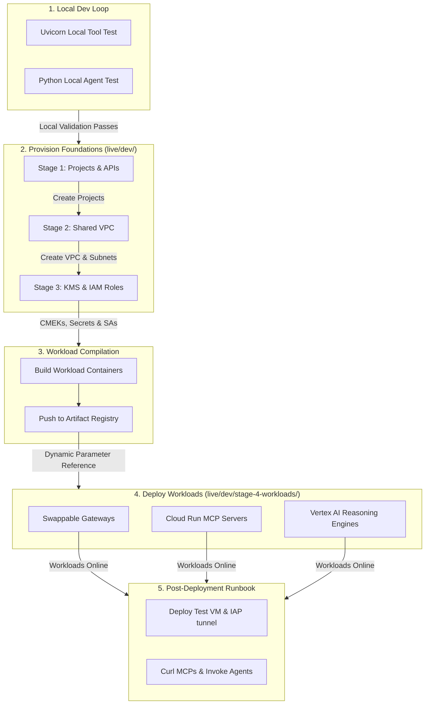

# Esmeralda Developer Quickstart & Runbook

Welcome to the **Esmeralda Developer Quickstart & Runbook**. This guide is designed to help newcomers set up their local development environments, test microservices and agents locally, provision the isolated multi-project infrastructure on Google Cloud Platform, and verify live deployments.

---

## Part 1: Local Development Setup

Esmeralda separates application workloads into independent Python services located in the `app/` directory. Each service defines its own dependencies using PEP-621 standards in `pyproject.toml`.

### 1. Prerequisites Checklist
Ensure you have the following tools installed locally:
*   **Python**: Version 3.10 or higher (3.12 recommended).
*   **Google Cloud SDK (gcloud)**: Installed and authenticated (`gcloud auth login`).
*   **Docker**: Installed and running locally.
*   **Terraform**: Version 1.5.0 or higher.
*   **Terragrunt**: Version 0.50.0 or higher.
*   **uv** (Optional): A fast Python package installer and resolver.

### 2. Setting Up Local Python Environments
Navigate to the tool or agent you want to develop and create a local virtual environment:

```bash
# Example: Setting up the Corporate Email MCP server
cd app/services/corporate-email
python3 -m venv .venv
source .venv/bin/activate
pip install --upgrade pip
pip install .[dev]
```

### 3. Running MCP Tool Servers Locally
MCP servers are built on top of Starlette and FastMCP, allowing them to run as HTTP endpoints. Use Uvicorn to run tool servers locally during development:

```bash
# Start the Corporate Email server on port 8080
uvicorn main:app --port 8080 --reload
```

You can verify the local server is running by querying its health endpoint:
```bash
curl http://localhost:8080/health
# Returns: {"status": "ok"}
```

### 4. Testing AI Agents Locally
AI agents are developed using Google's Antigravity SDK (AGY / ADK). They require environment variables to connect to Google Vertex AI.

1.  **Configure Local Environment Variables**: Create a `.env` file in the agent folder (e.g., `app/agents/a2a-agent/`) containing:
    ```text
    GOOGLE_CLOUD_PROJECT=your-test-project-id
    PROJECT_ID=your-test-project-id
    DMS_MCP_URL=http://localhost:8080/mcp
    INCOME_VERIFICATION_URL=http://localhost:8081/mcp
    EMAIL_MCP_URL=http://localhost:8082/mcp
    ```

2.  **Execute Local Test Script**: Run the test script to execute the agent's reasoning loop locally:
    ```bash
    cd app/agents/a2a-agent
    source .venv/bin/activate
    python3 scripts/test_local.py "Process mortgage application 2024-7891"
    ```

---

## Part 2: Greenfield Infrastructure Deployment Runbook

Once local testing passes, you can deploy the complete Esmeralda infrastructure stack onto Google Cloud using Terragrunt.

### Deployment Timeline Roadmap



### Step 1: Initializing Live Parameters
1.  Navigate to the live development folder:
    ```bash
    cd infrastructure/live/dev/
    ```
2.  Open `env.yaml` and configure your corporate variables:
    ```yaml
    billing_account: "012345-6789AB-CDEF01"
    org_id: "9876543210" # Optional if folder_id is provided
    folder_id: ""        # Optional if org_id is provided
    project_prefix: "esmeralda"
    environment: "dev"
    region: "us-central1"
    ```

### Step 2: Provisioning Foundations Stage-by-Stage
Apply the foundational infrastructure blocks sequentially. Do not run them concurrently, as downstream blocks consume outputs from preceding stages:

1.  **Deploy Layer 1 (Projects, Billing & APIs)**:
    ```bash
    cd infrastructure/live/dev/stage-1-projects/
    terragrunt apply --terragrunt-non-interactive
    ```
2.  **Deploy Layer 2 (Shared VPC, DNS & NAT)**:
    ```bash
    cd infrastructure/live/dev/stage-2-networking/
    terragrunt apply --terragrunt-non-interactive
    ```
3.  **Deploy Layer 3 (KMS, Secrets & Service Accounts)**:
    ```bash
    cd infrastructure/live/dev/stage-3-security/
    terragrunt apply --terragrunt-non-interactive
    ```

### Step 3: Compiling and Pushing Workload Containers
Before deploying Stage 4, you must compile and push the application container images to the Artifact Registry repository created in Stage 1.

1.  **Authorize Docker with Google Cloud**:
    ```bash
    gcloud auth configure-docker us-central1-docker.pkg.dev
    ```
2.  **Build and Push the Corporate Email Tool Server**:
    ```bash
    # Resolve the destination repository URL from Stage 1 outputs
    REPO_URL="us-central1-docker.pkg.dev/esmeralda-cicd-artifacts-xxxx/esmeralda-containers"
    
    cd app/services/corporate-email
    docker build -t ${REPO_URL}/corporate-email:latest .
    docker push ${REPO_URL}/corporate-email:latest
    ```
    *(Repeat this step for the `income-verification` and `legacy-dms` directories).*

### Step 4: Deploying Workloads Catalog (Stage 4)
With infrastructure and container images ready, deploy gateways, tool servers, and reasoning engines:

1.  **Deploy Workload Services (MCP Tool Servers & Ingress Gateways)**:
    ```bash
    cd infrastructure/live/dev/stage-4-workloads/services/
    terragrunt apply --terragrunt-non-interactive
    ```
2.  **Deploy AI Agent Reasoning Engines**:
    ```bash
    cd infrastructure/live/dev/stage-4-workloads/agents/
    terragrunt apply --terragrunt-non-interactive
    ```

---

## Part 3: Post-Deployment Verification Runbook

To verify that the zero-trust private network routing is functioning correctly, use the private Test VM jumpbox to query internal endpoints.

### 1. Tunneling into the Private Jumpbox VM
Since the Test VM does not have a public IP, connect securely using Google Identity-Aware Proxy (IAP) tunneling:

```bash
# SSH into the Test VM using IAP tunnel
gcloud compute ssh test-vm-dev \
  --project="esmeralda-root-agent-xxxx" \
  --zone="us-central1-a" \
  --tunnel-through-iap
```

### 2. Verifying Internal MCP Tool Server Connectivity
Since the MCP servers run as private, authenticated Cloud Run services inside the Shared VPC, you can verify their health and connectivity directly using their private Cloud Run URLs (available as outputs from Terragrunt Stage 4).

1.  **Retrieve the Service URLs locally** (from the workspace root):
    ```bash
    cd infrastructure/live/dev/stage-4-workloads/services/
    terragrunt output
    # Look for: service_uri outputs (e.g., https://corporate-email-dev-3xpp4jmpmq-uc.a.run.app)
    ```

2.  **SSH into the Test VM and perform the verification**:
    ```bash
    # 1. Fetch the OIDC identity token representing the Test VM's Service Account.
    # The audience MUST exactly match the target Cloud Run Service URL.
    SERVICE_URL="https://corporate-email-dev-3xpp4jmpmq-uc.a.run.app"
    TOKEN=$(curl -s -H "Metadata-Flavor: Google" "http://metadata.google.internal/computeMetadata/v1/instance/service-accounts/default/identity?audience=${SERVICE_URL}")

    # 2. Query the /health endpoint (Starlette route, unauthenticated/authenticated depending on GFE IAM settings):
    curl -i -H "Authorization: Bearer ${TOKEN}" ${SERVICE_URL}/health
    # Expected Output: HTTP 200 OK, {"status":"ok"}

    # 3. Query the /mcp tool list endpoint:
    # Crucial requirements:
    # - Accept header must be set to "application/json" (or "text/event-stream" if stateful/SSE)
    # - Body payload must conform to standard JSON-RPC 2.0 format (including "jsonrpc": "2.0" and "id" fields)
    curl -i -X POST \
      -H "Authorization: Bearer ${TOKEN}" \
      -H "Content-Type: application/json" \
      -H "Accept: application/json" \
      -d '{"jsonrpc": "2.0", "method": "tools/list", "id": 1, "params": {}}' \
      ${SERVICE_URL}/mcp
    ```

If the Shared VPC routing and GFE IAM invoker policies (`roles/run.invoker` bindings) are correctly applied, the server will return `HTTP/2 200` along with the JSON-RPC response containing the schema metadata for the tools (e.g. `read_email` and `send_email`).

### 3. Verifying Vertex AI Reasoning Engine Invocations
To verify agent-to-agent routing, invoke the Root Orchestrator Reasoning Engine. From your local command line (or from the Test VM if authorized), call the Vertex AI API:

```bash
# Invoke the Root Orchestrator Reasoning Engine directly
gcloud ai reasoning-engines predict \
  --project="esmeralda-root-agent-xxxx" \
  --location="us-central1" \
  --reasoning-engine="your-reasoning-engine-id" \
  --input='{"message": {"role": "user", "parts": [{"kind": "text", "text": "Check email for Sarah Johnson and verify her income."}]}}'
```
This triggers the Root Orchestrator, which queries the Corporate Email MCP, fetches documents from Legacy DMS, sends verification queries to the Mortgage Assistant, and returns the final decision stream.

### 4. Verifying GCP Agent Registry Registrations
To verify that all MCP servers and A2A Agents have registered automatically across all spoke projects:

```bash
# List all registered services in a target spoke project (e.g. esmeralda-root-agent-3a3d or esmeralda-a2a-3a3d)
gcloud alpha agent-registry services list \
  --project="esmeralda-root-agent-3a3d" \
  --location="us-central1"

# Verify full A2A Agent Card specification with indexed skills
gcloud alpha agent-registry services list \
  --project="esmeralda-root-agent-3a3d" \
  --location="us-central1" \
  --filter="displayName:a2a-mortgage-agent"
```

