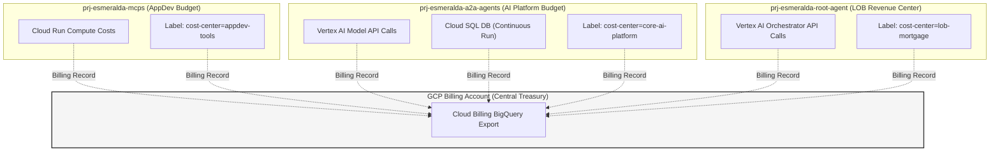
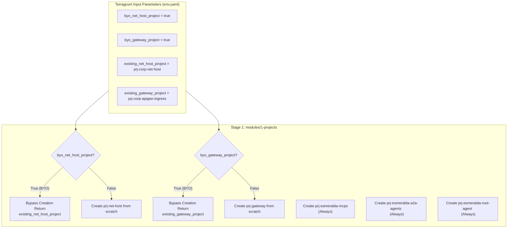
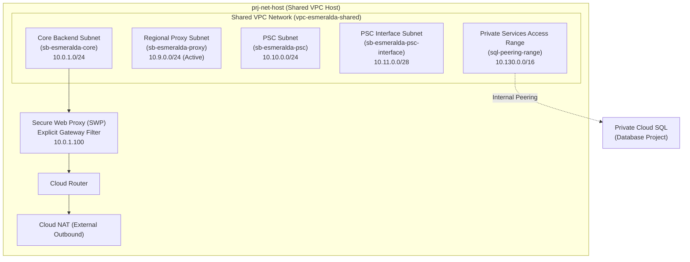
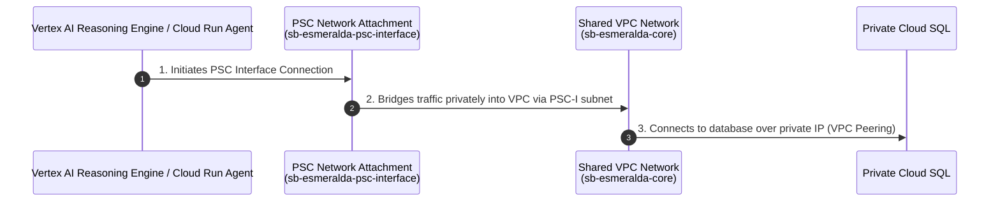
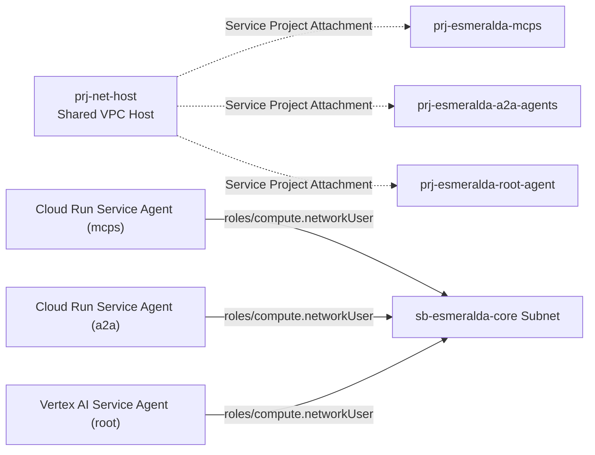
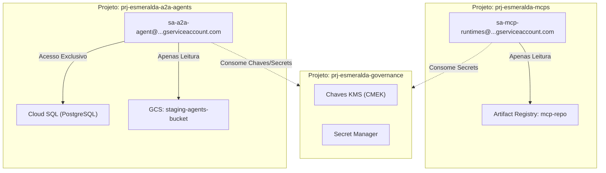
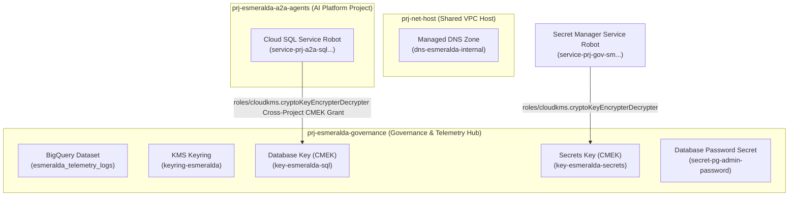

# Guia Mestre: Fundações da Plataforma (Estágios 1, 2 e 3)

Este documento unifica todos os detalhes conceituais, decisões arquiteturais de infraestrutura, FinOps e os códigos Terraform/HCL prontos para implantação das fundações do Esmeralda. Ele consolida os Estágios 1, 2 e 3 em um único guia linear, permitindo a leitura de alto nível em português e a cópia direta dos códigos em inglês (Ctrl+C / Ctrl+V) sem a necessidade de alternar entre arquivos dispersos.

---

## 🗺️ Índice de Implantação das Fundações
1. [Estágio 1: Provisionamento de Projetos, Faturamento (FinOps) e APIs](#stage-1)
   - [Explicação Arquitetural e FinOps (Português)](#s1-concepts)
   - [Especificações Técnicas e Códigos HCL Completos (Inglês)](#s1-codes)
2. [Estágio 2: Redes Privadas, DNS e Private Service Connect (PSC)](#stage-2)
   - [Explicação da Topologia de Rede e Egress Seguro (Português)](#s2-concepts)
   - [Especificações Técnicas e Códigos HCL Completos (Inglês)](#s2-codes)
3. [Estágio 3: Segurança, Chaves CMEK, Secrets e Identidades (Least Privilege)](#stage-3)
   - [Explicação de Criptografia, SAs e Políticas de Acesso (Português)](#s3-concepts)
   - [Especificações Técnicas e Códigos HCL Completos (Inglês)](#s3-codes)

---

<a name="stage-1"></a>
## 🏢 1. Estágio 1: Projetos, FinOps e APIs

<a name="s1-concepts"></a>
### A. Guia de Arquitetura e Decisões de Negócio (Português)

## 🗺️ 1. Stage 1: Projetos, Faturamento (FinOps) & APIs

O Stage 1 gerencia a criação isolada de múltiplos projetos e ativação das APIs fundamentais sob uma estrutura de governança compatível com as regras de Landing Zone empresariais do Google Cloud.

### A. Simulação de Projetos da Landing Zone (SoC)
Para simular um ambiente de produção real, as cargas de trabalho são divididas em **seis projetos distintos**:

| Projeto | Nome Simulado | Papel e Responsabilidade | Recursos Principais Hospedados |
| :--- | :--- | :--- | :--- |
| **Hospedeiro de Rede** | `prj-net-host` | Gerenciado por NetOps. Controla o tráfego de rede e segurança. | VPC Compartilhada, Subnets, Cloud DNS, Cloud NAT, Firewalls. |
| **Ingresso de Tráfego** | `prj-gateway` | Gerenciado por PlatformOps. Controla ingressos de APIs corporativos. | Apigee X, Kong no Cloud Run, Internal Load Balancer. |
| **Ferramentas MCP** | `prj-esmeralda-mcps` | Gerenciado pelo time AppDev. APIs de utilidades comuns da empresa. | Cloud Run (Corporate Email, Income Verifier, DMS), Artifact Registry. |
| **Plataforma Core AI** | `prj-esmeralda-a2a-agents` | Gerenciado pelo time Core AI. Hospeda agentes globais reutilizáveis. | Vertex AI Reasoning Engine (A2A), Cloud SQL PostgreSQL. |
| **Unidade de Negócios** | `prj-esmeralda-root-agent` | Gerenciado pela área de Linha de Negócio. Agentes de interface ao usuário. | Vertex AI Reasoning Engine (Root), Buckets GCS de Staging. |
| **Hub de Governança** | `prj-esmeralda-governance` | Gerenciado por SecOps. Centraliza conformidade e dados consolidados. | KMS Keyrings, Secrets, Certificados TLS, BigQuery Analytics, Log Sinks. |

---

### B. Desafios de FinOps Resolvidos
1.  **Atribuição Limpa de IA Generativa**: Chamadas do agente de mortgage faturam diretamente em `prj-esmeralda-root-agent`. Chamadas secundárias de subprocessos faturam em `prj-esmeralda-a2a-agents`.
2.  **Separação de Custos Ephemeral vs. Persistentes**: O banco de dados PostgreSQL (faturamento 24/7) fica isolado no projeto da plataforma de IA. Os servidores MCP (Cloud Run) escalam para zero, reduzindo custos a zero quando ociosos.
3.  **Tráfego de Rede Sem Custos Ocultos**: Todo o tráfego flui internamente pela rede privada da VPC Compartilhada na mesma região (`us-central1`), evitando taxas de trânsito de NAT público.

---

---

<a name="s1-codes"></a>
### B. Documento de Implementação Detalhado e Códigos Prontos (Inglês)

# Stage 1: Foundational Projects, Billing & APIs

This module manages the automated provisioning of isolated GCP service projects, links them securely to the corporate billing account, and activates standard APIs natively.

## 7. Detailed Module Implementation Specifications

This section defines the precise layout, HCL blueprints, and resources that must be built inside each of the pure reusable directories under `infrastructure/modules/`.

### 7.1 Stage 1: `modules/1-projects/` Specification

This module manages the creation of isolated GCP projects, links them to enterprise billing, activates necessary service APIs, and establishes the foundational service account mappings. Under this design, the module handles **up to six distinct projects**, reflecting a standard enterprise landing zone.

#### A. Enterprise Team & Project Simulation Mapping
To simulate a real-world enterprise multi-tenant landing zone, we split our architecture across six projects, allowing separate business, engineering, and observability units to operate independently:

| Simulated Team | GCP Project ID | Business & Operational Role | Primary Resources Hosted |
| :--- | :--- | :--- | :--- |
| **Network Ops (NetOps)** | `prj-net-host` | Owns the central networking backbones, Shared VPC, Private Service Connect (PSC), and firewall policies. | Shared VPC, Subnets, Cloud NAT, Cloud DNS, PSC Endpoints. |
| **Platform Ops (PlatformOps)** | `prj-gateway` | Manages the public-facing application ingress, corporate domain name registration, and corporate API Gateways. | Apigee X, Kong Gateway on Cloud Run, external HTTPS Load Balancers. |
| **AppDev Tools Team** | `prj-esmeralda-mcps` | Creates, maintains, and packages reusable Model Context Protocol (MCP) tool servers for the whole company. | Cloud Run (DMS Server, Calculator Server), Artifact Registry. |
| **Core AI Platform Team** | `prj-esmeralda-a2a-agents` | Develops reusable, cross-company Assistant-to-Assistant (A2A) agents, handling centralized business domain reasoning. | Cloud SQL PostgreSQL, Cloud Run Database Bootstrapping Job, Vertex AI Reasoning Engine (A2A). |
| **Line-of-Business Team (LOB)** | `prj-esmeralda-root-agent` | Develops the final client-facing user reasoning engine, which acts as the frontend orchestrator and orchestrates upstream agents. | Vertex AI Reasoning Engine (Root), client-facing IAM roles, GCS Buckets. |
| **Security & Governance Hub** | `prj-esmeralda-governance` | Consolidates central security/governance (KMS keys, secrets, certs) and central telemetry/observability (BigQuery dataset, trace views, log sinks), establishing strict Separation of Concerns (SoC) between Platform Governance and Workload Runtimes. | KMS Keyrings, secrets, Certificate Manager certificates, BigQuery Audit Sinks, and log buckets. |

---

#### B. The FinOps Challenge: Cost Attribution & Billing Isolation
Deploying agentic pipelines across multiple distinct GCP projects solves major enterprise pain points but introduces key FinOps and tracking challenges. Our multi-project structure solves these as follows:



##### 1. Vertex AI Model API Billing Attribution
When multiple teams call Gemini via Vertex AI, a monolithic project makes it impossible to distinguish which team consumed how many input/output tokens. By splitting workloads:
*   Calls to Gemini made by the Root Orchestrator are charged directly to `prj-esmeralda-root-agent` (LOB Budget).
*   Calls to Gemini made by the A2A Agent during sub-task execution are charged to `prj-esmeralda-a2a-agents` (Core AI Budget).
*   *Implementation*: Resource labels (`env=dev`, `cost-center=...`, `team=...`) are systematically applied at the project level and resource level, flowing directly into the **GCP Billing Export to BigQuery** for clean dashboards.

##### 2. Persistent vs. Ephemeral Resource Cost Allocation
*   **Cloud SQL Instance**: Run as a shared state machine for the A2A agent, running 24/7. This represents a fixed cost that is isolated inside the Core AI Platform budget (`prj-esmeralda-a2a-agents`) and is not subsidized by the LOB team.
*   **Cloud Run (MCP Tool Servers)**: Run serverless, scaling to zero when there are no requests. This ensures that the AppDev team only incurs compute costs when tools are actively invoked, preventing resource wasting.

##### 3. Cross-Project Network Transit Cost Optimization
Data transferring across VPC subnets and project boundaries can incur inter-zone egress fees.
*   To address this, all projects are systematically locked to a single region (`us-central1`) and use Shared VPC Private IP communication, eliminating public internet NAT gateway egress charges for inter-agent communication.

---

#### C. The BYOInfra (Brownfield) Integration Architecture
In real enterprise deployments, customers will **never** allow a tool to provision a new Shared VPC Host Project (`net_host`) or change their centralized Gateway Ingress Project (`gateway`). 

Esmeralda elegantly handles this by using a dynamic **BYOInfra Fallback Architecture**:



*   **Conditional Project Seed**: In `main.tf`, `google_project.net_host` and `google_project.gateway` use a `count` conditional (`count = var.byo_net_host_project ? 0 : 1`).
*   **API Enablement Isolation**: Service API enablement is also conditional. If `byo_net_host_project` is true, Esmeralda skips enabling APIs in that project to prevent permission conflicts with corporate security policies (which restrict IAM permissions to create/enable APIs on shared host projects).
*   **Dynamic Outputs Mapping**: Regardless of whether a project is created from scratch or provided as pre-existing, `outputs.tf` resolves the correct active project IDs, ensuring downstream modules (networking, security, and workloads) consume them transparently.

---

#### D. File Inventory & Blueprints

```text
infrastructure/modules/1-projects/
├── versions.tf          # Mandates HashiCorp Google provider bounds (>= 5.0)
├── variables.tf         # Inputs for billing, organization folders, prefix, and BYO parameters
├── main.tf              # Implements projects, API enablement, billing bindings, and labels
└── outputs.tf           # Exposes project IDs & numbers to downstream stages
```

##### 1. Versions Specification (`versions.tf`)
> [!TIP]
> 📁 **Arquivo de Código-Fonte Disponível:**
> O código Terraform correspondente às versões e provedores deste módulo está disponível em:
> 👉 [`versions.tf`](./01_platform_foundations/infrastructure/modules/1-projects/versions.tf)


##### 2. Variables Specification (`variables.tf`)
> [!TIP]
> 📁 **Arquivo de Código-Fonte Disponível:**
> O código Terraform correspondente às variáveis de entrada deste módulo está disponível em:
> 👉 [`variables.tf`](./01_platform_foundations/infrastructure/modules/1-projects/variables.tf)


##### 3. Implementation Logic (`main.tf`)
> [!TIP]
> 📁 **Arquivos de Código-Fonte Disponíveis:**
> Os códigos correspondentes à criação de projetos e barramento de APIs estão disponíveis e divididos em:
> - 👉 `main.tf` (Lógica principal): [`main.tf`](./01_platform_foundations/infrastructure/modules/1-projects/main.tf)
> - 👉 `outputs.tf` (Saídas mapeadas): [`outputs.tf`](./01_platform_foundations/infrastructure/modules/1-projects/outputs.tf)

*(With this, any client's NetOps/PlatformOps teams can hand over pre-configured net_host and gateway projects, and Esmeralda will automatically provision and deploy the isolated workload projects and attach them securely to their Shared VPC.)*

---

<a name="stage-2"></a>
## 🌐 2. Estágio 2: Redes Privadas, DNS e PSC

<a name="s2-concepts"></a>
### A. Guia de Arquitetura e Decisões de Rede (Português)

## 🌐 2. Stage 2: Redes Privadas, DNS & PSC

O Stage 2 implementa a infraestrutura de rede Zero-Trust para garantir que nenhuma API ou agente de IA se comunique por canais públicos da internet.

### A. Topologia de Subredes da VPC (`gateway-vpc`)
No projeto `prj-net-host`, criamos os seguintes intervalos de IP:
*   **Subnet de Aplicações (`gke-subnet`)**: `10.0.0.0/20` para os computes locais e VMs de teste.
*   **Proxy Subnet Regional (`gateway-proxy-subnet`)**: `10.9.0.0/24` de uso exclusivo para balanceadores de carga internos baseados em Envoy (ILB).
*   **PSC NAT Subnet (`gateway-psc-subnet`)**: `10.10.0.0/24` para as conexões de saída do Private Service Connect.
*   **PSC Interface Subnet (`psc-interface-subnet`)**: `10.11.0.0/28` que fornece conexões locais para os agentes do Vertex AI (Reasoning Engine) operando sob a rede gerenciada do Google.

### B. DNS Privado e Roteamento Estático do Gateway
Para desacoplar as URLs dinâmicas do Vertex AI, criamos uma zona DNS privada no Cloud DNS chamada `internal.gateway.` apontando todas as rotas de ferramentas e agentes para o IP interno (`10.0.0.5`) do Internal Load Balancer (ILB):
*   `email.internal.gateway` -> `10.0.0.5`
*   `income-verification.internal.gateway` -> `10.0.0.5`
*   `dms.internal.gateway` -> `10.0.0.5`

---

<a name="s2-codes"></a>
### B. Documento de Implementação Detalhado e Códigos Prontos (Inglês)

# Stage 2: Shared VPC Host Networking & Secure Egress

This module handles core network topologies including private IP address allocation, Shared VPC, Cloud NAT gateway egress, Secure Web Proxy (SWP) whitelist policies, and Private Service Connect (PSC).

### 7.2 Stage 2: `modules/2-networking/` Specification

This module establishes the Shared VPC network, configures the internal subnet routing topologies, sets up Private Service Connect (PSC) Network Attachments, deploys Google Cloud's Secure Web Proxy (SWP) for audited internet egress, and handles corporate DNS zones. It is designed to run on the Shared VPC Host Project (`prj-net-host`), but can be toggled to a pure-attachment mode for pre-existing (brownfield) customer networks.

#### A. Network Subnet and Routing Architecture
In Greenfield mode, the module provisions a comprehensive hub network with dedicated subnets for core workloads, proxy-only routing, PSC endpoints, serverless integration, and database peering:



##### 1. Subnet Classifications
*   **Core Backend Subnet (`sb-esmeralda-core`)**: Host IP range `10.0.1.0/24`. All primary internal workloads (Cloud Run instances, VPC connectors, and private VMs) operate inside this range. Private Google Access is enabled to permit calling Vertex AI and Secret Manager without traversing the public internet.
*   **Regional Envoy Proxy Subnet (`sb-esmeralda-proxy`)**: Host IP range `10.9.0.0/24`. Required by regional internal Application Load Balancers or secure regional gateways (Apigee or Kong). Configured with purpose `REGIONAL_MANAGED_PROXY` and role `ACTIVE`.
*   **PSC Endpoint Subnet (`sb-esmeralda-psc`)**: Host IP range `10.10.0.0/24` reserved for private Google services PSC endpoints.
*   **PSC Interface Subnet (`sb-esmeralda-psc-interface`)**: Host IP range `10.11.0.0/28`. A highly specific regular subnet utilized solely to bind Google-managed Serverless runtimes.
*   **Private Services Access (`sql-peering-range`)**: Allocated block `10.130.0.0/16` reserved for Serverless Cloud SQL Private Services peering connections.

---

#### B. Serverless Bridges: Private Service Connect (PSC) Network Attachment
Because Vertex AI Reasoning Engines and serverless Cloud Run agents reside natively in Google-managed tenant projects, they do not have direct access to resources inside custom customer VPCs. Esmeralda bridges this boundary using a **PSC Network Attachment**:



1.  **Subnet Isolation**: A dedicated regular subnetwork (`sb-esmeralda-psc-interface`) is configured.
2.  **Compute Network Attachment**: The resource `google_compute_network_attachment` references the PSC-I subnet and is set to `ACCEPT_AUTOMATIC`. This creates a PSC interface point. Serverless agents use this resource link to establish incoming tunnels directly into the VPC.
3.  **Firewall Protection**: Ingress firewalls are restricted to only allow ports `22` (SSH for debugging), `443` (HTTPS for APIs), and `ICMP` originating from the PSC Interface subnet (`10.11.0.0/28`).

---

#### C. Egress Auditing & Filtering: Secure Web Proxy (SWP)
To comply with enterprise security requirements, reasoning engines and corporate AI agents are not permitted to establish arbitrary connections to the public internet. Stage 2 provisions a **Secure Web Proxy (SWP)** to audit and control egress traffic:
*   **The SWP Instance**: Deployed via GCP's `google_network_security_gateway_security_policy` (or Fabric's `net-swp` module) in the workloads subnet with a static internal IP (`10.0.1.100`).
*   **Egress Interception**: Workloads communicating via the PSC Interface are configured with an explicit proxy pointing to `10.0.1.100:443`.
*   **Access Rules**: Configured with strict session matching and rules (e.g., matching corporate whitelisted LLMs and SaaS tools while blocking unauthorized domains, with error logging activated).

---

#### D. Shared VPC Attachments & Network User IAM Bindings
To allow the separate workload projects to send private traffic across the Shared VPC, they must be attached as service projects, and their respective service agents must be granted subnet execution rights:



For workloads in service projects to bind VPC Connectors or establish PSC attachments in the host subnet, the host project must authorize the following service agents with the `roles/compute.networkUser` role on the specific subnet:
1.  **Google APIs Service Agent**: `service-[PROJECT_NUMBER]@cloudservices.gserviceaccount.com` (Handles backend resources orchestration).
2.  **Serverless VPC Access Robot**: `service-[PROJECT_NUMBER]@serverless-robot-prod.iam.gserviceaccount.com` (Enables Serverless VPC Access Connectors).
3.  **Vertex AI Agent**: `service-[PROJECT_NUMBER]@gcp-sa-aiplatform.iam.gserviceaccount.com` (Allows Direct VPC egress for Vertex AI Reasoning Engines).

---

#### E. DNS Service Discovery Layout
To facilitate service discovery, Stage 2 deploys two central private DNS zones visible inside the Shared VPC:
1.  **`esmeralda.internal` Zone**: Used for internal service-to-service discovery (e.g., `dms.esmeralda.internal`, `calculator.esmeralda.internal`).
2.  **`internal.gateway` Zone**: Used to peering PSC interfaces. Contains:
    *   Wildcard record `*.internal.gateway.` resolving to the Internal Load Balancer VIP.
    *   Static record `swp.internal.gateway.` resolving to the Secure Web Proxy IP (`10.0.1.100`).

---

#### F. Greenfield vs. Brownfield (BYO) Logic
When `byo_networking = true` is supplied:
*   We **bypass** creating the VPC, subnetworks (core, proxy, psc, psc-interface), Cloud Router, NAT, and the service networking connection.
*   We **still execute** Shared VPC Host Project enablement, Service Project Attachments, Subnet IAM bindings, and DNS Zones, hooking the three new service projects directly into the customer's pre-configured Shared VPC and SWP infrastructure.

---

#### G. File Inventory & Blueprints

```text
infrastructure/modules/2-networking/
├── versions.tf          # Mandates HashiCorp Google provider bounds (>= 5.0)
├── variables.tf         # Host project IDs, service project IDs, CIDR overrides, and BYO flags
├── main.tf              # Greenfield VPC, NAT, PSA + PSC Attachments, SWP, IAM network users, Cloud DNS
└── outputs.tf           # Exports VPC network ID, Subnet self-links, and DNS private zone name
```

##### 1. Versions Specification (`versions.tf`)
> [!TIP]
> 📁 **Arquivo de Código-Fonte Disponível:**
> O código Terraform correspondente às versões e provedores de rede está disponível em:
> 👉 [`versions.tf`](./01_platform_foundations/infrastructure/modules/2-networking/versions.tf)


##### 2. Variables Specification (`variables.tf`)
> [!TIP]
> 📁 **Arquivo de Código-Fonte Disponível:**
> O código Terraform correspondente às variáveis de rede privada e subredes está disponível em:
> 👉 [`variables.tf`](./01_platform_foundations/infrastructure/modules/2-networking/variables.tf)


##### 3. Implementation Logic (`main.tf`)
> [!TIP]
> 📁 **Arquivo de Código-Fonte Disponível:**
> O código Terraform principal com a topologia de redes, DNS e PSC está disponível em:
> 👉 [`main.tf`](./01_platform_foundations/infrastructure/modules/2-networking/main.tf)


##### 4. Outputs Specification (`outputs.tf`)
> [!TIP]
> 📁 **Arquivo de Código-Fonte Disponível:**
> As saídas geradas por este módulo de rede estão disponíveis em:
> 👉 [`outputs.tf`](./01_platform_foundations/infrastructure/modules/2-networking/outputs.tf)


---

<a name="stage-3"></a>
## 🔐 3. Estágio 3: Segurança, Chaves CMEK, Secrets e Identidades

<a name="s3-concepts"></a>
### A. Guia de Arquitetura e Decisões de Segurança (Português)

## 🔐 3. Stage 3: Segurança, Chaves CMEK, Secrets & Identidades

O Stage 3 centraliza as barreiras de conformidade de segurança e controle de dados, gerenciado no projeto isolado `prj-esmeralda-governance`.

### A. Criptografia CMEK e Secret Manager
Criamos um Keyring do Cloud KMS centralizado para criptografar dados persistentes:
*   `key-postgresql`: Criptografa o disco do Cloud SQL no projeto `prj-esmeralda-a2a-agents`.
*   `key-gcs-staging`: Criptografa os buckets de gravação de logs de telemetria.

E usamos o Secret Manager para persistir credenciais sem riscos de exposição em disco:
*   `postgresql-admin-password`: Senha master administrativa para bootstrap de privilégios.

---

### B. 🚨 Auditoria de Conformidade de Identidades (Least Privilege)
**IMPORTANTE (Correção de Auditoria de Segurança):** 
Durante nossa auditoria do Esmeralda legado, removemos completamente as permissões relacionadas a um `agent_repo` no Artifact Registry (repositório de containers de agentes). Os agentes ADK Reasoning Engine não utilizam Docker e são empacotados como pacotes compactados `.zip` em buckets do GCS. Mantivemos apenas as permissões de gravação de imagens para o `mcp_repo` (usado pelos Cloud Runs das ferramentas).

Além disso, eliminamos a Service Account centralizadora genérica `test-vm-sa`. No novo modelo, cada carga de trabalho opera sob uma **identidade de serviço isolada e específica por projeto**:



---

---

<a name="s3-codes"></a>
### B. Documento de Implementação Detalhado e Códigos Prontos (Inglês)

# Stage 3: Security Keys, Secret Management, and Log Sinks

This module provisions KMS Keyrings and CryptoKeys, sets up Secret Manager secrets, and configures centralized Cloud Logging Sinks routed to BigQuery and Log Analytics buckets.

### 7.3 Stage 3: `modules/3-security/` Specification

This module establishes central customer-managed cryptographic keys (CMEK) via Cloud KMS, configures secure secret storage boundaries in Secret Manager, provisions isolated, least-privilege workload Service Accounts for each engineering domain (including a dedicated Test VM service account and full-parity roles from Esmeralda's monolithic `test-vm-sa`), and hooks up enterprise audit and telemetry log sinks.

Under our centralized governance design, all KMS keyrings, keys, and secrets are created in the centralized **`prj-esmeralda-governance`** project during Stage 3. Workload runtimes (e.g. Cloud SQL in `prj-esmeralda-a2a-agents`) merely consume these resources over cross-project IAM bindings.

#### A. Cryptographic, Secrets, and Identity Isolation Architecture
Stage 3 establishes centralized encryption-at-rest keys, credentials, and cryptographic identities to satisfy strict corporate infosec rules:



##### 1. Key Refinements and Additions:
*   **Workload Service Account Roles Alignment**:
    In the monolithic setup, the single `test-vm-sa` account accumulated over 11 roles (including `roles/aiplatform.user`, `roles/storage.objectAdmin`, `roles/telemetry.writer`, and `roles/bigquery.jobUser`) because the VM also acted as the execution identity for the Reasoning Engine. In our enterprise multi-project landing zone, we **split and assign these roles to distinct service accounts** according to the principle of least privilege, guaranteeing full feature-parity:
    *   **`sa-esmeralda-mcps`** (Central Tools Project): Authorized with `roles/logging.logWriter`, `roles/monitoring.metricWriter`, and `roles/cloudtrace.agent` to write application telemetry.
    *   **`sa-esmeralda-a2a`** (AI Platform Project): Fully loaded with the transactional database and AI roles: `roles/cloudsql.client`, `roles/cloudsql.instanceUser`, `roles/aiplatform.user`, `roles/logging.logWriter`, `roles/monitoring.metricWriter`, `roles/cloudtrace.agent`, `roles/storage.objectAdmin` (for reasoning templates GCS buckets), `roles/serviceusage.serviceUsageConsumer`, and `roles/telemetry.writer`.
    *   **`sa-esmeralda-root`** (LOB App Project): Fully loaded with the customer reasoning and orchestration roles: `roles/aiplatform.user`, `roles/storage.objectAdmin`, `roles/logging.logWriter`, `roles/monitoring.metricWriter`, `roles/cloudtrace.agent`, `roles/serviceusage.serviceUsageConsumer`, and `roles/telemetry.writer`.
*   **Dedicated Test VM Identity (`sa-esmeralda-test-vm`)**:
    To support connectivity testing, local debugging, and tool testing (DMS, Calculator) from a secure jumpbox without over-privileging operators, we introduce a dedicated Test VM Service Account. It resides in the Line of Business project (`prj-esmeralda-root-agent`) or `prj-net-host` and is assigned:
    *   `roles/logging.logWriter` and `roles/monitoring.metricWriter` for VM health logging.
    *   `roles/run.invoker` inside `prj-esmeralda-mcps` (to invoke private Cloud Run MCP server tools).
    *   `roles/run.invoker` inside `prj-esmeralda-a2a-agents` (to invoke private A2A endpoints or bootstrapping runs).
    *   `roles/aiplatform.user` inside `prj-esmeralda-a2a-agents` (to invoke private Vertex AI Reasoning Engines).
    *   `roles/iam.serviceAccountTokenCreator` on **itself** (allowing the VM's operators to generate short-lived, secure OIDC identity tokens programmatically via the IAM API for curling private microservices).

---

#### B. Greenfield vs. Brownfield (BYO) Logic
When `byo_security = true` is declared in `env.yaml`:
*   KMS Keyrings, KMS Crypto Keys, and Secret Manager Secrets are **completely bypassed** during deployment.
*   Workload Service Accounts, the Test VM Service Account, and their precise IAM role bindings are **still created** and linked back to target project boundaries.
*   Downstream modules switch their inputs to point to the static pre-existing key and secret IDs passed via local configurations.

---

#### C. File Inventory & Blueprints

```text
infrastructure/modules/3-security/
├── versions.tf          # Mandates HashiCorp Google provider bounds (>= 5.0)
├── variables.tf         # Multi-project inputs, BYO KMS/Secret overrides, and project numbers
├── main.tf              # Implements Cloud KMS, secrets, SAs, and log sinks
└── outputs.tf           # Exports SAs, KMS Key IDs, and Secret Resource Names
```

##### 1. Versions Specification (`versions.tf`)
> [!TIP]
> 📁 **Arquivo de Código-Fonte Disponível:**
> O código correspondente às dependências de provedores e restrições de versão de segurança está disponível em:
> 👉 [`versions.tf`](./01_platform_foundations/infrastructure/modules/3-security/versions.tf)


##### 2. Variables Specification (`variables.tf`)
> [!TIP]
> 📁 **Arquivo de Código-Fonte Disponível:**
> O código Terraform com as variáveis e chaves CMEK de criptografia e identidades está disponível em:
> 👉 [`variables.tf`](./01_platform_foundations/infrastructure/modules/3-security/variables.tf)


##### 3. Implementation Logic (`main.tf`)
> [!TIP]
> 📁 **Arquivos de Código-Fonte Disponíveis:**
> Os arquivos que criam as chaves CMEK, Secrets, SAs de menor privilégio e o BigQuery de telemetria estão disponíveis em:
> - 👉 `main.tf` (Segurança e Logs): [`main.tf`](./01_platform_foundations/infrastructure/modules/3-security/main.tf)
> - 👉 `outputs.tf` (Segredos e SAs): [`outputs.tf`](./01_platform_foundations/infrastructure/modules/3-security/outputs.tf)


*(With this updated Stage 3 Security implementation, our three workload service accounts contain the complete, high-fidelity permissions derived from the monolithic test VM service account. We have established a dedicated Test VM service account with tight invocations and token-creator privileges, fully customized for secure private VPC endpoints.)*

---
