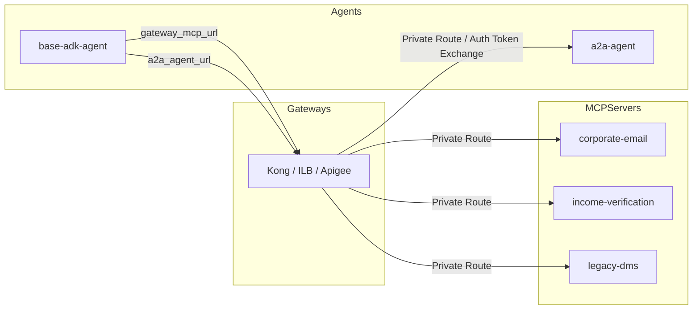
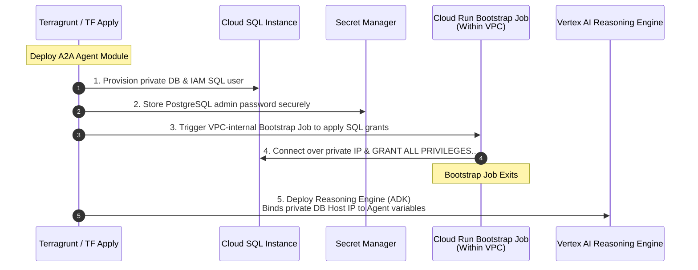

# Master Guide: Workloads, Integration & Delivery (Stage 4 and Strategy)

This document unifies all specifications for Esmeralda's workloads (Gateways, MCP Servers, and AI Agents), the Greenfield vs. Brownfield (BYOInfra) toggle architecture, the Cloud SQL Database Bootstrap flow, and the symmetric testing ecosystem. It consolidates conceptual explanations and complete HCL and Python blueprints ready for seamless production deployment.

---

## 🗺️ Workloads & Delivery Index
1. [Stage 4: Workloads Catalog](#stage-4)
   - [A. Swappable Ingress Gateways](#s4-gateways)
   - [B. Standalone API Hub](#s4-apihub)
   - [C. Composable MCP Server Tools](#s4-mcp)
   - [D. Atomic Agent Reasoning Engines](#s4-agents)
   - [E. Live Orchestrator Configurations (Terragrunt Live HCL)](#s4-live-hcl)
2. [Deployment Strategy: Greenfield vs. Brownfield (BYOInfra)](#byoinfra)
3. [Database Bootstrap Lifecycle (PostgreSQL & Cloud SQL)](#db-bootstrap)
4. [DX Onboarding Ecosystem: Symmetric Testing (Local vs. Remote)](#symmetric-tests)
5. [DX Automation: Declarative Deployments without deploy.sh and .env Files](#dx-revolution)

---

<a name="stage-4"></a>
## 🏗️ 1. Stage 4: Workloads Catalog (`modules/4-workloads/`)

<a name="s4-gateways"></a>
### A. Gateway Adapter Pattern: Swappable Ingress Gateways

Stage 4 transitions Esmeralda from foundational infrastructure into **Composable AI Applications**. The architecture adopts an independent catalog pattern: every gateway, MCP tool, or AI agent is structured as a reusable module, enabling granular deployments onto the foundational projects provisioned in Stage 1.

---

### A. Gateway Adapter Pattern: Swappable Ingress Gateways

To ensure the platform can be deployed into any enterprise environment (from agile developer sandboxes to highly governed corporate networks), Esmeralda enforces the **Gateway Adapter Pattern**. Downstream Vertex AI Reasoning Engine agents remain completely agnostic of which ingress gateway technology is active on the network.

We define three ingress adapters under `/modules/4-workloads/gateways/` that adhere to the exact same **unified variable interface contract**:

#### Swappable Gateways Technical Specifications

# Stage 4 Workloads: Swappable Ingress Gateways

This directory houses swappable entry points for external and internal traffic, including Apigee proxies, Kong on private Cloud Run, or an Internal Load Balancer.

### 7.4 Stage 4: `modules/4-workloads/` Specification

Stage 4 transitions Esmeralda from foundational infrastructure (projects, networking, security) into the **Composable Workloads Space**. It acts as a modular "Product Catalog Shelf", allowing platform operators to selectively deploy gateways, MCP tool API servers, and ADK reasoning engine agents onto the pre-existing foundational projects.

This design enforces the **Gateway Adapter Pattern**: downstream agents (the reasoning engine workloads) remain completely agnostic of *how* ingress is routed or which API gateway is active. They simply interact with a standard set of interface variables, allowing seamless toggling between different gateway products.

---

#### 7.4.1 Swappable Gateway Ingress Adapters

We define three distinct gateway options under `/modules/4-workloads/gateways/`. Platform engineers can select their desired adapter by changing the `source` path of their live gateway Terragrunt configuration:

```text
infrastructure/modules/4-workloads/gateways/
├── apigee/                 # Option A: Enterprise-grade Apigee X Ingress
├── kong/                   # Option B: Lightweight, serverless Kong Gateway on Cloud Run
└── ilb/                    # Option C: Direct GCP Regional L7 Internal HTTP(S) Load Balancer
```

##### The Swappable Gateway Contract

To maintain complete interchangeability, all three gateway sub-modules **must accept the exact same input variables** and **expose the exact same output variables**. This contract enforces the **Gateway Adapter Pattern**: downstream agents (the reasoning engine workloads) remain completely agnostic of *how* ingress is routed or which API gateway is active.

> [!TIP]
> 📁 **Unified Variable Contract:**
> The common, standardized input variable interface contract that enforces gateway interchangeability is available at:
> 👉 [`variables.tf`](./02_workloads_and_delivery/infrastructure/modules/4-workloads/gateways/apigee/variables.tf)


---

##### A. Option A: Apigee X Enterprise Gateway (`gateways/apigee/`)

The Apigee X adapter implements an enterprise-grade API management plane. It provisions an Apigee Organization, binds an Apigee Environment to the gateway project, creates an Environment Group to register hostnames (`*.esmeralda.internal`), and hooks up the Apigee runtime plane to the Shared VPC via Private Service Connect (PSC).

To handle dynamic Vertex AI Reasoning Engine IDs (which change on every deployment), the Apigee adapter populates an **Apigee Key Value Map (KVM)** using Terraform's `null_resource` local-exec trigger. At runtime, an Apigee Proxy intercepts `*.esmeralda.internal`, extracts the logical agent name from the host header, looks up the target endpoint URL in the KVM, performs Google Service Account token exchange, and proxies the query to Vertex AI.

###### 1. Variables Specification (`variables.tf`)
Includes the standard Swappable Gateway variables contract defined above.

###### 2. Implementation Blueprint (`main.tf`)
> [!TIP]
> 📁 **Source Code File Available:**
> The main Terraform configuration for enterprise Apigee X Ingress Gateway is available at:
> 👉 [`main.tf`](./02_workloads_and_delivery/infrastructure/modules/4-workloads/gateways/apigee/main.tf)


###### 3. Dynamic Routing & Auth Policies (`policies/`)

Inside the Apigee API Proxy (`/apiproxy/policies/`), we implement:
*   **KVM-Lookup.xml** (extracts the sub-domain e.g. `a2a-agent` from `request.header.host`, looks up target in KVM):
> [!TIP]
> 📁 **Apigee XML Policies Available:**
> The dynamic KVM Lookup routing policy for the Apigee Proxy is available at:
> 👉 [`KVM-Lookup.xml`](./02_workloads_and_delivery/infrastructure/modules/4-workloads/gateways/apigee/apiproxy/policies/KVM-Lookup.xml)


*   **Generate-Bearer-Token.xml** (uses Google Application Default Credentials or the Apigee Service Account's Identity Token to authenticate with Vertex AI):
> [!TIP]
> 📁 **Apigee XML Policies Available:**
> The policy for generating and injecting Bearer authentication tokens is available at:
> 👉 [`Generate-Bearer-Token.xml`](./02_workloads_and_delivery/infrastructure/modules/4-workloads/gateways/apigee/apiproxy/policies/Generate-Bearer-Token.xml)


###### 4. Outputs Specification (`outputs.tf`)
> [!TIP]
> 📁 **Source Code File Available:**
> The exported outputs from the Apigee X gateway adapter module are available at:
> 👉 [`outputs.tf`](./02_workloads_and_delivery/infrastructure/modules/4-workloads/gateways/apigee/outputs.tf)


---

##### B. Option B: Lightweight Kong Gateway on Cloud Run (`gateways/kong/`)

The Kong adapter deploys the lightweight, open-source Kong Gateway container in a DB-less serverless mode on Cloud Run inside the gateway project (`prj-gateway`). It uses Secret Manager to load Kong's declarative configuration routing rules and binds to the central Shared VPC via Direct VPC Egress for low-latency, private routing to downstream agents.

To support swappability, we compile the DB-less `kong.yml` dynamically inside Terraform using the `templatefile()` function, mapping each logical name from `var.agent_endpoints` to its dynamic Vertex AI Reasoning Engine URL. We also configure Kong's **GCP Service Account plugin** to transparently inject the Google OIDC tokens required to authorize calls to private Vertex AI reasoning engine endpoints.

###### 1. Variables Specification (`variables.tf`)
Includes the standard Swappable Gateway variables contract defined above, plus:
> [!TIP]
> 📁 **Source Code File Available:**
> The additional variables specific to Kong Gateway (such as container image overrides) are available at:
> 👉 [`variables.tf`](./02_workloads_and_delivery/infrastructure/modules/4-workloads/gateways/kong/variables.tf)


###### 2. Implementation Blueprint (`main.tf`)
> [!TIP]
> 📁 **Source Code File Available:**
> The Cloud Run DB-less deployment configuration for Kong Gateway is available at:
> 👉 [`main.tf`](./02_workloads_and_delivery/infrastructure/modules/4-workloads/gateways/kong/main.tf)


###### 3. Declarative Config Template (`templates/kong.yml.tpl`)
> [!TIP]
> 📁 **Configuration Template Available:**
> The declarative template file `kong.yml.tpl` configuring Kong's dynamic routing rules is available at:
> 👉 [`kong.yml.tpl`](./02_workloads_and_delivery/infrastructure/modules/4-workloads/gateways/kong/templates/kong.yml.tpl)


###### 4. Outputs Specification (`outputs.tf`)
> [!TIP]
> 📁 **Source Code File Available:**
> The exported outputs generated by the Kong Gateway ingress module are available at:
> 👉 [`outputs.tf`](./02_workloads_and_delivery/infrastructure/modules/4-workloads/gateways/kong/outputs.tf)


---

##### C. Option C: Direct Regional L7 Internal HTTP(S) Load Balancer (`gateways/ilb/`)

The direct L7 Internal Load Balancer (ILB) bypasses API gateway appliances entirely, routing traffic directly using Google Cloud's managed regional L7 load balancer. However, because an ILB lacks a programming engine and cannot natively rewrite paths or dynamically inject Google OIDC tokens to private Vertex AI Reasoning Engine API endpoints, a **Routing Broker proxy container** (Cloud Run + Serverless NEG) is packaged **inside** the ILB module itself.

This preserves the unified interface contract! The ILB routes all `*.esmeralda.internal` traffic to the `routing_broker` Cloud Run service. The Routing Broker container reads the dynamic `agent_endpoints` map via an environment variable (`AGENT_ENDPOINTS_JSON`), intercepts incoming agent requests, matches the host header prefix to obtain the target engine URL, retrieves an IAM ID Token from the metadata server, and proxies the query payload directly to the Vertex AI Reasoning Engine.

###### 1. Variables Specification (`variables.tf`)
Includes the standard Swappable Gateway variables contract defined above, plus:
> [!TIP]
> 📁 **Source Code File Available:**
> The input variables specific to the internal load balancer adapter (ILB + Broker) are available at:
> 👉 [`variables.tf`](./02_workloads_and_delivery/infrastructure/modules/4-workloads/gateways/ilb/variables.tf)


###### 2. Implementation Blueprint (`main.tf`)
> [!TIP]
> 📁 **Source Code File Available:**
> The provisioning of the regional Internal Load Balancer and its companion Routing Broker container is available at:
> 👉 [`main.tf`](./02_workloads_and_delivery/infrastructure/modules/4-workloads/gateways/ilb/main.tf)


###### 3. Outputs Specification (`outputs.tf`)
> [!TIP]
> 📁 **Source Code File Available:**
> The exported outputs generated by the regional ILB ingress module are available at:
> 👉 [`outputs.tf`](./02_workloads_and_delivery/infrastructure/modules/4-workloads/gateways/ilb/outputs.tf)


---

---

<a name="s4-apihub"></a>
### B. Standalone API Hub

(`modules/4-workloads/apihub/`)

The API Hub governance catalog runs as an isolated adjacent workload within `prj-gateway`. It automatically catalogs enterprise APIs without interfering with active live traffic routing.

> [!TIP]
> 📁 **Source Code File Available:**
> The Terraform implementation for standalone API Hub creation and activation is available at:
> 👉 [`main.tf`](./02_workloads_and_delivery/infrastructure/modules/4-workloads/apihub/main.tf)


---

---

<a name="s4-mcp"></a>
### C. Composable MCP Server Tools

(`modules/4-workloads/mcp-servers/`)

Shared enterprise backend utilities exposed via the Model Context Protocol (DMS, Email, Income Verification) reside in the `prj-esmeralda-mcps` tool project. Each server is deployed independently to Cloud Run under strict security controls:
*   `no-allow-unauthenticated` status enforced.
*   Outbound traffic mandated to flow 100% via Direct VPC Egress into the Shared VPC network.
*   Explicit custom audiences configured targeting the stable network IP of the Ingress Gateway.
*   Post-deployment triggers executing Python scripts to dynamically catalog tools inside Google Agent Registry.

#### Composable MCP Servers Technical Specifications

# Stage 4 Workloads: Composable MCP Server Tools

This module handles the packaging, containerization, and private execution of corporate backend tools via MCP.

#### 7.4.2 Composable MCP Server Tools (`modules/4-workloads/mcp-servers/`)

To achieve complete modularity and operational flexibility, each Model Context Protocol (MCP) server from the `/tools_mcp/servers/` directory is isolated into a standalone sub-module under `/modules/4-workloads/mcp-servers/`. This allows platform operators to independently update, patch, and redeploy specific tool services without affecting other workloads or gateways.

We define three self-contained sub-modules:
1.  **Corporate Email Tool Server** (`mcp-servers/corporate-email/`)
2.  **Income Verification Tool Server** (`mcp-servers/income-verification/`)
3.  **Legacy DMS Tool Server** (`mcp-servers/legacy-dms/`)

To preserve the zero-trust security paradigm established in Stage 3, each MCP server is deployed to Cloud Run with `no-allow-unauthenticated` status, bound directly to the Shared VPC network via Direct VPC Egress, and protected by Cloud Run IAM invoker bindings. Furthermore, each module incorporates post-deployment registration blocks to dynamically catalog available tools in the GCP Agent Registry and API Hub.

```text
infrastructure/modules/4-workloads/mcp-servers/
├── corporate-email/
│   ├── main.tf
│   ├── variables.tf
│   └── outputs.tf
├── income-verification/
│   ├── main.tf
│   ├── variables.tf
│   └── outputs.tf
└── legacy-dms/
    ├── main.tf
    ├── variables.tf
    └── outputs.tf
```

---

##### A. Sub-Module 1: Corporate Email Server (`mcp-servers/corporate-email/`)

This module deploys the `corporate-email` tool server on Cloud Run. It mounts the service directly inside the Shared VPC to resolve downstream targets privately, locks down the service's HTTP ingress, and grants invoker privileges exclusively to designated agent service accounts.

###### 1. Variables Specification (`variables.tf`)
> [!TIP]
> 📁 **Source Code File Available:**
> The Terraform variables configuration for the Corporate Email MCP tool server is available at:
> 👉 [`variables.tf`](./02_workloads_and_delivery/infrastructure/modules/4-workloads/mcp-servers/corporate-email/variables.tf)


###### 2. Implementation Blueprint (`main.tf`)
> [!TIP]
> 📁 **Source Code File Available:**
> The Cloud Run deployment configuration and Shared VPC binding for Corporate Email is available at:
> 👉 [`main.tf`](./02_workloads_and_delivery/infrastructure/modules/4-workloads/mcp-servers/corporate-email/main.tf)


###### 3. Outputs Specification (`outputs.tf`)
> [!TIP]
> 📁 **Source Code File Available:**
> The exported service URLs from the Corporate Email MCP module are available at:
> 👉 [`outputs.tf`](./02_workloads_and_delivery/infrastructure/modules/4-workloads/mcp-servers/corporate-email/outputs.tf)


---

##### B. Sub-Module 2: Income Verification Server (`mcp-servers/income-verification/`)

This module deploys the `income-verification` tool server. It integrates the verification server with regional telemetry logs and enforces strict IAM token-based OIDC protection.

###### 1. Variables Specification (`variables.tf`)
> [!TIP]
> 📁 **Source Code File Available:**
> The Terraform variables configuration for the Income Verification MCP tool server is available at:
> 👉 [`variables.tf`](./02_workloads_and_delivery/infrastructure/modules/4-workloads/mcp-servers/income-verification/variables.tf)


###### 2. Implementation Blueprint (`main.tf`)
> [!TIP]
> 📁 **Source Code File Available:**
> The secure deployment blueprint for the Income Verification tool server is available at:
> 👉 [`main.tf`](./02_workloads_and_delivery/infrastructure/modules/4-workloads/mcp-servers/income-verification/main.tf)


###### 3. Outputs Specification (`outputs.tf`)
> [!TIP]
> 📁 **Source Code File Available:**
> The exported endpoint URL for Income Verification is available at:
> 👉 [`outputs.tf`](./02_workloads_and_delivery/infrastructure/modules/4-workloads/mcp-servers/income-verification/outputs.tf)


---

##### C. Sub-Module 3: Legacy DMS Server (`mcp-servers/legacy-dms/`)

This module deploys the `legacy-dms` (Document Management System) tool server on Cloud Run. It secures interactions with the core asset store and registers with API Hub.

###### 1. Variables Specification (`variables.tf`)
> [!TIP]
> 📁 **Source Code File Available:**
> The Terraform variables configuration for Legacy DMS is available at:
> 👉 [`variables.tf`](./02_workloads_and_delivery/infrastructure/modules/4-workloads/mcp-servers/legacy-dms/variables.tf)


###### 2. Implementation Blueprint (`main.tf`)
> [!TIP]
> 📁 **Source Code File Available:**
> The private Cloud Run deployment configuration for Legacy DMS is available at:
> 👉 [`main.tf`](./02_workloads_and_delivery/infrastructure/modules/4-workloads/mcp-servers/legacy-dms/main.tf)


###### 3. Outputs Specification (`outputs.tf`)
> [!TIP]
> 📁 **Source Code File Available:**
> The exported URL generated by the Legacy DMS module is available at:
> 👉 [`outputs.tf`](./02_workloads_and_delivery/infrastructure/modules/4-workloads/mcp-servers/legacy-dms/outputs.tf)


###### 4. Composed Inputs-Outputs Mapping Matrix

To help operators configure their Terragrunt dependency blocks, this matrix maps the variable bindings across the gateway layer and the composable MCP tool servers:

| MCP Sub-module | Input Source (`terragrunt.hcl`) | Authorized Invokers (`invoker_service_accounts`) | Regional Custom Audience Endpoint | Matches Route Path in ILB |
| :--- | :--- | :--- | :--- | :--- |
| **`corporate-email`** | Output of `prj-esmeralda-mcps` and `base-adk-agent` | `base-adk-agent-sa` email, `test-vm-sa` email | `http://email.internal.gateway/mcp` | `/email/*`, `/email/mcp` |
| **`income-verification`** | Output of `prj-esmeralda-mcps` and `base-adk-agent` | `base-adk-agent-sa` email, `test-vm-sa` email | `http://income-verification.internal.gateway/mcp` | `/income-verification/*` |
| **`legacy-dms`** | Output of `prj-esmeralda-mcps` and `base-adk-agent` | `base-adk-agent-sa` email, `test-vm-sa` email | `http://dms.internal.gateway/mcp` | `/dms/*`, `/dms/mcp` |

---

---

<a name="s4-agents"></a>
### D. Atomic Agent Reasoning Engines

(`modules/4-workloads/agents/`)

In Esmeralda, ADK agents operate in completely isolated environments with declarative dynamic dependency injection orchestrated by Terragrunt:

#### Atomic ADK AI Agent Technical Specifications

# Stage 4 Workloads: Atomic Agent Reasoning Engines

This module packages Python ADK agent runtimes, automates GCS staging uploads, and provisions Vertex AI Reasoning Engines with fully atomic staging, artifacts, and log buckets.

#### 7.4.3 AI Platform Agent Reasoning Engines (`modules/4-workloads/agents/`)

Esmeralda's downstream execution flow relies on Vertex AI Reasoning Engines deployed declaratively via the Google Antigravity (AGY) / ADK framework. We organize these agents into two separate, self-contained sub-modules:
1.  **Mortgage Assistant Agent (`agents/a2a-agent/`)**: The downstream, specialized reasoning engine executing tasks and storing operational states.
2.  **Root Orchestrator Agent (`agents/base-adk-agent/`)**: The master coordinator handling multi-agent graph routing and dispatching queries.

```text
infrastructure/modules/4-workloads/agents/
├── a2a-agent/                 # Downstream reasoning engine + Atomic Cloud SQL Postgres task store
│   ├── main.tf
│   ├── variables.tf
│   └── outputs.tf
└── base-adk-agent/            # Root Orchestrator reasoning engine
    ├── main.tf
    ├── variables.tf
    └── outputs.tf
```

---

##### A. Sub-Module A: Atomic Mortgage Assistant (`agents/a2a-agent/`)

To guarantee absolute **self-contained portability**, the Cloud SQL PostgreSQL task store, its private subnet service IP allocation ranges, its IAM-authenticated DB user accounts, and database readiness bootstrappers are **fully packaged inside this single workload module**. This encapsulates all infrastructure and database requirements into an atomic, standalone unit. Calling `terragrunt apply` on this module will automatically spin up PostgreSQL, initialize the schema tables via a containerized bootstrap job, and deploy the Vertex AI Reasoning Engine with Direct VPC access peering.

###### 1. Variables Specification (`variables.tf`)
> [!TIP]
> 📁 **Source Code File Available:**
> The input variables for the atomic A2A Agent module are available at:
> 👉 [`variables.tf`](./02_workloads_and_delivery/infrastructure/modules/4-workloads/agents/a2a-agent/variables.tf)


###### 2. Implementation Blueprint (`main.tf`)
> [!TIP]
> 📁 **Source Code File Available:**
> The complete A2A Agent provisioning script, including PostgreSQL instance creation, Vertex AI service account binding, and Reasoning Engine deployment, is available at:
> 👉 [`main.tf`](./02_workloads_and_delivery/infrastructure/modules/4-workloads/agents/a2a-agent/main.tf)


###### 3. Outputs Specification (`outputs.tf`)
> [!TIP]
> 📁 **Source Code File Available:**
> The exported resource names and Reasoning Engine IDs are available at:
> 👉 [`outputs.tf`](./02_workloads_and_delivery/infrastructure/modules/4-workloads/agents/a2a-agent/outputs.tf)


---

##### B. Sub-Module B: Root Orchestrator Agent (`agents/base-adk-agent/`)

The active API Ingress Gateway acts as the single, secure entry point and transit router for all Esmeralda agent traffic. The client-side **User Prompt** first hits the gateway, which routes it to the **Root Orchestrator Agent** (`base-adk-agent`). The Root Orchestrator then parses the prompt, and routes any downstream tool service (MCP) requests or specialized downstream assistant queries (such as the `a2a-agent`) **back through the gateway**.

Because we decoupled routing mechanics, **we pass both the Gateway MCP URL and the Gateway-abstracted A2A Agent Ingress URL (`http://a2a-agent.esmeralda.internal`) as standard, runtime variables**. This guarantees complete composition flexibility and eliminates cyclic Terragrunt dependency blocks during platform deployments:


###### 1. Variables Specification (`variables.tf`)
> [!TIP]
> 📁 **Source Code File Available:**
> The variables for the Root Orchestrator module are available at:
> 👉 [`variables.tf`](./02_workloads_and_delivery/infrastructure/modules/4-workloads/agents/base-adk-agent/variables.tf)


###### 2. Implementation Blueprint (`main.tf`)
> [!TIP]
> 📁 **Source Code File Available:**
> The Terraform configuration packaging the Root Orchestrator Reasoning Engine is available at:
> 👉 [`main.tf`](./02_workloads_and_delivery/infrastructure/modules/4-workloads/agents/base-adk-agent/main.tf)


###### 3. Outputs Specification (`outputs.tf`)
> [!TIP]
> 📁 **Source Code File Available:**
> The exported outputs from the Root Orchestrator Reasoning Engine are available at:
> 👉 [`outputs.tf`](./02_workloads_and_delivery/infrastructure/modules/4-workloads/agents/base-adk-agent/outputs.tf)


###### 4. Composed Inputs-Outputs Mapping Matrix

To configure Terragrunt cross-dependency wiring, this matrix outlines the data flow between gateway adapters, downstream tool servers, and the orchestration engines:



The runtime linkage in `terragrunt.hcl` is established as follows:

| Target Component | Dependency Variable | Injected Value Source | Security Context / IAM Role | Private Network Egress Transit |
| :--- | :--- | :--- | :--- | :--- |
| **`base-adk-agent`** | `gateway_mcp_url` | Output of the selected Gateway adapter module (`outputs.gateway_mcp_url`) | Requires `roles/run.invoker` on targets | Private Load Balancer VIP (`gateway.internal.gateway`) |
| **`base-adk-agent`** | `a2a_agent_url` | Static private DNS zone routing string (`http://a2a-agent.esmeralda.internal`) | Resolved dynamically by the swappable gateway | Resolves to the selected Gateway Ingress VIP inside the Shared VPC |
| **`a2a-agent`** | `database_host` | Output of atomic database user block (`outputs.db_private_ip`) | Requires `roles/cloudsql.client` & `instanceUser` | Private Services Access (PSA) internal range |

---

<a name="s4-live-hcl"></a>
### E. Live Orchestrator Configurations (Terragrunt Live HCL)

To understand how these independent microservices and agents are dynamically assembled and wired in live environments under `live/dev/stage-4-workloads/`, see the Terragrunt configurations below. They use `dependency` blocks to inject real resource outputs from preceding stages transparently, enabling 100% automation without manual IP or parameter entry:

### A. The A2A Agent (`live/dev/stage-4-workloads/agents/a2a-agent/terragrunt.hcl`)
> [!TIP]
> 📁 **Live Terragrunt Configuration Available:**
> The live Terragrunt deployment configuration for the A2A Agent is available at:
> 👉 [`terragrunt.hcl`](./02_workloads_and_delivery/infrastructure/live/dev/stage-4-workloads/agents/a2a-agent/terragrunt.hcl)


### B. The Root Orchestrator (`live/dev/stage-4-workloads/agents/base-adk-agent/terragrunt.hcl`)
> [!TIP]
> 📁 **Live Terragrunt Configuration Available:**
> The live Terragrunt deployment configuration for the Root Orchestrator is available at:
> 👉 [`terragrunt.hcl`](./02_workloads_and_delivery/infrastructure/live/dev/stage-4-workloads/agents/base-adk-agent/terragrunt.hcl)


---

---

<a name="byoinfra"></a>
## 🔌 2. Greenfield vs. Brownfield (BYOInfra) Toggle Design

In real corporate production environments, network and security teams (NetOps and SecOps) rarely allow Terraform scripts to create Shared VPC networks, subnets, internet DNS zones, or billing projects from scratch. Enterprise clients require deploying workloads onto pre-existing resources (**Brownfield** / **BYOInfra**).

Esmeralda solves this constraint by implementing dynamic toggle switches in its Terragrunt environment configs (`live/dev/env.yaml`), utilizing native `skip` parameters and conditional fallbacks:

To allow seamless deployment inside enterprise client environments with pre-existing resources, the architecture implements the **BYOInfra Pattern** natively using Terragrunt's skip parameters and input-fallbacks:

### A. The Client's Environment Parameters (`live/client-prod/env.yaml`)
The client declares their pre-existing resources and toggles dynamic skip flags (`true`):

> [!TIP]
> 📁 **Client Environment Parameters File Available:**
> The static bypass settings and corporate network pointers for enterprise client environments are available at:
> 👉 [`env.yaml`](./02_workloads_and_delivery/infrastructure/live/client-prod/env.yaml)


### B. Dynamically Skipping Stage 2 (`live/client-prod/stage-2-networking/terragrunt.hcl`)
Using Terragrunt's native skip block, the networking stage skips compilation and returns instantly if `byo_networking` is active:

> [!TIP]
> 📁 **Live Terragrunt Configuration Available:**
> The live Terragrunt file implementing infrastructure skip logic in client environments is available at:
> 👉 [`terragrunt.hcl`](./02_workloads_and_delivery/infrastructure/live/client-prod/stage-2-networking/terragrunt.hcl)


### C. Downstream Fallback Lookup (`live/client-prod/stage-4-workloads/agents/a2a-agent/terragrunt.hcl`)
Workloads consuming outputs from skipped stages dynamically switch their inputs to read from the static fields in `env.yaml`, preventing Terragrunt parser evaluation errors:

> [!TIP]
> 📁 **Live Terragrunt Configuration Available:**
> The live Terragrunt configuration implementing dynamic fallback to client static data for the A2A Agent is available at:
> 👉 [`terragrunt.hcl`](./02_workloads_and_delivery/infrastructure/live/client-prod/stage-4-workloads/agents/a2a-agent/terragrunt.hcl)


---

---

<a name="db-bootstrap"></a>
## 🔄 3. Database Bootstrap & SQL Lifecycle

A frequent challenge in corporate CI/CD pipelines is tightly coupled and insecure database privilege provisioning. To guarantee a 100% atomic and secure deployment, Esmeralda encapsulates the PostgreSQL database and its bootstrap initialization directly within the `a2a-agent` workload module:

### Database Orchestration Sequencing



### Integrated Provisioning & Bootstrap Script (`modules/4-workloads/agents/a2a-agent/main.tf`)

> [!TIP]
> 📁 **Source Code File Available:**
> The Terraform configuration implementing private connections and the containerized SQL bootstrap job is available at:
> 👉 [`main.tf`](./02_workloads_and_delivery/infrastructure/modules/4-workloads/agents/a2a-agent/main.tf)


---

### 📊 Privilege Initialization and Lifecycle Sequencing

By packaging Cloud SQL, bootstrapping, and the Vertex AI Reasoning engine inside the `modules/4-workloads/agents/a2a-agent` pure module, we obtain an atomic, self-contained workload where schema permissions and administrative credentials are fully set up before the Reasoning Engine instantiates:

By packaging Cloud SQL, bootstrapping, and the Vertex AI Reasoning engine inside the `modules/4-workloads/agents/a2a-agent` pure module, we obtain an atomic, self-contained workload.


---

---

<a name="symmetric-tests"></a>
## 🧪 4. DX Onboarding Ecosystem: Symmetric Testing (Local vs. Remote)

Esmeralda adopts the **Symmetric Testing** philosophy. This minimizes developer friction and accelerates code validation by allowing software engineers to test AI reasoning engines offline (Inner Loop) and post-deployment in the cloud (Outer Loop) without modifying application logic.

```text
app/agents/a2a-agent/scripts/
├── test_local.py             # Offline test execution with localhost mocks
└── test_remote.py            # Real cloud integrated test execution via SSE
```

---

### A. Inner Loop: Offline Testing Architecture (`test_local.py`)

The local testing script imports the agent application object (`adk_app`) directly from the Python codebase, eliminating cloud network dependencies. It reads tool mocks running on the local loopback interface (`localhost`) across designated ports, simulating real-time asynchronous streaming:

> [!TIP]
> 📁 **Onboarding Script Available:**
> The complete Python developer script for local execution testing (Inner Loop) is available at:
> 👉 [`test_local.py`](./02_workloads_and_delivery/app/agents/a2a-agent/scripts/test_local.py)


---

### B. Outer Loop: Integrated Post-Deployment Verification (`test_remote.py`)

After automated pipeline deployment, developers verify that IAM privileges, private VPC connections, and cloud database integrations operate correctly.

The `test_remote.py` script uses the native `google.auth` library to retrieve active developer credentials (with fallback to `gcloud` CLI). It resolves the production Reasoning Engine ID and initiates authenticated streaming `POST` calls via Server-Sent Events (SSE) directly against the real Vertex AI endpoint, streaming the remote agent's thought trajectory to the console:

> [!TIP]
> 📁 **Onboarding Script Available:**
> The Python developer script for triggering cloud flows and validating reasoning in GCP (Outer Loop) is available at:
> 👉 [`test_remote.py`](./02_workloads_and_delivery/app/agents/a2a-agent/scripts/test_remote.py)


---

<a name="part-ii"></a>

---

<a name="dx-revolution"></a>
## 💎 5. DX Automation: Declarative Deployments without deploy.sh and .env Files

In legacy architectures, a major pain point is the complexity and brittleness of deployment workflows and environment variable management, where developers spend hours debugging imperative shell scripts and synchronizing local IP addresses.

Esmeralda's architecture, powered by **Terragrunt + GCP Secret Manager**, optimizes the Developer Experience (DX) by automating lifecycle management and eliminating fragile manual practices:

### A. Declarative Automation without `deploy.sh`
In contrast to imperative `deploy.sh` scripts that sequentially invoke CLI commands, interpolate strings, generate temporary disk files, and rely on arbitrary `sleep 30` blocks, Esmeralda operates declaratively:
*   **Native Declarative Orchestration**: Terragrunt manages the complete resource lifecycle through clean commands like `terragrunt run-all apply`.
*   **Parallel Dependency Graph**: Terragrunt scans the `live/` environment directory tree, constructs a Directed Acyclic Graph (DAG) in milliseconds, and executes non-dependent stage creations in parallel.
*   **Intelligent Concurrency Control**: When Stage 4 workloads depend on outputs from Stage 2 (Networking) and Stage 3 (Security), Terragrunt automatically holds Stage 4 execution until upstream dependencies are fully provisioned and ready.

### B. Configuration Sovereignty without Local `.env` Files
Instead of requiring developers to maintain multiple unsynchronized `.env` or `.env.local` files containing temporary private IP addresses, database secrets, and bucket paths:
*   **Single Source of Truth (`env.yaml`)**: Non-confidential global environment parameters (GCP region, billing account ID, resource prefix) are cleanly declared in a single structured `env.yaml` file per environment.
*   **Dynamic Injection via `dependency` Blocks**: Terragrunt dynamically reads Terraform state outputs and injects network paths, VPC IDs, subnet self-links, database IPs, and Cloud Run URLs directly into downstream module inputs.
*   **Secret Manager Governance (Stage 3)**: Critical secrets (such as administrative database passwords) are generated programmatically and stored in GCP Secret Manager, consumed on demand over secure IAM bindings without ever being written to local disks or git repositories.
