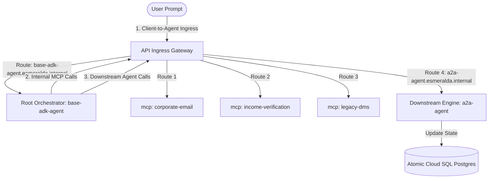
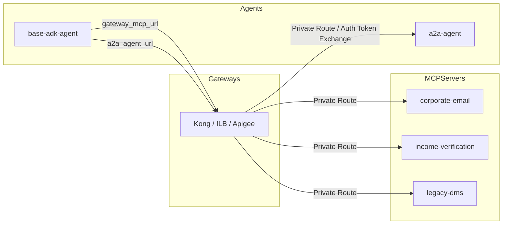
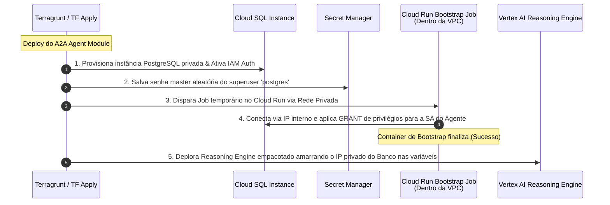
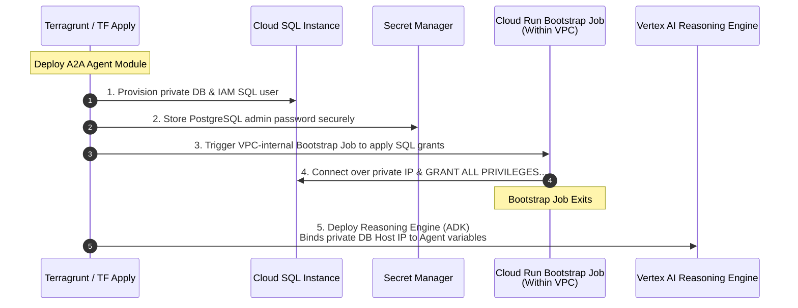

# Guia Mestre: Cargas de Trabalho, Integração & Delivery (Estágio 4 e Estratégia)

Este documento unifica todas as especificações das cargas de trabalho do Esmeralda (Gateways, Servidores MCP e Agentes de IA), a arquitetura de alternância Greenfield vs. Brownfield (BYOInfra), o fluxo integrado de Bootstrap do Banco de Dados Cloud SQL e o ecossistema de testes simétricos. Ele consolida os conceitos em português com os códigos HCL e scripts em inglês prontos para Ctrl+C / Ctrl+V.

---

## 🗺️ Índice de Cargas de Trabalho e Delivery
1. [Estágio 4: Catálogo de Cargas de Trabalho](#stage-4)
   - [A. Gateways de Ingress Intercambiáveis (Português e Códigos Completos)](#s4-gateways)
   - [B. Standalone API Hub (Português e Códigos Completos)](#s4-apihub)
   - [C. Servidores MCP Composíveis (Português e Códigos Completos)](#s4-mcp)
   - [D. Motores de Raciocínio de Agentes Atômicos (Português e Códigos Completos)](#s4-agents)
   - [E. Configurações de Orquestração Live (Terragrunt Live HCL)](#s4-live-hcl)
2. [Estratégia de Deploy: Greenfield vs. Brownfield (BYOInfra)](#byoinfra)
3. [Ciclo de Vida do Database Bootstrap (PostgreSQL & Cloud SQL)](#db-bootstrap)
4. [Ecossistema Onboarding DX: Testes Simétricos (Local vs. Remoto)](#symmetric-tests)
5. [Revolução na DX: Eliminação de deploy.sh e Arquivos .env](#dx-revolution)

---

<a name="stage-4"></a>
## 🏗️ 1. Estágio 4: Catálogo de Cargas de Trabalho

<a name="s4-gateways"></a>
### A. Padrão Gateway Adapter: Gateways de Ingress Intercambiáveis

## 🏗️ 1. Stage 4: Prateleira de Cargas de Trabalho (`modules/4-workloads/`)

O Stage 4 faz a transição do Esmeralda de fundações brutas de rede e segurança para o espaço de **Aplicações de IA Composíveis**. O design adota o padrão de catálogo independente: cada gateway, ferramenta MCP ou agente de IA é tratado como um módulo reaproveitável, permitindo deploys granulares sobre os projetos criados no Stage 1.

---

### A. Padrão Gateway Adapter: Gateways de Ingress Intercambiáveis

Para garantir que a plataforma possa ser implantada em qualquer cliente corporativo (desde sandboxes ágeis até ambientes de alta governança), o Esmeralda adota o **Padrão Gateway Adapter**. Os agentes do Vertex AI Reasoning Engine permanecem completamente agnósticos sobre qual tecnologia de gateway está ativa na rede.

Definimos três adaptadores de entrada sob `/modules/4-workloads/gateways/` que atendem ao mesmo **contrato unificado de variáveis**:

#### Blueprint e Códigos Completos para Gateways (Inglês)

# Stage 4 Workloads: Swappable Ingress Gateways

This directory houses swappable entry points for external and internal traffic, including Apigee proxies, Kong on private Cloud Run, or an Internal Load Balancer.

### 7.4 Stage 4: `modules/4-workloads/` Specification

Stage 4 transitions Esmeralda from foundational infrastructure (projects, networking, security) into the **Composable Workloads Space**. It acts as a modular "Product Catalog Shelf", allowing platform operators to selectively deploy gateways, MCP tool API servers, and ADK reasoning engine agents onto the pre-existing foundational projects.

This design enforces the **Gateway Adapter Pattern**: downstream agents (the reasoning engine workloads) remain completely agnostic of *how* ingress is routed or which API gateway is active. They simply interact with a standard set of interface variables, allowing seamless toggling between different gateway products.

---

#### 7.4.1 Swappable Gateway Ingress Adapters

We define three distinct gateway options under `/modules/4-workloads/gateways/`. Platform engineers can select their desired adapter by changing the `source` path of their live gateway Terragrunt configuration:

```text
infrastructure/modules/4-workloads/gateways/
├── apigee/                 # Option A: Enterprise-grade Apigee X Ingress
├── kong/                   # Option B: Lightweight, serverless Kong Gateway on Cloud Run
└── ilb/                    # Option C: Direct GCP Regional L7 Internal HTTP(S) Load Balancer
```

##### The Swappable Gateway Contract

To maintain complete interchangeability, all three gateway sub-modules **must accept the exact same input variables** and **expose the exact same output variables**. This contract enforces the **Gateway Adapter Pattern**: downstream agents (the reasoning engine workloads) remain completely agnostic of *how* ingress is routed or which API gateway is active.

> [!TIP]
> 📁 **Contrato Unificado de Variáveis:**
> O contrato comum e padronizado de variáveis de entrada que garante a swappabilidade dos gateways está disponível em:
> 👉 [`variables.tf`](./02_workloads_and_delivery/infrastructure/modules/4-workloads/gateways/apigee/variables.tf)


---

##### A. Option A: Apigee X Enterprise Gateway (`gateways/apigee/`)

The Apigee X adapter implements an enterprise-grade API management plane. It provisions an Apigee Organization, binds an Apigee Environment to the gateway project, creates an Environment Group to register hostnames (`*.esmeralda.internal`), and hooks up the Apigee runtime plane to the Shared VPC via Private Service Connect (PSC).

To handle dynamic Vertex AI Reasoning Engine IDs (which change on every deployment), the Apigee adapter populates an **Apigee Key Value Map (KVM)** using Terraform's `null_resource` local-exec trigger. At runtime, an Apigee Proxy intercepts `*.esmeralda.internal`, extracts the logical agent name from the host header, looks up the target endpoint URL in the KVM, performs Google Service Account token exchange, and proxies the query to Vertex AI.

###### 1. Variables Specification (`variables.tf`)
Includes the standard Swappable Gateway variables contract defined above.

###### 2. Implementation Blueprint (`main.tf`)
> [!TIP]
> 📁 **Arquivo de Código-Fonte Disponível:**
> A implementação principal do Ingress Gateway corporativo Apigee X está disponível em:
> 👉 [`main.tf`](./02_workloads_and_delivery/infrastructure/modules/4-workloads/gateways/apigee/main.tf)


###### 3. Dynamic Routing & Auth Policies (`policies/`)

Inside the Apigee API Proxy (`/apiproxy/policies/`), we implement:
*   **KVM-Lookup.xml** (extracts the sub-domain e.g. `a2a-agent` from `request.header.host`, looks up target in KVM):
> [!TIP]
> 📁 **Políticas Apigee XML Disponíveis:**
> A política de roteamento dinâmico via KVM Lookup do Apigee Proxy está disponível em:
> 👉 [`KVM-Lookup.xml`](./02_workloads_and_delivery/infrastructure/modules/4-workloads/gateways/apigee/apiproxy/policies/KVM-Lookup.xml)


*   **Generate-Bearer-Token.xml** (uses Google Application Default Credentials or the Apigee Service Account's Identity Token to authenticate with Vertex AI):
> [!TIP]
> 📁 **Políticas Apigee XML Disponíveis:**
> A política para gerar e injetar tokens de autenticação Bearer está disponível em:
> 👉 [`Generate-Bearer-Token.xml`](./02_workloads_and_delivery/infrastructure/modules/4-workloads/gateways/apigee/apiproxy/policies/Generate-Bearer-Token.xml)


###### 4. Outputs Specification (`outputs.tf`)
> [!TIP]
> 📁 **Arquivo de Código-Fonte Disponível:**
> As saídas geradas pelo adaptador de gateway Apigee X estão disponíveis em:
> 👉 [`outputs.tf`](./02_workloads_and_delivery/infrastructure/modules/4-workloads/gateways/apigee/outputs.tf)


---

##### B. Option B: Lightweight Kong Gateway on Cloud Run (`gateways/kong/`)

The Kong adapter deploys the lightweight, open-source Kong Gateway container in a DB-less serverless mode on Cloud Run inside the gateway project (`prj-gateway`). It uses Secret Manager to load Kong's declarative configuration routing rules and binds to the central Shared VPC via Direct VPC Egress for low-latency, private routing to downstream agents.

To support swappability, we compile the DB-less `kong.yml` dynamically inside Terraform using the `templatefile()` function, mapping each logical name from `var.agent_endpoints` to its dynamic Vertex AI Reasoning Engine URL. We also configure Kong's **GCP Service Account plugin** to transparently inject the Google OIDC tokens required to authorize calls to private Vertex AI reasoning engine endpoints.

###### 1. Variables Specification (`variables.tf`)
Includes the standard Swappable Gateway variables contract defined above, plus:
> [!TIP]
> 📁 **Arquivo de Código-Fonte Disponível:**
> As variáveis adicionais específicas do Kong Gateway (imagem de container) estão disponíveis em:
> 👉 [`variables.tf`](./02_workloads_and_delivery/infrastructure/modules/4-workloads/gateways/kong/variables.tf)


###### 2. Implementation Blueprint (`main.tf`)
> [!TIP]
> 📁 **Arquivo de Código-Fonte Disponível:**
> A receita de implantação do Kong Gateway no Cloud Run DB-less está disponível em:
> 👉 [`main.tf`](./02_workloads_and_delivery/infrastructure/modules/4-workloads/gateways/kong/main.tf)


###### 3. Declarative Config Template (`templates/kong.yml.tpl`)
> [!TIP]
> 📁 **Template de Configuração Disponível:**
> O arquivo template declarativo `kong.yml.tpl` que configura as rotas dinâmicas do Kong está disponível em:
> 👉 [`kong.yml.tpl`](./02_workloads_and_delivery/infrastructure/modules/4-workloads/gateways/kong/templates/kong.yml.tpl)


###### 4. Outputs Specification (`outputs.tf`)
> [!TIP]
> 📁 **Arquivo de Código-Fonte Disponível:**
> As saídas geradas para o Ingress do Kong Gateway estão disponíveis em:
> 👉 [`outputs.tf`](./02_workloads_and_delivery/infrastructure/modules/4-workloads/gateways/kong/outputs.tf)


---

##### C. Option C: Direct Regional L7 Internal HTTP(S) Load Balancer (`gateways/ilb/`)

The direct L7 Internal Load Balancer (ILB) bypasses API gateway appliances entirely, routing traffic directly using Google Cloud's managed regional L7 load balancer. However, because an ILB lacks a programming engine and cannot natively rewrite paths or dynamically inject Google OIDC tokens to private Vertex AI Reasoning Engine API endpoints, a **Routing Broker proxy container** (Cloud Run + Serverless NEG) is packaged **inside** the ILB module itself.

This preserves the unified interface contract! The ILB routes all `*.esmeralda.internal` traffic to the `routing_broker` Cloud Run service. The Routing Broker container reads the dynamic `agent_endpoints` map via an environment variable (`AGENT_ENDPOINTS_JSON`), intercepts incoming agent requests, matches the host header prefix to obtain the target engine URL, retrieves an IAM ID Token from the metadata server, and proxies the query payload directly to the Vertex AI Reasoning Engine.

###### 1. Variables Specification (`variables.tf`)
Includes the standard Swappable Gateway variables contract defined above, plus:
> [!TIP]
> 📁 **Arquivo de Código-Fonte Disponível:**
> As variáveis específicas do adaptador de balanceador interno (ILB + Broker) estão disponíveis em:
> 👉 [`variables.tf`](./02_workloads_and_delivery/infrastructure/modules/4-workloads/gateways/ilb/variables.tf)


###### 2. Implementation Blueprint (`main.tf`)
> [!TIP]
> 📁 **Arquivo de Código-Fonte Disponível:**
> O provisionamento do Internal Load Balancer regional e do Routing Broker correspondente está disponível em:
> 👉 [`main.tf`](./02_workloads_and_delivery/infrastructure/modules/4-workloads/gateways/ilb/main.tf)


###### 3. Outputs Specification (`outputs.tf`)
> [!TIP]
> 📁 **Arquivo de Código-Fonte Disponível:**
> As saídas do Ingress Gateway por ILB regional estão disponíveis em:
> 👉 [`outputs.tf`](./02_workloads_and_delivery/infrastructure/modules/4-workloads/gateways/ilb/outputs.tf)


---

---

<a name="s4-apihub"></a>
### B. Standalone API Hub

(`modules/4-workloads/apihub/`)

O catálogo de governança do API Hub é executado como uma carga de trabalho adjacente isolada no projeto `prj-gateway`. Ele registra automaticamente o diretório corporativo de APIs sem influenciar os roteamentos de tráfego ativos.

> [!TIP]
> 📁 **Arquivo de Código-Fonte Disponível:**
> A receita Terraform com a criação e ativação autônoma do API Hub está disponível em:
> 👉 [`main.tf`](./02_workloads_and_delivery/infrastructure/modules/4-workloads/apihub/main.tf)


---

---

<a name="s4-mcp"></a>
### C. Composable MCP Server Tools

(`modules/4-workloads/mcp-servers/`)

As utilidades e conexões de backend corporativas expostas pelo protocolo MCP (DMS, Email, Income Verification) residem no projeto de ferramentas `prj-esmeralda-mcps`. Cada servidor é implantado de forma independente no Cloud Run sob regras rígidas de segurança:
*   `no-allow-unauthenticated` ativado.
*   Tráfego de saída obrigado a fluir 100% via Direct VPC Egress dentro da VPC Compartilhada.
*   Audiências customizadas explícitas apontando para o IP estável de rede do Gateway de Ingress.
*   Post-deployment trigger executando um script em Python que cataloga automaticamente a ferramenta de forma programática no Google Agent Registry.

#### Blueprint e Códigos Completos para Servidores MCP (Inglês)

# Stage 4 Workloads: Composable MCP Server Tools

This module handles the packaging, containerization, and private execution of corporate backend tools via MCP.

#### 7.4.2 Composable MCP Server Tools (`modules/4-workloads/mcp-servers/`)

To achieve complete modularity and operational flexibility, each Model Context Protocol (MCP) server from the `/tools_mcp/servers/` directory is isolated into a standalone sub-module under `/modules/4-workloads/mcp-servers/`. This allows platform operators to independently update, patch, and redeploy specific tool services without affecting other workloads or gateways.

We define three self-contained sub-modules:
1.  **Corporate Email Tool Server** (`mcp-servers/corporate-email/`)
2.  **Income Verification Tool Server** (`mcp-servers/income-verification/`)
3.  **Legacy DMS Tool Server** (`mcp-servers/legacy-dms/`)

To preserve the zero-trust security paradigm established in Stage 3, each MCP server is deployed to Cloud Run with `no-allow-unauthenticated` status, bound directly to the Shared VPC network via Direct VPC Egress, and protected by Cloud Run IAM invoker bindings. Furthermore, each module incorporates post-deployment registration blocks to dynamically catalog available tools in the GCP Agent Registry and API Hub.

```text
infrastructure/modules/4-workloads/mcp-servers/
├── corporate-email/
│   ├── main.tf
│   ├── variables.tf
│   └── outputs.tf
├── income-verification/
│   ├── main.tf
│   ├── variables.tf
│   └── outputs.tf
└── legacy-dms/
    ├── main.tf
    ├── variables.tf
    └── outputs.tf
```

---

##### A. Sub-Module 1: Corporate Email Server (`mcp-servers/corporate-email/`)

This module deploys the `corporate-email` tool server on Cloud Run. It mounts the service directly inside the Shared VPC to resolve downstream targets privately, locks down the service's HTTP ingress, and grants invoker privileges exclusively to designated agent service accounts.

###### 1. Variables Specification (`variables.tf`)
> [!TIP]
> 📁 **Arquivo de Código-Fonte Disponível:**
> As variáveis correspondentes ao servidor MCP Corporate Email estão disponíveis em:
> 👉 [`variables.tf`](./02_workloads_and_delivery/infrastructure/modules/4-workloads/mcp-servers/corporate-email/variables.tf)


###### 2. Implementation Blueprint (`main.tf`)
> [!TIP]
> 📁 **Arquivo de Código-Fonte Disponível:**
> A implantação do servidor MCP Corporate Email no Cloud Run e amarração à VPC Compartilhada está disponível em:
> 👉 [`main.tf`](./02_workloads_and_delivery/infrastructure/modules/4-workloads/mcp-servers/corporate-email/main.tf)


###### 3. Outputs Specification (`outputs.tf`)
> [!TIP]
> 📁 **Arquivo de Código-Fonte Disponível:**
> As saídas e URLs geradas pelo módulo do servidor MCP Corporate Email estão disponíveis em:
> 👉 [`outputs.tf`](./02_workloads_and_delivery/infrastructure/modules/4-workloads/mcp-servers/corporate-email/outputs.tf)


---

##### B. Sub-Module 2: Income Verification Server (`mcp-servers/income-verification/`)

This module deploys the `income-verification` tool server. It integrates the verification server with regional telemetry logs and enforces strict IAM token-based OIDC protection.

###### 1. Variables Specification (`variables.tf`)
> [!TIP]
> 📁 **Arquivo de Código-Fonte Disponível:**
> As variáveis para o servidor MCP Income Verification estão disponíveis em:
> 👉 [`variables.tf`](./02_workloads_and_delivery/infrastructure/modules/4-workloads/mcp-servers/income-verification/variables.tf)


###### 2. Implementation Blueprint (`main.tf`)
> [!TIP]
> 📁 **Arquivo de Código-Fonte Disponível:**
> O código principal para implantação segura do servidor MCP Income Verification está disponível em:
> 👉 [`main.tf`](./02_workloads_and_delivery/infrastructure/modules/4-workloads/mcp-servers/income-verification/main.tf)


###### 3. Outputs Specification (`outputs.tf`)
> [!TIP]
> 📁 **Arquivo de Código-Fonte Disponível:**
> O URL de saída do servidor MCP Income Verification está disponível em:
> 👉 [`outputs.tf`](./02_workloads_and_delivery/infrastructure/modules/4-workloads/mcp-servers/income-verification/outputs.tf)


---

##### C. Sub-Module 3: Legacy DMS Server (`mcp-servers/legacy-dms/`)

This module deploys the `legacy-dms` (Document Management System) tool server on Cloud Run. It secures interactions with the core asset store and registers with API Hub.

###### 1. Variables Specification (`variables.tf`)
> [!TIP]
> 📁 **Arquivo de Código-Fonte Disponível:**
> As variáveis para o servidor MCP Legacy DMS estão disponíveis em:
> 👉 [`variables.tf`](./02_workloads_and_delivery/infrastructure/modules/4-workloads/mcp-servers/legacy-dms/variables.tf)


###### 2. Implementation Blueprint (`main.tf`)
> [!TIP]
> 📁 **Arquivo de Código-Fonte Disponível:**
> A receita principal para implantação privada do servidor MCP Legacy DMS está disponível em:
> 👉 [`main.tf`](./02_workloads_and_delivery/infrastructure/modules/4-workloads/mcp-servers/legacy-dms/main.tf)


###### 3. Outputs Specification (`outputs.tf`)
> [!TIP]
> 📁 **Arquivo de Código-Fonte Disponível:**
> O URL de saída gerado pelo servidor MCP Legacy DMS está disponível em:
> 👉 [`outputs.tf`](./02_workloads_and_delivery/infrastructure/modules/4-workloads/mcp-servers/legacy-dms/outputs.tf)


###### 4. Composed Inputs-Outputs Mapping Matrix

To help operators configure their Terragrunt dependency blocks, this matrix maps the variable bindings across the gateway layer and the composable MCP tool servers:

| MCP Sub-module | Input Source (`terragrunt.hcl`) | Authorized Invokers (`invoker_service_accounts`) | Regional Custom Audience Endpoint | Matches Route Path in ILB |
| :--- | :--- | :--- | :--- | :--- |
| **`corporate-email`** | Output of `prj-esmeralda-mcps` and `base-adk-agent` | `base-adk-agent-sa` email, `test-vm-sa` email | `http://email.internal.gateway/mcp` | `/email/*`, `/email/mcp` |
| **`income-verification`** | Output of `prj-esmeralda-mcps` and `base-adk-agent` | `base-adk-agent-sa` email, `test-vm-sa` email | `http://income-verification.internal.gateway/mcp` | `/income-verification/*` |
| **`legacy-dms`** | Output of `prj-esmeralda-mcps` and `base-adk-agent` | `base-adk-agent-sa` email, `test-vm-sa` email | `http://dms.internal.gateway/mcp` | `/dms/*`, `/dms/mcp` |

---

---

<a name="s4-agents"></a>
### D. Atomic Agent Reasoning Engines

(`modules/4-workloads/agents/`)

No novo modelo Esmeralda, os agentes ADK operam em ambientes perfeitamente isolados e com injeção dinâmica de dependências declarativas via Terragrunt:

#### Blueprint e Códigos Completos para Agentes AI ADK (Inglês)

# Stage 4 Workloads: Atomic Agent Reasoning Engines

This module packages Python ADK agent runtimes, automates GCS staging uploads, and provisions Vertex AI Reasoning Engines with fully atomic staging, artifacts, and log buckets.

#### 7.4.3 AI Platform Agent Reasoning Engines (`modules/4-workloads/agents/`)

Esmeralda's downstream execution flow relies on Vertex AI Reasoning Engines deployed declaratively via the Google Antigravity (AGY) / ADK framework. We organize these agents into two separate, self-contained sub-modules:
1.  **Mortgage Assistant Agent (`agents/a2a-agent/`)**: The downstream, specialized reasoning engine executing tasks and storing operational states.
2.  **Root Orchestrator Agent (`agents/base-adk-agent/`)**: The master coordinator handling multi-agent graph routing and dispatching queries.

```text
infrastructure/modules/4-workloads/agents/
├── a2a-agent/                 # Downstream reasoning engine + Atomic Cloud SQL Postgres task store
│   ├── main.tf
│   ├── variables.tf
│   └── outputs.tf
└── base-adk-agent/            # Root Orchestrator reasoning engine
    ├── main.tf
    ├── variables.tf
    └── outputs.tf
```

---

##### A. Sub-Module A: Atomic Mortgage Assistant (`agents/a2a-agent/`)

To guarantee absolute **self-contained portability**, the Cloud SQL PostgreSQL task store, its private subnet service IP allocation ranges, its IAM-authenticated DB user accounts, and database readiness bootstrappers are **fully packaged inside this single workload module**. This encapsulates all infrastructure and database requirements into an atomic, standalone unit. Calling `terragrunt apply` on this module will automatically spin up PostgreSQL, initialize the schema tables via a containerized bootstrap job, and deploy the Vertex AI Reasoning Engine with Direct VPC access peering.

###### 1. Variables Specification (`variables.tf`)
> [!TIP]
> 📁 **Arquivo de Código-Fonte Disponível:**
> As variáveis de entrada para o módulo atômico do A2A Agent estão disponíveis em:
> 👉 [`variables.tf`](./02_workloads_and_delivery/infrastructure/modules/4-workloads/agents/a2a-agent/variables.tf)


###### 2. Implementation Blueprint (`main.tf`)
> [!TIP]
> 📁 **Arquivo de Código-Fonte Disponível:**
> O provisionamento completo do A2A Agent, incluindo as tabelas PostgreSQL, SA do Vertex AI e o Reasoning Engine está disponível em:
> 👉 [`main.tf`](./02_workloads_and_delivery/infrastructure/modules/4-workloads/agents/a2a-agent/main.tf)


###### 3. Outputs Specification (`outputs.tf`)
> [!TIP]
> 📁 **Arquivo de Código-Fonte Disponível:**
> As saídas geradas e IDs exclusivos do motor A2A Reasoning Engine estão disponíveis em:
> 👉 [`outputs.tf`](./02_workloads_and_delivery/infrastructure/modules/4-workloads/agents/a2a-agent/outputs.tf)


---

##### B. Sub-Module B: Root Orchestrator Agent (`agents/base-adk-agent/`)

The active API Ingress Gateway acts as the single, secure entry point and transit router for all Esmeralda agent traffic. The client-side **User Prompt** first hits the gateway, which routes it to the **Root Orchestrator Agent** (`base-adk-agent`). The Root Orchestrator then parses the prompt, and routes any downstream tool service (MCP) requests or specialized downstream assistant queries (such as the `a2a-agent`) **back through the gateway**.

Because we decoupled routing mechanics, **we pass both the Gateway MCP URL and the Gateway-abstracted A2A Agent Ingress URL (`http://a2a-agent.esmeralda.internal`) as standard, runtime variables**. This guarantees complete composition flexibility and eliminates cyclic Terragrunt dependency blocks during platform deployments:



###### 1. Variables Specification (`variables.tf`)
> [!TIP]
> 📁 **Arquivo de Código-Fonte Disponível:**
> As variáveis do módulo de orquestração Root Orchestrator estão disponíveis em:
> 👉 [`variables.tf`](./02_workloads_and_delivery/infrastructure/modules/4-workloads/agents/base-adk-agent/variables.tf)


###### 2. Implementation Blueprint (`main.tf`)
> [!TIP]
> 📁 **Arquivo de Código-Fonte Disponível:**
> A receita Terraform que empacota o Root Orchestrator e seu motor de Reasoning Engine Vertex AI está disponível em:
> 👉 [`main.tf`](./02_workloads_and_delivery/infrastructure/modules/4-workloads/agents/base-adk-agent/main.tf)


###### 3. Outputs Specification (`outputs.tf`)
> [!TIP]
> 📁 **Arquivo de Código-Fonte Disponível:**
> Os outputs mapeados do Root Orchestrator Reasoning Engine estão disponíveis em:
> 👉 [`outputs.tf`](./02_workloads_and_delivery/infrastructure/modules/4-workloads/agents/base-adk-agent/outputs.tf)


###### 4. Composed Inputs-Outputs Mapping Matrix

To configure Terragrunt cross-dependency wiring, this matrix outlines the data flow between gateway adapters, downstream tool servers, and the orchestration engines:



The runtime linkage in `terragrunt.hcl` is established as follows:

| Target Component | Dependency Variable | Injected Value Source | Security Context / IAM Role | Private Network Egress Transit |
| :--- | :--- | :--- | :--- | :--- |
| **`base-adk-agent`** | `gateway_mcp_url` | Output of the selected Gateway adapter module (`outputs.gateway_mcp_url`) | Requires `roles/run.invoker` on targets | Private Load Balancer VIP (`gateway.internal.gateway`) |
| **`base-adk-agent`** | `a2a_agent_url` | Static private DNS zone routing string (`http://a2a-agent.esmeralda.internal`) | Resolved dynamically by the swappable gateway | Resolves to the selected Gateway Ingress VIP inside the Shared VPC |
| **`a2a-agent`** | `database_host` | Output of atomic database user block (`outputs.db_private_ip`) | Requires `roles/cloudsql.client` & `instanceUser` | Private Services Access (PSA) internal range |

---

<a name="s4-live-hcl"></a>
### E. Configurações de Orquestração Live (Terragrunt Live HCL)

Para entender como esses microserviços e agentes independentes são montados e encadeados de forma dinâmica no ambiente real sob a árvore `live/dev/stage-4-workloads/`, veja os arquivos de configuração Terragrunt abaixo. Eles utilizam blocos `dependency` para injetar saídas de recursos reais de estágios anteriores de forma transparente, permitindo total automação e eliminando parâmetros manuais:

These HCL declarations demonstrate how the micro-services are configured and chained in your live environment:

### A. The A2A Agent (`live/dev/stage-4-workloads/agents/a2a-agent/terragrunt.hcl`)
> [!TIP]
> 📁 **Configuração Terragrunt Live Disponível:**
> A receita Terragrunt live para o deploy do A2A Agent no ambiente de desenvolvimento está disponível em:
> 👉 [`terragrunt.hcl`](./02_workloads_and_delivery/infrastructure/live/dev/stage-4-workloads/agents/a2a-agent/terragrunt.hcl)


### B. The Root Orchestrator (`live/dev/stage-4-workloads/agents/base-adk-agent/terragrunt.hcl`)
> [!TIP]
> 📁 **Configuração Terragrunt Live Disponível:**
> A receita Terragrunt live para o deploy do Root Orchestrator em desenvolvimento está disponível em:
> 👉 [`terragrunt.hcl`](./02_workloads_and_delivery/infrastructure/live/dev/stage-4-workloads/agents/base-adk-agent/terragrunt.hcl)


---

---

<a name="byoinfra"></a>
## 🔌 2. Greenfield vs. Brownfield (BYOInfra) Toggle Design

## 🔌 2. Greenfield vs. Brownfield (BYOInfra) Toggle Design

Em ambientes produtivos reais de clientes corporativos, o time de infraestrutura (NetOps e SecOps) raramente autoriza que scripts Terraform criem redes VPC Compartilhadas, subredes, rotas DNS de internet ou projetos corporativos de faturamento do zero. O cliente exige consumir recursos preexistentes (**Brownfield** / **BYOInfra**).

O Esmeralda resolve esse bloqueio implementando de forma transparente chaves de alternância dinâmica em suas receitas de Terragrunt (`live/dev/env.yaml`), utilizando o parâmetro de bypass nativo `skip` e mapeando fallbacks condicionais:

### A. Configuração de Variáveis de Controle do Cliente (`live/client-prod/env.yaml`)

Neste arquivo, o cliente define quais infraestruturas deseja reutilizar (`true`) e fornece os ponteiros explícitos dessas conexões reais:

> [!TIP]
> 📁 **Arquivo de Parâmetros do Cliente Disponível:**
> As configurações estáticas de bypass e rede corporativa no ambiente de produção do cliente estão disponíveis em:
> 👉 [`env.yaml`](./02_workloads_and_delivery/infrastructure/live/client-prod/env.yaml)


### B. Bypass Dinâmico de Estágios de Infraestrutura (`live/client-prod/stage-2-networking/terragrunt.hcl`)

Utilizando o bloco de bypass nativo do Terragrunt, o módulo de provisionamento de rede é desativado instantaneamente na esteira se a variável `byo_networking` estiver ativa:

> [!TIP]
> 📁 **Configuração Terragrunt Live Disponível:**
> O arquivo Terragrunt live que implementa o skip de infraestrutura de rede no cliente está disponível em:
> 👉 [`terragrunt.hcl`](./02_workloads_and_delivery/infrastructure/live/client-prod/stage-2-networking/terragrunt.hcl)


### C. Fallbacks Condicionais em Dependências Downstream (`live/client-prod/stage-4-workloads/agents/a2a-agent/terragrunt.hcl`)

Cargas de trabalho que consomem as saídas de estágios pulados desviam de forma transparente suas leituras de variáveis para os campos estáticos do `env.yaml` do cliente, evitando estouros de avaliação no analisador do Terragrunt usando mocks estruturados:

> [!TIP]
> 📁 **Configuração Terragrunt Live Disponível:**
> O arquivo Terragrunt live que faz o fallback dinâmico para os dados estáticos do cliente no deploy do A2A Agent está disponível em:
> 👉 [`terragrunt.hcl`](./02_workloads_and_delivery/infrastructure/live/client-prod/stage-4-workloads/agents/a2a-agent/terragrunt.hcl)


---

### 📐 Detalhes Técnicos de Implementação e Arquivo de Configuração BYOInfra (Inglês)

Abaixo, encontre os fluxos de bypass de compilação reais e as receitas de fallback dinâmico utilizadas para orquestrar implantações sobre redes corporativas legadas de clientes. Ao definir as flags de skip correspondentes no arquivo `env.yaml`, o Terragrunt de downstream herda os mapeamentos de subnets e VPCs corporativas sem tentar recriar os backbones de rede centrais do Stage 2:

To allow seamless deployment inside enterprise client environments with pre-existing resources, the architecture implements the **BYOInfra Pattern** natively using Terragrunt's skip parameters and input-fallbacks:

### A. The Client's Environment Parameters (`live/client-prod/env.yaml`)
The client declares their pre-existing resources and toggles the dynamic skip flags:

> [!TIP]
> 📁 **Arquivo de Parâmetros do Cliente Disponível:**
> As configurações estáticas de bypass e rede corporativa no ambiente de produção do cliente estão disponíveis em:
> 👉 [`env.yaml`](./02_workloads_and_delivery/infrastructure/live/client-prod/env.yaml)


### B. Dynamically Skipping Stage 2 (`live/client-prod/stage-2-networking/terragrunt.hcl`)
The networking configuration skips compilation and returns instantly if `byo_networking` is configured:

> [!TIP]
> 📁 **Configuração Terragrunt Live Disponível:**
> O arquivo Terragrunt live que implementa o skip de infraestrutura de rede no cliente está disponível em:
> 👉 [`terragrunt.hcl`](./02_workloads_and_delivery/infrastructure/live/client-prod/stage-2-networking/terragrunt.hcl)


### C. Downstream Fallback Lookup (`live/client-prod/stage-4-workloads/agents/a2a-agent/terragrunt.hcl`)
Downstream persistence components safely switch their inputs between Stage 2 outputs or `env.yaml` static resource IDs based on the active flag:

> [!TIP]
> 📁 **Configuração Terragrunt Live Disponível:**
> O arquivo Terragrunt live que faz o fallback dinâmico para os dados estáticos do cliente no deploy do A2A Agent está disponível em:
> 👉 [`terragrunt.hcl`](./02_workloads_and_delivery/infrastructure/live/client-prod/stage-4-workloads/agents/a2a-agent/terragrunt.hcl)


---

---

<a name="db-bootstrap"></a>
## 🔄 3. Database Bootstrap & SQL Lifecycle

## 🔄 3. Ciclo de Vida do Database Bootstrap (A2A Agent & Cloud SQL)

Um dos grandes problemas de esteiras de infraestrutura corporativas é o provisionamento acoplado e inseguro de privilégios de banco de dados. Para garantir um deploy 100% atômico e seguro, o Esmeralda encapsula o banco PostgreSQL e seu ciclo de inicialização diretamente dentro do módulo do `a2a-agent`:

### Sequenciamento de Orquestração do Banco de Dados



### Código do Provisionamento e Bootstrap Integrado (`modules/4-workloads/agents/a2a-agent/main.tf`)

> [!TIP]
> 📁 **Arquivo de Código-Fonte Disponível:**
> O arquivo Terraform que implementa as conexões e o bootstraper SQL para o banco está disponível em:
> 👉 [`main.tf`](./02_workloads_and_delivery/infrastructure/modules/4-workloads/agents/a2a-agent/main.tf)


---

### 📊 Sequenciamento de Inicialização e Inicialização de Privilégios (Inglês)

Abaixo, apresentamos o fluxo detalhado de coordenação do ciclo de vida que garante que o banco de dados Cloud SQL privado PostgreSQL esteja 100% provisionado, inicializado com senhas administrativas seguras armazenadas no Secret Manager e estruturado com permissões estritas para a Service Account dedicada do Agente A2A antes que o motor de Vertex AI Reasoning Engine seja instanciado:

By packaging Cloud SQL, bootstrapping, and the Vertex AI Reasoning engine inside the `modules/4-workloads/agents/a2a-agent` pure module, we obtain an atomic, self-contained workload.



---

---

<a name="symmetric-tests"></a>
## 🧪 4. Ecossistema de Testes Simétricos (Local vs. Remoto)

## 🧪 4. Ecossistema Onboarding DX: Testes Simétricos (Local vs. Remoto)

Inspirado no consagrado repositório de referência `ncf-conversacional-ecommerce`, o Esmeralda adota a filosofia de **Testes Simétricos**. Isso reduz o atrito e acelera as validações de código, garantindo que o engenheiro de software consiga testar o agente de forma offline (Inner Loop) e pós-deploy integrado (Outer Loop) sem alterar lógicas de negócio.

```text
app/agents/a2a-agent/scripts/
├── test_local.py             # Execução de testes offline com Mocks no localhost
└── test_remote.py            # Execução de testes integrados reais via SSE na nuvem GCP
```

---

### A. Inner Loop: Arquitetura de Testes Offline (`test_local.py`)

O teste local importa diretamente o objeto de aplicativo do agente (`adk_app`) do código Python, eliminando qualquer dependência de nuvem. Ele lê mocks das ferramentas rodando na rede de loopback local (`localhost`) através de portas designadas, simulando fluxos em tempo real com streams assíncronos:

> [!TIP]
> 📁 **Script de Onboarding Disponível:**
> O script Python completo do desenvolvedor para execução de testes locais (Inner Loop) está disponível em:
> 👉 [`test_local.py`](./02_workloads_and_delivery/app/agents/a2a-agent/scripts/test_local.py)


---

### B. Outer Loop: Verificação Pós-Deploy Integrado (`test_remote.py`)

Após o deploy automatizado via pipeline, o desenvolvedor precisa certificar-se de que os privilégios, conexões de rede privada e integrações de banco de dados no Google Cloud estão perfeitos.

O script `test_remote.py` utiliza a biblioteca nativa `google.auth` para coletar as credenciais ativas do desenvolvedor (ou faz fallback para o CLI `gcloud`). Ele resolve o ID do Reasoning Engine de produção e dispara chamadas autenticadas de streaming `POST` por Server-Sent Events (SSE) diretamente contra o endpoint real do Vertex AI, exibindo a árvore de pensamentos do agente remoto no console local:

> [!TIP]
> 📁 **Script de Onboarding Disponível:**
> O script Python do desenvolvedor para disparar fluxos e validar pensamentos em nuvem (Outer Loop) está disponível em:
> 👉 [`test_remote.py`](./02_workloads_and_delivery/app/agents/a2a-agent/scripts/test_remote.py)


---

<a name="part-ii"></a>

---

<a name="dx-revolution"></a>
## 💎 5. Revolução na Experiência do Desenvolvedor (DX): Fim do deploy.sh e do Caos dos Arquivos .env

Uma das maiores dores do Esmeralda legado residia na complexidade e instabilidade do processo de deploy e gerenciamento de variáveis de ambiente. Os desenvolvedores e operadores de plataforma perdiam horas depurando scripts de deploy manuais e sincronizando chaves e IPs locais.

Nossa nova arquitetura baseada em **Terragrunt + GCP Secret Manager** realiza uma verdadeira revolução na Experiência do Desenvolvedor (DX), eliminando completamente dois grandes vilões históricos:

### A. O Fim do `deploy.sh` (A Morte dos Scripts Bash Frágeis)
No modelo antigo, o deploy dependia de um script `deploy.sh` centralizado, que tentava:
*   Autenticar o `gcloud` sequencialmente de forma imperativa.
*   Interpolar strings e gerar arquivos temporários em disco.
*   Orquestrar a ordem exata de criação de recursos com blocos imperativos `sleep 30` (para aguardar APIs e redes).
*   Tratar erros de forma extremamente rudimentar, deixando a infraestrutura em estados inconsistentes se um passo intermediário falhasse.

**Como resolvemos na nova arquitetura:**
*   **Orquestração Declarativa Nativa**: O `deploy.sh` foi totalmente aposentado. Agora, o **Terragrunt** gerencia todo o ciclo de vida usando comandos declarativos simples como `terragrunt run-all apply`.
*   **Grafo de Dependências Paralelo**: O Terragrunt varre a árvore de diretórios em `live/`, monta um Grafo Direcionado Acíclico (DAG) de dependências em milissegundos e dispara os deploys em paralelo.
*   **Controle Inteligente de Concorrência**: Se as cargas de trabalho do Estágio 4 dependem das saídas do Estágio 2 (Networking) e Estágio 3 (Security), o Terragrunt retém a execução do Estágio 4 até que as dependências estejam ativas e prontas. Não há mais sleeps manuais ou scripts imperativos.

### B. O Fim dos Arquivos `.env` (Soberania de Configuração e Segredos Protegidos)
No legado, o desenvolvimento local e remoto exigia manter múltiplos arquivos `.env` ou `.env.local` contendo:
*   Endereços de IP privados temporários que mudavam a cada recriação de recurso.
*   Segredos de bancos de dados e credenciais em texto claro no disco do desenvolvedor.
*   Mapeamentos manuais de URLs de agentes e caminhos de buckets GCS que quebravam entre diferentes máquinas.

**Como resolvemos na nova arquitetura:**
*   **Fonte Única de Verdade (`env.yaml`)**: Variáveis globais não confidenciais (região GCP, ID da conta de faturamento, prefixo de recursos) são declaradas de forma limpa em um único arquivo `env.yaml` estruturado por ambiente.
*   **Injeção Dinâmica via `dependency`**: O Terragrunt lê as saídas reais do estado do Terraform e injeta dinamicamente as URLs, conexões e caminhos de rede (ex: `network_id`, `subnet_id`, IPs do banco PostgreSQL, URLs do Cloud Run) diretamente nos inputs dos módulos. O desenvolvedor nunca mais precisa gerenciar manualmente IPs em arquivos locais.
*   **Gestão de Segredos com Secret Manager (Stage 3)**: Segredos críticos (como a senha administrativa do PostgreSQL) são provisionados programaticamente no GCP Secret Manager durante a execução e consumidos de forma privada pelas cargas de trabalho sob demanda por conexões IAM estritas. Nenhum segredo ou credencial é exposto em disco local ou em commits do Git.
