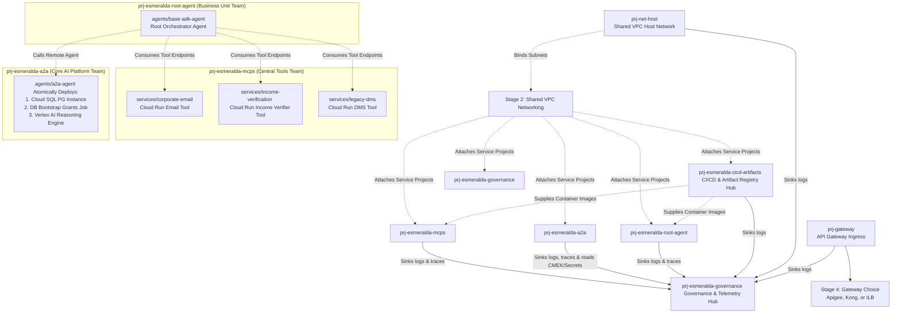
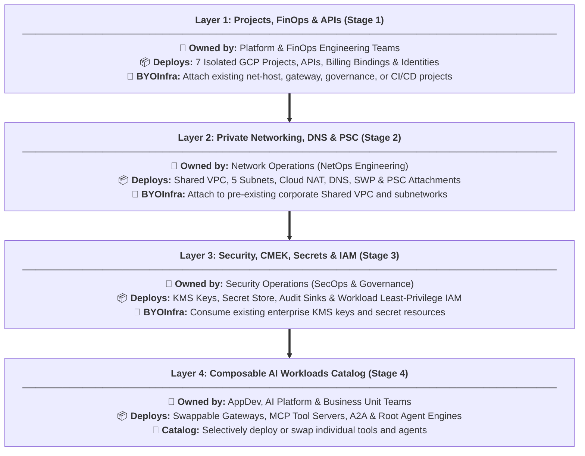

# Official Esmeralda Architecture Documentation

Welcome to the **Official Esmeralda Architecture Documentation**.

Esmeralda is an opinionated, commercial-grade monorepo blueprint designed to accelerate the path to production for AI Agents and Model Context Protocol (MCP) servers on Google Cloud Platform. By separating runtime application logic from cloud infrastructure, Esmeralda allows software developers to focus purely on agent reasoning while platform engineers manage secure, declarative infrastructure with Terragrunt.

This documentation organizes the platform's architecture into **self-contained master guides** that combine conceptual design explanations, architectural diagrams, and production-ready Terraform and script implementations.

---

## 💎 Developer Experience (DX) and Automation
The Esmeralda architecture provides a **modernized Developer Experience (DX)**. In contrast to legacy models that require fragile manual scripts (`deploy.sh`) and manual synchronization of local `.env` files containing plaintext IPs and credentials, Esmeralda adopts a declarative, automated approach.

The architecture **100% eliminates the need for manual `deploy.sh` scripts and local `.env` files**:
*   **No `deploy.sh`**: Terragrunt orchestrates deployments declaratively via `terragrunt run-all apply`. It builds a Directed Acyclic Graph (DAG) of dependencies and executes creations in parallel, enforcing correct sequencing without artificial bash sleeps or imperative shell scripts.
*   **No `.env` files**:
    *   **Public Variables**: Centralized in a structured `env.yaml` file per environment.
    *   **Dynamic Injection**: Private endpoint URLs, IPs, and dynamic resource properties are automatically resolved and passed between stages via Terragrunt `dependency` blocks, avoiding manual IP entry on developer machines.
    *   **Protected Secrets**: Critical keys and passwords are securely stored in Secret Manager (Stage 3) and consumed dynamically over encrypted private channels.

---

## 🗺️ Enterprise Multi-Project Topology

To enforce strict Separation of Concerns (SoC) and align infrastructure with Google Cloud enterprise Landing Zone best practices, Esmeralda's architecture is segregated into **seven independent GCP projects**, ensuring that each operational domain controls its own security and resource boundary:

We organize Esmeralda's lifecycle stages to map directly to Google Cloud's enterprise landing zone standards. We divide our workloads across **five independent workload and service projects** representing distinct engineering and business teams, connected back to a central Shared VPC, alongside a dedicated central governance and telemetry hub project:

### The Architecture Design Philosophy:
*   **The Shared VPC Project (`prj-net-host`)**: Managed by NetOps. Owns the core routing, private DNS zones, and Private Service Connect (PSC).
*   **The Ingress Project (`prj-gateway`)**: Managed by PlatformOps. Hosts the public gateway endpoint.
*   **The CI/CD & Artifacts Project (`prj-esmeralda-cicd-artifacts`)**: Managed by Platform Engineering. Hosts central CI/CD pipelines (Cloud Build), container images, and Artifact Registry repositories shared across workloads.
*   **The Central Tools Project (`prj-esmeralda-mcps`)**: Managed by the AppDev Team. Deploys the reusable corporate tool API servers.
*   **The AI Platform Project (`prj-esmeralda-a2a`)**: Managed by the Core AI Team. Hosts cross-company reusable assistant agents (`a2a-agent`) and their Cloud SQL task stores.
*   **The Business Unit Application Project (`prj-esmeralda-root-agent`)**: Managed by specific Business Unit Teams. Owns the customer-facing user reasoning engine, which orchestrates calls to the other projects.
*   **The Governance & Telemetry Hub Project (`prj-esmeralda-governance`)**: Managed by SecOps / PlatformOps. Centralizes security elements (KMS Keyrings, Secrets, Certificate Manager certificates) and telemetry components (Log Analytics buckets, Cloud Trace datasets, BigQuery tables), completely separating security/observability governance from core workloads.

---

---

## 🏗️ Modular & Composable Infrastructure Architecture

Esmeralda builds enterprise AI infrastructure **from the ground up** using a modular, composable, four-layer approach. Rather than locking platforms into a monolithic stack, each stage operates as an independent building block. This allows organizations to either deploy a complete greenfield architecture from scratch or leverage the **BYOInfra (Bring Your Own Infrastructure)** pattern to selectively attach Esmeralda workloads to pre-existing corporate networks, security keys, and GCP projects.

### Detailed Layer Responsibilities & BYOInfra Integration:

1. **Layer 1 (Stage 1: Projects, FinOps & APIs)**
   * **Target Teams**: Platform Engineering & FinOps (`netops`, `platformops`, `platform-engineering`, `appdev-tools`, `core-ai-agents`, `business-unit-teams`, `secops`).
   * **What it Deploys**: Provisions up to seven isolated GCP projects (`net_host`, `gateway`, `cicd`, `mcps`, `a2a`, `root_agent`, `governance`), activates Google Cloud service APIs, links billing accounts, and force-creates GCP service agents.
   * **BYOInfra Integration**: If `byo_net_host_project`, `byo_gateway_project`, `byo_governance_project`, or `byo_cicd_project` toggles are enabled in `env.yaml`, Esmeralda skips project creation and API enablement, consuming pre-existing enterprise projects instead.

2. **Layer 2 (Stage 2: Private Networking, DNS & PSC)**
   * **Target Team**: Network Operations (`NetOps`).
   * **What it Deploys**: Provisions a zero-trust Shared VPC network in `prj-net-host`, internal subnetworks (`core`, `proxy`, `psc`, `psc-interface`), Cloud NAT gateway, private Cloud DNS zones (`*.esmeralda.internal` and `*.internal.gateway`), Private Service Connect (PSC) Network Attachments for serverless VPC access, and a Secure Web Proxy (SWP) for audited internet egress.
   * **BYOInfra Integration**: When `byo_networking = true` is supplied, Esmeralda bypasses VPC and subnet creation and attaches workload projects directly to the customer's pre-configured Shared VPC subnets.

3. **Layer 3 (Stage 3: Security, CMEK Keys, Secrets & IAM)**
   * **Target Team**: Security Operations (`SecOps`) & Platform Governance.
   * **What it Deploys**: Centralizes Cloud KMS Keyrings and CMEK encryption keys in `prj-esmeralda-governance` to encrypt workloads at rest, provisions Secret Manager secrets, configures centralized audit log sinks (BigQuery datasets and Cloud Storage log buckets), and creates dedicated workload Service Accounts with strict least-privilege IAM bindings.
   * **BYOInfra Integration**: When `byo_security = true` is declared, KMS key and secret creation is skipped, and workload identities bind directly to enterprise-managed KMS keys and existing secrets.

4. **Layer 4 (Stage 4: Composable AI Workloads Catalog)**
   * **Target Teams**: Application Developers, Core AI Platform Engineers, and Business Unit Teams.
   * **What it Deploys**: A composable catalog of AI application runtime modules:
     * **Swappable Gateways (`services/apigee`, `services/kong`, `services/ilb`)**: Interchangeable ingress gateways adhering to a standardized variable contract.
     * **Composable MCP Tool Servers (`services/corporate-email`, `services/income-verification`, `services/legacy-dms`)**: Shared enterprise utility APIs packaged as containerized Cloud Run services.
     * **Atomic AI Agents (`agents/a2a-agent`, `agents/base-adk-agent`)**: Self-contained Reasoning Engine workloads. The `a2a-agent` atomically provisions its Cloud SQL PostgreSQL database, runs a VPC-internal bootstrap job to grant DB schema roles, and deploys the Vertex AI Reasoning Engine.

---

---

## 🔄 Architectural Component Mapping Table

Below is the mapping showing how platform components are organized across the respective Terragrunt stages, along with their isolated target Google Cloud projects and cross-dependency input parameters:

| Component | Target Terragrunt Stage | Target GCP Project | Dependency Inputs |
| :--- | :--- | :--- | :--- |
| Core Projects & APIs | **`stage-1-projects`** | Up to 7 Isolated Projects | `billing_account`, `byo_net_host_project`, `byo_gateway_project`, `byo_governance_project`, `byo_cicd_project` |
| Shared VPC Networking | **`stage-2-networking`** | `prj-net-host` | `net_host_project_id` (from stage-1), `governance_project_id` (from stage-1) |
| IAM, SAs & CMEK Keys | **`stage-3-security`** | Split across workloads & `prj-esmeralda-governance` | Project IDs from Stage 1 |
| Swappable Ingress Gateway | **`stage-4-workloads/services/kong`** *(or `apigee`/`ilb`)* | `prj-gateway` | `gateway_project_id` (stage-1), `network_id` (stage-2) |
| DMS MCP Service | **`stage-4-workloads/services/legacy-dms`** | `prj-esmeralda-mcps` | `mcps_project_id` (stage-1), `subnet_id` (stage-2) |
| Email MCP Service | **`stage-4-workloads/services/corporate-email`** | `prj-esmeralda-mcps` | `mcps_project_id` (stage-1), `subnet_id` (stage-2) |
| Income Verification Service | **`stage-4-workloads/services/income-verification`** | `prj-esmeralda-mcps` | `mcps_project_id` (stage-1), `subnet_id` (stage-2) |
| Cloud SQL & A2A Agent | **`stage-4-workloads/agents/a2a-agent`** | `prj-esmeralda-a2a` | `a2a_project_id` (stage-1), `vpc_id` (stage-2), `subnet_id` (stage-2) |
| Root / Orchestrator Agent | **`stage-4-workloads/agents/base-adk-agent`** | `prj-esmeralda-root-agent` | `root_project_id` (stage-1), `a2a_agent_endpoint_url` (from `a2a-agent`), tool endpoints |
| Security & Telemetry Hub | **`stage-3-security`** | `prj-esmeralda-governance` | `governance_project_id` (stage-1), audit sinks across all 7 projects |

---

---

## 🗺️ Master Architecture Guides Structure

The architecture documentation is divided into two primary focus areas, enabling end-to-end reading and deployment:

### 1. 🏢 [Guide 01: Platform Foundations (Stages 1, 2, and 3)](01_platform_foundations.md)
*   **Scope**: Initial ecosystem provisioning, networking, and enterprise security.
*   **Unified Content**:
    *   **Stage 1: Projects, FinOps, and APIs**: Structuring of 6 isolated projects, AI model cost attribution and compute fixed vs. variable expense tracking, and BYOInfra toggles.
    *   **Stage 2: Private Networking, DNS, and Private Service Connect (PSC)**: VPCs, subnets, Cloud NAT, egress control with Secure Web Proxy (SWP), internal Cloud DNS, and PSC Network Attachments for Vertex AI connections.
    *   **Stage 3: Security, CMEK, Secrets, and Identities**: Centralized KMS key management, Secret Manager, enterprise structured log sinks, and strict identity auditing (isolated Service Accounts with least privilege).
    *   **Complete HCL**: Verbatim `versions.tf`, `variables.tf`, `main.tf`, and `outputs.tf` for each foundational stage.

### 2. 🏗️ [Guide 02: Workloads, Integration & Delivery (Stage 4 and Strategy)](02_workloads_and_delivery.md)
*   **Scope**: Deployment of the product shelf (gateways, MCP tools, and agents) and actual deploy and test orchestration.
*   **Unified Content**:
    *   **Stage 4: AI Application Catalog**:
        *   **Swappable Ingress Gateways**: Complete blueprints for Apigee X (with local-exec KVM population for dynamic routes), Kong Gateway on Cloud Run, or direct Internal Load Balancer.
        *   **Composable MCP Servers**: Artifact Registry packaging and private Cloud Run deployment of utilities like DMS and Financial Calculators.
        *   **Reasoning Engines (ADK Runtimes)**: Agent `.zip` package uploads, staging buckets, and Vertex AI Reasoning Engine activation.
        *   **Terragrunt Live HCL**: Complete real-world configurations for orchestrating workloads under `live/dev/`.
    *   **Greenfield vs. Brownfield (BYOInfra) Strategy**: Real environment files (`env.yaml`) and Terragrunt skip recipes to bypass creation and conditionally fall back onto legacy corporate networks.
    *   **Database Bootstrap**: Secure privilege initialization sequencing for PostgreSQL and Cloud SQL via VPC-internal Cloud Run jobs, complete with lifecycle sequence diagrams.
    *   **DX Onboarding Ecosystem (Symmetric Testing)**: Offline testing scripts with mocks (`test_local.py`) and integrated post-deployment verification (`test_remote.py`), unified via `Makefile`.
    *   **DX Automation**: Detailed breakdown showing how declarative infrastructure eliminates `deploy.sh` and manual `.env` file management.

---

## 🚀 How to Execute Deployments with This Guide

Deployments are structured sequentially. For each phase:
1.  **Read the introductory overview** at the beginning of each section to understand the design, client governance requirements, and FinOps/Security implications.
2.  **Copy the English source code** (Terraform/Terragrunt HCL or Python/Shell scripts) located in the respective implementation section.
3.  **Paste the code directly into the corresponding file structure** in your infrastructure repository (`infrastructure/modules/` or `infrastructure/live/`).

All code blueprints in this documentation are **validated, lint-free, and production-ready**, ensuring safe and predictable copy-paste execution.

---

*To begin deploying network and project foundations, proceed to:* **[01_platform_foundations.md](01_platform_foundations.md)**
