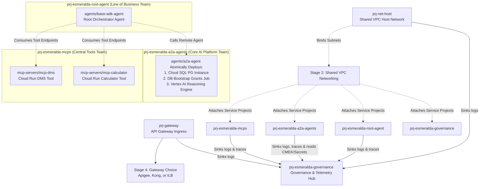

# Plano de Migração Unificado do Esmeralda v2

Bem-vindo ao **Plano de Migração Unificado do Esmeralda (v2)**. 

Este repositório consolidado foi projetado para simplificar drasticamente o processo de migração da infraestrutura monolítica do Esmeralda para uma arquitetura modular, com governança alinhada às melhores práticas de Landing Zone empresariais do Google Cloud e do framework FAST.

Diferente do plano de migração anterior (que exigia alternar constantemente entre guias conceituais e arquivos técnicos dispersos), a **versão v2** organiza todo o conhecimento em **documentos mestre totalmente lineares e autocontidos**. Cada documento integra perfeitamente as explicações e diagramas em português com os códigos completos e scripts em inglês prontos para implantação (**Ctrl+C / Ctrl+V**).

---

## 💎 Revolução na Experiência do Desenvolvedor (DX)
Um dos marcos mais importantes desta migração é a **modernização completa da Experiência do Desenvolvedor (DX)**. No modelo legado, os deploys do Esmeralda exigiam scripts manuais frágeis (`deploy.sh`) e a sincronização manual de arquivos `.env` locais contendo IPs e credenciais em texto claro. 

A nova arquitetura **elimina 100% a necessidade de `deploy.sh` e arquivos `.env`**:
*   **Fim do `deploy.sh`**: O Terragrunt orquestra o deploy de forma totalmente declarativa com `terragrunt run-all apply`. Ele monta um grafo direcionado de dependências (DAG) e executa as criações em paralelo, respeitando o sequenciamento correto sem a necessidade de `sleeps` artificiais ou scripts imperativos em bash.
*   **Fim dos arquivos `.env`**:
    *   **Variáveis Públicas**: Centralizadas em um arquivo `env.yaml` estruturado para cada ambiente.
    *   **Injeção Dinâmica**: URLs de endpoints privados, IPs e recursos dinâmicos são resolvidos e passados automaticamente de um estágio para o outro via blocos `dependency` do Terragrunt, evitando o preenchimento manual de IPs no disco local do desenvolvedor.
    *   **Segredos Protegidos**: Chaves e senhas críticas são guardadas com segurança no Secret Manager (Stage 3) e consumidas dinamicamente em canais privados criptografados.

---

## 🗺️ Topologia Multi-Projeto Alinhada ao FAST (FAST-Aligned Platform Layout)

Para garantir o isolamento completo de responsabilidades (Separation of Concerns - SoC) e alinhar a infraestrutura às melhores práticas de Landing Zone empresariais do Google Cloud, a arquitetura do Esmeralda é segregada em **seis projetos GCP independentes**. Isso reflete exatamente o layout FAST (Fabric Associated Services Template), onde cada equipe operacional controla sua respectiva unidade de controle:

We organize Esmeralda's lifecycle stages to map directly to Google Cloud's enterprise landing zone standards. We divide our workloads across **four independent service projects** representing distinct engineering and business teams, connected back to a central Shared VPC, alongside a dedicated central governance and telemetry hub project:



### The Architecture Design Philosophy:
*   **The Shared VPC Project (`prj-net-host`)**: Managed by NetOps. Owns the core routing, private DNS zones, and Private Service Connect (PSC).
*   **The Ingress Project (`prj-gateway`)**: Managed by PlatformOps. Hosts the public gateway endpoint.
*   **The Central Tools Project (`prj-esmeralda-mcps`)**: Managed by the AppDev Team. Deploys the reusable corporate tool API servers.
*   **The AI Platform Project (`prj-esmeralda-a2a-agents`)**: Managed by the Core AI Team. Hosts cross-company re-usable assistant agents and their SQL task stores.
*   **The LOB App Project (`prj-esmeralda-root-agent`)**: Managed by a specific business unit. Owns the customer-facing user reasoning engine, which orchestrates calls to the other projects.
*   **The Governance & Telemetry Hub Project (`prj-esmeralda-governance`)**: Managed by SecOps / PlatformOps. Centralizes security elements (KMS Keyrings, Secrets, Certificate Manager certificates) and telemetry components (Log Analytics buckets, Cloud Trace datasets, BigQuery tables), completely separating security/observability governance from core workloads.

---

---

## 📂 Estrutura de Diretórios do Repositório Terragrunt

A separação estrita entre módulos de infraestrutura reutilizáveis (nosso catálogo ou **Product Shelf**) e as configurações reais de implantação de cada ambiente (nosso carrinho de compras ou **Shopping Cart**) é organizada na seguinte estrutura de arquivos limpa e previsível:

```text
infrastructure/
├── modules/                                 # PURE, REUSABLE TERRAFORM MODULES
│   ├── 1-projects/                          # Seeds projects & enables APIs (Stage 1)
│   ├── 2-networking/                        # Provisions Shared VPC, subnets, DNS (Stage 2)
│   ├── 3-security/                          # Provisions Secret Manager, KMS, Log Sinks (Stage 3)
│   │
│   └── 4-workloads/                         # THE PRODUCT CATALOG SHELF (Stage 4)
│       ├── gateways/                        # --- GATEWAYS SHELF ---
│       │   ├── apigee/                      # Product A: Apigee X Enterprise Gateway
│       │   ├── kong/                        # Product B: Lightweight Kong on Cloud Run
│       │   └── ilb/                         # Product C: Direct Internal Load Balancer
│       │
│       ├── mcp-servers/                     # --- MCP TOOLS SHELF ---
│       │   ├── mcp-dms/                     # DMS Document Tool Service
│       │   └── mcp-calculator/              # Financial Calculator Tool Service
│       │
│       └── agents/                          # --- AI AGENTS SHELF ---
│           ├── base-adk-agent/              # Root Orchestrator (Reasoning Engine Only)
│           └── a2a-agent/                   # Mortgage Assistant (Atomic: SQL + Bootstrap + Agent)
│
└── live/                                    # LIVE INFRASTRUCTURE ENVIRONMENT CONFIG
    ├── terragrunt.hcl                       # Root config: remote state, global provider blocks
    ├── dev/                                 # DEVELOPMENT ENVIRONMENT
    │   ├── env.yaml                         # Dev environment vars (billing_id, region, prefix)
    │   │
    │   ├── stage-1-projects/
    │   │   └── terragrunt.hcl               # Deploys up to 6 Projects & APIs
    │   ├── stage-2-networking/
    │   │   └── terragrunt.hcl               # Deploys VPC, NAT, Firewalls, Private DNS
    │   ├── stage-3-security/
    │   │   └── terragrunt.hcl               # Deploys KMS, Secrets, Sinks across projects
    │   │
    │   └── stage-4-workloads/               # COMPOSABLE ASSEMBLY DIRECTORY
    │       ├── gateway/
    │       │   └── terragrunt.hcl           # Swappable: Deploys chosen Gateway
    │       ├── mcp-servers/
    │       │   ├── mcp-dms/
    │       │   │   └── terragrunt.hcl       # Deploys DMS to prj-esmeralda-mcps
    │       │   └── mcp-calculator/
    │       │       └── terragrunt.hcl       # Deploys Calculator to prj-esmeralda-mcps
    │       └── agents/
    │           ├── a2a-agent/
    │           │   └── terragrunt.hcl       # Deploys private SQL & ADK Agent to prj-esmeralda-a2a-agents
    │           └── base-adk-agent/
    │               └── terragrunt.hcl       # Deploys Orchestrator to prj-esmeralda-root-agent
```

---

---

## 🔄 Tabela de Mapeamento de Migração de Componentes

Abaixo, encontre o mapeamento exato mostrando como os componentes do legado monolítico são transicionados para os respectivos estágios do Terragrunt, com seus projetos de destino isolados no Google Cloud e seus respectivos parâmetros e entradas de dependência cruzada:

| Monolithic Component | Target Terragrunt Stage | Target GCP Project | Dependency Inputs |
| :--- | :--- | :--- | :--- |
| `module.foundation` (Core APIs) | **`stage-1-projects`** | *Pre-workloads* | `billing_account`, `byo_net_host_project`, `byo_gateway_project`, `byo_governance_project` |
| `module.networking` | **`stage-2-networking`** | `prj-net-host` | `net_host_project_id` (from stage-1), `governance_project_id` (from stage-1) |
| IAM, SAs & Encryption Keys | **`stage-3-security`** | Split across all | Project IDs from Stage 1 |
| Ingress / Load Balancer | **`stage-4-workloads/gateway`** | `prj-gateway` | `gateway_project_id` (stage-1), `network_id` (stage-2) |
| DMS MCP Service | **`stage-4-workloads/mcp-servers/mcp-dms`** | `prj-esmeralda-mcps` | `mcps_project_id` (stage-1), `subnet_id` (stage-2) |
| Calculator MCP Service | **`stage-4-workloads/mcp-servers/mcp-calculator`** | `prj-esmeralda-mcps` | `mcps_project_id` (stage-1), `subnet_id` (stage-2) |
| Cloud SQL & A2A Agent | **`stage-4-workloads/agents/a2a-agent`** | `prj-esmeralda-a2a-agents` | `a2a_project_id` (stage-1), `vpc_id` (stage-2), `subnet_id` (stage-2) |
| Root / Orchestrator Agent | **`stage-4-workloads/agents/base-adk-agent`** | `prj-esmeralda-root-agent` | `root_project_id` (stage-1), `a2a_agent_endpoint_url` (from `a2a-agent`), tool endpoints |
| Security, Governance, & Telemetry | **`stage-3-security`** | `prj-esmeralda-governance` | `governance_project_id` (stage-1), sinks across all 6 projects |

---

---

## 🗺️ Estrutura dos Guias Unificados

O plano de migração está dividido em duas grandes áreas de foco, permitindo a leitura e a implantação de ponta a ponta:

### 1. 🏢 [Guia 01: Fundações da Plataforma (Estágios 1, 2 e 3)](01_platform_foundations.md)
*   **Escopo**: Provisionamento inicial do ecossistema, redes e segurança corporativa.
*   **Conteúdo Unificado**:
    *   **Estágio 1: Projetos, FinOps e APIs**: Estruturação de 6 projetos isolados, atribuição de faturamento de modelos de IA e despesas fixas vs. variáveis de computação, e toggles BYOInfra.
    *   **Estágio 2: Redes Privadas, DNS e Private Service Connect (PSC)**: Configuração de VPCs, subredes, Cloud NAT, controle de egress com Secure Web Proxy (SWP), Cloud DNS interno e Network Attachment para conexões PSC com Vertex AI.
    *   **Estágio 3: Segurança, CMEK, Secrets e Identidades**: Gestão centralizada de chaves KMS, Secret Manager, log sinks corporativos estruturados e auditoria estrita de identidades (Service Accounts isoladas e privilégio mínimo).
    *   **HCL Completo**: Arquivos `versions.tf`, `variables.tf`, `main.tf` e `outputs.tf` verbatim de cada estágio.

### 2. 🏗️ [Guia 02: Cargas de Trabalho, Integração & Delivery (Estágio 4 e Estratégia)](02_workloads_and_delivery.md)
*   **Escopo**: Implantação da prateleira de produtos (gateways, ferramentas MCP e agentes) e orquestração do deploy real e testes.
*   **Conteúdo Unificado**:
    *   **Estágio 4: Catálogo de Aplicações de IA**:
        *   **Gateways Ingress Intercambiáveis**: Códigos completos para Apigee X (e população local-exec de KVM para rotas dinâmicas), Kong Gateway no Cloud Run, ou Internal Load Balancer direto.
        *   **Servidores MCP Composíveis**: Empacotamento Artifact Registry e Cloud Run privado de utilitários como o DMS e Calculadoras Financeiras.
        *   **Motores de Raciocínio (ADK Runtimes)**: Uploads de pacotes `.zip` de agentes, buckets de staging e ativação do Vertex AI Reasoning Engine.
        *   **Terragrunt Live HCL**: Configurações reais e completas para orquestrar as cargas sob `live/dev/`.
    *   **Estratégia Greenfield vs. Brownfield (BYOInfra)**: Arquivos reais de ambiente (`env.yaml`) e receitas de skip do Terragrunt para pular compilações e fazer fallback condicional sobre redes corporativas legadas.
    *   **Database Bootstrap**: O sequenciamento de inicialização seguro de privilégios de acesso do PostgreSQL e do Cloud SQL via Jobs internos à VPC com o respectivo diagrama de sequência de ciclo de vida.
    *   **Ecossistema Onboarding DX (Testes Simétricos)**: Scripts de testes offline com Mocks (`test_local.py`) e verificações integradas pós-deploy (`test_remote.py`), integrados via `Makefile`.
    *   **Revolução na DX**: Comparação detalhada mostrando como a nova infraestrutura remove o uso de `deploy.sh` e o caótico controle manual de arquivos `.env`.

---

## 🚀 Como Executar a Migração com Este Guia

A migração foi desenhada de forma sequencial. Para cada fase:
1.  **Leia a introdução em português** no início da seção para compreender o design, os requisitos de governança do cliente e os impactos de FinOps/Segurança.
2.  **Copie o código-fonte em inglês** (HCL do Terraform/Terragrunt ou scripts em Python/Shell) localizado na respectiva seção de implementação.
3.  **Cole o código diretamente na estrutura de arquivos correspondente** em seu repositório de infraestrutura (`infrastructure/modules/` ou `infrastructure/live/`).

Todos os códigos contidos nesta documentação estão **validados, livres de lints e prontos para produção**, garantindo que você tenha um "copiar e colar" seguro e previsível.

---

*Para iniciar a migração das fundações de rede e projetos, acesse:* **[01_platform_foundations.md](01_platform_foundations.md)**
