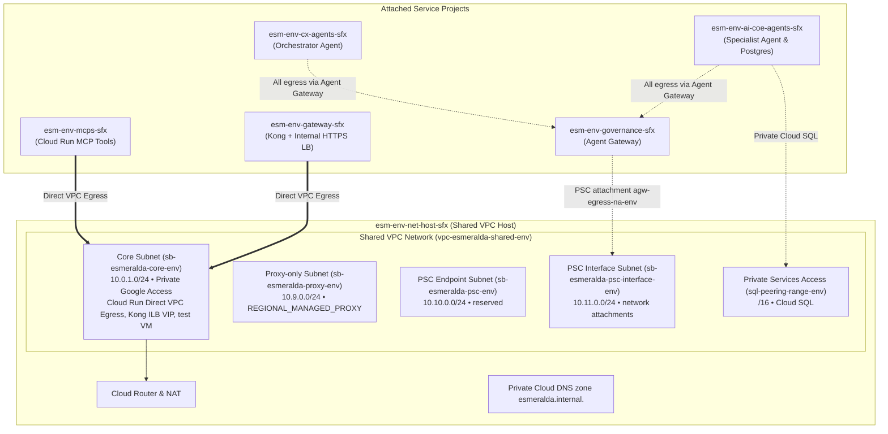

# Layer 2: Private Networking, DNS & Private Service Connect (PSC)

Welcome to the technical deep-dive for **Layer 2 (Private Networking & Connectivity)**.

Layer 2 deploys an enterprise Shared VPC network inside `esm-<env>-net-host-<sfx>`, attaches the workload projects to it, establishes the private subnet topology, prepares the subnet that Private Service Connect (PSC) network attachments use, and creates the private Cloud DNS zone `esmeralda.internal.`.

* **Module:** [`infrastructure/modules/2-networking/`](../../../infrastructure/modules/2-networking/main.tf)
* **Live config:** `infrastructure/live/<env>/layer-2-networking/`
* **Deploy:** `make deploy-networking ENV=<env>`

---

## The 60-Second Mental Model: Why Layer 2 Exists

AI agents running on Vertex AI Agent Engine (Agent Runtime) execute inside Google-managed tenant networks, not in your VPC. By default, letting them reach private databases (Cloud SQL) or corporate tools (Cloud Run MCPs) would require either:
1. Exposing database and tool ports to the public internet (a severe enterprise security violation).
2. Complex VPC Peering meshes that exhaust IP address space (CIDR) and suffer from non-transitive routing.

**Layer 2 creates one centralized Shared VPC. In Layer 4, the Agent Gateway attaches to it with a PSC network attachment, so agents reach private tools and other agents over private IPs with zero public endpoints.**

---

## Persona & Role Breakdown: Who Owns Layer 2?

| Engineering Persona | Role & Daily Responsibilities | What They Own | What They NEVER Touch |
| :--- | :--- | :--- | :--- |
| **Network Operations (NetOps)** | Managing CIDR allocations, routing tables, Cloud NAT, firewall ingress rules, and DNS resolution. | `infrastructure/modules/2-networking/`, Shared VPC host, subnets, firewall rules, Cloud Router. | Application Python code, agent prompt graphs, SQL schemas. |
| **Platform / SecOps Engineer** | Auditing private egress paths and ensuring zero-trust traffic segmentation. | Subnet IAM bindings (`roles/compute.networkUser`), PSC attachments. | Direct database query tuning or tool implementations. |
| **AI Application Developer** (CX or AI CoE team) | Consuming internal private domain names (`*.esmeralda.internal`). | Agent tool client configurations (e.g. `https://legacy-dms.esmeralda.internal/mcp`, `https://ai-coe-mortgage-specialist.esmeralda.internal`). | Subnet IP math, VPC peering, firewall configurations. |

---

## Architecture Decision Records (ADRs): The "Why"

### ADR-02.1: Shared VPC Hub-and-Spoke vs. VPC Peering Mesh
* **Context:** Interconnecting the workload projects via standard VPC Peering requires many bilateral peering links, cannot route transitively, and risks overlapping IP space.
* **Decision:** Provision a single, authoritative **Shared VPC** (`vpc-esmeralda-shared-<env>`) in `esm-<env>-net-host-<sfx>` and attach the `mcps`, `ai-coe-agents`, `cx-agents`, `gateway` and `governance` projects as **Service Projects** via `google_compute_shared_vpc_service_project`.
* **Benefit:** Centralizes firewall and routing policies under NetOps while allowing workload runtimes in spoke projects to bind to host subnets via `roles/compute.networkUser`.

---

### ADR-02.2: Direct VPC Egress & PSC Network Attachments vs. Serverless VPC Access Connector
* **Context:** Traditional Serverless VPC Access Connectors require dedicated `/28` subnets with underlying VM instances that incur fixed hourly costs and have scaling bottlenecks during bursty agent traffic.
* **Decision:**
  * **Cloud Run** services that need private egress (Kong, the `income-verification` and `corporate-email` MCP servers, and the specialist's Cloud SQL bootstrap job) use **Direct VPC Egress**: their instances get an IP straight from the `core` subnet.
  * Google-managed services that can't join the VPC use a **PSC network attachment**. *What it is:* a resource in a VPC subnet that lets a managed service plug a network interface into that subnet (PSC-Interface). *In Esmeralda:* the Agent Gateway's attachment `agw-egress-na-<env>` (created in Layer 4 in the governance project) uses the dedicated `psc-interface` subnet created here.
* **Benefit:** No connector VMs to run, and a single, auditable private entry point into the VPC for all agent egress.

---

## Shared VPC Network Topology



---

## Technical Implementation Breakdown (`modules/2-networking/`)

### 1. Subnet Classifications & CIDR Allocations

| Subnet Identifier | CIDR Block | Purpose & Role | Connected Workloads |
| :--- | :--- | :--- | :--- |
| **`sb-esmeralda-core-<env>`** | `10.0.1.0/24` | Primary backend subnet with Private Google Access enabled. | Cloud Run Direct VPC Egress (Kong, MCP tools), the Kong internal HTTPS LB forwarding rule, test VM. |
| **`sb-esmeralda-proxy-<env>`** | `10.9.0.0/24` | `REGIONAL_MANAGED_PROXY` (Active): the Envoy proxies Google runs for regional managed load balancers. | Kong's regional internal HTTPS load balancer (and Apigee, if selected). |
| **`sb-esmeralda-psc-<env>`** | `10.10.0.0/24` | Range reserved for PSC consumer endpoints. | No endpoint is deployed in it today. |
| **`sb-esmeralda-psc-interface-<env>`** | `10.11.0.0/24` | Subnet for PSC network attachments (Private Google Access on). | The Agent Gateway attachment `agw-egress-na-<env>` (Layer 4). |
| **`sql-peering-range-<env>`** | `/16` (Google-allocated) | Private Services Access (PSA) range peered with `servicenetworking.googleapis.com`. | Private Cloud SQL PostgreSQL instance in `esm-<env>-ai-coe-agents-<sfx>`. |

Also created: Cloud Router `cr-esmeralda-nat-<env>` with Cloud NAT `nat-esmeralda-outbound-<env>` (all subnets), and firewall rules `allow-iap-ssh-<env>` (IAP range `35.235.240.0/20` → TCP 22) and `allow-psc-interface-ingress-<env>` (from `10.11.0.0/24`).

---

### 2. Private DNS Zone (`esmeralda.internal.`)

**What it is:** a Cloud DNS *private zone* answers queries only for the VPC networks it is bound to; it is invisible from the internet.

**In Esmeralda:** Layer 2 creates the zone `esmeralda-private-dns-<env>` for `esmeralda.internal.`, bound to the Shared VPC. It starts empty. In Layer 5, the [Kong module](../../../infrastructure/modules/5-workloads/services/kong/main.tf) adds `esmeralda.internal` and `*.esmeralda.internal` A records pointing at Kong's internal load balancer, so every private service (`legacy-dms`, `income-verification`, `corporate-email`, `ai-coe-mortgage-specialist`, ...) is reached through Kong, which routes by `Host` header. The Agent Gateway resolves these names by DNS-peering this zone (never `googleapis.com.`); see the [Agent Gateway guide](../3-agentops-and-lifecycle/01-central-agent-gateway.md#37-agent-connectivity-template-act).

> [!NOTE]
> `.internal` can't get a public certificate, which is why Kong's `*.esmeralda.internal` certificate is signed by the internal Root CA from [Layer 3](./03-security-iam-and-telemetry.md). See [TLS and certificates](../3-agentops-and-lifecycle/01-central-agent-gateway.md#5-tls-and-certificates-why-we-need-self-signed-cas).

---

### 3. Network Attachments: Who Uses the PSC Interface Subnet

| Attachment | Project | Created by | Used? |
| :--- | :--- | :--- | :--- |
| `agw-egress-na-<env>` | governance | Layer 4 ([6_agent_gateway](../../../infrastructure/modules/4-governance/modules/6_agent_gateway/main.tf)) | **Yes**: all agent egress to `*.esmeralda.internal` enters the VPC here. |
| `gateway-psc-interface-attachment-<env>` | net-host | Layer 2 | Created (`enable_psc_interface = true`) but not referenced by any later layer. |
| `<agent>-psc-attachment-<env>` | each agent project | Layer 5 agent modules (`enable_psc_network = true`) | Only used as the engine's `psc_interface_config` when the agent is **not** bound to an Agent Gateway; in dev/prd agents are bound, so it is unused. |

---

### 4. Subnet IAM Network User Permissions (`roles/compute.networkUser`)
To permit serverless runtimes in spoke projects to consume host subnets, Layer 2 grants `roles/compute.networkUser` on the `core` and `psc-interface` subnets to seven Google-managed service agents:
* `service-{mcps_number}@serverless-robot-prod.iam.gserviceaccount.com`
* `service-{gateway_number}@serverless-robot-prod.iam.gserviceaccount.com`
* `service-{ai_coe_agents_number}@serverless-robot-prod.iam.gserviceaccount.com`
* `service-{ai_coe_agents_number}@gcp-sa-aiplatform.iam.gserviceaccount.com`
* `service-{ai_coe_agents_number}@gcp-sa-aiplatform-re.iam.gserviceaccount.com`
* `service-{cx_agents_number}@gcp-sa-aiplatform.iam.gserviceaccount.com`
* `service-{cx_agents_number}@gcp-sa-aiplatform-re.iam.gserviceaccount.com`

When `enable_psc_interface = true` (the default), the same identities also get `roles/compute.networkUser`, `roles/compute.networkAdmin` and `roles/dns.peer` at the **host project** level. The Agent Gateway's own service agent receives `compute.networkUser` and `dns.peer` on the host project in Layer 4.

---

### 5. Optional & Legacy Resources
* **Secure Web Proxy (SWP):** the module can deploy an SWP at `10.0.1.100` (`enable_secure_web_proxy`), but dev and prd set it to `false`. Agent egress control is done by the Agent Gateway instead.
* **`internal.gateway.` zone:** a second private zone with placeholder records (`*` → `10.0.1.200`, `swp` → `10.0.1.100`) is still created when `enable_psc_interface = true`. Current services use `*.esmeralda.internal`.
* **Brownfield:** with `byo_networking = true`, the VPC, subnets, NAT and firewall rules are skipped, and `existing_vpc_id` / `existing_subnet_id` from `env.yaml` are used instead.

---

## Verification & Runbook

### Test Private DNS Resolution from the Test VM
```bash
# SSH into the test VM (it lives in the CX agents project) via IAP tunnel
gcloud compute ssh test-vm-dev --zone=us-central1-f --project=$(cd infrastructure/live/dev/layer-1-projects && terragrunt output -raw cx_agents_project_id) --tunnel-through-iap

# Inside VM: verify internal DNS resolves to the Kong internal LB VIP
dig +short ai-coe-mortgage-specialist.esmeralda.internal
# Output: the private IP of Kong's internal HTTPS load balancer
```

### Inspect the Agent Gateway Network Attachment
```bash
gcloud compute network-attachments describe agw-egress-na-dev \
    --region=us-central1 \
    --project=$(cd infrastructure/live/dev/layer-1-projects && terragrunt output -raw governance_project_id)
```
