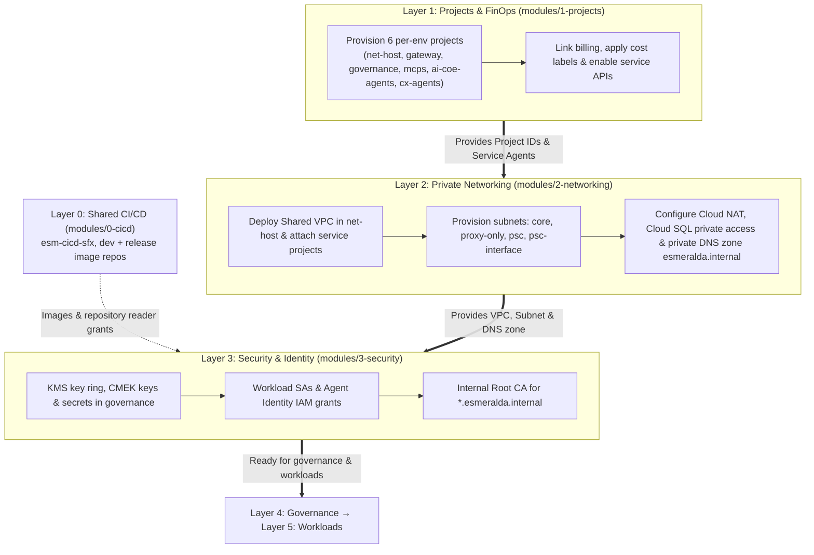

# Platform Foundations (Layers 1, 2, and 3)

This section of the documentation details the conceptual architecture, **Architectural Decision Records (ADRs)**, FinOps governance principles, and Terraform/Terragrunt implementations for Esmeralda's foundational platform.

> [!NOTE]
> Esmeralda is deployed as a stack of numbered **layers**. Layer 0 (`infrastructure/live/shared/layer-0-cicd`) is a single CI/CD project shared by every environment. Layers 1–5 are deployed once per environment from `infrastructure/live/<env>/layer-N-*`, using settings from `infrastructure/live/<env>/env.yaml` (for example `project_prefix = esm-dev`). This section covers Layers 1–3, deployed with `make deploy-foundations ENV=<env>`.

---

## Who Builds What: The Team Model

The foundations exist to give each team its own boundary. Two teams build agents:

| Team | Builds | Lives in | Example |
| :--- | :--- | :--- | :--- |
| **CX team** | User-facing **orchestrator** agents (ADK). They *consume* reusable agents and tools; they don't re-implement them. | `esm-<env>-cx-agents-<sfx>` | `cx-mortgage-orchestrator` |
| **AI CoE team** | **Reusable A2A specialist** agents that any team can call over the [A2A protocol](https://a2a-protocol.org/) through the Agent Gateway and Kong. | `esm-<env>-ai-coe-agents-<sfx>` | `ai-coe-mortgage-specialist` |

Platform teams own the shared projects around them: NetOps (`net-host`), PlatformOps (`gateway`), AppDev Tools (`mcps`), Security & PlatformOps (`governance`) and Platform Engineering (shared `cicd`).

---

## Architecture Decision Records (ADRs): The "Why" Behind Foundations

### 1. ADR-01: Why 7 Isolated GCP Projects Instead of a Monolith?
* **The Problem:** In monolith deployments, all workloads share a single GCP project. This leads to **FinOps attribution blackouts** (inability to distinguish which business unit consumed Vertex AI tokens), **IAM privilege bleeding** (tool developers can inspect platform security keys), and **API quota starvation** (one rogue agent loop kills all corporate workloads).
* **The Decision:** Segregate workloads across **seven specialized GCP projects** (six per environment, plus one shared CI/CD project). Each per-environment project ID is `esm-<env>-<name>-<sfx>`, where `<sfx>` is a random 4-hex suffix:
  * `net-host`: Network Operations boundary (Shared VPC, Cloud NAT, private DNS).
  * `gateway`: Platform ingress boundary (Kong by default; Apigee optional).
  * `mcps`: Reusable corporate MCP tool servers on Cloud Run.
  * `ai-coe-agents`: AI CoE team's reusable A2A specialist agents and their Cloud SQL task store.
  * `cx-agents`: CX team's user-facing orchestrator agents.
  * `governance`: Agent Gateway, Agent Registry, KMS keys, secrets, telemetry and FinOps hub.
  * `cicd` (shared, `esm-cicd-<sfx>`, Layer 0): Cloud Build and the dev/release Artifact Registry repositories.
* **The Benefit:** Blast-radius containment, per-project billing attribution, and API quota isolation.

---

### 2. ADR-02: Why a Shared VPC Over VPC Peering?
* **The Problem:** Traditional VPC Peering is non-transitive (Spoke A cannot reach Spoke B via Host) and leads to IP address (CIDR) exhaustion and subnet overlap issues across large enterprise networks.
* **The Decision:** Deploy a single **Shared VPC** in `esm-<env>-net-host-<sfx>` and attach the workload projects as service projects. Google-managed runtimes that don't live in the VPC (the Agent Gateway) reach it through a **Private Service Connect (PSC) network attachment**.
* **The Benefit:**
  * Cloud Run MCP tools, Kong and Cloud SQL communicate over private internal IPs; agent egress to private services goes through the Agent Gateway into the same VPC.
  * One IP plan owned by NetOps, so no subnet overlap conflicts.
  * Central firewall, routing and DNS policy.

---

### 3. ADR-03: Why Centralized Keys & Secrets in a Dedicated Governance Project?
* **The Problem:** When KMS encryption keys and secrets are created locally within workload projects, rotating keys, auditing access logs, and proving compliance (SOC 2, ISO 27001) requires querying dozens of separate project perimeters.
* **The Decision:** Create the Cloud KMS key ring, **Customer-Managed Encryption Keys (CMEK)** and platform secrets in `esm-<env>-governance-<sfx>`, and grant workload identities narrowly scoped roles on them.
* **The Benefit:** Separation of duties between Security Administrators (SecOps) and Application Developers (AppDev), with one place to audit key and secret access. See [Layer 3](./03-security-iam-and-telemetry.md) for what currently consumes these keys.

---

## Foundations 3-Layer Progression Pipeline

---

## Foundations Detailed Guides

1. **[Layer 1: Foundational Projects, Billing (FinOps), and APIs](./01-projects-and-finops.md)**
   * Architectural & FinOps Deep-Dive
   * Technical Specifications (`modules/1-projects/`)
2. **[Layer 2: Private Networking, DNS, and Private Service Connect (PSC)](./02-private-networking.md)**
   * Network Topology & Secure Egress Overview
   * Technical Specifications (`modules/2-networking/`)
3. **[Layer 3: Security, CMEK Keys, Secrets, Identities, and Internal PKI](./03-security-iam-and-telemetry.md)**
   * Service Accounts, Agent Identity, and Least-Privilege IAM Overview
   * Technical Specifications (`modules/3-security/`)

**Next:** Layer 4 builds the [Central Agent Gateway](../3-agentops-and-lifecycle/01-central-agent-gateway.md) and [centralized monitoring & FinOps](../3-agentops-and-lifecycle/03-centralized-monitoring-and-dashboards.md) on top of these foundations; Layer 5 deploys the [workloads catalog](../2-workloads-and-catalog/index.md).
