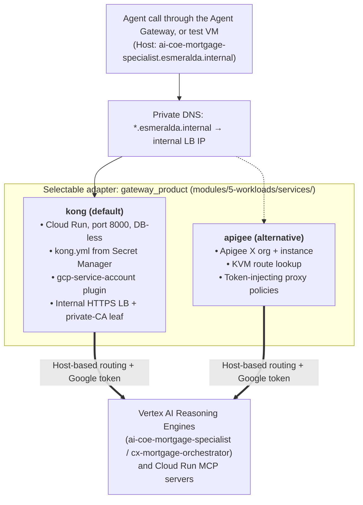

# Layer 5 Workloads: Swappable Ingress Gateways

Welcome to the technical deep-dive for **Layer 5 Ingress Gateways**.

**What an ingress gateway is:** an API gateway is a reverse proxy that sits in front of a set of backend services. It gives them one stable entry point and applies cross-cutting concerns (routing, authentication, rate limiting) so that each backend doesn't have to.

**How Esmeralda uses it:** every private hostname under `*.esmeralda.internal` (the A2A specialist, the orchestrator and the three MCP servers) resolves to a single internal load balancer in front of the gateway. The gateway routes each request by its `Host` header to the right Reasoning Engine or Cloud Run service and adds the Google credential that backend requires. This guide details the **Gateway Adapter Pattern** that keeps that contract stable regardless of which gateway product is behind it.

> [!NOTE]
> The ingress gateway is **not** the [Central Agent Gateway](../3-agentops-and-lifecycle/01-central-agent-gateway.md). The Agent Gateway (Layer 4, governance project) controls where agents may go *out* to; the ingress gateway (Layer 5, gateway project) is the private front door that those calls arrive *at*. A typical call goes agent → Agent Gateway → Kong internal LB → Kong → target.

---

## The 60-Second Mental Model: Why Swappable Gateways?

In enterprise environments, different business units and IT organizations have divergent API gateway standards:
* **Large Financial Enterprises** mandate **Apigee X** for API product cataloging, rate limiting, and compliance auditing.
* **Agile Cloud-Native Teams** prefer **Kong Gateway on Cloud Run** for lightweight, low-cost serverless DB-less execution.

**Esmeralda enforces an abstracted Gateway Adapter Pattern: downstream AI agents and MCP tools expose the exact same interface contract regardless of which gateway adapter is active.**

The adapter is chosen per environment with `gateway_product` in `infrastructure/live/<env>/env.yaml`. The `services/kong` live stack sources `modules/5-workloads/services/${gateway_product}`. Both **dev and prd use `kong`**.

---

## Persona & Role Breakdown: Who Owns Ingress Gateways?

| Engineering Persona | Role & Daily Responsibilities | What They Own | What They NEVER Touch |
| :--- | :--- | :--- | :--- |
| **PlatformOps / Ingress Lead** | Managing the internal LB certificate, ingress security policies, routes, and upstream token injection. | `infrastructure/modules/5-workloads/services/kong/` (and `services/apigee/`), `apps/services/kong/` (custom image + plugin), `templates/kong.yml.tpl`. | Internal agent prompt graphs, Python business logic. |
| **NetOps Engineer** | Providing the Shared VPC subnets and the private DNS zone. | `sb-esmeralda-core-<env>` / `sb-esmeralda-proxy-<env>` subnets, the `esmeralda.internal.` zone (the `*.esmeralda.internal` A records are created by the Kong module). | Ingress route transformation policies. |
| **AI Application Developer** (CX and AI CoE teams) | Calling targets via standard internal DNS hostnames. | Consuming `https://ai-coe-mortgage-specialist.esmeralda.internal` or `https://<svc>.esmeralda.internal/mcp`. | Gateway configuration, upstream token generation, or proxy infrastructure. |

---

## Architecture Decision Records (ADRs): The "Why"

### ADR-04.1: Gateway Adapter Contract & Upstream Token Injection
* **Context:** Private Vertex AI Reasoning Engines require a Google OAuth2 access token (`roles/aiplatform.user`), and Cloud Run MCP servers require a Google OIDC ID token for an identity holding `roles/run.invoker`. The engines are also only reachable through their `aiplatform.googleapis.com` resource URL, not a friendly hostname.
* **Decision:** The Ingress Gateway acts as an **Identity-Injecting Reverse Proxy**:
  1. Receives requests on `*.esmeralda.internal` (HTTPS, port 443) through the internal load balancer.
  2. Routes by `Host` header to the target URL that Terraform rendered into the gateway config (engine resource URL or Cloud Run URI).
  3. Fetches a short-lived Google token for the gateway's own service account (`sa-esmeralda-kong-<env>`) from the metadata server.
  4. Replaces the `Authorization` header with that token before proxying the request to the backend.
* **Benefit:** Callers use one stable hostname per target. Backends only need to trust the gateway's service account, and engine IDs can change without touching callers (only the gateway config is re-rendered).

---

## The Gateway Options



---

## Technical Specifications & Blueprints

### 1. Kong Gateway on Cloud Run (`services/kong/`, default)

**What Kong is:** an open-source API gateway built on NGINX/OpenResty. In **DB-less mode** it needs no database: its whole configuration is one declarative YAML file loaded at start-up.

**In Esmeralda:**
* **Custom image:** `apps/services/kong/Dockerfile` extends `kong:3.7-ubuntu` with the custom `gcp-service-account` Lua plugin. It is built with `make build-service-kong` (image `kong-gateway`) and deployed by digest like every other image.
* **Cloud Run service:** `kong-gateway-<env>` in the gateway project (`esm-<env>-gateway-<sfx>`), port 8000, `KONG_DATABASE=off`, running as `sa-esmeralda-kong-<env>`. Ingress is `INGRESS_TRAFFIC_INTERNAL_LOAD_BALANCER`, so it is reachable only through the internal LB. Direct VPC egress on the Shared VPC core subnet.
* **Who may call Kong:** `roles/run.invoker` for the test VM, specialist, orchestrator and `sa-mcp-invoker-<env>` service accounts. Agents mint an ID token by impersonating `sa-mcp-invoker-<env>` with audience `https://<host>.esmeralda.internal`, which Kong accepts through its `custom_audiences`.
* **Declarative config:** Terraform renders `templates/kong.yml.tpl` from `agent_endpoints` and stores it in Secret Manager (`kong-config-<env>`), mounted into the container. For each target it creates:
  * a **host route** (`<name>.esmeralda.internal`) and a path route (`/agents/<name>`, `/<name>`);
  * the upstream URL: `<engine endpoint>/a2a` for the specialist, `<engine endpoint>:streamQuery?alt=sse` for the orchestrator, and the Cloud Run URI for each MCP server;
  * a global `rate-limiting` plugin (120 requests/minute per `X-API-Key`).
* **Token injection (`gcp-service-account` plugin):** for `*.googleapis.com` audiences (Reasoning Engines) it fetches an **OAuth2 access token**; for Cloud Run audiences it fetches an **OIDC ID token** for the service URI. MCP services list `sa-esmeralda-kong-<env>` as an invoker.
* **Internal HTTPS load balancer:** serverless NEG → regional backend service (`INTERNAL_MANAGED`) → URL map → target HTTPS proxy → forwarding rule on port **443** (uses the proxy-only subnet). The LB presents a `*.esmeralda.internal` leaf certificate signed by the Layer 3 **internal Root CA**, and the module writes the `esmeralda.internal` and `*.esmeralda.internal` A records into the private zone. Why a private CA is needed, and how the Agent Gateway trusts it, is explained in [Central Agent Gateway §5](../3-agentops-and-lifecycle/01-central-agent-gateway.md#5-tls-and-certificates-why-we-need-self-signed-cas).

> [!IMPORTANT]
> Kong routes use the agents' **engine IDs**. If an agent engine is recreated, run `make deploy-gateway ENV=<env>` to re-render the routes.

---

### 2. Apigee X (`services/apigee/`, alternative)

**What Apigee is:** Google Cloud's managed enterprise API management platform (proxies, products, quotas, analytics).

**In Esmeralda** (selected with `gateway_product = "apigee"`; not used by the current environments):
* **Organization & Environment:** Provisions `google_apigee_organization` with `authorized_network = var.vpc_id`, an environment (`var.environment`), and an environment group registering `*.esmeralda.internal`.
* **Runtime Plane:** Deploys `google_apigee_instance` with peering range `10.12.0.0/22`.
* **Dynamic Route KVM:** The `null_resource.populate_apigee_kvm` step iterates over `var.agent_endpoints`, populating the `agent-routes` Key-Value Map with logical-name → target URL entries.
* **Proxy Policies:** `KVM-Lookup.xml` extracts the subdomain and `Generate-Bearer-Token.xml` sets the `Authorization: Bearer` header.

> [!WARNING]
> The Apigee module does not create the internal HTTPS LB certificate or the `*.esmeralda.internal` DNS records that the Kong module creates, and it has not been validated with the Agent Gateway path. Treat it as a starting point, not a drop-in replacement.

---

## Verification & Runbook

### Test Ingress Routing via Test VM
The test VM (`test-vm-<env>`) currently lives in the CX agents project. The internal LB only listens on HTTPS, so pass the internal Root CA public certificate (Secret Manager `esmeralda-internal-root-ca-<env>` in the gateway project) to `curl`.

```bash
CX_PROJ=$(cd infrastructure/live/dev/layer-1-projects && terragrunt output -raw cx_agents_project_id)
GW_PROJ=$(cd infrastructure/live/dev/layer-1-projects && terragrunt output -raw gateway_project_id)

# Copy the internal Root CA (public cert only) to the VM
gcloud secrets versions access latest --secret=esmeralda-internal-root-ca-dev --project=$GW_PROJ > /tmp/root-ca.pem
gcloud compute scp /tmp/root-ca.pem test-vm-dev:/tmp/root-ca.pem --zone=us-central1-f --project=$CX_PROJ --tunnel-through-iap

# SSH into the test VM
gcloud compute ssh test-vm-dev --zone=us-central1-f --project=$CX_PROJ --tunnel-through-iap

# Inside VM: fetch the AgentCard through Kong
HOST=ai-coe-mortgage-specialist.esmeralda.internal
TOKEN=$(curl -s -H "Metadata-Flavor: Google" \
  "http://metadata.google.internal/computeMetadata/v1/instance/service-accounts/default/identity?audience=https://${HOST}")
curl -s --cacert /tmp/root-ca.pem -H "Authorization: Bearer ${TOKEN}" https://${HOST}/v1/card | jq .
```
