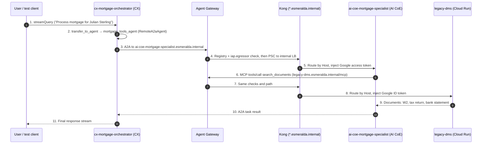

# Layer 5 Workloads: AI Reasoning Engines & Database Bootstrapping

Welcome to the technical deep-dive for **Layer 5 AI Agents & Databases**.

**What Agent Engine is:** Vertex AI **Agent Engine** (also called Agent Runtime) is a managed, serverless runtime for agents. Each deployed agent is a **Reasoning Engine** resource. With **BYOC** (bring your own container) you give it a container image instead of Python source, and it runs that image in an isolated micro-VM.

**How Esmeralda uses it:** Layer 5 deploys two BYOC agents, each owned by a different team and living in that team's project:

| Agent | Team | Role | Project | Module |
| :--- | :--- | :--- | :--- | :--- |
| `cx-mortgage-orchestrator` | **CX team** | User-facing ADK orchestrator. Owns the conversation and delegates mortgage work. | `esm-<env>-cx-agents-<sfx>` | `modules/5-workloads/agents/adk-agent` |
| `ai-coe-mortgage-specialist` | **AI CoE team** | Reusable A2A specialist. Calls the MCP tools; can be consumed by any orchestrator. | `esm-<env>-ai-coe-agents-<sfx>` | `modules/5-workloads/agents/a2a-agent` |

Both run with `identity_type = AGENT_IDENTITY` and are bound to the [Central Agent Gateway](../3-agentops-and-lifecycle/01-central-agent-gateway.md), so all their outbound traffic is authorized there. The specialist module also packages a private Cloud SQL PostgreSQL instance with a zero-bastion serverless bootstrap job.

---

## The 60-Second Mental Model: Why Atomic Agent Packaging?

In standard enterprise cloud architectures, deploying an AI agent requires filing tickets across 3 teams:
1. **DBA Team:** Create a database instance, assign passwords, and run SQL grants.
2. **InfOps Team:** Configure VPC access, private IP peerings, and firewall rules.
3. **AI Dev Team:** Build the agent container and inject database connection strings.

**Esmeralda solves this by packaging the agent runtime, its private Cloud SQL PostgreSQL instance, an IAM-authenticated DB user, buckets, a BigQuery analytics dataset, and a serverless bootstrap job into a single, atomic Terraform module.**

---

## Persona & Role Breakdown: Who Owns AI Agents & Databases?

| Engineering Persona | Role & Daily Responsibilities | What They Own | What They NEVER Touch |
| :--- | :--- | :--- | :--- |
| **AI Reasoning Engineer** (CX team or AI CoE team) | Prompt graph development, multi-agent delegation, tool orchestration, evaluating accuracy. | `apps/agents/<agent>/` (Python/ADK code, `Dockerfile`, `scripts/entrypoint.sh`), `agent.yaml`, prompts. | VPC subnetting, Cloud SQL replication, IAM project bindings. |
| **Platform / Database Lead** | Ensuring zero public IPs, IAM-authenticated SQL connections and automated bootstrap. | `infrastructure/modules/5-workloads/agents/`, Cloud SQL specs, bootstrap Cloud Run jobs. | Agent prompt engineering, LLM model fine-tuning. |
| **SecOps / Identity Auditor** | Enforcing zero-trust database authentication and Agent Identity (SPIFFE). | Service accounts (`sa-cx-mortgage-orch-<env>`, `sa-ai-coe-mortgage-spec-<env>`, `sa-mcp-invoker-<env>`), Agent Identity grants, Cloud SQL IAM users. | Python business logic. |

---

## Architecture Decision Records (ADRs): The "Why"

### ADR-04.3: Atomic Agent + Cloud SQL Packaging
* **Context:** Shared databases across multiple AI agents violate zero-trust boundaries and create tight coupling during schema migrations.
* **Decision:** Each stateful agent (e.g. `ai-coe-mortgage-specialist`) owns its private Cloud SQL PostgreSQL 15 instance inside its team's project (`esm-<env>-ai-coe-agents-<sfx>`).
* **Benefit:** Workloads can be provisioned, upgraded, or destroyed independently with zero cross-agent blast radius.

---

### ADR-04.4: Zero-Bastion Serverless DB Bootstrapping (Cloud Run Job)
* **Context:** Private databases have no public IP, preventing CI/CD runners (like Cloud Build) or laptops from running SQL `GRANT` statements without launching vulnerable public bastion VMs.
* **Decision:** Deploy a VPC-internal Cloud Run Job (`<agent>-db-bootstrap-<env>`) running `alpine:latest` + `psql`, attached to the Shared VPC core subnet (`10.0.1.0/24`) with Direct VPC Egress. Terraform executes it once (`gcloud run jobs execute --wait`) during apply.
* **Benefit:** Runs the grants securely inside the private VPC and exits immediately, eliminating persistent bastion costs and security risks.

---

## Multi-Agent Interaction & Database Architecture



How each hop is authorized and how TLS works on it is detailed in [Central Agent Gateway §4](../3-agentops-and-lifecycle/01-central-agent-gateway.md#4-life-of-a-request).

---

## Technical Implementation Breakdown (`infrastructure/modules/5-workloads/agents/`)

### Common to both agents
* **BYOC image:** built with `make build-ai-coe-mortgage-specialist` / `make build-cx-mortgage-orchestrator` into the shared CI/CD Artifact Registry. Terraform resolves the tag from `env.yaml` (`container_tag`) to a **digest** and pins `container_spec.image_uri` to it. Images contain no certificates, so the same digest is promoted from dev to prd.
* **Agent Identity:** `identity_type = AGENT_IDENTITY` gives each engine a SPIFFE identity. Grants go to the team project's `principalSet://agents.global.org-<ORG>.system.id.goog/attribute.platformContainer/aiplatform/projects/<PROJECT_NUMBER>`, so CX and AI CoE agents are authorized independently.
* **Agent Gateway binding:** `deployment_spec.agent_gateway_config.agent_to_anywhere_config.agent_gateway` points at the Layer 4 gateway. When it is set, the module does **not** attach `psc_interface_config`; all egress (Gemini, Google APIs, MCPs, A2A) goes through the Agent Gateway.
* **Trust bundle:** the Layer 4 bundle (gateway inspection roots + internal Root CA) is injected as `AGENT_GATEWAY_ROOT_CERTIFICATES` and installed by `scripts/entrypoint.sh` at start-up (see [Central Agent Gateway §6](../3-agentops-and-lifecycle/01-central-agent-gateway.md#6-bring-your-own-container-byoc)).
* **Calling Kong:** `SERVICE_ACCOUNT_EMAIL` is set to `sa-mcp-invoker-<env>`. The agent impersonates it to mint the ID token that Kong's Cloud Run IAM check requires.
* **Per-agent resources:** staging, artifacts and logs buckets, and a BigQuery dataset `<agent>_logs_<env>` for event analytics.
* **Configuration:** `apps/agents/<agent>/agent.yaml` supplies the name, resources (CPU, memory, min/max instances, concurrency) and env vars. Terraform runtime values (bucket, dataset, URLs, certificates) override the YAML.

---

### 1. AI CoE Mortgage Specialist, A2A (`agents/a2a-agent/main.tf`)
* **A2A server:** the engine exposes the A2A methods (`on_message_send`, `handle_authenticated_agent_card`, `on_get_task`, `on_cancel_task`) with the agent card from `agent.yaml` (skills: Document Search, Income Verification, Corporate Email).
* **Agent card in Agent Registry:** `google_agent_registry_service.agent_card` registers the card (type `A2A_AGENT_CARD`, URL `https://ai-coe-mortgage-specialist.esmeralda.internal`) in the **governance** registry, which is what lets orchestrators egress to it through the Agent Gateway.
* **MCP tools:** `DMS_MCP_URL`, `INCOME_VERIFICATION_URL` and `EMAIL_MCP_URL` point at `https://<svc>.esmeralda.internal/mcp` (see [MCP Tool Servers](./02-mcp-tool-servers.md)).
* **Private Cloud SQL Instance:** `google_sql_database_instance.task_store` (`POSTGRES_15`, `ZONAL`) with `ipv4_enabled = false` and `private_network = var.vpc_id`, reached through the Shared VPC's private services access range (Layer 2).
* **IAM Database Authentication:** sets `cloudsql.iam_authentication = on` and creates a `CLOUD_IAM_SERVICE_ACCOUNT` user for `sa-ai-coe-mortgage-spec-<env>`, plus `roles/cloudsql.client` and `roles/cloudsql.instanceUser`.
* **VPC-Bound Bootstrapper:** `google_cloud_run_v2_job.schema_bootstrap` connects to the private IP as the `postgres` superuser and grants the IAM user privileges on the `a2a_tasks` database and the `public` schema. The A2A SDK's `DatabaseTaskStore` creates its own tables on first use.

> [!WARNING]
> The Cloud SQL instance is provisioned and bootstrapped, but the module currently pins `USE_CLOUD_SQL = "0"`, so the specialist stores A2A tasks with the in-memory task store. The Cloud SQL task store (`plugins/task_store.py`) is only used when `USE_CLOUD_SQL=1`.

---

### 2. CX Mortgage Orchestrator, ADK (`agents/adk-agent/main.tf`)
* **Multi-Agent Coordinator:** an ADK `Agent` named `cx_mortgage_orchestrator` (exported as `root_agent`, the symbol ADK requires) with one sub-agent, `mortgage_tools_agent`, a `RemoteA2aAgent` that loads the specialist's card from `${A2A_AGENT_URL}/v1/card` and delegates with `transfer_to_agent`. No database.
* **Dynamic Variable Injection:** `A2A_AGENT_URL` (`https://ai-coe-mortgage-specialist.esmeralda.internal`) comes from the live `terragrunt.hcl`. `GATEWAY_MCP_URL` is still a module input but is empty and unused, because the orchestrator doesn't call MCP tools itself.
* **Consumer, not owner:** the CX team doesn't deploy or configure the specialist. It only needs the specialist's hostname, the registry entry (created by the AI CoE module) and an `iap.egressor` grant for its own project's agent identities.

---

## Verification & Runbook

### End-to-End Multi-Agent Test
```bash
# Specialist alone, then orchestrator → specialist through the Agent Gateway and Kong
make test-e2e ENV=dev

# Or individually
make test-ai-coe-mortgage-specialist-remote ENV=dev
make test-cx-mortgage-orchestrator-remote ENV=dev   # TEST_VERBOSE=1 dumps raw objects
```

### Test the Specialist through Kong from the Test VM
```bash
CX_PROJ=$(cd infrastructure/live/dev/layer-1-projects && terragrunt output -raw cx_agents_project_id)
gcloud compute ssh test-vm-dev --zone=us-central1-f --project=$CX_PROJ --tunnel-through-iap \
  --command="bash -s" < apps/agents/ai-coe-mortgage-specialist/scripts/test_through_gateway.sh
```
