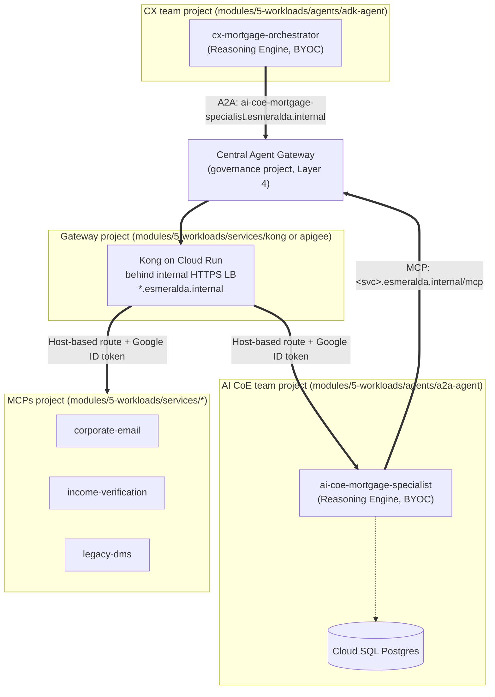

# Workloads & Catalog (Layer 5)

This section of the documentation unifies the architectural specifications, **Architectural Decision Records (ADRs)**, and implementation blueprints for Esmeralda's Layer 5 workloads: the swappable ingress gateway (Kong by default), the composable MCP tool servers, and the two AI agents.

Layer 5 is deployed with `make deploy-workloads ENV=<env>` (Terragrunt `run --all` over `infrastructure/live/<env>/layer-5-workloads/`). Terragrunt dependencies give this order:

1. **MCP services** (`services/{legacy-dms,income-verification,corporate-email}`) and their Agent Registry entries.
2. **Agents**: `agents/ai-coe-mortgage-specialist`, then `agents/cx-mortgage-orchestrator`.
3. **Kong** (`services/kong`): its routes point at the agents' engine IDs, so re-run `make deploy-gateway` whenever an agent engine is recreated.
4. **IAP egress** (`services/iap-egress`): grants `roles/iap.egressor` on the registry entries created above.
5. **Test VM** (`services/test-vm`).

---

## Who Builds What: CX Team vs. AI CoE Team

Esmeralda separates **agents that talk to customers** from **agents that are reused across the business**. Each team has its own GCP project, service account and Agent Identity:

| Team | Builds | Project | Agent in this repo |
| :--- | :--- | :--- | :--- |
| **CX team** | User-facing **orchestrator** agents (ADK). They own the conversation and *consume* reusable agents. | `esm-<env>-cx-agents-<sfx>` | `cx-mortgage-orchestrator` |
| **AI CoE team** | Reusable **A2A specialist** agents that any orchestrator (CX or other teams) can call. | `esm-<env>-ai-coe-agents-<sfx>` | `ai-coe-mortgage-specialist` |
| **AppDev tools team** | MCP tool servers used by the specialists. | `esm-<env>-mcps-<sfx>` | `legacy-dms`, `income-verification`, `corporate-email` |
| **PlatformOps** | The ingress gateway (Kong) and its internal load balancer. | `esm-<env>-gateway-<sfx>` | `kong-gateway-<env>` |

The orchestrator never calls MCP tools directly: it delegates to the specialist over **A2A**, and the specialist calls the tools over **MCP**. Every agent-to-agent and agent-to-tool call leaves the agent through the [Central Agent Gateway](../3-agentops-and-lifecycle/01-central-agent-gateway.md) and enters the target through Kong.

---

## Architecture Decision Records (ADRs): The "Why" Behind Workloads

### 1. ADR-04: Why Standalone MCP Microservices Instead of Embedded Python Tools?
* **The Problem:** In traditional agent projects, tool functions (`get_payroll()`, `search_dms()`) are hardcoded as internal Python functions within the agent process. If a backend API changes, the entire AI agent must be re-tested, re-evaluated with LLM-as-judge, and redeployed. Furthermore, tools cannot scale independently or be shared across different business unit agents.
* **The Decision:** Expose every corporate tool as a standalone **Model Context Protocol (MCP)** server (an open protocol that lets an LLM agent discover and call tools over JSON-RPC) on Cloud Run, reachable only through the internal load balancer.
* **The Benefit:**
  * **Polyglot & Decoupled:** Tools can be implemented in Python (FastMCP), TypeScript, or Go.
  * **Zero-Downtime Agent Upgrades:** Tools scale to zero when idle and can be updated without touching agent code.
  * **Fine-Grained Security:** Each tool has its own Cloud Run IAM invoker list and its own exact entry in Agent Registry.

---

### 2. ADR-05: Why Multi-Agent Delegation (A2A Protocol) Over a Single Mega-Prompt?
* **The Problem:** Cramming dozens of tool definitions and hundreds of instruction rules into a single "Mega-Agent" degrades LLM reasoning accuracy, inflates token costs, and creates context pollution.
* **The Decision:** Implement the **Agent-to-Agent (A2A) protocol** (an open protocol in which an agent publishes an *agent card* describing its skills and accepts tasks over HTTP):
  * **CX Orchestrator Agent (`cx-mortgage-orchestrator`, CX team)**: Interacts with the user, determines intent, and delegates mortgage tasks.
  * **Specialist Agent (`ai-coe-mortgage-specialist`, AI CoE team)**: Reusable mortgage underwriting assistant with tool access (DMS, Income, Email) over MCP.
* **The Benefit:** Clean separation of concerns and team ownership, modular prompt engineering, reduced token consumption, independent evaluation loops, and one specialist reusable by many orchestrators.

---

### 3. ADR-06: Why Automated VPC-Internal Database Bootstrapping?
* **The Problem:** In a zero-trust architecture, Cloud SQL PostgreSQL instances have **no public IP address** and are accessible only from within the Shared VPC. Running `psql` from local developer laptops is impossible.
* **The Decision:** The agent module provisions an ephemeral **Cloud Run DB Bootstrap Job** on the Shared VPC that grants the agent's IAM database user its privileges automatically during `layer-5-workloads` deployment.
* **The Benefit:** 100% automated, deterministic, zero-touch greenfield deployments with zero exposed public IPs.

---

## Composable AI Workloads Matrix

---

## Workloads Catalog Detailed Guides

1. **[Swappable Ingress Gateways](./01-ingress-gateways.md)**
   * Kong Gateway on Cloud Run behind an internal HTTPS load balancer (default in dev and prd)
   * Apigee X (alternative module, selected with `gateway_product`)
2. **[Composable MCP Tool Servers](./02-mcp-tool-servers.md)**
   * Corporate Email Server (`apps/services/corporate-email/`)
   * Income Verification Server (`apps/services/income-verification/`)
   * Legacy DMS Server (`apps/services/legacy-dms/`)
   * Agent Registry cataloging
3. **[AI Agents & Database Bootstrapping](./03-ai-agents-and-database.md)**
   * AI CoE Mortgage Specialist, A2A (`modules/5-workloads/agents/a2a-agent/`)
   * CX Mortgage Orchestrator, ADK (`modules/5-workloads/agents/adk-agent/`)
   * Database Bootstrap & SQL Lifecycle
   * Live configurations (`infrastructure/live/<env>/layer-5-workloads/agents/`)

For how agent egress is authorized, how the private certificates work and how BYOC images trust them, see [Central Agent Gateway](../3-agentops-and-lifecycle/01-central-agent-gateway.md).
