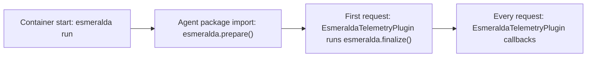

# Esmeralda Library

`esmeralda` is the Python library every Esmeralda agent uses to run on Agent Runtime. The agent team writes the agent itself (`agent.py`, tools, prompts). The library takes care of everything operational around it:

- trusting the Agent Gateway's TLS certificates;
- making Google clients work through the gateway's egress proxy;
- telemetry events and caller attribution on traces;
- one consistent way to wire all of this into ADK.

It lives in [`packages/esmeralda`](../../../packages/esmeralda/README.md). It is a member of the uv workspace, so agents depend on it through `uv.lock`, like any other dependency, instead of copying code.

- [Usage guide](guide.md): how to use it in a new or existing agent, and which piece to use in which case.
- [Package reference](reference.md): every module, function, class, environment variable and telemetry event.

## Why a library

Before it existed, each agent carried its own copy of the operational code (interceptors, telemetry plugin, patches in `agent/__init__.py`, an `entrypoint.sh`). The copies had drifted apart, and part of the code never ran in production. The container starts `adk api_server` (orchestrator) or an A2A server (specialist), not the `AdkApp` subclass that held the interceptors.

The library uses only extension points that run in every serving mode:

| Extension point | Runs in production because |
|---|---|
| Container `ENTRYPOINT` | Docker always runs it before `CMD` |
| Code executed when the agent package is imported | Every server imports the agent package to load the agent |
| An ADK `App` with a plugin | The ADK loader looks for `app` before `root_agent`; plugins run inside the ADK runner, whatever the API in front of it |

## The four stages of a request's life

| Stage | When | What the library does |
|---|---|---|
| **Entrypoint** | Once, before the server process starts | Installs the Agent Gateway root CA into the system trust store and certifi, then `exec`s the server |
| **prepare** | Once, when the agent package is imported, before the agent and its clients exist | Environment defaults; forces google-genai onto httpx and makes aiohttp honor the proxy env; points the genai client at the model location |
| **finalize** | Once, when ADK and its telemetry providers exist | Registers the span processor that copies the caller context onto spans |
| **Per request** | Every run of the ADK runner | Puts the caller context in OpenTelemetry baggage for the run; emits tool and token telemetry events |

## What you get

- **One image for every environment.** No certificate is baked in. The entrypoint installs the bundle that Terraform injects at deploy time, so the image digest tested in dev is the one promoted to prd.
- **Egress through the gateway works out of the box.** google-genai, aiohttp and the genai client defaults are adjusted before any client is created.
- **Telemetry in every serving mode.** The Agent Runtime query API, Gemini Enterprise, A2A and `adk web` all emit the same `mcp_tool_execution` and `genai_token_consumption` events. The Layer 4 log metrics and dashboards read them.
- **Caller attribution.** Every span of a request carries `caller.project_id` and `caller.agent_name` when the caller identifies itself. Agent-to-agent calls do it automatically.

> [!IMPORTANT]
> The caller context is whatever the caller sends. Use it for telemetry and cost attribution only, never for authorization.
