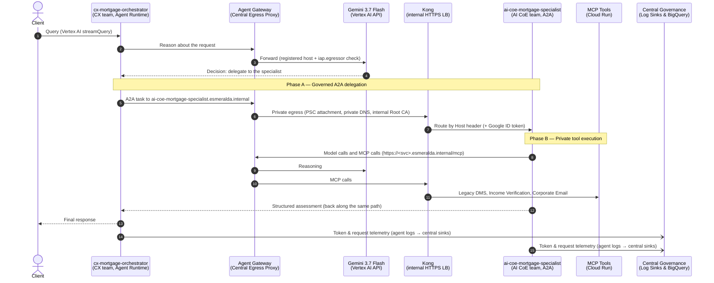
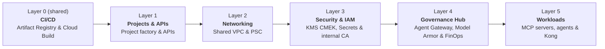

# Esmeralda Architecture & Documentation Hub


Welcome to the **Official Esmeralda Documentation Hub**.

If you are new to the project, this guide will give you a **crystal-clear understanding** of what Esmeralda is, why it was designed this way, and how the entire ecosystem fits together.

---

## The 60-Second Mental Model: What is Esmeralda?

> *"O que está embaixo é como o que está no alto, e o que está no alto é como o que está embaixo."*  
> — **A Tábua de Esmeralda** (Hermes Trismegisto/Jorge Ben Jor)

In most enterprises, AI Agent prototypes remain stuck in notebooks or local scripts because **taking agents to production is an infrastructure, security, and governance challenge**, not just a prompt engineering challenge.

**Esmeralda bridges this gap by enforcing a strict duality:**

```
               ┌────────────────────────────────────────────────────────┐
               │  🟢 NO ALTO (Application Layer - apps/)                │
               │  Pure Python reasoning, Gemini 3.7 Flash, ADK agents,  │
               │  and standardized Model Context Protocol (MCP) tools.   │
               └─────────────────────────┬──────────────────────────────┘
                                         │  Zero-Trust Integration
               ┌─────────────────────────┴──────────────────────────────┐
               │  🔵 EMBAIXO (Platform Layer - infrastructure/)         │
               │  6-layer Terragrunt IaC, Shared VPC, SPIFFE identity,  │
               │  Central Agent Gateway, Model Armor & BigQuery FinOps. │
               └────────────────────────────────────────────────────────┘
```

---

## The Two Personas: Separation of Concerns

Esmeralda is designed around two distinct developer personas who collaborate without stepping on each other's toes:

| Persona | Where they work | What they care about | What they NEVER have to touch |
| :--- | :--- | :--- | :--- |
| **AI / Application Developer** | [`apps/`](../../apps/) | Writing agent logic with **Google ADK**, defining **MCP tool servers** (FastAPI/FastMCP), testing prompts with **Gemini 3.7 Flash**, and orchestrating multi-agent **A2A protocols**. | Terraform, Terragrunt, VPC peering, KMS IAM roles, subnets, firewall rules, or DNS zones. |
| **Platform / SecOps Engineer** | [`infrastructure/`](../../infrastructure/) | Managing declarative **Terragrunt & Terraform modules**, isolated GCP projects, Private Service Connect (PSC), **Central Agent Gateway** egress, and **BigQuery FinOps** chargeback views. | Python application business logic, agent prompts, or internal tool schemas. |

### Agent Teams: Who Owns Which Agent

Application developers are further split into teams, and **each team owns its own GCP project** (named after the team), so agents, identities and budgets never mix:

| Team | What it builds | Esmeralda agent | Project |
| :--- | :--- | :--- | :--- |
| **CX team** | User-facing **orchestrator** agents (Google ADK). They talk to the customer and *consume* reusable agents instead of rebuilding them. | `cx-mortgage-orchestrator` ([`apps/agents/cx-mortgage-orchestrator`](../../apps/agents/cx-mortgage-orchestrator/)) | `esm-<env>-cx-agents-<sfx>` |
| **AI CoE team** | Reusable **specialist** agents published over the **A2A** (Agent-to-Agent) protocol, an open standard where an agent advertises its skills in an *agent card* and receives tasks over HTTP. Any team can call them. | `ai-coe-mortgage-specialist` ([`apps/agents/ai-coe-mortgage-specialist`](../../apps/agents/ai-coe-mortgage-specialist/)), skills: Document Search, Income Verification, Corporate Email | `esm-<env>-ai-coe-agents-<sfx>` |

The specialist's agent card is registered in the central **Agent Registry** (governance project), and the orchestrator reaches it at `https://ai-coe-mortgage-specialist.esmeralda.internal` through the Agent Gateway and Kong. Neither team needs network or IAM access to the other's project.

---

## End-to-End Request & Security Lifecycle

Here is what happens under the hood when a user submits a prompt (e.g., *"Process mortgage application 2024-7891 for Julian Sterling"*):



Every arrow that leaves an agent passes the gateway's three checks: **who** (SPIFFE Agent Identity), **where** (Agent Registry entry + `roles/iap.egressor`), and optionally **what** (Model Armor inline inspection, wired but disabled by default). Details, certificates and troubleshooting: [Central Agent Gateway guide](./3-agentops-and-lifecycle/01-central-agent-gateway.md).

---

## The Layered Infrastructure Blueprint

Infrastructure is built from the ground up in **6 decoupled layers** using Terragrunt. Layer 0 is shared by all environments; layers 1 to 5 are deployed once per environment (`dev`, `prd`):



0. **Layer 0: Shared CI/CD (`live/shared/layer-0-cicd`)**:
   One CI/CD project for all environments, with a mutable dev image repository and an immutable release repository. Images are built once and promoted by digest from dev to release.
1. **[Layer 1: Projects & FinOps (`layer-1-projects`)](./1-platform-foundations/01-projects-and-finops.md)**:
   Provisions the isolated GCP projects (`net-host`, `gateway`, `governance`, `mcps`, `ai-coe-agents`, `cx-agents`) and activates required APIs. Agent projects are named after the team that owns them.
2. **[Layer 2: Private Networking (`layer-2-networking`)](./1-platform-foundations/02-private-networking.md)**:
   Deploys the central Shared VPC, private subnets, Cloud DNS zones (`*.esmeralda.internal`), and Private Service Connect (PSC) attachments.
3. **[Layer 3: Security & Secrets (`layer-3-security`)](./1-platform-foundations/03-security-iam-and-telemetry.md)**:
   Configures Cloud KMS CMEK encryption keyrings, Secret Manager secrets, workload Service Accounts and Agent Identity grants with least-privilege IAM bindings, and the **internal Root CA**: a self-signed certificate authority (Terraform `tls` provider) that signs the certificate Kong presents for `*.esmeralda.internal`.
4. **[Layer 4: Central Governance Hub (`layer-4-governance`)](./3-agentops-and-lifecycle/index.md)**:
   Establishes the enterprise control plane before any workload runs:
   * **Central Agent Gateway**: a Google-managed proxy on every agent's outbound path (`AGENT_TO_ANYWHERE`). It authorizes each call by SPIFFE Agent Identity against the **Agent Registry** allowlist and IAP `roles/iap.egressor`. See the [Central Agent Gateway guide](./3-agentops-and-lifecycle/01-central-agent-gateway.md).
   * **Model Armor**: prompt and response guardrail templates (PII, prompt injection). Inline gateway inspection is wired but disabled by default.
   * **FinOps Analytics**: Sinks agent and service logs from the workload projects to BigQuery views (`vw_monthly_agent_chargeback`, `vw_request_level_telemetry`) and Cloud Monitoring dashboards.
5. **[Layer 5: Workloads & Tool Catalog (`layer-5-workloads`)](./2-workloads-and-catalog/index.md)**:
   Deploys the runtime applications, bound to the layer-4 gateway and registry:
   * **MCP Microservices** (Cloud Run, internal only): Corporate Email, Income Verification, Legacy DMS, each registered in the Agent Registry.
   * **AI Reasoning Engines** (Vertex AI Agent Engine, BYOC containers bound to the gateway): the CX team's orchestrator (`cx-mortgage-orchestrator`) consuming the AI CoE's reusable A2A specialist (`ai-coe-mortgage-specialist`; a Cloud SQL task store is provisioned but not yet enabled).
   * **Kong** (Cloud Run behind an internal HTTPS load balancer): the private front door for `*.esmeralda.internal`, routing by Host header to the MCP servers and agents.
   * **IAP egress grants** and a **test VM** for private smoke tests.

---

## Documentation Roadmap & Sub-Guides

Deep-dive into specific areas of the platform:

| Guide | Description | Key Topics |
| :--- | :--- | :--- |
| **[1. Platform Foundations](./1-platform-foundations/index.md)** | Core cloud landing zone and infrastructure specs. | [Projects & APIs](./1-platform-foundations/01-projects-and-finops.md), [Shared VPC Networking](./1-platform-foundations/02-private-networking.md), [Security, CMEK & IAM](./1-platform-foundations/03-security-iam-and-telemetry.md). |
| **[2. Workloads & Catalog](./2-workloads-and-catalog/index.md)** | Runtimes, microservices, and AI engines. | [Ingress Gateways](./2-workloads-and-catalog/01-ingress-gateways.md), [MCP Tool Servers](./2-workloads-and-catalog/02-mcp-tool-servers.md), [Reasoning Engines & Database](./2-workloads-and-catalog/03-ai-agents-and-database.md). |
| **[3. AgentOps & Governance](./3-agentops-and-lifecycle/index.md)** | Enterprise governance, security, and observability. | [Central Agent Gateway](./3-agentops-and-lifecycle/01-central-agent-gateway.md), [Centralized Monitoring & FinOps Dashboards](./3-agentops-and-lifecycle/03-centralized-monitoring-and-dashboards.md), [Multi-repo SDLC, cross-team model & image promotion](./3-agentops-and-lifecycle/index.md). |
| **[Contributing Guidelines](./contributing.md)** | Contribution process and local testing. | CLA, PR reviews, `make` test targets. |
| **[Code of Conduct](./code-of-conduct.md)** | Community engagement standards. | Respect, inclusivity, and community ethics. |
