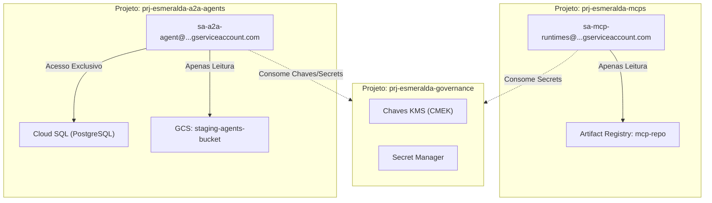

# Estágios de Infraestrutura: Fundações de Plataforma (Stages 1, 2 e 3)

Este documento centraliza as especificações detalhadas de infraestrutura para as fundações da landing zone do Esmeralda. Ele consolida e otimiza as etapas de **Provisionamento de Projetos e APIs (Stage 1)**, **Redes Privadas e DNS (Stage 2)** e **Segurança, Chaves CMEK e Identidades (Stage 3)**.

---

## 🗺️ 1. Stage 1: Projetos, Faturamento (FinOps) & APIs

O Stage 1 gerencia a criação isolada de múltiplos projetos e ativação das APIs fundamentais sob uma estrutura de governança compatível com as regras de Landing Zone empresariais do Google Cloud.

### A. Simulação de Projetos da Landing Zone (SoC)
Para simular um ambiente de produção real, as cargas de trabalho são divididas em **seis projetos distintos**:

| Projeto | Nome Simulado | Papel e Responsabilidade | Recursos Principais Hospedados |
| :--- | :--- | :--- | :--- |
| **Hospedeiro de Rede** | `prj-net-host` | Gerenciado por NetOps. Controla o tráfego de rede e segurança. | VPC Compartilhada, Subnets, Cloud DNS, Cloud NAT, Firewalls. |
| **Ingresso de Tráfego** | `prj-gateway` | Gerenciado por PlatformOps. Controla ingressos de APIs corporativos. | Apigee X, Kong no Cloud Run, Internal Load Balancer. |
| **Ferramentas MCP** | `prj-esmeralda-mcps` | Gerenciado pelo time AppDev. APIs de utilidades comuns da empresa. | Cloud Run (Corporate Email, Income Verifier, DMS), Artifact Registry. |
| **Plataforma Core AI** | `prj-esmeralda-a2a-agents` | Gerenciado pelo time Core AI. Hospeda agentes globais reutilizáveis. | Vertex AI Reasoning Engine (A2A), Cloud SQL PostgreSQL. |
| **Unidade de Negócios** | `prj-esmeralda-root-agent` | Gerenciado pela área de Linha de Negócio. Agentes de interface ao usuário. | Vertex AI Reasoning Engine (Root), Buckets GCS de Staging. |
| **Hub de Governança** | `prj-esmeralda-governance` | Gerenciado por SecOps. Centraliza conformidade e dados consolidados. | KMS Keyrings, Secrets, Certificados TLS, BigQuery Analytics, Log Sinks. |

---

### B. Desafios de FinOps Resolvidos
1.  **Atribuição Limpa de IA Generativa**: Chamadas do agente de mortgage faturam diretamente em `prj-esmeralda-root-agent`. Chamadas secundárias de subprocessos faturam em `prj-esmeralda-a2a-agents`.
2.  **Separação de Custos Ephemeral vs. Persistentes**: O banco de dados PostgreSQL (faturamento 24/7) fica isolado no projeto da plataforma de IA. Os servidores MCP (Cloud Run) escalam para zero, reduzindo custos a zero quando ociosos.
3.  **Tráfego de Rede Sem Custos Ocultos**: Todo o tráfego flui internamente pela rede privada da VPC Compartilhada na mesma região (`us-central1`), evitando taxas de trânsito de NAT público.

---

### C. Especificações Técnicas de Projetos (`modules/1-projects/`)

#### 1. Variáveis de Entrada (`variables.tf`)
```hcl
variable "billing_account" {
  type        = string
  description = "ID da conta de faturamento do GCP"
}

variable "project_prefix" {
  type        = string
  default     = "esmeralda"
}

variable "byo_net_host_project" { type = bool; default = false }
variable "byo_gateway_project"  { type = bool; default = false }

variable "existing_net_host_project" { type = string; default = "" }
variable "existing_gateway_project"  { type = string; default = "" }
```

#### 2. Declaração do Projeto (`main.tf`)
```hcl
resource "random_id" "suffix" {
  byte_length = 3
}

locals {
  suffix = random_id.suffix.hex
}

resource "google_project" "mcps" {
  name            = "${var.project_prefix}-mcps"
  project_id      = "${var.project_prefix}-mcps-${local.suffix}"
  billing_account = var.billing_account
  labels          = { env = "dev", cost-center = "appdev" }
}

# Definição do Projeto Core de Inteligência Artificial (AUDIT-03 Fix)
resource "google_project" "a2a" {
  name            = "${var.project_prefix}-a2a-agents"
  project_id      = "${var.project_prefix}-a2a-${local.suffix}"
  billing_account = var.billing_account
  labels          = { env = "dev", cost-center = "core-ai" }
}


# Habilita Vertex AI no projeto de agentes
resource "google_project_service" "a2a_services" {
  project = google_project.a2a.project_id
  service = "aiplatform.googleapis.com"
  disable_on_destroy = false
}
```

---

## 🌐 2. Stage 2: Redes Privadas, DNS & PSC

O Stage 2 implementa a infraestrutura de rede Zero-Trust para garantir que nenhuma API ou agente de IA se comunique por canais públicos da internet.

### A. Topologia de Subredes da VPC (`gateway-vpc`)
No projeto `prj-net-host`, criamos os seguintes intervalos de IP:
*   **Subnet de Aplicações (`gke-subnet`)**: `10.0.0.0/20` para os computes locais e VMs de teste.
*   **Proxy Subnet Regional (`gateway-proxy-subnet`)**: `10.9.0.0/24` de uso exclusivo para balanceadores de carga internos baseados em Envoy (ILB).
*   **PSC NAT Subnet (`gateway-psc-subnet`)**: `10.10.0.0/24` para as conexões de saída do Private Service Connect.
*   **PSC Interface Subnet (`psc-interface-subnet`)**: `10.11.0.0/28` que fornece conexões locais para os agentes do Vertex AI (Reasoning Engine) operando sob a rede gerenciada do Google.

### B. DNS Privado e Roteamento Estático do Gateway
Para desacoplar as URLs dinâmicas do Vertex AI, criamos uma zona DNS privada no Cloud DNS chamada `internal.gateway.` apontando todas as rotas de ferramentas e agentes para o IP interno (`10.0.0.5`) do Internal Load Balancer (ILB):
*   `email.internal.gateway` -> `10.0.0.5`
*   `income-verification.internal.gateway` -> `10.0.0.5`
*   `dms.internal.gateway` -> `10.0.0.5`

#### Especificação do Network Attachment para Vertex AI (`modules/2-networking/`)
```hcl
resource "google_compute_service_attachment" "psc_attachment" {
  name                  = "gateway-psc-interface-attachment"
  project               = var.net_host_project_id
  region                = var.region
  target_service        = google_compute_forwarding_rule.ilb_forwarding_rule.id
  connection_preference = "ACCEPT_AUTOMATIC"
  nat_subnets           = [google_compute_subnetwork.psc_subnet.id]
}
```

---

## 🔐 3. Stage 3: Segurança, Chaves CMEK, Secrets & Identidades

O Stage 3 centraliza as barreiras de conformidade de segurança e controle de dados, gerenciado no projeto isolado `prj-esmeralda-governance`.

### A. Criptografia CMEK e Secret Manager
Criamos um Keyring do Cloud KMS centralizado para criptografar dados persistentes:
*   `key-postgresql`: Criptografa o disco do Cloud SQL no projeto `prj-esmeralda-a2a-agents`.
*   `key-gcs-staging`: Criptografa os buckets de gravação de logs de telemetria.

E usamos o Secret Manager para persistir credenciais sem riscos de exposição em disco:
*   `postgresql-admin-password`: Senha master administrativa para bootstrap de privilégios.

---

### B. 🚨 Auditoria de Conformidade de Identidades (Least Privilege)
**IMPORTANTE (Correção de Auditoria de Segurança):** 
Durante nossa auditoria do Esmeralda legado, removemos completamente as permissões relacionadas a um `agent_repo` no Artifact Registry (repositório de containers de agentes). Os agentes ADK Reasoning Engine não utilizam Docker e são empacotados como pacotes compactados `.zip` em buckets do GCS. Mantivemos apenas as permissões de gravação de imagens para o `mcp_repo` (usado pelos Cloud Runs das ferramentas).

Além disso, eliminamos a Service Account centralizadora genérica `test-vm-sa`. No novo modelo, cada carga de trabalho opera sob uma **identidade de serviço isolada e específica por projeto**:



---

### C. Código de Provisionamento do Cloud SQL com CMEK (`modules/3-security/`)

```hcl
# infrastructure/modules/3-security/main.tf

# Criação da Chave KMS para o Cloud SQL
resource "google_kms_crypto_key" "sql_key" {
  name            = "key-postgresql"
  key_ring        = google_kms_key_ring.ring.id
  rotation_period = "7776000s" # 90 dias
}

# Permite que a Service Account de serviço do Cloud SQL do projeto de agentes leia a chave KMS
resource "google_kms_crypto_key_iam_binding" "sql_kms_binding" {
  crypto_key_id = google_kms_crypto_key.sql_key.id
  role          = "roles/cloudkms.signerDecrypter"
  members       = [
    "serviceAccount:service-${var.a2a_project_number}@gcp-sa-cloud-sql.iam.gserviceaccount.com"
  ]
}

# --------------------------------------------------------------------
# Permissões de Direct VPC Egress para Cloud Run (Correção AUDIT-01)
# --------------------------------------------------------------------

# Permite que as Service Accounts das workloads usem a subnet da VPC Compartilhada
resource "google_compute_subnetwork_iam_member" "a2a_subnet_user" {
  project    = var.net_host_project_id
  region     = var.region
  subnetwork = var.backend_subnet_id
  role       = "roles/compute.networkUser"
  member     = "serviceAccount:${google_service_account.a2a_sa.email}"
}

resource "google_compute_subnetwork_iam_member" "mcps_subnet_user" {
  project    = var.net_host_project_id
  region     = var.region
  subnetwork = var.backend_subnet_id
  role       = "roles/compute.networkUser"
  member     = "serviceAccount:${google_service_account.mcps_sa.email}"
}

resource "google_compute_subnetwork_iam_member" "root_subnet_user" {
  project    = var.net_host_project_id
  region     = var.region
  subnetwork = var.backend_subnet_id
  role       = "roles/compute.networkUser"
  member     = "serviceAccount:${google_service_account.root_sa.email}"
}

```
