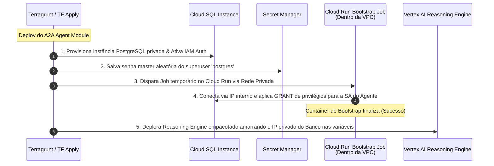

# Estágios de Infraestrutura: Cargas de Trabalho, Integração & Delivery (Stage 4 e Estratégia)

Este documento centraliza as especificações detalhadas de infraestrutura para a camada de **Cargas de Trabalho (Stage 4)**, a arquitetura de **Alternância Greenfield vs. Brownfield (BYOInfra)**, o fluxo integrado de **Bootstrap do Banco de Dados Cloud SQL** e o ecossistema de **Testes Simétricos Locais e Remotos**. Ele consolida e otimiza as antigas diretrizes individuais de gateways, servidores MCP, agentes ADK e estratégias de entrega.

---

## 🏗️ 1. Stage 4: Prateleira de Cargas de Trabalho (`modules/4-workloads/`)

O Stage 4 faz a transição do Esmeralda de fundações brutas de rede e segurança para o espaço de **Aplicações de IA Composíveis**. O design adota o padrão de catálogo independente: cada gateway, ferramenta MCP ou agente de IA é tratado como um módulo reaproveitável, permitindo deploys granulares sobre os projetos criados no Stage 1.

---

### A. Padrão Gateway Adapter: Gateways de Ingress Intercambiáveis

Para garantir que a plataforma possa ser implantada em qualquer cliente corporativo (desde sandboxes ágeis até ambientes de alta governança), o Esmeralda adota o **Padrão Gateway Adapter**. Os agentes do Vertex AI Reasoning Engine permanecem completamente agnósticos sobre qual tecnologia de gateway está ativa na rede.

Definimos três adaptadores de entrada sob `/modules/4-workloads/gateways/` que atendem ao mesmo **contrato unificado de variáveis**:

```text
infrastructure/modules/4-workloads/gateways/
├── apigee/                 # Opção A: Apigee X Enterprise (WAF, Rate Limiting, IAM Auth)
├── kong/                   # Opção B: Kong Gateway Serverless no Cloud Run privado
└── ilb/                    # Opção C: GCP Regional L7 HTTP(S) Internal Load Balancer + Broker
```

#### Contrato de Interfaces dos Gateways (`variables.tf` & `outputs.tf`)

```hcl
# Variáveis comuns de entrada obrigatórias para os 3 adaptadores:
variable "project_id" {
  description = "ID do projeto GCP prj-gateway alocado para ingress"
  type        = string
}

variable "region" {
  description = "Região GCP onde os recursos de ingress serão criados"
  type        = string
}

variable "vpc_id" {
  description = "Self-link da VPC Compartilhada central (de prj-net-host)"
  type        = string
}

variable "subnet_id" {
  description = "Self-link da subrede de backends/ingress na VPC"
  type        = string
}

variable "agent_endpoints" {
  description = "Mapeamento de nomes lógicos de agentes para seus endpoints dinâmicos no Vertex AI"
  type = map(object({
    logical_name = string
    engine_id    = string
    endpoint_url = string
  }))
}

variable "environment" {
  type    = string
  default = "dev"
}

# Saídas padrão expostas de forma idêntica pelos 3 adaptadores:
output "gateway_ingress_ip" {
  description = "IP VIP privado interno do gateway de ingress na VPC"
  value       = string
}

output "gateway_agent_ingress_host" {
  description = "Zona DNS interna padrão controlada pelo gateway (ex: esmeralda.internal)"
  value       = "esmeralda.internal"
}
```

---

#### Opção A: Apigee X Enterprise Gateway (`gateways/apigee/`)

A Apigee X atua como o gateway corporativo padrão. Para resolver as URLs dinâmicas do Vertex AI Reasoning Engine (cujos IDs de recurso mudam a cada novo empacotamento), a Apigee armazena esse mapa em um **Apigee Key Value Map (KVM)** e utiliza políticas internas de fluxo para extrair o host, ler o destino e injetar o token OAuth2 de Service Account de forma transparente.

```hcl
# infrastructure/modules/4-workloads/gateways/apigee/main.tf

resource "google_apigee_organization" "apigee_org" {
  analytics_region   = var.region
  project_id         = var.project_id
  authorized_network = var.vpc_id
}

resource "google_apigee_environment" "apigee_env" {
  name         = var.environment
  org_id       = google_apigee_organization.apigee_org.id
  description  = "Ambiente Esmeralda ${var.environment}"
}

resource "google_apigee_envgroup" "apigee_envgroup" {
  name      = "esmeralda-group-${var.environment}"
  org_id    = google_apigee_organization.apigee_org.id
  hostnames = ["*.esmeralda.internal"]
}

resource "google_apigee_envgroup_attachment" "env_to_group" {
  envgroup_id = google_apigee_envgroup.apigee_envgroup.id
  environment = google_apigee_environment.apigee_env.name
}

resource "google_apigee_instance" "apigee_instance" {
  name               = "apigee-instance-${var.environment}"
  org_id             = google_apigee_organization.apigee_org.id
  location           = var.region
  peering_cidr_range = "10.12.0.0/22"
}

resource "google_apigee_instance_attachment" "env_to_instance" {
  instance_id = google_apigee_instance.apigee_instance.id
  environment = google_apigee_environment.apigee_env.name
}

# Mapa de Valores Chave para rotas de agentes dinâmicas
resource "google_apigee_keyvaluemap" "agent_routes" {
  org_id = google_apigee_organization.apigee_org.id
  env_id = google_apigee_environment.apigee_env.id
  name   = "agent-routes"
}

# Popula KVM de rotas via curl local-exec (limitação do provider do Google)
resource "null_resource" "populate_apigee_kvm" {
  for_each = var.agent_endpoints

  triggers = {
    engine_id    = each.value.engine_id
    endpoint_url = each.value.endpoint_url
  }

  provisioner "local-exec" {
    command = <<EOT
      curl -X POST -H "Authorization: Bearer $(gcloud auth print-access-token)" \
        -H "Content-Type: application/json" \
        "https://apigee.googleapis.com/v1/organizations/${google_apigee_organization.apigee_org.name}/environments/${google_apigee_environment.apigee_env.name}/keyvaluemaps/agent-routes/entries" \
        -d '{"name": "${each.value.logical_name}", "value": "${each.value.endpoint_url}"}' \
        || curl -X PUT -H "Authorization: Bearer $(gcloud auth print-access-token)" \
        -H "Content-Type: application/json" \
        "https://apigee.googleapis.com/v1/organizations/${google_apigee_organization.apigee_org.name}/environments/${google_apigee_environment.apigee_env.name}/keyvaluemaps/agent-routes/entries/${each.value.logical_name}" \
        -d '{"name": "${each.value.logical_name}", "value": "${each.value.endpoint_url}"}'
    EOT
  }
}
```

---

#### Opção B: Lightweight Kong Gateway no Cloud Run (`gateways/kong/`)

Para instalações ágeis, o Kong roda em modo DB-less (sem banco de dados) no Cloud Run dentro do projeto `prj-gateway`. Ele consome sua configuração declarativa armazenada de forma segura no Secret Manager, montada como volume do container.

```hcl
# infrastructure/modules/4-workloads/gateways/kong/main.tf

locals {
  kong_config = templatefile("${path.module}/templates/kong.yml.tpl", {
    agent_endpoints = var.agent_endpoints
  })
}

resource "google_secret_manager_secret" "kong_config" {
  secret_id = "kong-config-${var.environment}"
  project   = var.project_id
  replication { auto {} }
}

resource "google_secret_manager_secret_version" "kong_config" {
  secret      = google_secret_manager_secret.kong_config.id
  secret_data = local.kong_config
}

resource "google_service_account" "kong_sa" {
  account_id   = "kong-gateway-sa-${var.environment}"
  project      = var.project_id
}

# Permite ao Kong invocar os Reasoning Engines no Vertex AI
resource "google_project_iam_member" "kong_vertex_access" {
  project = var.project_id
  role    = "roles/aiplatform.user"
  member  = "serviceAccount:${google_service_account.kong_sa.email}"
}

resource "google_cloud_run_v2_service" "kong_gateway" {
  name     = "kong-gateway-${var.environment}"
  location = var.region
  project  = var.project_id
  ingress  = "INGRESS_TRAFFIC_INTERNAL_ONLY" # Apenas tráfego privado da VPC Compartilhada

  template {
    service_account = google_service_account.kong_sa.email

    containers {
      image = "kong:latest"
      ports { container_port = 8000 }
      env {
        name  = "KONG_DATABASE"
        value = "off"
      }
      env {
        name  = "KONG_DECLARATIVE_CONFIG"
        value = "/etc/kong/kong.yml"
      }
      volume_mounts {
        name       = "kong-config"
        mount_path = "/etc/kong"
      }
    }
    
    volumes {
      name = "kong-config"
      secret {
        secret_name = google_secret_manager_secret.kong_config.secret_id
        items {
          version = "latest"
          path    = "kong.yml"
        }
      }
    }
    
    vpc_access {
      network_interfaces {
        network    = var.vpc_id
        subnetwork = var.subnet_id
      }
      egress = "ALL_TRAFFIC"
    }
  }
}
```

##### Template do Arquivo de Configuração Kong (`templates/kong.yml.tpl`)

O template compila rotas e aplica o plugin nativo do GCP para trocar automaticamente tokens de Service Account em tempo de trânsito:

```yaml
_format_version: "3.0"
_transform: true

services:
%{ for key, endpoint in agent_endpoints ~}
  - name: ${endpoint.logical_name}
    url: ${endpoint.endpoint_url}
    routes:
      - name: ${endpoint.logical_name}-route
        hosts:
          - ${endpoint.logical_name}.esmeralda.internal
        strip_path: true
    plugins:
      - name: gcp-service-account
        config:
          audience: "https://us-central1-aiplatform.googleapis.com"
%{ endfor ~}
```

---

#### Opção C: Internal Load Balancer + Broker Proxy (`gateways/ilb/`)

Para evitar produtos de API Gateway adicionais, utilizamos o próprio balanceador regional HTTP L7 do Google Cloud (ILB). Como o ILB não consegue reescrever rotas ou injetar tokens de identidade dinamicamente, empacotamos um **Routing Broker privado** rodando em Cloud Run como seu backend padrão (acessado via Serverless NEG). O Broker intercepta as cabeçalhos `Host`, resolve o endpoint Vertex correspondente e injeta as credenciais via Metadata Server local.

```hcl
# infrastructure/modules/4-workloads/gateways/ilb/main.tf

resource "google_service_account" "broker_sa" {
  account_id   = "routing-broker-sa-${var.environment}"
  project      = var.project_id
}

resource "google_project_iam_member" "broker_vertex_access" {
  project = var.project_id
  role    = "roles/aiplatform.user"
  member  = "serviceAccount:${google_service_account.broker_sa.email}"
}

resource "google_cloud_run_v2_service" "routing_broker" {
  name     = "routing-broker-${var.environment}"
  location = var.region
  project  = var.project_id
  ingress  = "INGRESS_TRAFFIC_INTERNAL_ONLY"

  template {
    service_account = google_service_account.broker_sa.email

    containers {
      image = "us-central1-docker.pkg.dev/${var.mcps_project_id}/mcp-repo/routing-broker:latest" # AUDIT-05 Fix
      env {
        name  = "AGENT_ENDPOINTS_JSON"
        value = jsonencode(var.agent_endpoints)
      }
    }

    vpc_access {
      network_interfaces {
        network    = var.vpc_id
        subnetwork = var.subnet_id
      }
      egress = "ALL_TRAFFIC"
    }
  }
}

resource "google_compute_region_network_endpoint_group" "broker_neg" {
  name                  = "neg-broker-${var.environment}"
  project               = var.project_id
  region                = var.region
  network_endpoint_type = "SERVERLESS"
  cloud_run {
    service = google_cloud_run_v2_service.routing_broker.name
  }
}

resource "google_compute_region_backend_service" "broker_backend" {
  name                  = "backend-broker-${var.environment}"
  project               = var.project_id
  region                = var.region
  protocol              = "HTTP"
  load_balancing_scheme = "INTERNAL_MANAGED"

  backend {
    group = google_compute_region_network_endpoint_group.broker_neg.id
  }
}

resource "google_compute_region_url_map" "ilb_url_map" {
  name            = "ilb-gateway-url-map-${var.environment}"
  project         = var.project_id
  region          = var.region
  default_service = google_compute_region_backend_service.broker_backend.id

  host_rule {
    hosts        = ["*.esmeralda.internal"]
    path_matcher = "all-agents"
  }

  path_matcher {
    name            = "all-agents"
    default_service = google_compute_region_backend_service.broker_backend.id
  }
}

resource "google_compute_region_target_http_proxy" "ilb_proxy" {
  name    = "ilb-gateway-proxy-${var.environment}"
  project = var.project_id
  region  = var.region
  url_map = google_compute_region_url_map.ilb_url_map.id
}

resource "google_compute_forwarding_rule" "ilb_forwarding_rule" {
  name                  = "ilb-gateway-rule-${var.environment}"
  project               = var.project_id
  region                = var.region
  ip_protocol           = "TCP"
  port_range            = "80"
  load_balancing_scheme = "INTERNAL_MANAGED"
  network               = var.vpc_id
  subnetwork            = var.subnet_id
  target                = google_compute_region_target_http_proxy.ilb_proxy.id
}
```

---

### B. Standalone API Hub (`modules/4-workloads/apihub/`)

O catálogo de governança do API Hub é executado como uma carga de trabalho adjacente isolada no projeto `prj-gateway`. Ele registra automaticamente o diretório corporativo de APIs sem influenciar os roteamentos de tráfego ativos.

```hcl
# infrastructure/modules/4-workloads/apihub/main.tf

resource "google_project_service_identity" "apihub_service_identity" {
  provider = google-beta
  project  = var.project_id
  service  = "apihub.googleapis.com"
}

resource "google_project_iam_member" "apihub_service_identity_permission" {
  provider = google-beta
  for_each = toset(["roles/apihub.admin", "roles/apihub.runtimeProjectServiceAgent"])
  project  = var.project_id
  role     = each.key
  member   = "serviceAccount:${google_project_service_identity.apihub_service_identity.email}"
}

resource "google_apihub_host_project_registration" "apihub_host_project" {
  provider                     = google-beta
  project                      = var.project_id
  location                     = var.region
  host_project_registration_id = var.project_id
  gcp_project                  = "projects/${var.project_id}"
  depends_on                   = [google_project_iam_member.apihub_service_identity_permission]
}

resource "google_apihub_api_hub_instance" "main" {
  provider            = google-beta
  project             = var.project_id
  location            = var.region
  api_hub_instance_id = var.api_hub_instance_id
  
  config {
    disable_search  = false
    vertex_location = "us"
  }

  timeouts { create = "35m" }
  depends_on = [google_apihub_host_project_registration.apihub_host_project]
}
```

---

### C. Composable MCP Server Tools (`modules/4-workloads/mcp-servers/`)

As utilidades e conexões de backend corporativas expostas pelo protocolo MCP (DMS, Email, Income Verification) residem no projeto de ferramentas `prj-esmeralda-mcps`. Cada servidor é implantado de forma independente no Cloud Run sob regras rígidas de segurança:
*   `no-allow-unauthenticated` ativado.
*   Tráfego de saída obrigado a fluir 100% via Direct VPC Egress dentro da VPC Compartilhada.
*   Audiências customizadas explícitas apontando para o IP estável de rede do Gateway de Ingress.
*   Post-deployment trigger executando um script em Python que cataloga automaticamente a ferramenta de forma programática no Google Agent Registry.

```hcl
# Exemplo genérico: modules/4-workloads/mcp-servers/main.tf (Aplicado para DMS, Email e Income)

resource "google_cloud_run_v2_service" "mcp_service" {
  name     = "${var.server_name}-${var.environment}"
  location = var.region
  project  = var.project_id
  ingress  = "INGRESS_TRAFFIC_INTERNAL_AND_CLOUD_LIMITING" # Permite apenas chamadas via ILB / VPC

  template {
    containers {
      image = var.container_image
      ports { container_port = 8080 }
      
      env {
        name  = "OTEL_EXPORTER_OTLP_ENDPOINT"
        value = "http://collector.telemetry.internal:4317"
      }
      env {
        name  = "ENVIRONMENT"
        value = var.environment
      }
    }

    vpc_access {
      network_interfaces {
        network    = var.network_id
        subnetwork = var.subnet_id
      }
      egress = "ALL_TRAFFIC"
    }
  }
}

resource "google_cloud_run_v2_service_custom_audiences" "audiences" {
  name      = google_cloud_run_v2_service.mcp_service.name
  location  = var.region
  project   = var.project_id
  audiences = [
    "http://${var.server_name}.internal.gateway",
    "https://${var.server_name}.internal.gateway",
    "https://${var.server_name}.internal.gateway/mcp"
  ]
}


resource "google_cloud_run_v2_service_iam_binding" "invokers" {
  project  = var.project_id
  location = var.region
  name     = google_cloud_run_v2_service.mcp_service.name
  role     = "roles/run.invoker"
  members  = [for sa in var.invoker_service_accounts : "serviceAccount:${sa}"]
}

resource "null_resource" "mcp_registration" {
  triggers = {
    service_uri = google_cloud_run_v2_service.mcp_service.uri
  }

  provisioner "local-exec" {
    command = <<EOT
      python3 ../../../../tools_mcp/register_mcp.py \
        --project_id="${var.project_id}" \
        --region="${var.region}" \
        --server_name="${var.server_name}" \
        --server_url="${google_cloud_run_v2_service.mcp_service.uri}"
    EOT
  }
}
```

---

### D. Atomic Agent Reasoning Engines (`modules/4-workloads/agents/`)

No novo modelo Esmeralda, os agentes ADK operam em ambientes perfeitamente isolados e com injeção dinâmica de dependências declarativas via Terragrunt:

#### 1. Atomic Mortgage Assistant (`agents/a2a-agent/`)

Para garantir portabilidade corporativa absoluta, este módulo empacota de forma 100% autossuficiente o banco PostgreSQL privado, a service range dedicada da VPC via peering de PSA, as permissões de acesso nativo baseadas em IAM Token DB Authentication e um executor de bootstrap privado (Cloud Run Job rodando na rede interna) que inicia os privilégios operacionais.

*(O código de provisionamento completo HCL desta sub-unidade, contendo a instância de banco privada, o Cloud Run Job de bootstrap `schema_bootstrap` e a declaração de recursos de Vertex AI Reasoning Engine `google_vertex_ai_reasoning_engine` encontra-se especificado detalhadamente na Seção 4 deste documento de Ciclo de Vida).*

#### 2. Root Orchestrator Agent (`agents/base-adk-agent/`)

O Root Orchestrator coordena a árvore de decisões multi-agente. Ele recebe perguntas da camada pública de ingress via Gateway, analisa a necessidade de ferramentas (MCP) ou de subprocessos refinados (como o `a2a-agent`), e dispara requisições de volta **através da URL estável de DNS privado do gateway**.

Ao expor caminhos estáveis baseados em DNS privado (`http://a2a-agent.esmeralda.internal`), o Root Orchestrator quebra qualquer referência cruzada cíclica com os outros módulos do Terragrunt na fase de avaliação.

```hcl
# infrastructure/modules/4-workloads/agents/base-adk-agent/main.tf

resource "google_storage_bucket" "staging" {
  project                     = var.project_id
  name                        = "${var.project_id}-${var.agent_name}-staging-${var.environment}"
  location                    = var.region
  uniform_bucket_level_access = true
}

resource "google_storage_bucket_object" "agent_pickle" {
  name   = "agents/${var.agent_name}/agent.pkl"
  bucket = google_storage_bucket.staging.name
  source = var.pickle_object_path
}

resource "google_vertex_ai_reasoning_engine" "agent" {
  display_name = "${var.agent_name}-${var.environment}"
  region       = var.region
  project      = var.project_id

  spec {
    agent_framework = "google-adk"
    service_account = var.agent_service_account

    package_spec {
      python_version        = "3.12"
      pickle_object_gcs_uri = "gs://${google_storage_bucket.staging.name}/${google_storage_bucket_object.agent_pickle.name}"
      requirements_gcs_uri  = "gs://${google_storage_bucket.staging.name}/requirements.txt"
    }

    deployment_spec {
      psc_interface_config {
        network_attachment = var.network_attachment
      }
    }
  }
}
```

---

## 🔌 2. Greenfield vs. Brownfield (BYOInfra) Toggle Design

Em ambientes produtivos reais de clientes corporativos, o time de infraestrutura (NetOps e SecOps) raramente autoriza que scripts Terraform criem redes VPC Compartilhadas, subredes, rotas DNS de internet ou projetos corporativos de faturamento do zero. O cliente exige consumir recursos preexistentes (**Brownfield** / **BYOInfra**).

O Esmeralda resolve esse bloqueio implementando de forma transparente chaves de alternância dinâmica em suas receitas de Terragrunt (`live/dev/env.yaml`), utilizando o parâmetro de bypass nativo `skip` e mapeando fallbacks condicionais:

### A. Configuração de Variáveis de Controle do Cliente (`live/client-prod/env.yaml`)

Neste arquivo, o cliente define quais infraestruturas deseja reutilizar (`true`) e fornece os ponteiros explícitos dessas conexões reais:

```yaml
# infrastructure/live/client-prod/env.yaml
locals {
  environment               = "prod"
  project_prefix            = "enterprise-client"
  region                    = "us-central1"

  # 🔌 BYO INFRA SWITCHES: Indica reutilização de rede e gateway preexistentes
  byo_net_host_project      = true
  byo_gateway_project       = true
  byo_networking            = true
  byo_apigee                = true

  # Apontadores para recursos corporativos existentes
  existing_net_host_project = "prj-corp-shared-net"
  existing_gateway_project  = "prj-corp-apigee"
  existing_vpc_id           = "projects/prj-corp-shared-net/global/networks/vpc-production"
  existing_subnet_id        = "projects/prj-corp-shared-net/regions/us-central1/subnetworks/sb-prod-private"

  database_product          = "cloud-sql" # Criar banco do zero
}
```

### B. Bypass Dinâmico de Estágios de Infraestrutura (`live/client-prod/stage-2-networking/terragrunt.hcl`)

Utilizando o bloco de bypass nativo do Terragrunt, o módulo de provisionamento de rede é desativado instantaneamente na esteira se a variável `byo_networking` estiver ativa:

```hcl
# infrastructure/live/client-prod/stage-2-networking/terragrunt.hcl
include "root" {
  path = find_in_parent_folders()
}

terraform {
  source = "../../../modules//2-networking"
}

locals {
  env_vars = read_terragrunt_config(find_in_parent_folders("env.yaml"))
}

# Se for Brownfield, pula este estágio sem gerar erros de execução ou apply
skip = local.env_vars.locals.byo_networking
```

### C. Fallbacks Condicionais em Dependências Downstream (`live/client-prod/stage-4-workloads/agents/a2a-agent/terragrunt.hcl`)

Cargas de trabalho que consomem as saídas de estágios pulados desviam de forma transparente suas leituras de variáveis para os campos estáticos do `env.yaml` do cliente, evitando estouros de avaliação no analisador do Terragrunt usando mocks estruturados:

```hcl
# infrastructure/live/client-prod/stage-4-workloads/agents/a2a-agent/terragrunt.hcl
include "root" {
  path = find_in_parent_folders()
}

terraform {
  source = "../../../../../modules//4-workloads/agents/a2a-agent"
}

locals {
  env_vars       = read_terragrunt_config(find_in_parent_folders("env.yaml"))
  byo_networking = lookup(local.env_vars.locals, "byo_networking", false)
}

dependency "projects" {
  config_path = "../../../stage-1-projects"
}

dependency "security" {
  config_path = "../../../stage-3-security"
}

dependency "networking" {
  config_path  = "../../../stage-2-networking"
  
  # Evita carregar variáveis de um módulo cujo apply foi ignorado
  skip_outputs = local.byo_networking
  
  # Alimenta o analisador do Terraform com mocks seguros em tempo de compilação
  mock_outputs = {
    network_id = local.env_vars.locals.existing_vpc_id
    subnet_id  = local.env_vars.locals.existing_subnet_id
  }
}

inputs = {
  project_id            = dependency.projects.outputs.a2a_project_id
  region                = local.env_vars.locals.region
  agent_service_account = dependency.security.outputs.a2a_agent_sa_email
  
  # DESVIO CONDICIONAL: Usa a infraestrutura preexistente do cliente ou as saídas criadas em Stage 2
  vpc_id                = local.byo_networking ? local.env_vars.locals.existing_vpc_id  : dependency.networking.outputs.network_id
  subnet_id             = local.byo_networking ? local.env_vars.locals.existing_subnet_id : dependency.networking.outputs.subnet_id
  
  database_name         = "a2a_tasks"
}
```

---

## 🔄 3. Ciclo de Vida do Database Bootstrap (A2A Agent & Cloud SQL)

Um dos grandes problemas de esteiras de infraestrutura corporativas é o provisionamento acoplado e inseguro de privilégios de banco de dados. Para garantir um deploy 100% atômico e seguro, o Esmeralda encapsula o banco PostgreSQL e seu ciclo de inicialização diretamente dentro do módulo do `a2a-agent`:

### Sequenciamento de Orquestração do Banco de Dados



### Código do Provisionamento e Bootstrap Integrado (`modules/4-workloads/agents/a2a-agent/main.tf`)

```hcl
# infrastructure/modules/4-workloads/agents/a2a-agent/main.tf

# 1. RESERVA DE IP E CRIAÇÃO DA INSTÂNCIA PRIVADA
resource "google_compute_global_address" "sql_private_ip" {
  name          = "${var.agent_name}-sql-ip-${var.environment}"
  purpose       = "VPC_PEERING"
  address_type  = "INTERNAL"
  prefix_length = 16
  network       = var.vpc_id
  project       = var.project_id
}

resource "google_service_networking_connection" "sql_peering" {
  network                 = var.vpc_id
  service                 = "servicenetworking.googleapis.com"
  reserved_peering_ranges = [google_compute_global_address.sql_private_ip.name]
}

resource "google_sql_database_instance" "task_store" {
  name             = "${var.agent_name}-db-${var.environment}"
  project          = var.project_id
  region           = var.region
  database_version = "POSTGRES_15"
  depends_on       = [google_service_networking_connection.sql_peering]

  settings {
    tier              = var.sql_tier
    availability_type = "ZONAL"
    disk_size         = 15

    ip_configuration {
      ipv4_enabled    = false # Isolamento estrito de internet
      private_network = var.vpc_id
    }

    database_flags {
      name  = "cloudsql.iam_authentication"
      value = "on"
    }
  }
  deletion_protection = false
}

resource "google_sql_database" "tasks_db" {
  name     = var.database_name
  instance = google_sql_database_instance.task_store.name
  project  = var.project_id
}

resource "random_password" "postgres_pwd" {
  length  = 24
  special = false
}

resource "google_sql_user" "postgres_user" {
  name     = "postgres"
  instance = google_sql_database_instance.task_store.name
  project  = var.project_id
  password = random_password.postgres_pwd.result
}

# Usuário de banco integrado ao IAM para conexão sem senhas em disco
resource "google_sql_user" "agent_iam_user" {
  name       = trimsuffix(var.agent_service_account, ".gserviceaccount.com")
  instance   = google_sql_database_instance.task_store.name
  project    = var.project_id
  type       = "CLOUD_IAM_SERVICE_ACCOUNT"
  depends_on = [google_sql_user.postgres_user]
}

# Garante sincronismo físico aguardando a API do banco estar 100% RUNNABLE
resource "null_resource" "db_ready" {
  depends_on = [google_sql_database_instance.task_store, google_sql_database.tasks_db, google_sql_user.agent_iam_user]

  provisioner "local-exec" {
    command = <<EOT
      echo "⏳ Aguardando ativação do banco ${google_sql_database_instance.task_store.name}..."
      for i in {1..30}; do
        STATE=$(gcloud sql instances describe ${google_sql_database_instance.task_store.name} --project=${var.project_id} --format="value(state)" 2>/dev/null || echo "UNKNOWN")
        if [ "$STATE" = "RUNNABLE" ]; then
          echo "✅ Banco online. Aguardando 10s para estabilização de sockets..."
          sleep 10
          exit 0
        fi
        sleep 10
      done
      exit 1
    EOT
  }
}

# Atribuição de permissões IAM do GCP para permitir conexão
resource "google_project_iam_member" "cloudsql_client_role" {
  project = var.project_id
  role    = "roles/cloudsql.client"
  member  = "serviceAccount:${var.agent_service_account}"
}

resource "google_project_iam_member" "cloudsql_user_role" {
  project = var.project_id
  role    = "roles/cloudsql.instanceUser"
  member  = "serviceAccount:${var.agent_service_account}"
}

# 2. RUNTIME DE INICIALIZAÇÃO CORPORATIVA VIA VPC-BOUND CLOUD RUN JOB
resource "google_cloud_run_v2_job" "schema_bootstrap" {
  name     = "${var.agent_name}-db-bootstrap-${var.environment}"
  location = var.region
  project  = var.project_id
  depends_on = [
    null_resource.db_ready,
    google_project_iam_member.cloudsql_client_role,
    google_project_iam_member.cloudsql_user_role
  ]

  template {
    template {
      service_account = var.agent_service_account
      
      containers {
        image   = "alpine:latest"
        command = ["/bin/sh", "-c"]
        args = [
          "apk add --no-cache postgresql-client && psql \"postgresql://postgres:${random_password.postgres_pwd.result}@${google_sql_database_instance.task_store.private_ip_address}/${var.database_name}\" -c \"GRANT ALL PRIVILEGES ON DATABASE ${var.database_name} TO \\\"${google_sql_user.agent_iam_user.name}\\\";\""
        ]
      }

      vpc_access {
        network_interfaces {
          network    = var.vpc_id
          subnetwork = var.subnet_id
        }
        egress = "ALL_TRAFFIC"
      }
    }
  }
}

resource "null_resource" "trigger_bootstrap" {
  depends_on = [google_cloud_run_v2_job.schema_bootstrap]

  provisioner "local-exec" {
    command = <<EOT
      echo "🚀 Executando Job Cloud Run para bootstrap privado de privilégios SQL..."
      gcloud run jobs execute ${google_cloud_run_v2_job.schema_bootstrap.name} \
        --region="${var.region}" \
        --project="${var.project_id}" \
        --wait
    EOT
  }
}
```

---

## 🧪 4. Ecossistema Onboarding DX: Testes Simétricos (Local vs. Remoto)

Inspirado no consagrado repositório de referência `ncf-conversacional-ecommerce`, o Esmeralda adota a filosofia de **Testes Simétricos**. Isso reduz o atrito e acelera as validações de código, garantindo que o engenheiro de software consiga testar o agente de forma offline (Inner Loop) e pós-deploy integrado (Outer Loop) sem alterar lógicas de negócio.

```text
app/agents/a2a-agent/scripts/
├── test_local.py             # Execução de testes offline com Mocks no localhost
└── test_remote.py            # Execução de testes integrados reais via SSE na nuvem GCP
```

---

### A. Inner Loop: Arquitetura de Testes Offline (`test_local.py`)

O teste local importa diretamente o objeto de aplicativo do agente (`adk_app`) do código Python, eliminando qualquer dependência de nuvem. Ele lê mocks das ferramentas rodando na rede de loopback local (`localhost`) através de portas designadas, simulando fluxos em tempo real com streams assíncronos:

```python
# app/agents/a2a-agent/scripts/test_local.py
import asyncio
import os
import sys
import logging
import dotenv
import warnings

# Limpa alertas de APIs experimentais
warnings.filterwarnings("ignore", category=UserWarning)

# Carrega variáveis de teste offline
dotenv.load_dotenv()

logging.basicConfig(
    stream=sys.stdout,
    level=logging.INFO,
    format='%(asctime)s - %(levelname)s - %(message)s'
)
logger = logging.getLogger("test_local")

# Insere a pasta app no path de busca
sys.path.insert(0, os.path.abspath(os.path.join(os.path.dirname(__file__), "../../../")))

try:
    from app.agents.a2a_agent.agent_app import adk_app
except ImportError as e:
    logger.error(f"Erro ao importar adk_app do agente: {e}")
    sys.exit(1)

async def run_local_test(query: str):
    logger.info("Iniciando setup e configurações do AdkApp local...")
    adk_app.set_up()
    
    # Simula identificadores de telemetria e faturamento (SoC)
    caller_context = {
      "tenant_id": "mortgage-bu",
      "project": "esmeralda-local-sandbox",
      "application_name": "mortgage-assistant-client"
    }

    logger.info(f"Enviando consulta local: '{query}'")
    print("\n--- EVENTOS TRANSMITIDOS (LOCAL STREAM) ---")

    try:
        # Invoca a execução offline por meio do interceptador de stream assíncrono
        async for event in adk_app.async_stream_query(
            message=query,
            user_id="dev-sandbox-user",
            caller_context=caller_context
        ):
            print(f"Evento Local: {event}")
            sys.stdout.flush()
            
    except Exception as e:
        logger.error(f"Erro ao simular execução local do agente: {e}")
    finally:
        print("-------------------------------------------\n")
        await adk_app.async_close()

if __name__ == "__main__":
    query = sys.argv[1] if len(sys.argv) > 1 else "Gostaria de cotar taxas para refinanciamento, por favor."
    asyncio.run(run_local_test(query))
```

---

### B. Outer Loop: Verificação Pós-Deploy Integrado (`test_remote.py`)

Após o deploy automatizado via pipeline, o desenvolvedor precisa certificar-se de que os privilégios, conexões de rede privada e integrações de banco de dados no Google Cloud estão perfeitos.

O script `test_remote.py` utiliza a biblioteca nativa `google.auth` para coletar as credenciais ativas do desenvolvedor (ou faz fallback para o CLI `gcloud`). Ele resolve o ID do Reasoning Engine de produção e dispara chamadas autenticadas de streaming `POST` por Server-Sent Events (SSE) diretamente contra o endpoint real do Vertex AI, exibindo a árvore de pensamentos do agente remoto no console local:

```python
# app/agents/a2a-agent/scripts/test_remote.py
import argparse
import sys
import os
import logging
import requests
import json
import dotenv
import google.auth
import google.auth.transport.requests

dotenv.load_dotenv()

logging.basicConfig(
    stream=sys.stdout,
    level=logging.INFO,
    format='%(asctime)s - %(levelname)s - %(message)s'
)
logger = logging.getLogger("test_remote")

def get_gcp_access_token() -> str:
    """Carrega as credenciais ativas locais do desenvolvedor do Google Cloud."""
    try:
        credentials, _ = google.auth.default(
            scopes=["https://www.googleapis.com/auth/cloud-platform"]
        )
        auth_request = google.auth.transport.requests.Request()
        credentials.refresh(auth_request)
        if credentials.token:
            logger.info("Token GCP obtido com sucesso via credenciais nativas.")
            return credentials.token
    except Exception as e:
        logger.warning(f"Incapaz de obter token de forma nativa: {e}. Executando fallback gcloud CLI...")
        
    import subprocess
    try:
        token = subprocess.check_output(
            ["gcloud", "auth", "print-access-token"],
            text=True
        ).strip()
        logger.info("Token GCP obtido via fallback de gcloud CLI.")
        return token
    except Exception as ex:
        logger.error(f"Erro ao rodar fallback: {ex}")
        raise RuntimeError("Nenhuma credencial válida do Google Cloud encontrada.")

def main():
    parser = argparse.ArgumentParser(description="Dispara teste integrado contra o Vertex AI real.")
    parser.add_argument("--project", default=os.environ.get("GCP_PROJECT_ID", "prj-dev-esmeralda-agents"))
    parser.add_argument("--location", default="us-central1")
    parser.add_argument("--resource-id", default=os.environ.get("VERTEX_AGENT_RESOURCE_ID"))
    parser.add_argument("query", nargs="?", default="Gostaria de cotar taxas para refinanciamento, por favor.")
    args = parser.parse_args()

    if not args.resource_id:
        logger.error("Erro: A variável VERTEX_AGENT_RESOURCE_ID deve estar definida para resolver o agente.")
        sys.exit(1)

    # Constrói o endpoint SSE nativo da Vertex AI para streaming do ADK
    stream_url = f"https://{args.location}-aiplatform.googleapis.com/v1/projects/{args.project}/locations/{args.location}/reasoningEngines/{args.resource_id}:streamQuery?alt=sse"

    try:
        token = get_gcp_access_token()
    except Exception as e:
        logger.error(f"Erro de autenticação GCP: {e}")
        sys.exit(1)

    headers = {
        "Authorization": f"Bearer {token}",
        "Content-Type": "application/json"
    }

    # Contextos injetados e encaminhados de forma limpa pelo trânsito de nuvem
    query_payload = {
        "class_method": "async_stream_query",
        "input": {
            "message": args.query,
            "user_id": "remote-verified-user",
            "caller_context": {
                "tenant_id": "mortgage-bu",
                "project": args.project,
                "application_name": "mortgage-assistant-client"
            }
        }
    }

    logger.info(f"Disparando stream HTTP POST contra {stream_url}...")
    print("\n--- STREAM REAL DE EVENTOS (VERTEX CLOUD) ---")

    try:
        response = requests.post(stream_url, json=query_payload, headers=headers, stream=True)
        response.raise_for_status()
        
        for line in response.iter_lines():
            if line:
                decoded_line = line.decode('utf-8')
                if decoded_line.startswith("data:"):
                    data_str = decoded_line[5:].strip()
                    try:
                        # Tenta processar o JSON retornado do stream do Vertex AI
                        data_json = json.loads(data_str)
                        print(json.dumps(data_json, indent=2, ensure_ascii=False))
                    except json.JSONDecodeError:
                        print(data_str)
                    sys.stdout.flush()
    except Exception as e:
        logger.error(f"Falha de comunicação no tráfego de rede do stream: {e}")
    finally:
        print("---------------------------------------------\n")
        logger.info("Execução integrada do teste remoto finalizada.")

if __name__ == "__main__":
    main()
```
